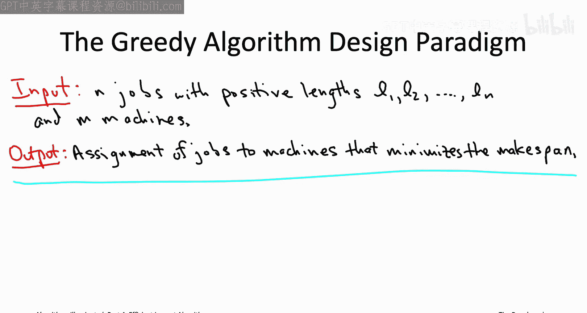
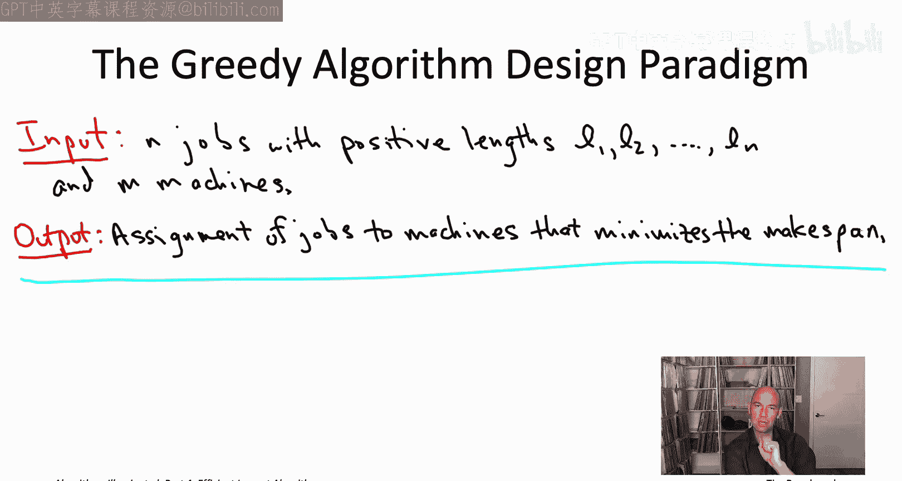
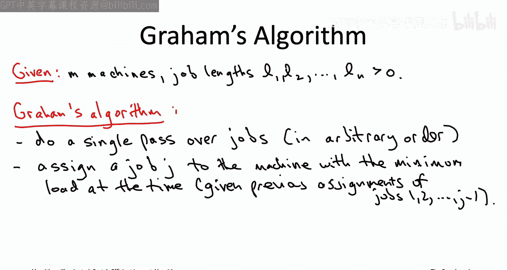
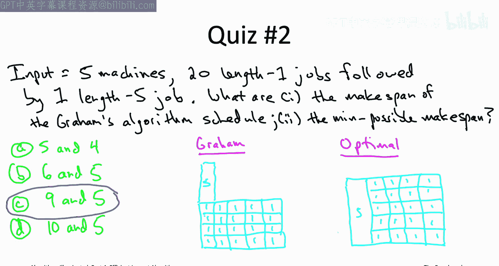
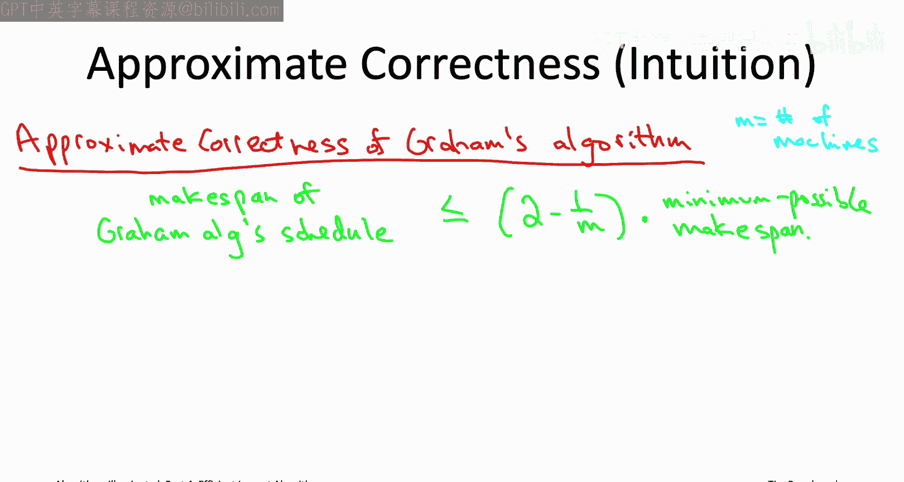
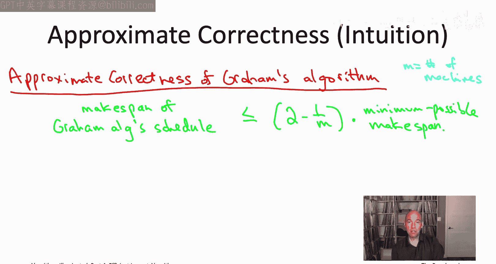
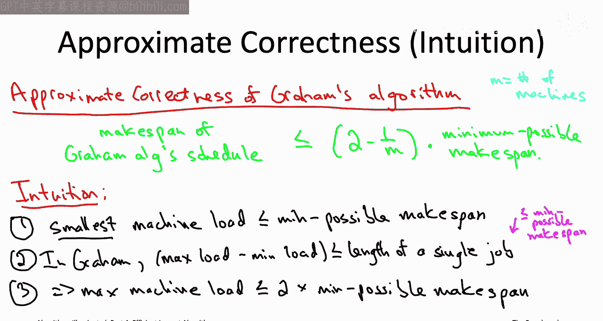

# 008：最小化最大完工时间（第一部分）📅

在本节课中，我们将学习一个经典的调度问题——最小化最大完工时间问题。我们将探讨其定义，并介绍一种简单快速的贪心算法（格雷厄姆算法），同时分析该算法的近似性能保证。

## 问题定义 🎯

在调度问题中，需要分配的任务通常被称为“作业”，而资源则被称为“机器”。一个“调度方案”就是为每个作业指定由哪台机器处理。

我们假设不同作业有不同的长度，用 `L_j` 表示作业 `j` 的长度。最常见的优化目标是：如何分配作业，使得所有作业尽可能快地完成。

为了形式化这个目标，我们定义一个目标函数来量化调度方案的好坏。

首先，定义一台机器的**负载**：即分配给该机器的所有作业的长度之和。

接着，我们关注所有机器负载中**最大**的那个，这被称为一个调度方案的**最大完工时间**。

我们的目标就是最小化这个最大完工时间。

需要注意的是，机器负载仅取决于分配给它的作业长度之和，与作业在机器上的处理顺序无关。因此，我们只关心每个作业被分配到哪台机器。

## 一个快速测验 ✅

为了确保理解机器负载和最大完工时间的定义，请看以下例子：

假设有两台机器和四个作业，长度分别为：1, 2, 2, 3。

*   **调度方案A**：机器1处理长度为2和2的作业；机器2处理长度为1和3的作业。
*   **调度方案B**：机器1处理长度为2和3的作业；机器2处理长度为1和2的作业。

在调度方案A中，机器1的负载是4，机器2的负载是4，因此最大完工时间为4。
在调度方案B中，机器1的负载是5，机器2的负载是3，因此最大完工时间为5。

## 最小化最大完工时间问题 ⚙️

现在，我们可以正式定义最小化最大完工时间问题：

**输入**：`m` 台相同的机器，`n` 个作业，每个作业 `j` 有一个处理时间（长度）`L_j`。
**目标**：将每个作业分配给一台机器，使得最终调度方案的最大完工时间（即最大机器负载）尽可能小。

这个问题在实际中非常常见。例如，如果作业代表一个并行计算任务（如MapReduce或Hadoop程序）的各个部分，那么整个计算任务的完成时间就由调度方案的最大完工时间决定。

## 问题的复杂性与启发式算法 💡

与本章讨论的所有问题一样，最小化最大完工时间问题是一个**NP难**问题。这意味着我们无法找到一个对所有输入都快速且精确求解的通用算法。

因此，我们必须做出妥协，考虑**快速启发式算法**。这类算法对所有输入都运行很快，并且在某种意义上是“近似正确”的。

## 贪心算法范式 🔄

贪心算法设计范式是构思启发式算法的绝佳起点。其思想是：通过一系列“短视”的决策，迭代地、一步一步地构建解决方案，并希望最终结果良好。

贪心算法有两个主要优点：
1.  易于构思，对于许多问题都容易想到。
2.  通常非常简单，因此运行速度极快（常为线性或近线性时间）。

当然，贪心算法的主要缺点是它们往往“过于简单”，无法在所有情况下都得到精确的最优解。然而，对于NP难问题，任何快速的多项式时间算法都注定无法始终正确。因此，贪心算法的这个“缺点”恰恰符合我们对快速启发式算法的期望，使其成为设计这类算法的完美起点。

## 应用于我们的问题：格雷厄姆算法 🧠

现在，让我们将贪心算法范式应用于最小化最大完工时间问题。

我们需要将每个作业分配给一台机器。一个自然的贪心策略是：按某种顺序（例如任意顺序）逐个处理作业，并在处理每个作业时，将其** irrevocably **（不可撤销地）分配给当前负载**最轻**的机器。

这个算法被称为**格雷厄姆算法**。其逻辑很直观：为了平衡负载、最小化最大值，我们总是将新作业交给当前“最闲”的机器。

### 算法实现与运行时间 ⏱️

以下是格雷厄姆算法的一个简单实现思路：

*   维护一个数组，记录每台机器的当前负载（初始为0）。
*   遍历所有 `n` 个作业。
*   对于每个作业，扫描所有 `m` 台机器，找到当前负载最小的那台。
*   将该作业分配给那台机器，并更新其负载。

这个简单实现的运行时间是 **O(m * n)**。

我们可以利用数据结构进行优化。注意到，在每次迭代中，我们都在进行“查找最小值”的操作。这提示我们可以使用**堆（优先队列）**。使用一个最小堆来维护机器的负载，可以将每次查找和更新的时间从 O(m) 降低到 O(log m)。因此，优化后的运行时间为 **O(n log m)**。

## 算法性能分析：一个例子 📊

贪心算法通常运行很快，但关键问题是：它产生的调度方案质量如何？

考虑以下输入：有5台机器，21个作业。其中20个作业的长度为1，第21个作业的长度为5。

**格雷厄姆算法**会如何处理？
1.  前20个长度为1的作业会被尽可能均匀地分配。处理完它们后，每台机器上都有4个作业，负载均为4。
2.  当处理长度为5的第21个作业时，所有机器的负载都是4。根据贪心规则，它会将其分配给当前负载最小的机器（任意一台）。这使得该机器的负载变为9。
3.  最终，格雷厄姆算法产生的调度方案的最大完工时间为 **9**。

**最优调度**可能是怎样的？
我们可以“预留”一台机器专门处理那个长作业（长度为5）。剩下的4台机器处理20个长度为1的作业，每台分配5个，负载为5。这样，所有机器的负载都是5。
因此，最优调度方案的最大完工时间可以低至 **5**。

这个例子表明，格雷厄姆算法并不总是最优的。在这个例子里，它的结果（9）比最优解（5）差了将近一倍。

## 近似性能保证：一个“保险单” 🛡️

你可能会担心，是否存在更极端的例子，让格雷厄姆算法的结果糟糕透顶？

令人欣慰的是，我们可以为格雷厄姆算法证明一个**近似性能保证**。这个保证就像一份“保险单”，它告诉我们，即使在最坏的情况下，算法的结果也不会差得太离谱。

**定理**：对于任意输入，设 `OPT` 为最优调度的最大完工时间，设 `M` 为机器数量。格雷厄姆算法输出的调度方案的最大完工时间 `Graham` 满足：
`Graham <= (2 - 1/M) * OPT`

**解读**：
*   当 `M=2` 时，保证 `Graham <= 1.5 * OPT`。
*   当 `M=5` 时（如上例），保证 `Graham <= 1.8 * OPT`。我们的例子中 `Graham=9`, `OPT=5`，恰好达到了 `1.8` 倍这个上界。
*   随着机器数 `M` 增加，这个上界趋近于 `2 * OPT`。

这个定理的意义在于：**即使是在人为构造的最坏情况输入下，格雷厄姆算法给出的最大完工时间也永远不会超过最优解的两倍。** 在实际中，算法在更“自然”的输入上通常表现得比这个理论界限好得多。

### 证明思路（简要） 🧮

证明的核心基于两个观察：

1.  **关于最优解**：在任何调度中（包括最优调度），总负载是固定的（所有作业长度之和）。因此，平均负载 `L_avg = (所有作业长度之和) / m` 是一个下界，即 `OPT >= L_avg`。同时，最长作业的长度 `L_max` 也是一个下界，因为任何调度都必须处理这个作业，即 `OPT >= L_max`。

2.  **关于格雷厄姆算法**：考虑最终负载最大的那台机器 `M*`。在 `M*` 被分配其最后一个作业 `J*` 的**那一刻之前**，根据算法规则，`M*` 是当时所有机器中负载**最轻**的。这意味着，在加入 `J*` 之前，`M*` 的负载不超过当时的平均负载，从而也不超过最终的平均负载 `L_avg`。

结合这两点：
*   `M*` 的最终负载 = （加入 `J*` 前的负载） + `L_J*`
*   `<= L_avg + L_max`
*   `<= OPT + OPT` （因为 `L_avg <= OPT` 且 `L_max <= OPT`）
*   `= 2 * OPT`

更精细的分析可以得到 `(2 - 1/M) * OPT` 这个更紧的界。

---

本节课中，我们一起学习了最小化最大完工时间这一NP难问题。我们介绍了其形式化定义，并设计了一个简单快速的贪心算法——格雷厄姆算法。尽管该算法不能保证最优，但我们证明了其强大的近似性能保证：它产生的解不会比最优解差两倍以上。这为我们在实践中使用快速启发式算法提供了信心。在下一节，我们将探讨针对该问题的其他算法思路。