# 009：最小化完工时间（第二部分）

## 概述
在本节课中，我们将学习如何分析格雷厄姆算法（Graham's algorithm）的近似性能，并介绍一种改进的算法——最长处理时间算法（LPT算法）。我们将通过严格的数学证明，理解这些算法在最坏情况下与最优解的差距，并学习如何利用排序等预处理步骤来提升近似比。

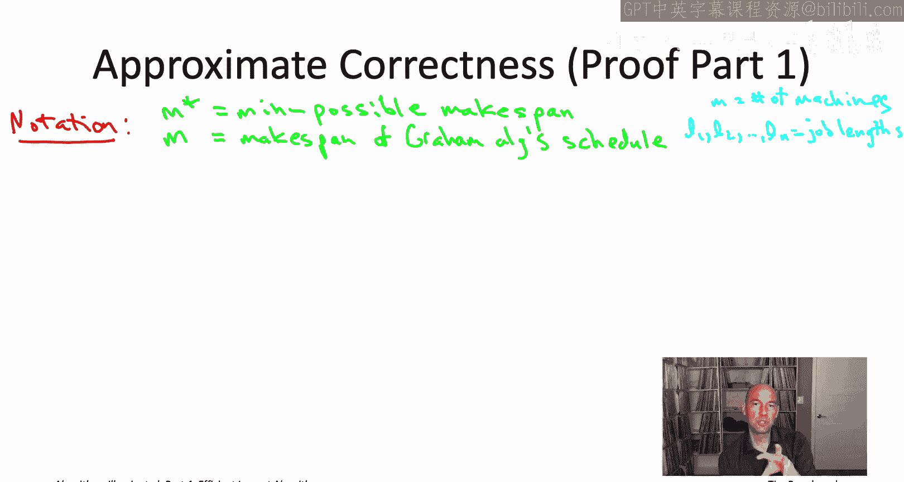

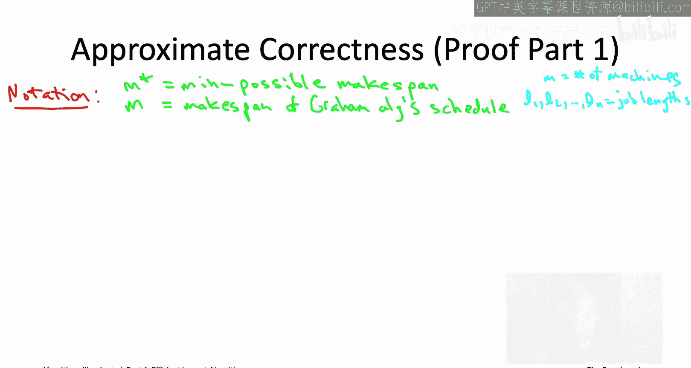

---

## 格雷厄姆算法的近似比证明

上一节我们介绍了用于最小化完工时间的格雷厄姆贪心算法。本节中，我们将正式证明其近似性能。

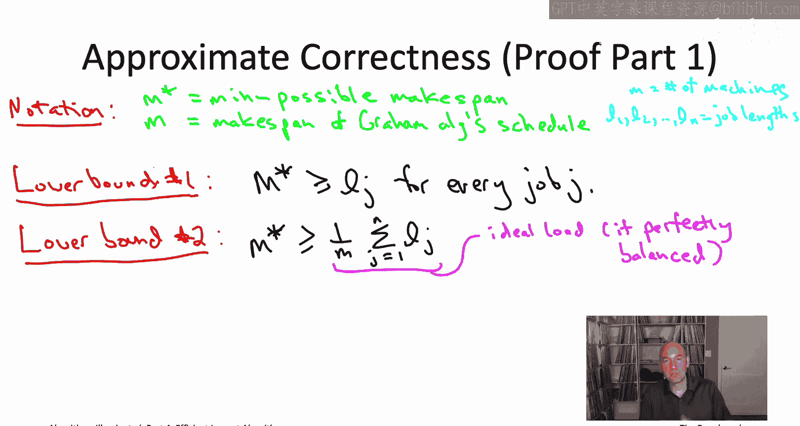

首先，我们回顾一下符号：
*   `m` 表示机器数量。
*   `L1` 到 `Ln` 表示 `n` 个作业的长度。
*   最优完工时间（最小可能完工时间）记为 `M*`。
*   格雷厄姆算法产生的完工时间记为 `M`。

证明的目标是证明 `M` 不会比 `M*` 大太多，具体来说，最多大 `(2 - 1/m)` 倍。

直接比较 `M` 和 `M*` 很困难。因此，我们引入两个中间量作为桥梁：**最大作业长度**和**平均机器负载**。我们将分别建立它们与 `M` 和 `M*` 的关系。

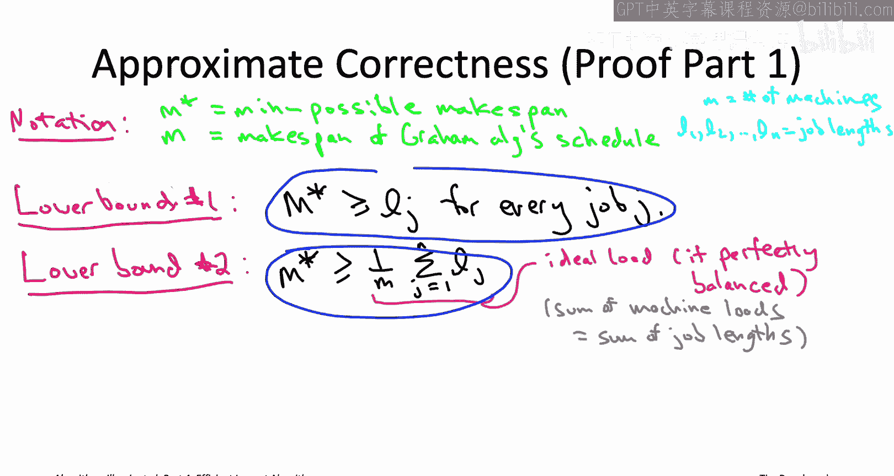

### 对最优解 `M*` 的两个下界

以下是两个简单的下界，它们都小于或等于最优完工时间 `M*`。

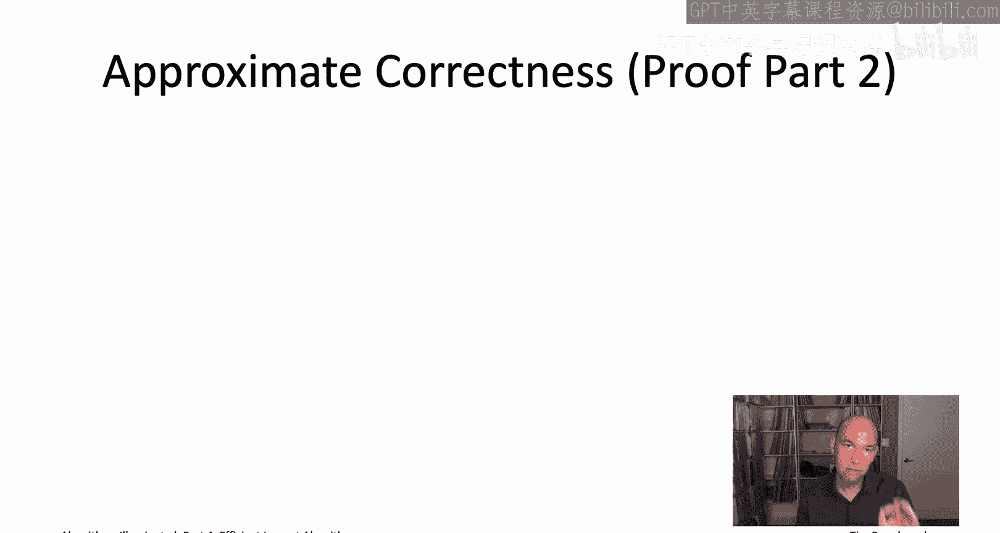

**下界1：最大作业长度**
任何调度都必须将每个作业分配到某台机器上。因此，如果某个作业长度为 `L_max`，那么至少有一台机器的负载至少为 `L_max`，这意味着完工时间至少为 `L_max`。因此，最优完工时间 `M*` 至少和最长作业一样长。

**公式：** `M* >= max(L1, L2, ..., Ln)`

**下界2：平均机器负载**
在一个调度中，所有机器负载的总和恰好是所有作业长度的总和，因为每个作业只被分配一次。即：`总负载 = Σ_{j=1}^{n} L_j`。

最理想的情况是所有机器负载完全平衡，即每台机器的负载都是 `(总负载 / m)`。任何调度方案的完工时间都不可能比这个完美平衡的理想情况更好。因此，最优完工时间 `M*` 至少是平均负载。

**公式：** `M* >= (1/m) * Σ_{j=1}^{n} L_j`

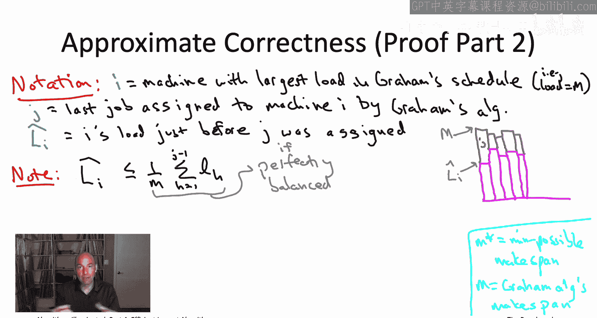

这两个下界将在后续证明中起到关键作用。

---

## 分析格雷厄姆算法产生的调度

现在，我们来分析格雷厄姆算法产生的调度 `M`，目标是将其与上述两个下界联系起来，从而关联到 `M*`。

我们需要形式化证明中的第二步直觉：**最忙机器与最闲机器的负载差，最多是一个作业的长度**。

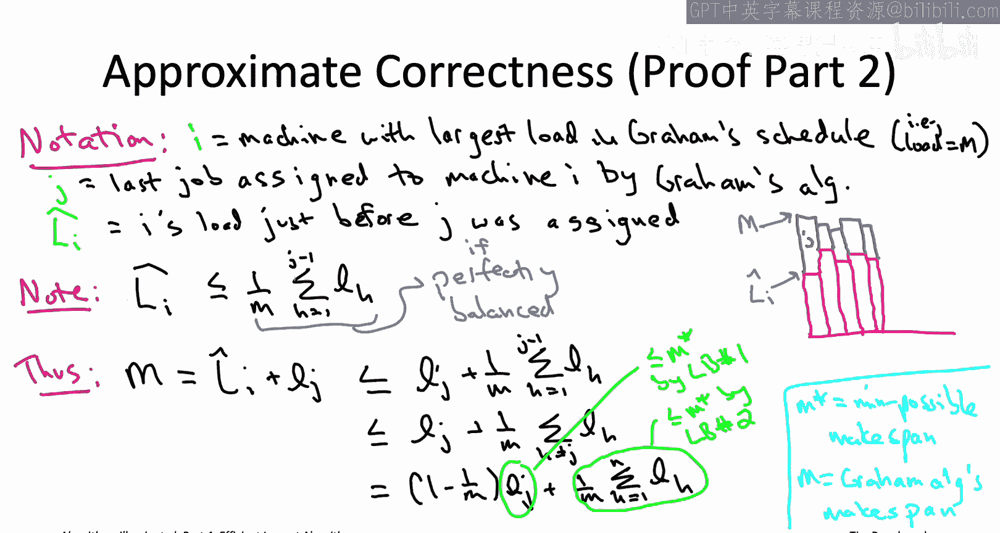

我们引入一些符号：
*   令机器 `I` 为格雷厄姆算法调度下负载最大的机器（即其负载等于 `M`）。
*   令作业 `J` 为算法分配给机器 `I` 的最后一个作业。
*   令 `L_hat_I` 为在作业 `J` 被分配之前，机器 `I` 的负载。

考虑算法将作业 `J` 分配给机器 `I` 的那个时刻。根据算法规则，在那一刻，机器 `I` 是当时负载最小的机器。因此，它的负载 `L_hat_I` 不可能超过当时的平均机器负载。

当时的平均负载是（已分配作业的总长度 / `m`）。所以有：
`L_hat_I <= (1/m) * (L1 + L2 + ... + L_{j-1})`

最终的完工时间 `M` 等于机器 `I` 分配作业 `J` 之前的负载加上作业 `J` 本身的长度：
`M = L_hat_I + L_J`

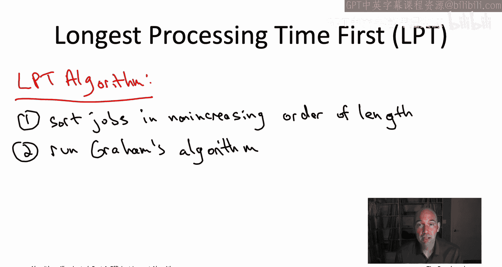

结合以上两个式子，我们可以推导出 `M` 的上界：
`M <= (1/m) * (L1 + L2 + ... + L_{j-1}) + L_J`

为了简化表达式，我们在第一项的和中加入作业 `J` 及其之后作业的长度（这些长度都是正数，只会使上界更大）：
`M <= (1/m) * (L1 + L2 + ... + L_n) + (1 - 1/m) * L_J`

现在，我们得到了 `M` 的一个上界，它由两部分组成：
1.  `(1/m) * (所有作业长度之和)`，即平均负载。
2.  `(1 - 1/m) * L_J`，即作业 `J` 长度的一个比例。

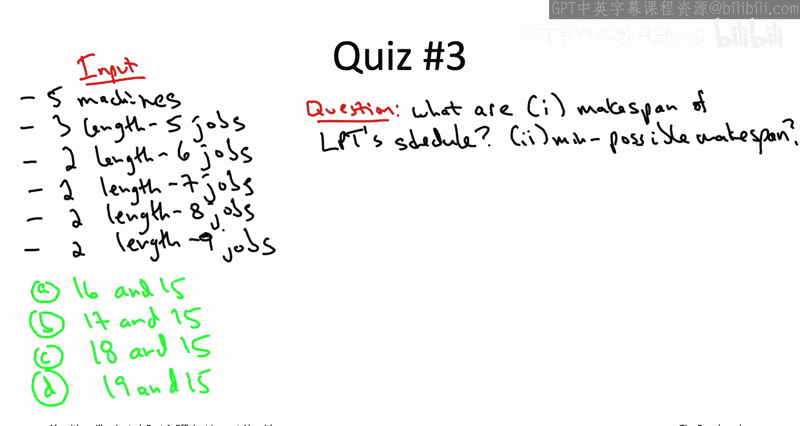

这正是我们需要的！因为这两个部分都可以用之前得到的 `M*` 的下界来约束。

*   根据下界2，平均负载 `(1/m) * Σ L_j <= M*`。
*   根据下界1，任何作业的长度，包括 `L_J`，都满足 `L_J <= M*`。

将这两个不等式代入 `M` 的上界公式：
`M <= (1 - 1/m) * M* + 1 * M* = (2 - 1/m) * M*`

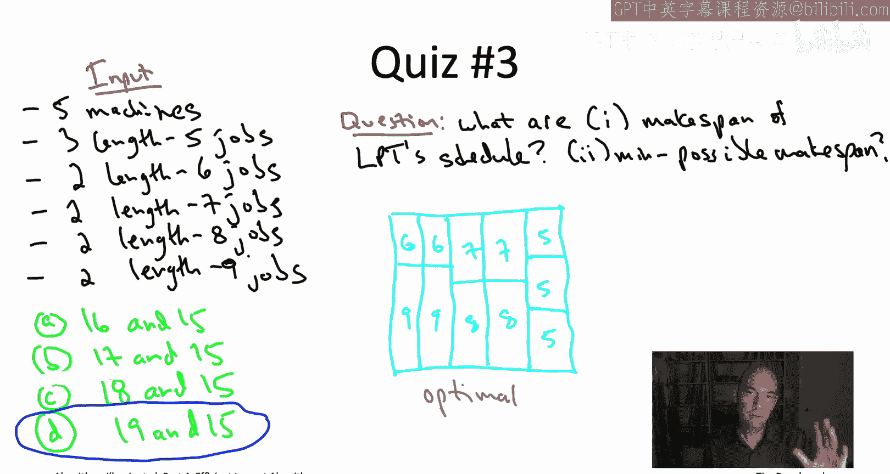

**证明完成。** 我们证明了格雷厄姆算法产生的完工时间 `M` 最多是最优完工时间 `M*` 的 `(2 - 1/m)` 倍。这是一个可靠的“保险策略”：即使在最坏情况下，性能也不会差于最优解的两倍。

---

## 能否做得更好？LPT算法

作为算法设计者，我们总是要问：能否找到性能保证更好的快速启发式算法？

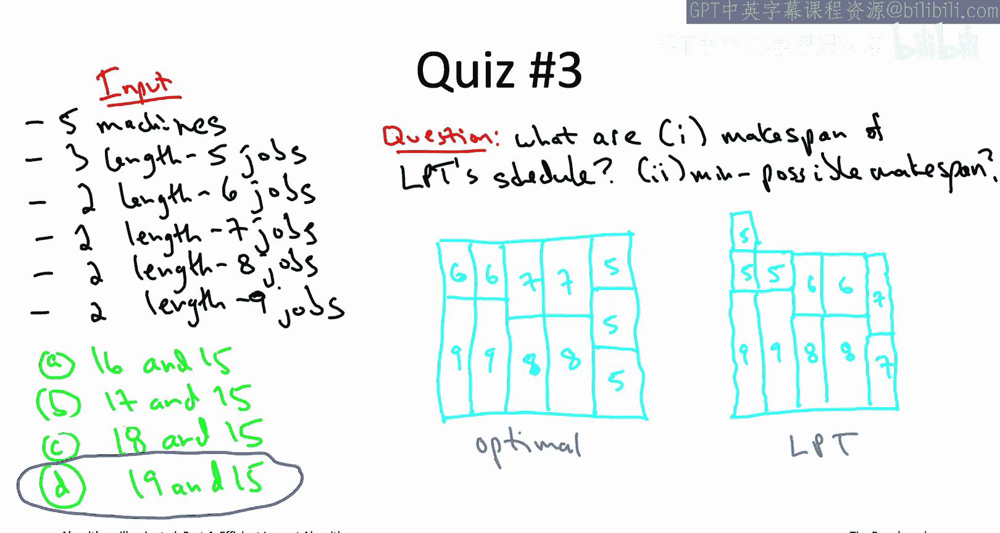

答案是肯定的。我们只需要在格雷厄姆算法之前加入一个熟悉的、几乎免费的预处理步骤：**排序**。

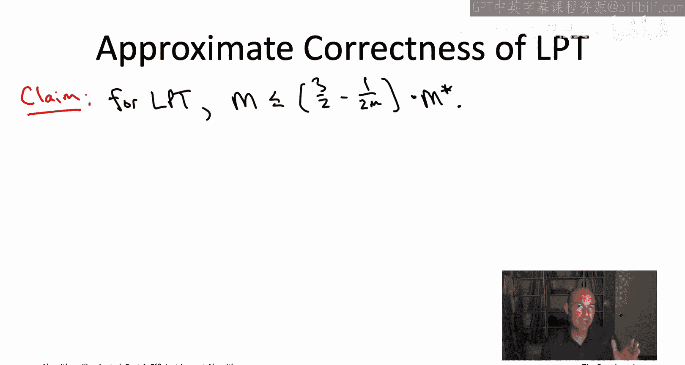

回顾之前测验中的反例，格雷厄姆算法先处理了许多短作业，导致最后不得不将长作业单独放在一台机器上，造成不平衡。如果我们**先将作业按长度从大到小排序**，再运行格雷厄姆算法，就可以避免这个问题。这个算法被称为**最长处理时间（LPT）算法**。

LPT算法步骤：
1.  **排序**：将作业按处理时间（长度）从大到小排序。
2.  **贪心分配**：对于排序后的作业列表，依次将每个作业分配给当前负载最小的机器。

其运行时间主要由排序决定，为 `O(n log n)`，加上使用堆（Heap）进行贪心分配的 `O(n log m)`，总体效率很高。

---

## LPT算法的性能分析

LPT算法总是最优的吗？让我们通过一个测验来感受一下。

**测验（略）结论**：存在实例使得LPT算法产生的完工时间（19）大于最优完工时间（15）。因此，LPT不是绝对最优的。

但关键问题是：它的最坏情况保证比格雷厄姆算法更好吗？是的。可以证明，对于LPT算法，其完工时间 `M` 满足：
`M <= (3/2 - 1/(2m)) * M*`

这个上界 `(约1.5倍)` 比格雷厄姆算法的 `(约2倍)` 更严格。通过更精细的分析（此处略去），实际上可以证明一个更紧的界：`M <= (4/3 - 1/(3m)) * M*`。当机器数量 `m` 很大时，最坏性能趋近于最优解的 `4/3` 倍（即最多差33%）。

### 证明思路（简述）

LPT算法证明是对格雷厄姆算法证明的精细化，核心在于改进了“单个作业可能造成的最大损害”这一估计。

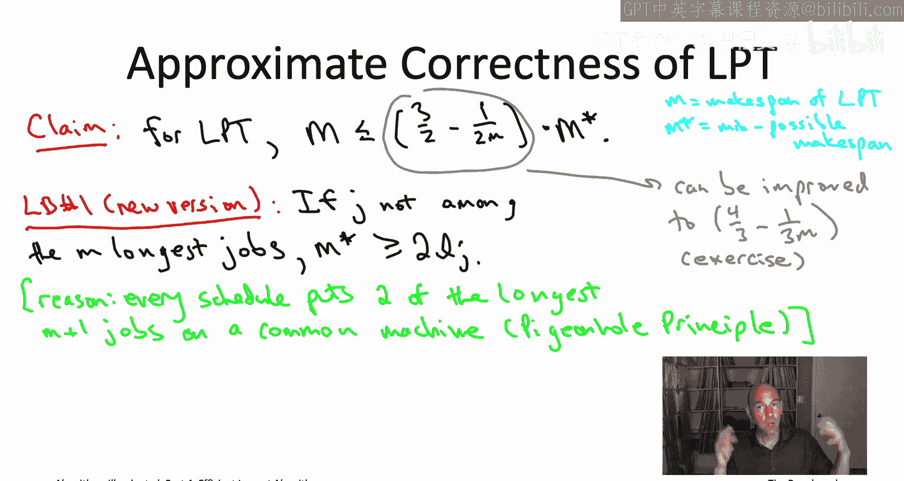

在格雷厄姆算法分析中，我们说作业 `J` 的长度 `L_J <= M*`。
在LPT算法中，由于作业已排序，我们可以证明：**如果作业 `J` 不是前 `m` 个最长的作业之一**，那么有更强的结论 `L_J <= M* / 2`。

**理由（鸽巢原理）**：考虑最长的 `m+1` 个作业。无论如何调度，都必须将其中两个作业放在同一台机器上，因此最优完工时间 `M*` 至少等于这两个作业长度之和。由于作业已排序，这两个作业的长度都至少等于第 `m+1` 长的作业的长度。因此，对于所有非前 `m` 长的作业 `J`，有 `M* >= 2 * L_J`。

在LPT调度中，导致最大完工时间的那台机器 `I` 上的最后一个作业 `J`，如果它前面还有作业（即机器 `I` 至少有两个作业），那么 `J` 就不可能是前 `m` 个作业之一（因为前 `m` 个作业会被分配到 `m` 台空机器上）。因此，强结论 `L_J <= M* / 2` 适用于它。

将这个更强的界代入格雷厄姆算法的证明框架中，就能得到 `M <= (3/2 - 1/(2m)) * M*` 的保证。

---

## 总结
本节课我们一起学习了：
1.  **格雷厄姆算法的近似比证明**：我们通过引入最大作业长度和平均负载两个下界作为桥梁，证明了其完工时间最多是最优解的 `(2 - 1/m)` 倍。
2.  **LPT算法及其改进**：我们通过在格雷厄姆算法前加入排序步骤，得到了最长处理时间（LPT）算法。该算法具有更好的理论保证，其完工时间最多约为最优解的 `1.5` 倍（更精细的分析可达 `4/3` 倍）。
3.  **证明技术的核心**：比较启发式算法解与最优解时，常通过寻找最优解的下界和启发式解的上界，并建立它们之间的联系。对于调度问题，最大作业长度和平均负载是两个非常实用的下界。

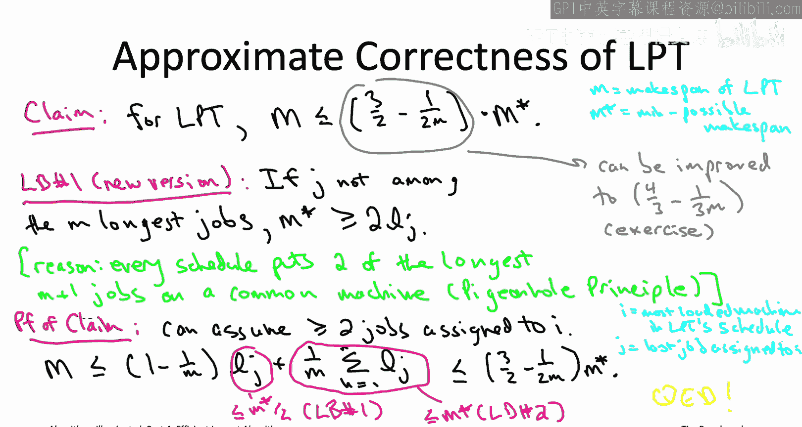

这些贪心启发式算法简单、快速，并且在实践中通常能产生接近最优的解，是解决NP难调度问题的有效起点。