# 011：最大覆盖问题的贪心启发式算法 - 第二部分

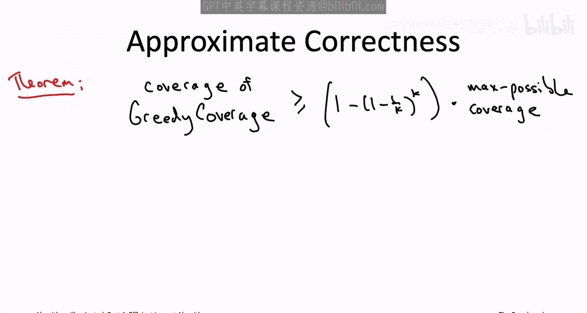

## 概述
在本节课中，我们将学习最大覆盖问题贪心启发式算法的近似正确性保证。我们将深入探讨一个关键引理，并证明该算法总能保证获得至少 `1 - (1 - 1/k)^k` 倍于最优解的覆盖范围。

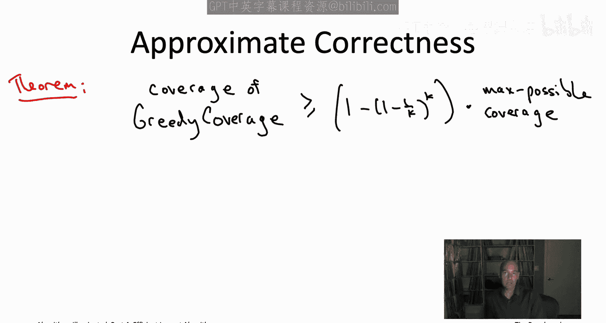

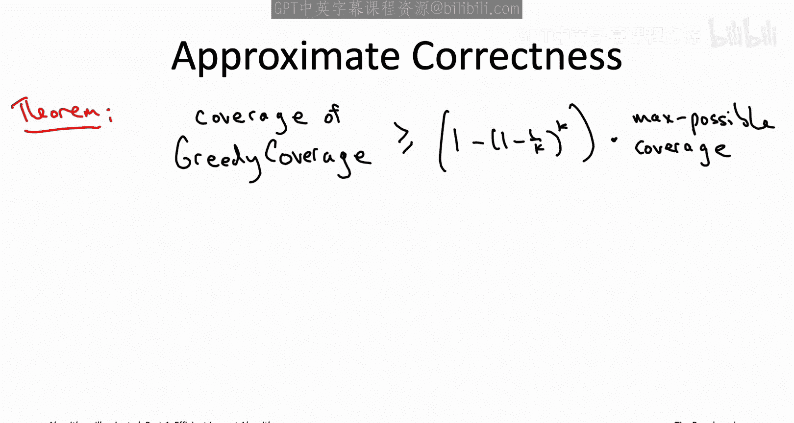

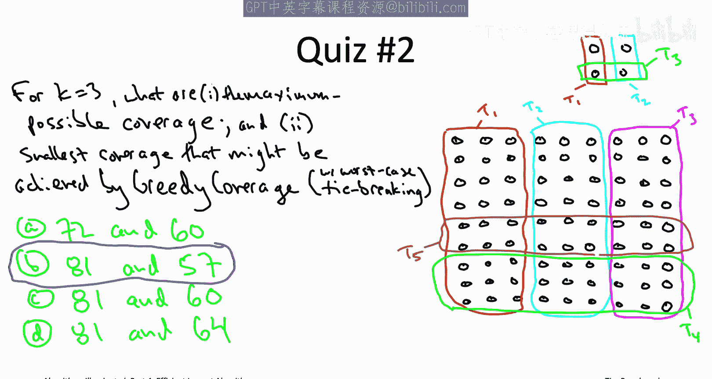

## 近似保证定理
对于最大覆盖问题的任意输入，无论全集大小或子集数量如何，只要预算为 `k`，贪心覆盖算法保证输出的解，其覆盖范围至少是最优解（即使用 `k` 个子集所能达到的最大覆盖范围）的 `1 - (1 - 1/k)^k` 倍。

例如：
*   当 `k = 2` 时，贪心算法保证获得至少 **75%** 的最大可能覆盖。
*   当 `k = 3` 时，保证获得至少 **70.4%** 的最大覆盖。
*   无论 `k` 多大，保证获得至少 **63.2%** 的最大覆盖（即 `1 - 1/e`）。

这是一个最坏情况下的保证。在实际输入中，贪心算法的表现通常会好得多，更接近 100%。

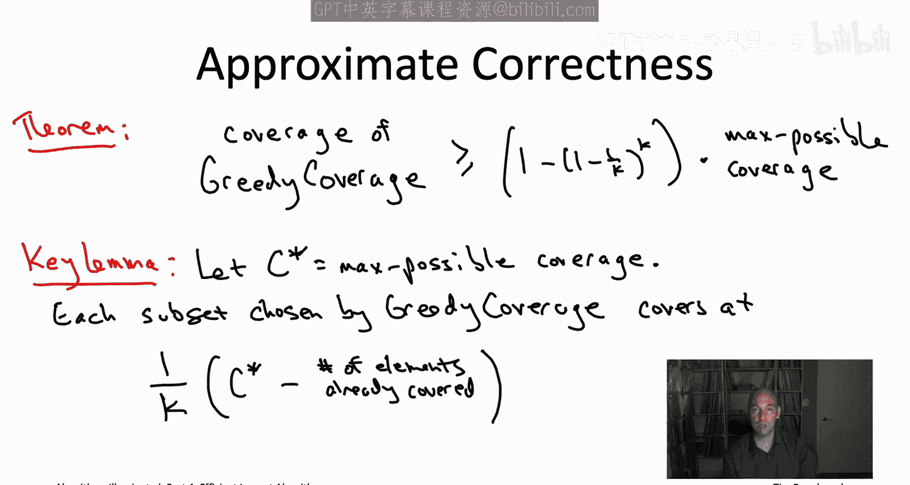

## 关键引理：贪心算法的持续进展
上一节我们介绍了算法的近似保证，本节中我们来看看这个保证背后的核心原理。关键在于一个引理，它表明贪心算法在每次迭代中都能有效地“蚕食”最优解的一部分。

该引理指出：在贪心算法的每一次迭代中，其覆盖范围的增量至少是当前“不足”的 `1/k`。

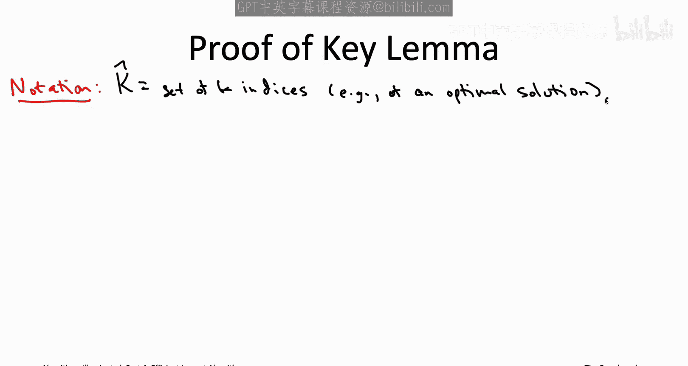

**定义**：
*   `C*`：使用 `k` 个子集所能达到的最大覆盖范围（最优解）。
*   `C_j`：贪心算法在前 `j` 次迭代后已覆盖的元素数量。
*   **不足**：`C* - C_{j-1}`，即当前覆盖与最优覆盖的差距。

**引理公式化**：
对于每次迭代 `j`，有：
`C_j - C_{j-1} >= (C* - C_{j-1}) / k`

这意味着，如果当前覆盖距离最优解还差 `D` 个元素，那么在下一次迭代中，贪心算法至少能覆盖 `D/k` 个新元素。

## 关键引理的证明
现在我们来证明这个关键引理。证明的核心思想是比较贪心算法的选择和某个参考解（例如最优解）的选择。

**设定**：
*   令 `K_hat` 为某个由 `k` 个子集索引组成的参考集合（例如一个最优解）。
*   考虑贪心算法的任意一次迭代 `j`。此时，贪心算法已选择了前 `j-1` 个子集。

**核心不等式**：
证明依赖于以下不等式：
`sum_{i in K_hat} [ |T_i \ C_{j-1}| ] >= C* - C_{j-1}`

**理解该不等式**：
我们可以通过一个图示来理解。想象有两个圆：
1.  **蓝色圆**：代表参考解 `K_hat` 覆盖的所有元素（数量为 `C*`）。
2.  **品红色圆**：代表贪心算法目前已覆盖的所有元素（数量为 `C_{j-1}`）。

两个圆之间的**绿色区域**，就是被参考解覆盖但尚未被贪心算法覆盖的元素。这个区域的大小恰好等于 `C* - C_{j-1}`。

现在看不等式左边：它是对于 `K_hat` 中的每一个子集 `T_i`，计算如果将其加入当前贪心解能新增多少覆盖（即 `|T_i \ C_{j-1}|`），然后将这 `k` 个值相加。

**为什么左边 >= 绿色区域？**
*   如果我们一次性将 `K_hat` 中的所有 `k` 个子集都加入当前解，新增的覆盖正好是绿色区域。
*   然而，左边计算的是分别加入每个子集所获新增覆盖的**总和**。如果某些元素同时属于 `K_hat` 中的多个子集，它们在左边的和中会被**重复计算多次**，而在一次性加入所有子集时只被计算一次。
*   因此，左边的和至少和绿色区域一样大（通常更大）。

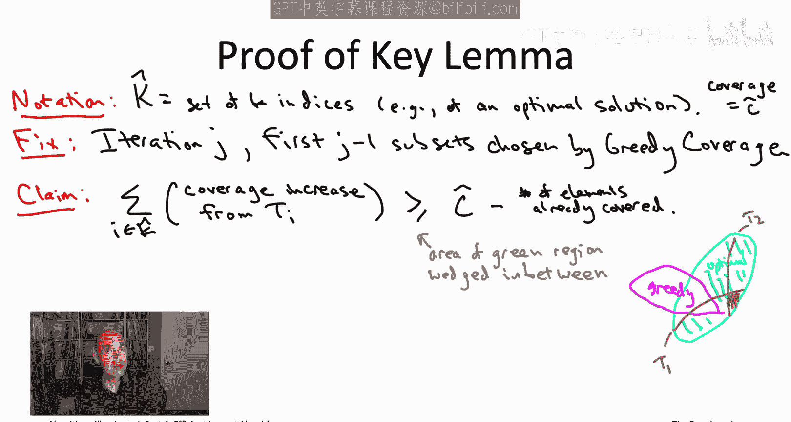

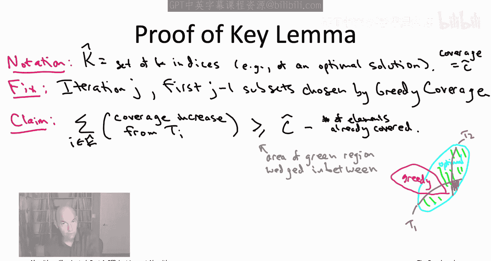

**完成证明**：
既然左边是 `k` 个正数的和，那么其中至少有一个数不小于它们的平均值。即存在某个 `i* in K_hat`，使得：
`|T_{i*} \ C_{j-1}| >= (C* - C_{j-1}) / k`

根据贪心算法的选择准则，它在迭代 `j` 中选择的子集，其带来的新增覆盖至少和任何可选子集（包括这个 `T_{i*}`）一样多。因此：
`C_j - C_{j-1} >= |T_{i*} \ C_{j-1}| >= (C* - C_{j-1}) / k`

这就完成了关键引理的证明。

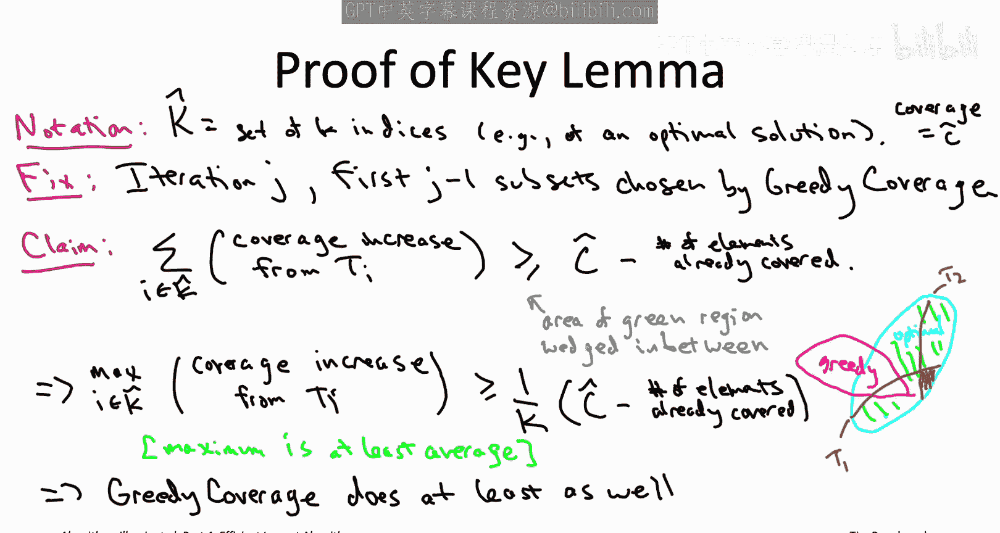

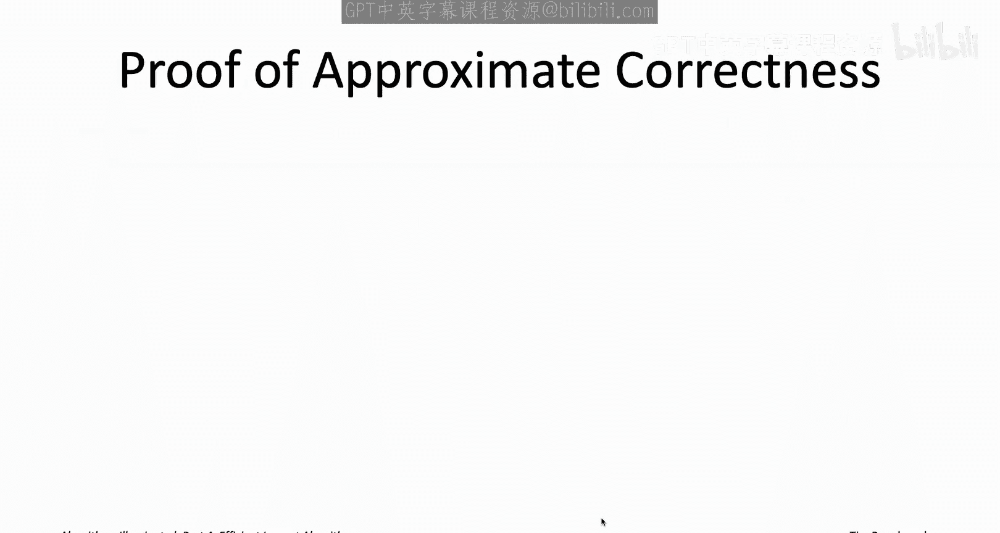

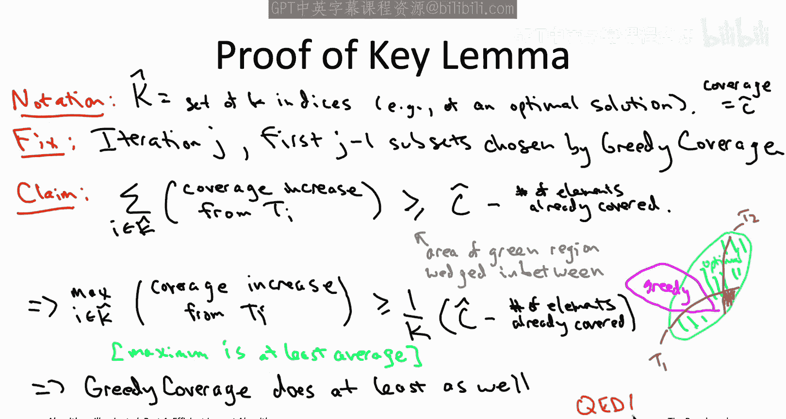

## 从关键引理推导近似保证
有了关键引理，我们现在可以通过数学推导，证明贪心算法的最终覆盖范围满足定理所述的近似比。

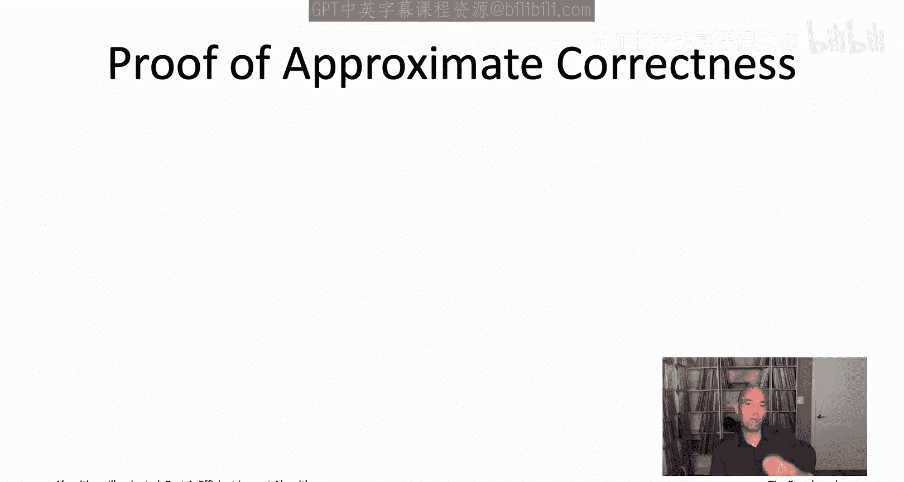

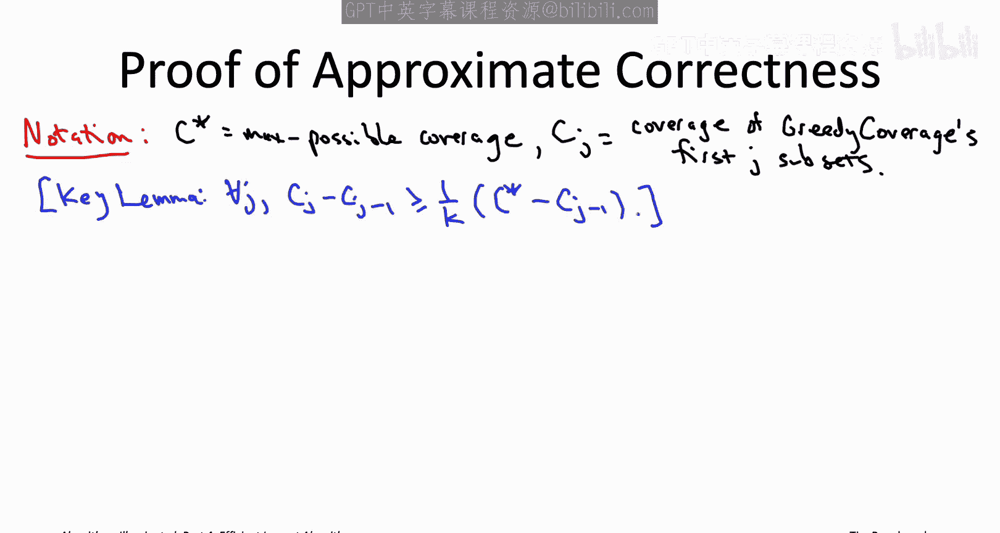

我们将关键引理应用于贪心算法的每一次迭代。

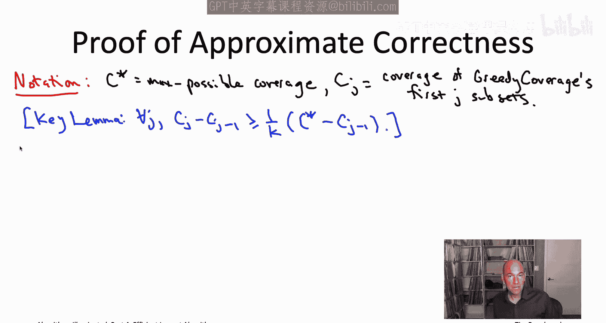

**第 k 次（最后一次）迭代**：
根据引理：
`C_k - C_{k-1} >= (C* - C_{k-1}) / k`
整理得：
`C_k >= C* / k + (1 - 1/k) * C_{k-1}` **(1)**

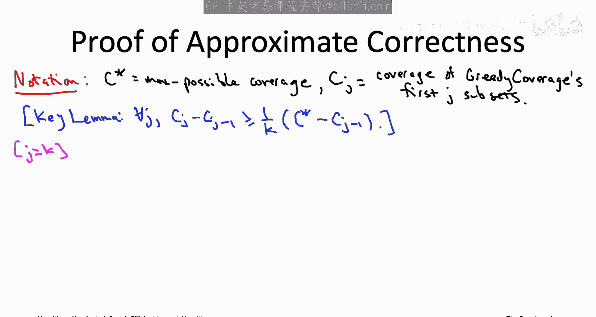

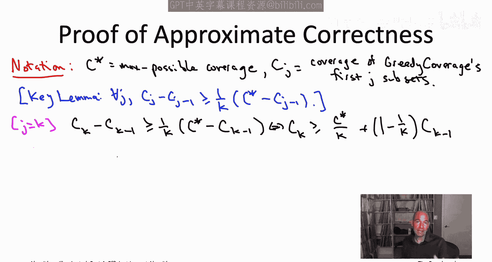

**第 k-1 次迭代**：
根据引理：
`C_{k-1} - C_{k-2} >= (C* - C_{k-2}) / k`
整理得：
`C_{k-1} >= C* / k + (1 - 1/k) * C_{k-2}` **(2)**

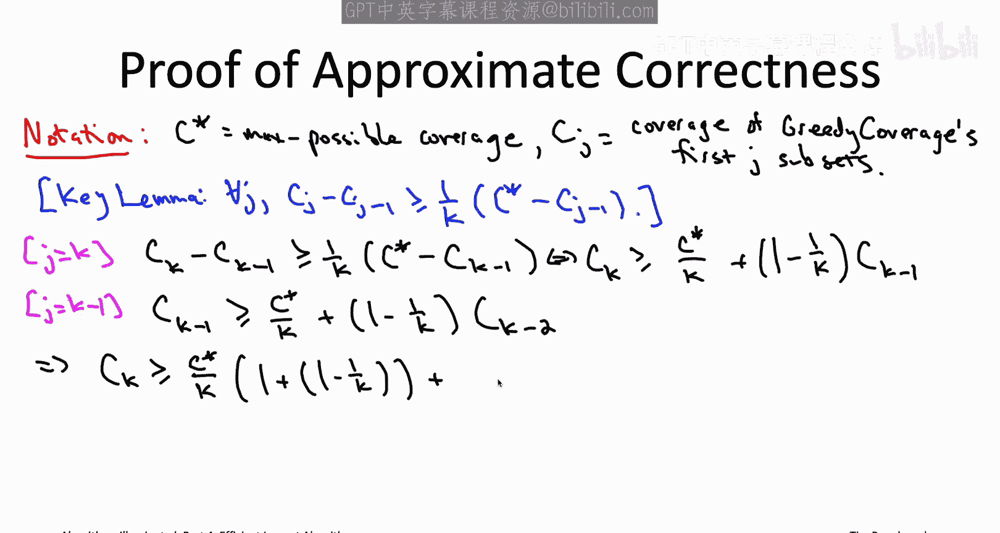

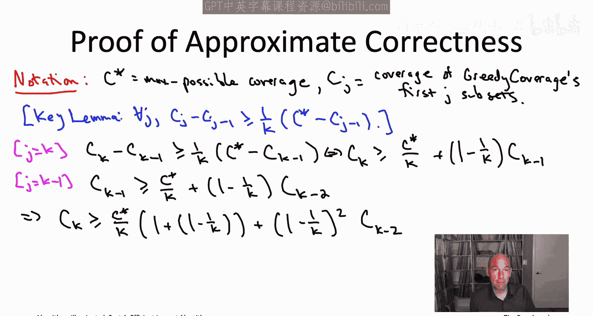

**代入与推导**：
将不等式 **(2)** 代入不等式 **(1)** 中的 `C_{k-1}`：
`C_k >= C* / k + (1 - 1/k) * [ C* / k + (1 - 1/k) * C_{k-2} ]`
`= C* / k * [1 + (1 - 1/k)] + (1 - 1/k)^2 * C_{k-2}`

**重复此过程**：
继续对 `C_{k-2}`, `C_{k-3}`, ... 应用关键引理并代入，直到 `C_0`（初始覆盖为 0）。最终我们会得到：
`C_k >= (C* / k) * [1 + (1 - 1/k) + (1 - 1/k)^2 + ... + (1 - 1/k)^{k-1}]`

**利用几何级数求和公式**：
中括号内的和是一个几何级数。设 `r = 1 - 1/k`，则和为：
`(1 - r^k) / (1 - r) = (1 - (1 - 1/k)^k) / (1/k) = k * [1 - (1 - 1/k)^k]`

**得到最终结果**：
将此和代入 `C_k` 的不等式：
`C_k >= (C* / k) * { k * [1 - (1 - 1/k)^k] }`
`C_k >= C* * [1 - (1 - 1/k)^k]`

这正是我们要证明的定理：贪心算法的覆盖范围至少是最优覆盖 `C*` 的 `1 - (1 - 1/k)^k` 倍。

## 总结
本节课中我们一起学习了最大覆盖问题贪心启发式算法的性能保证。
1.  我们首先陈述了定理：算法保证获得至少 `1 - (1 - 1/k)^k` 倍于最优解的覆盖。
2.  我们证明了一个**关键引理**，表明算法在每次迭代中都能至少弥补当前与最优解差距的 `1/k`。
3.  通过将关键引理迭代应用 `k` 次，并利用**几何级数求和公式**，我们最终推导出了定理中的近似比公式。

这个分析不仅提供了性能保证，也揭示了之前测验中的构造实例实际上是可能的最坏情况。这个贪心算法及其分析框架，将为我们接下来学习社交网络中的影响力最大化问题奠定基础。