# 013：影响力最大化的贪心启发式算法证明

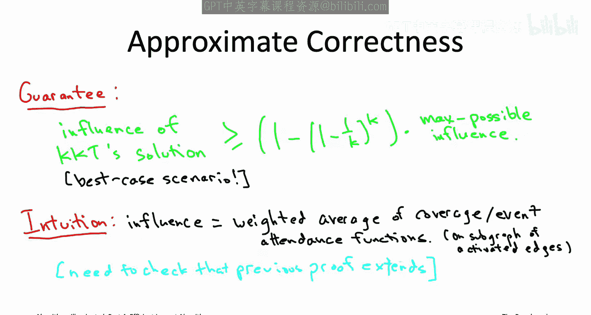

在本节课中，我们将学习影响力最大化问题的贪心启发式算法（KKT算法）的近似正确性证明。我们将看到，影响力函数可以被视为多个覆盖函数的加权平均，从而将问题与最大覆盖问题联系起来，并复用其分析框架。

上一节我们介绍了影响力最大化问题的贪心启发式算法。本节中，我们将深入探讨其理论证明，核心在于将影响力函数形式化为覆盖函数的加权平均。

## 影响力函数的形式化

首先，我们形式化地定义影响力最大化问题的输入。我们有一个有向图 **G**，每条边有一个介于0和1之间的激活概率 **p**，以及一个正整数 **K**，代表我们要选择的种子顶点数量。为方便起见，我们考虑包含后处理步骤的级联模型版本。这意味着在过程结束后，所有未被“翻转”的边都将被最终确定状态。该过程的关键在于，最终被激活的顶点，正是那些从某个种子顶点出发，通过一条由激活边构成的有向路径可达的顶点。

接下来，作为一个思想实验，假设我们拥有预知能力，能提前知道哪些边最终会被激活。这相当于我们预先抛掷了所有硬币，而不是像级联模型那样按需抛掷。那么，如果我们知道了激活边的集合 **H**，影响力最大化问题就完全简化为一个最大覆盖问题。

*   基础集合是社交网络的所有顶点 **V**。
*   每个顶点对应一个子集，该子集包含从该顶点出发，通过激活边（即子图 **(V, H)** 中的有向路径）可达的所有顶点。

例如，回到之前看过的四顶点图。假设激活边恰好是 **A→B**、**B→D** 和 **C→D**，这三条边构成了集合 **H**。那么：
*   对应顶点 **A** 的子集包含从 **A** 沿激活边可达的所有顶点，即 **{A, B, D}**。
*   对应顶点 **C** 的子集包含从 **C** 沿激活边可达的所有顶点，即 **{C, D}**。

此时，最终被激活的人数，恰好等于对应种子顶点的这些子集的覆盖大小。例如，如果选择对应 **A** 和 **C** 的子集，那么你将激活所有四个顶点，因为这两个子集的并集覆盖了全部四个顶点。

当然，我们实际上无法提前知道激活边的集合 **H**。**H** 是一个随机集合，不同的 **H** 有不同的出现概率。但最终，给定种子顶点集合 **S** 的影响力 **f(S)**，正是这个覆盖函数在所有可能的激活边集合 **H** 上的期望值。

这个期望值如何计算？我们可以对所有可能遇到的激活边子集 **H** 进行求和（共有 **2^m** 个，其中 **m** 是边数）。每个 **H** 都有一个出现的概率 **p(H)**。一旦固定了激活边集合 **H**，你就得到了一个覆盖函数，其基础集合是顶点，每个顶点对应一个子集，该子集包含从该顶点出发，沿着 **H** 中的激活边构成的路径可达的其他顶点。

严谨地说，我们这里使用的是全期望定律，将原始期望（影响力的定义）写成了以激活边集合 **H** 为条件的条件期望的概率加权平均。如果不理解这个术语也不必担心，直观上很清楚：存在 **2^m** 种不同的激活边子集可能性，每种可能性有自己的概率，每种情况有自己的覆盖函数，而影响力就是这 **2^m** 个覆盖函数的相应加权平均。

## 复用最大覆盖问题的分析框架

这听起来是个好消息。我们已经知道，对于单个覆盖函数，贪心算法能获得我们想要的近似正确性保证。现在，我们处理的不是一个覆盖函数，而是许多覆盖函数的平均。但希望分析框架仍然适用，让我们来验证这一点。

我们主要需要一个新版本的、在最大覆盖问题中称为“关键引理”的东西。这个引理断言贪心算法在每次迭代中都能取得显著进展。在最大覆盖中，我们希望说 **K** 次迭代中的每一次都增加了可观的覆盖范围。在这里，我们希望论证 KKT 算法的每次迭代都至少将当前种子顶点集合的影响力增加一个给定的量。

关键引理的形式将与最大覆盖问题中的完全相同。我们将用当前解在该迭代中的“不足”来界定每次迭代中影响力的增加量。

*   令 **I*** 表示使用 **K** 个种子顶点可能达到的最大影响力。
*   在 KKT 算法的某次迭代中，其当前解的影响力与最大可能值 **I*** 的差距即为“不足”。
*   保证的进展是：每次迭代，你至少能将影响力增加该“不足”的 **1/K** 倍。

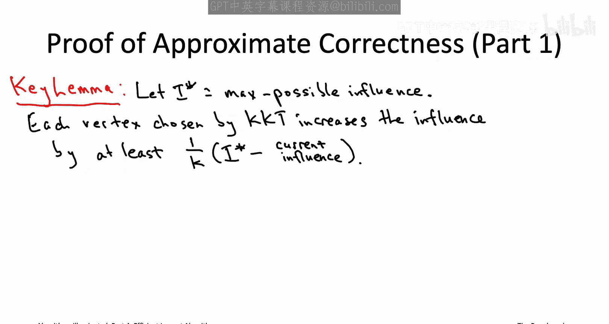

这与最大覆盖问题中的引理字面上完全相同，只是原来的最大覆盖 **C*** 现在是最大影响力 **I***，原来已覆盖的元素数量现在是 KKT 解的当前影响力 **f(S_{j-1})**，其他完全一样。

我们可能记得，在贪心覆盖算法的近似正确性证明中，我们有两部分：一个像这样的保证进展的关键引理，以及第二部分通过一些代数运算得到最终的近似正确性保证。既然这个关键引理与最大覆盖中的保证完全相同，那么证明的第二部分将完全不变地继续适用。只要这个引理为真，我们就能得到想要的结果：KKT 算法保证至少获得最大可能影响力的 **1 - (1 - 1/K)^K** 倍。因此，我们将在本视频结束时证明这个关键引理，并宣告胜利，因为近似正确性保证会以与之前完全相同的方式得出。

## 证明关键引理

首先引入一些符号。考虑一个任意的最优解，即某个包含 **K** 个顶点的集合，记作 **S***。所谓最优，即它们具有最大可能的影响力 **I***。

我们的计划是：先固定一个可能的激活边子集，这给我们一个覆盖函数；然后，我们将直接复用我们已经为覆盖问题所做的分析；最后在末尾取加权平均。

首先，固定你喜欢的任意边子集 **H**（从 **2^m** 个可能中任选一个）。然后我们有一个对应的覆盖函数，记作 **f_H**。记住，这个覆盖函数表示：给定 **H** 恰好是激活边，给定你选择了一个特定的种子顶点集合 **S**，有多少顶点可以从某个种子顶点沿着这些激活边可达。正如我们所见，这正是一个覆盖函数。

我们之前为最大覆盖问题及其贪心算法的近似正确性证明付出了很多努力，当然希望在这里尽可能多地复用那些工作。回想一下（或者回看那个视频），在近似正确性证明中，我们有一个类似的关键引理，涉及覆盖范围而非影响力。而在改进关键引理时，我们有一个关键的断言，一个非常重要的不等式（当时我们讨论的是“绿色区域”，一个量大于绿色区域，另一个量小于绿色区域）。我们当时说的是：一方面考虑截至当前的覆盖不足；另一方面，考虑在思想实验中，将最优解中的每个子集添加到当前解中，能获得多少额外的覆盖；后者至少是前者。换句话说，总是存在一个选项（最优解中的一个子集），能让你获得至少 **1/K** 倍于你当前不足（你的覆盖范围小于最大可能覆盖范围的程度）的进展。

我们只需将这个完全相同的不等式抄写下来，并用由激活边子集 **H** 诱导出的覆盖函数 **f_H** 来实例化它。同样，给定集合 **S**，**f_H(S)** 就是通过 **H** 中的激活边路径从 **S** 可达的顶点数量。我在这里字面上抄下了那个不等式，使用了我们当前的覆盖函数 **f_H**。

*   不等式的左边：对最优解 **S*** 中的每个顶点 **v** 进行思想实验，询问如果我们将这个顶点 **v** 添加到贪心算法的当前解 **S_{j-1}** 中，影响力（在此固定 **H** 下是覆盖）会增加多少。我们对 **S*** 中的 **K** 个顶点各做一次这个实验，然后求和。这是较大的量。
*   不等式的右边：是我们当前关于这个覆盖函数 **f_H** 的覆盖不足（赤字），即我们的覆盖范围 **f_H(S_{j-1})** 没有达到 **S*** 的覆盖范围 **f_H(S*)** 的程度。

到目前为止，我们还没有证明任何新东西。这只是直接复用了我们覆盖分析中关键断言的关键不等式。

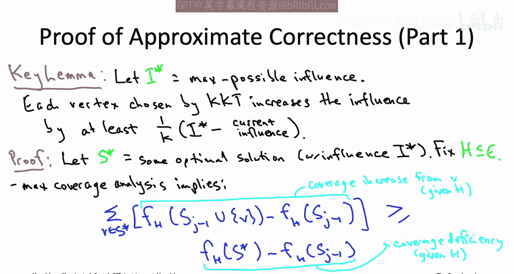

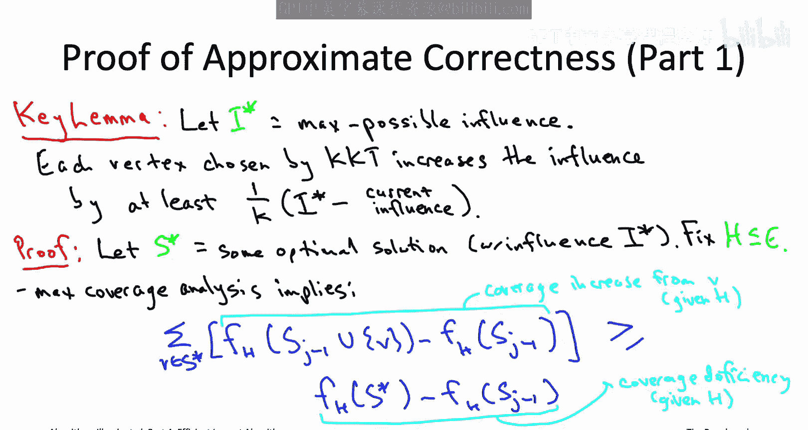

## 利用影响力是覆盖函数的加权平均

现在，让我们实际利用影响力是覆盖函数的加权平均这一事实，来完成对 KKT 算法保证的证明。

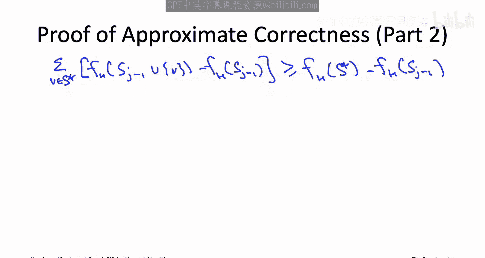

这个不等式是针对一个固定的 **H**（一个固定的最终激活边集合）的。因此，我们实际上不只有一个这样的不等式，而是有 **2^m** 个（**m** 是边数）。对于 **H** 的每一种选择（边的每一个子集），我们都有一个这种形式的不等式。

接下来我们要用的技巧是：既然我们已经知道影响力是覆盖函数的加权平均，那么我们就取这些不等式（每个覆盖函数一个），用定义影响力时使用的完全相同权重对它们进行加权平均。权重就是 **H** 真正成为激活边集合的概率 **p(H)**。

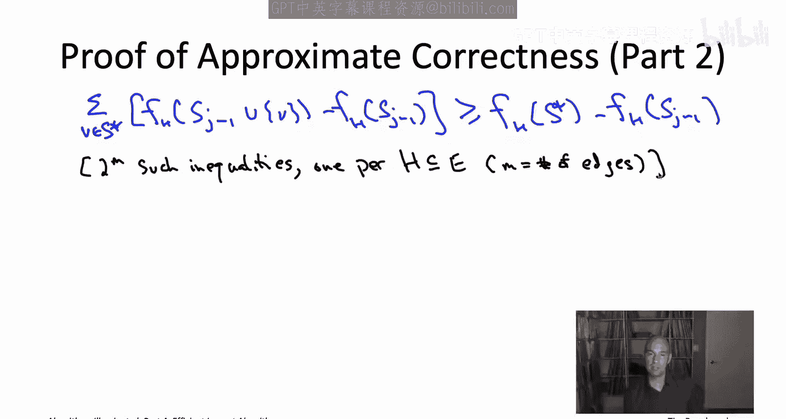

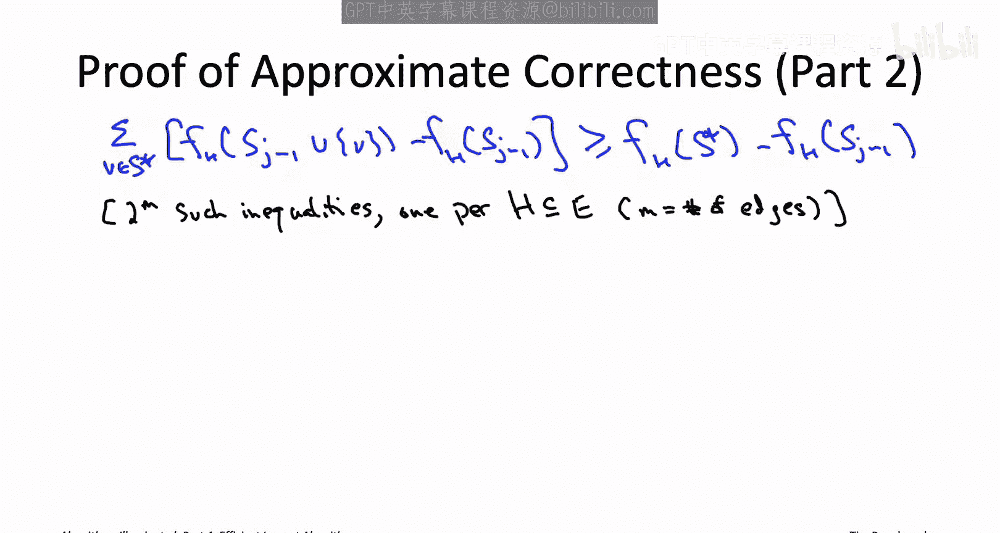

让我展示一下“取这 **2^m** 个不等式的加权平均”具体是什么意思。首先，对于对应激活边子集 **H** 的不等式，两边同时乘以该集合真正成为级联模型中激活边集合的概率 **p(H)**。因为如果 **a ≥ b**，两边乘以同一个正数，不等式仍然成立。

现在，我们有了一个由 **p(H)** 加权的不等式。同样，我们并不真正关心 **p(H)** 的具体形式，但它有一个闭式公式：**p^{|H|} * (1-p)^{m-|H|}**。

我们对每一个可能的边子集都有这样一个不等式。我们想要一个加权平均，所以最后，我们只需将这 **2^m** 个不等式全部加起来，得到另一个不等式（如果 **a1 ≥ b1** 且 **a2 ≥ b2**，那么 **a1 + a2 ≥ b1 + b2**）。

我们这样做是为了复用覆盖分析。我们知道，只有固定了激活边集合 **H**，我们才有一个覆盖函数。然后我们知道需要回到影响力，而影响力是这些覆盖函数的加权平均。因此，对每个覆盖函数单独得到的不等式取相同的加权平均，是一个合理的尝试。现在，它真的会神奇地奏效。

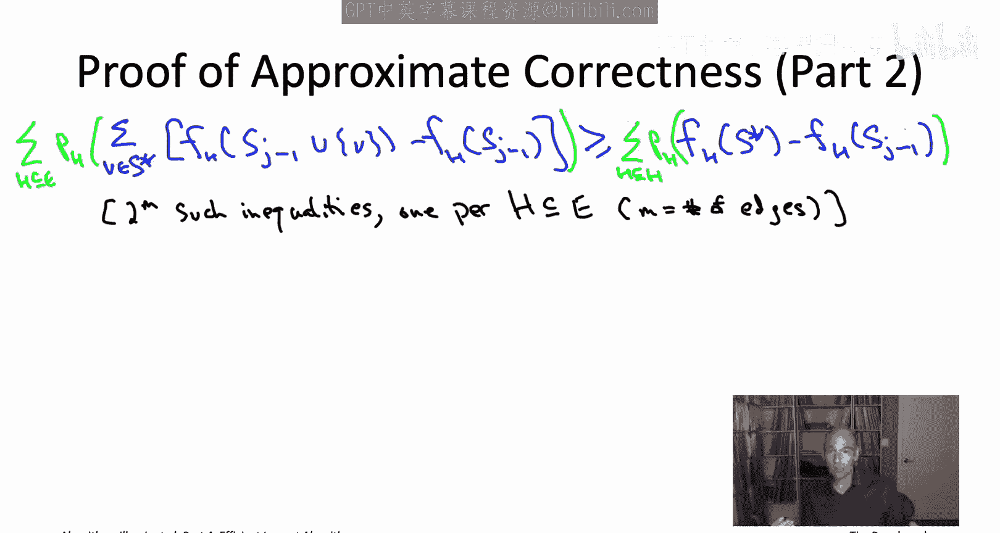

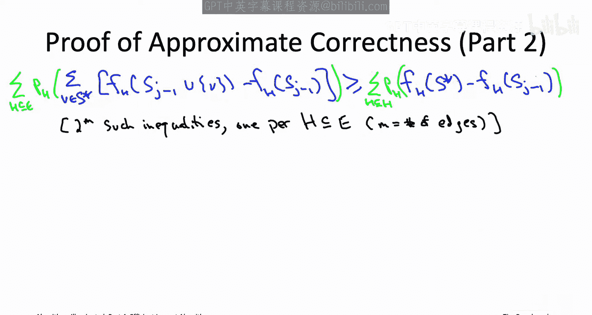

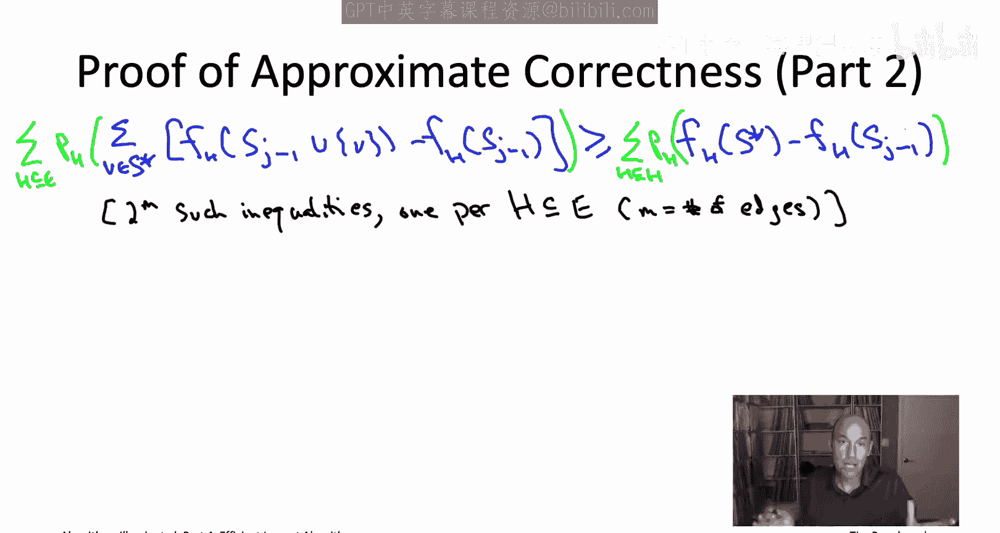

观察当我们交换求和顺序时会发生什么。我所做的只是两边乘以 **p(H)**，并尽可能地将 **p(H)** 带入求和内部。此外，在左边，我无害地颠倒了求和的顺序：现在我先对最优解 **S*** 中的顶点求和，然后再对可能的激活边子集求和。

为什么这是一个好步骤？我们以前见过这种对 **H** 求和 **p(H) * f_H(...)** 的形式。记住，影响力正是覆盖函数的加权平均，所涉及的覆盖函数正是这些 **f_H**，而权重正是这些 **p(H)**。因此，影响力 **f(.)** 正是 **∑_H p(H) * f_H(.)**。

这意味着我们即将成功。这意味着所有这些对 **H** 的求和，我们知道它们的另一个名字：这就是对应顶点子集的影响力。

例如，左边第一个对 **H** 的求和，不过是 KKT 算法前 **j-1** 次选择的顶点加上最优解 **S*** 中这个顶点 **v** 所构成集合的影响力。类似地，左边第二个对 **H** 的求和，就是 KKT 算法前 **j-1** 次选择的顶点集合 **S_{j-1}** 的影响力。

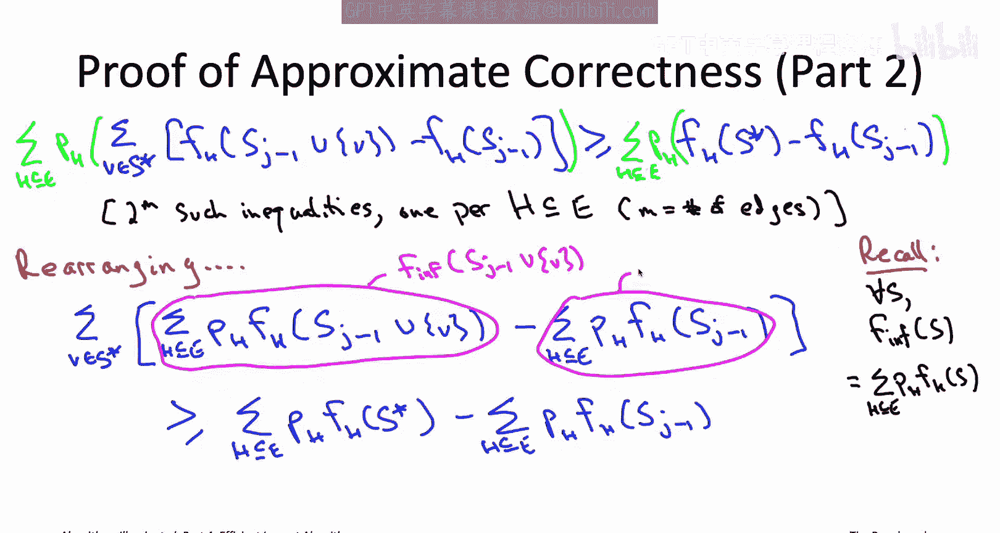

在右边，我们得到 **S*** 的影响力 **I***，以及 **S_{j-1}** 的影响力 **f(S_{j-1})**。

这就是我们在最大覆盖分析中最重要的不等式的类比。现在我们有了影响力最大化问题的类似不等式。既然我们知道了这个，我们基本上就成功了。证明的其余部分与最大覆盖的证明完全相同。

这个关键不等式告诉我们什么？它告诉我们，如果我们考虑这 **K** 个思想实验（贪心算法当前解是前 **j-1** 次迭代选出的 **S_{j-1}**，我们对最优解 **S*** 中的每个顶点 **v** 做一次实验：如果现在就将这个特定顶点加入贪心解，影响力会增加多少），那么这个不等式说明这些思想实验结果的和，有一个下界，即当前的影响力赤字（最大可能影响力 **I*** 比 KKT 算法已获得的影响力 **f(S_{j-1})** 大的部分）。

下一步，我们使用相同的策略：**K** 个数的最大值至少等于它们的平均值。在这个不等式的左边，我们有 **K** 个数的和，平均值就是和除以 **K**，所以其中一个数必须至少和平均值一样大。换句话说，在最优解 **S*** 中，存在一个顶点，它至少能获得左边求和的 **1/K** 倍，这当然意味着它也至少能获得右边求和的 **1/K** 倍，因为右边只可能更小。

也就是说，在最优解 **S*** 中存在一个顶点，如果你现在就将它添加到贪心算法的当前解中，保证影响力至少会增加当前影响力赤字的 **1/K** 倍。

KKT 算法可能会也可能不会选择这个顶点。但它是贪心算法，它选择在当前迭代中能最大化影响力增加的那个顶点。因此，无论 KKT 算法实际做了什么，它获得的影响力增加至少会有相同的下界：至少是左边不等式求和的 **1/K** 倍，因此也至少是右边不等式的 **1/K** 倍，即 **1/K * (f(S*) - f(S_{j-1}))**。

回顾关键引理的陈述，这正是我们需要证明的。我们现在已经完成了关键引理的证明。再次强调，KKT 算法的近似正确性保证从这里开始，将通过我们用于最大覆盖分析的完全相同的代数运算得出。

## 总结

本节课中我们一起学习了影响力最大化问题贪心启发式算法的理论证明。我们证明了即使影响力最大化是比最大覆盖更一般的问题，类似的贪心算法（KKT算法）也能获得同样好的近似保证：选择2个种子顶点时，你至少能获得75%的最大可能影响力；选择3个时，至少70.4%；无论选择多少个种子顶点，你至少能获得约63.2%的最大可能影响力。这只是一个“保险策略”，告诉你最坏情况下的理论下限。在实际的、更现实的实例中，你应该期望这个启发式算法表现得更好，获得的影响力会比这个最坏情况分析所暗示的更接近100%。

这结束了我们关于使用贪心算法设计范式的快速启发式算法的讨论，也结束了我们有可证明近似正确性保证的启发式算法讨论。但我们关于第20章的讨论尚未结束，因为我还想为你的工具箱添加一个重要工具——局部搜索，尽管它通常没有可证明的保证，但在许多实际案例中，对于NP难问题仍然极其有效。