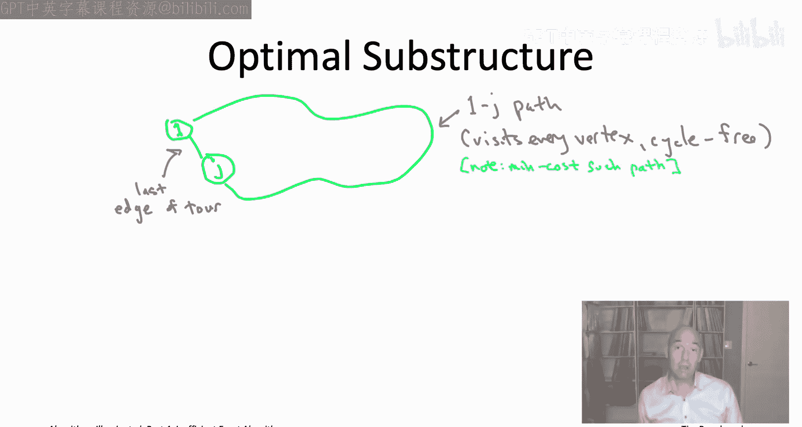
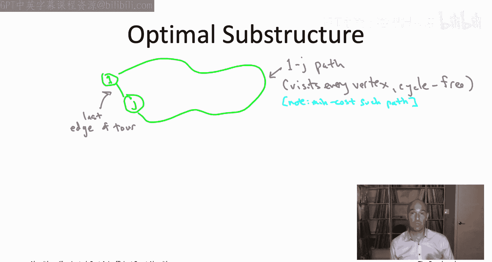

# 018：21.1_ 旅行商问题的贝尔曼-赫尔德-卡普算法 - 第1部分

在本节课中，我们将学习如何为NP难问题设计精确算法。我们将从一个经典问题——旅行商问题开始，并应用动态规划技术来设计一个比朴素穷举搜索快得多的精确算法。

## 概述：精确算法与动态规划

正如我们所见，对于NP难问题，我们无法同时兼顾正确性和速度。当我们不愿在正确性上妥协时，就只能在速度上做出妥协。本节的目标是设计精确算法。对于NP难问题，我们预期算法在某些情况下至少需要指数级运行时间。作为算法设计者，我们的目标是提出一种算法，它比朴素的穷举搜索等解决方案要好得多，并且在大多数情况下尽可能高效。

我们将从21.1节开始，应用一个老朋友——动态规划，来解决旅行商问题。这将为我们提供一个虽然是指数级但确实比穷举搜索好得多的算法。

## 重温旅行商问题

首先，快速回顾一下旅行商问题的定义，以及使用穷举搜索解决它需要多长时间。

在TSP中，输入是一个包含n个顶点的完全图。图中的每条无向边都有一个实数值成本，记为 **Ce**。目标是计算一个旅行商环路，即一个恰好访问每个顶点一次的环路。它从某个顶点开始，经过n-1跳访问所有其他顶点，最后回到起点。在所有环路中，我们希望找到边成本总和最小的那一个。

不幸的是，TSP是一个NP难问题。因此，如果我们想要一个精确算法，我们预期它至少在某些情况下需要指数级运行时间。那么问题是，我们能否有一些巧妙的算法思想，至少能改进朴素的穷举搜索？

为了设定基准，让我们记住穷举搜索解决TSP需要多长时间。旅行商环路的数量是 **(n-1)!**。因此，如果你要枚举每个环路，计算成本并记住最好的一个，你将花费 **O(n)** 的时间来处理每个 **(n-1)!** 环路，总运行时间为 **O(n * n!)**，这本质上是 **n!** 量级。

这非常糟糕。我们已经对 **2n** 形式的运行时间感到不满，但 **n!** 比 **2n** 大得多。为了回答 **n!** 比 **2n** 大多少的问题，让我介绍一个著名的近似结果，称为斯特林近似。

斯特林近似给出了阶乘函数增长的极其准确的估计。具体来说，**n!** 的增长大致可以认为是 **(n/e)n**。这里e是常数2.718...。还有一个前导项 **√(2πn)**，但这不太重要。更重要的是注意到 **(n/e)n**。当n变得适度大时，将一堆 **n/e** 相乘，这将比将一堆2相乘得到的指数大得多。这表明随着n增大，**n!** 的增长速度确实远快于 **2n**。

例如，如果在现代计算机上运行一个运行时间按 **n!** 缩放的算法，你大概只能处理最多15个顶点的输入。而对于运行时间为 **2n** 的算法，你可以处理大约40个顶点的问题规模。虽然听起来不那么令人印象深刻，但请记住这些都是NP难问题，我们必须给予它们足够的尊重。因此，**2n** 比 **n!** 好得多。

因此，这将成为我们为TSP设定的目标：朴素的穷举搜索运行时间为 **n!**，而 **2n** 虽然仍是指数级，但会快得多。所以我们将致力于设计一个运行时间大约为 **2n** 量级的TSP算法。

## 动态规划回顾

在上一章中，我们重温了一个熟悉的老算法设计范式——贪心算法，并看到了它们在为NP难问题设计快速启发式算法中的出色应用。在本章中，我们将再次重温工具箱中的另一个工具——动态规划。

动态规划的许多杀手级应用是针对多项式时间可解问题的，正如你在本系列之前的书籍和视频中所见。实际上，你已经看到了动态规划在NP难问题上的一个应用，因为背包问题实际上是NP难的，但我们为它提供了一个动态规划算法，这很不错。现在我们将看到另一个应用于旅行商问题的例子。

在深入之前，让我快速回顾一下动态规划的工作原理。

设计动态规划算法的关键在于找出正确的子问题集合。我们希望这些子问题具有一些属性：首先，子问题的数量不应该太多，因为我们将最终解决每个子问题。其次，解决每个子问题不应该花费太长时间，至少在我们已经解决了更简单的子问题之后。最后，在解决了所有子问题之后，应该很容易读出原始问题的实际答案。

例如，你可能记得的一些算法：在动态规划背包算法中，对于前i个物品的每个可能前缀（这是动态规划表的一个维度）和每个可能的整数剩余背包容量（另一个维度），都有一个单独的子问题。或者在贝尔曼-福特单源最短路径算法中，子问题由路径中允许的跳数参数化。给定的子问题会询问从起始顶点到某个目标顶点v的最短路径长度，该路径最多包含i条边。

想出这些神奇的子问题集合需要大量练习。当然，你现在已经身处第4部分，已经有了相当多的练习，我们将在接下来的几个视频中获得更多练习。为了提醒你，通常想出子问题的方法是进行这样的思维实验：思考最优解必须是什么样子。假设有人把最优解放在银盘上交给你，你想证明它必须由更小子问题的最优解以有限的方式组合而成。然后，你可以对可能的情况进行穷举搜索。这一点将在下一张幻灯片中具体说明。关键是，一旦你拥有具有所有这些属性的子问题集合，动态规划算法就几乎可以自己写出来了。你系统地解决所有子问题，从最简单的开始，到最难的结束，然后从子问题解决方案中推断出最终解。最后一步通常是微不足道的，因为原始问题通常就是你的一个子问题。

在许多情况下，动态规划算法的运行时间分析相当简单。例如，假设你拥有的子问题数量是 **F(n)**，其中n表示输入大小。这可能是n的线性、二次方甚至更糟的函数。假设在给定你已经解决的更简单子问题的解的情况下，解决每个子问题的时间上限是 **G(n)**。再假设从所有子问题的解中提取最终解需要 **H(n)** 时间。那么我们就得到一个明显的运行时间上限：**F(n) * G(n) + H(n)**。

当我们将动态规划应用于像TSP这样的NP难问题时，我们必须预期函数F、G或H中至少有一个是n的指数函数。

回顾一些经典的动态规划算法，例如背包问题、序列比对或贝尔曼-福特和弗洛伊德-沃歇尔算法，你会注意到函数G和H（即解决每个子问题的时间和后处理工作）从来都不大，它们总是 **O(1)** 常数或 **O(n)** 线性。而子问题的数量 **F(n)** 在我们考虑的不同动态规划算法中则大不相同。因此，如果我们要将动态规划应用于TSP，我们需要预期其中一个函数是指数级的。稍微思考一下，我们预期 **F(n)** 是指数级的。我们将在动态规划算法中看到指数数量的子问题。

## 为TSP设计动态规划算法

现在让我们通过这个思维实验来确定正确的子问题集合。让我们真正推理一下最优旅行商环路必须如何由更小子问题的最优解组成。

换句话说，假设有人把一个最优旅行商环路放在银盘上交给你，它必须是什么样子？这个环路访问所有顶点。如果我们愿意，可以认为它从标记为1的顶点开始（假设顶点编号从1到n），并最终回到该顶点。

我们在这些动态规划思维实验中看到的一个非常有效的技巧是推理最优解所做的最后一个决策。在这个上下文中，环路的边可以被认为是有序的，我们可以看最后一跳，即从某个顶点J回到1的边。

现在，我们想象做的是撤销最优解的这个最终决策，看看我们得到了什么，然后尝试理解对于什么子问题，那个结果是最优的。

如果我们从最优环路中移除这条最终边（1和J之间的边），我们会得到什么？现在我们得到一条路径，它在1和J之间，并且恰好访问每个顶点一次。此外，其中没有环路，因为我们是从一个环路开始的。

1和J之间的绿色路径不仅仅是访问每个顶点的任意一条1到J的路径。如果你仔细想想，它必须是成本最小的此类路径。没有其他方法可以在恰好访问每个顶点一次的情况下以更低的成本从1到达J。因为如果有，那么我们可以通过将1和J之间的边插回到那条据称更好的路径中，从而在原实例中获得一个更好的环路。

这是个好消息。这意味着如果我们只知道顶点J的身份，那么我们就知道整个环路的样子：它将是1和J之间的边，加上一条在1和J之间、恰好访问每个顶点一次、并且在此条件下具有最小可能成本的路径。这就是最优环路必须的样子。因此，实际上只有n个不同的候选者竞争成为最优旅行商环路，每个候选对应这个倒数第二个顶点J的一种可能性。

当然，我们事先并不知道J是什么，我们不知道最优环路访问的最后一个顶点是什么。但同样，只有线性数量的可能性，所以我们可以对最后一个顶点的n种不同可能性进行穷举搜索。

用数学写下来，我们可以写下对J可能性的穷举搜索。这就是 **minj=2 to n** 所做的。严格来说，不是n个候选，而是n-1个候选，因为1也不能是倒数第二个顶点。然后，对于给定的J猜测，你只需查看1和J之间的边成本，加上任何从1到J、无环路、恰好访问所有顶点一次的最小成本路径的成本。

如果你更喜欢递归地思考动态规划，这里的方法是：我们尝试J的所有可能性，对于J的每种选择，我们递归地计算从1到J、访问所有顶点的最小成本路径。

这一切听起来都很好。这告诉我们如何使用n-1次递归调用来计算最优环路成本，该子程序可以计算这些访问所有顶点的1-J无环路路径。下一个问题是，我们如何做到这一点？

在这里，事情变得有点棘手。让我们通过下面的测验来思考一下。

## 识别子问题

我们将问同样类型的问题。假设我们现在固定了J，并假设有人把我们需要的最小成本路径（从1到J，无环路且访问每个顶点）放在银盘上交给你。

同样，我们想思考这个最优解所做的最后一个决策。这将是结束于顶点J的最后一跳。所以，有一个倒数第二个顶点，称之为K，路径以边(K, J)结束。

现在，我们想思考移除最后一条边，看看剩下的子路径，然后我们想问：对于什么子问题，那个子路径是最优解？

让我们讨论一下这个测验的解决方案。这对于理解本节算法非常重要。

首先，因为我们从这条路径P开始（它从1到J，无环路，访问每个顶点，并且最后一跳是从K到J），子路径P'当然仍然是无环路的。它当然从1到K，因为我们移除了从K到J的最后一条边，并且它访问除J之外的所有顶点。因为P访问了每个顶点，我们移除了KJ跳，所以剩余的路径P'访问了V - {J}中的每个顶点。

至关重要的是，这条子路径P'确实不访问J。因为P只在最后一个端点访问了J一次，而P'我们移除了最后一跳，所以它不访问J。

这意味着答案A和C都是正确的。同时，答案B是不正确的。虽然P'确实是从1到K、访问V - {J}中所有顶点的某种无环路路径，但它不一定是最小成本的此类路径。因为谁能保证没有另一条路径，同样无环路，同样从1开始到K结束，同样访问V - {J}中的所有顶点，并且也访问顶点J呢？

为了说明我并非凭空捏造这种可能性，请考虑以下三个顶点的反例。在这个例子中，你可以看到，如果允许使用顶点J，那么1和K之间最短路径的长度会变得更短。如果它只能使用1和K，它必须选择成本为5的单跳路径。如果它也允许使用J，那么它可以做得更好，可以采用总成本为4的两跳路径。

换句话说，P'是一条被禁止使用顶点J的路径，它可能无法与允许使用顶点J的其他路径竞争。

好消息是，P'仍然是一个合适子问题的最优解，即后两个答案中提到的子问题类型。因此，D实际上是一个正确答案。

证明这一点的方法与我们在许多其他动态规划算法中看到的反证法、剪切粘贴论证完全相同。

从一个从1到J、无环路、恰好访问每个顶点一次的最优路径开始，即左上角的浅蓝色路径。

现在，我们考虑移除最后一跳(K, J)。这给我们留下了从1到K的剩余浅蓝色路径。我们想论证这是给定类型的最小成本路径，即一条从1到K、恰好访问除J之外的所有顶点一次、并且完全不访问顶点J的路径。

假设情况并非如此，假设实际上存在一条比此前缀更便宜的路径，满足完全相同的约束条件：从1开始到K结束，无环路，恰好访问V - {J}中的顶点，并且不访问J。让我们用洋红色画出这条路径。

如果洋红色路径的成本小于浅蓝色路径的成本，那么洋红色路径加上最后一跳(K, J)的成本就小于浅蓝色路径加上最后一跳(K, J)的成本。换句话说，这条洋红色路径加上最后一跳(K, J)，就构成了一条比我们开始时更好的路径。

现在非常重要的是，洋红色路径不使用顶点J，这是我们的约束之一。如果洋红色路径使用了顶点J，那么当我们放入最后一跳(K, J)时，就会形成一个环路（第二次访问J），我们就不能满足无环路条件。但是因为我们假设洋红色路径是前缀P'的一种更优版本，它从1到K，无环路，访问V - {J}中的所有顶点，并且不访问J。

这意味着当我们取洋红色路径，加上最后一跳(K, J)时，我们得到一条无环路路径。至关重要的是，现在它访问包括J在内的每个顶点，并且其成本严格小于浅蓝色路径的成本。但这是一个矛盾，因为浅蓝色路径是此类成本最小的路径。

因此，我们的假设是错误的，P'确实是从1到K、访问V - {J}中所有顶点且不访问J的最小成本无环路路径。

## 总结

在本节课中，我们一起学习了如何为旅行商问题设计一个基于动态规划的精确算法。我们首先回顾了TSP问题和穷举搜索的局限性，然后重温了动态规划的核心思想。通过思维实验，我们分析了最优解的结构，并识别出合适的子问题：计算从起点1到终点j、访问特定顶点集合S中所有顶点恰好一次且不访问其他顶点的最小成本无环路路径。这为我们设计运行时间约为 **O(n² * 2ⁿ)** 的算法奠定了基础，这远优于朴素的 **n!** 穷举搜索。在下一节中，我们将基于这些子问题正式构建贝尔曼-赫尔德-卡普算法。