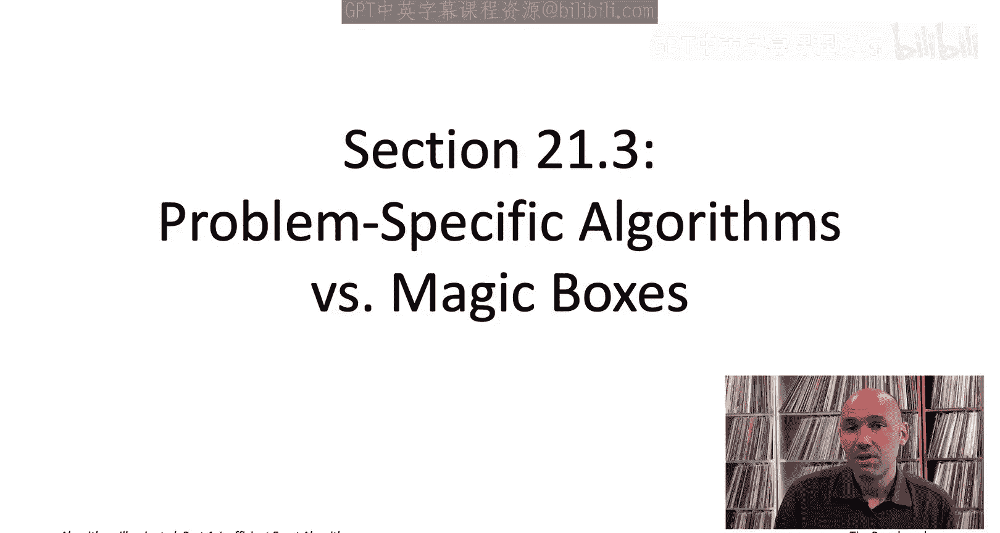
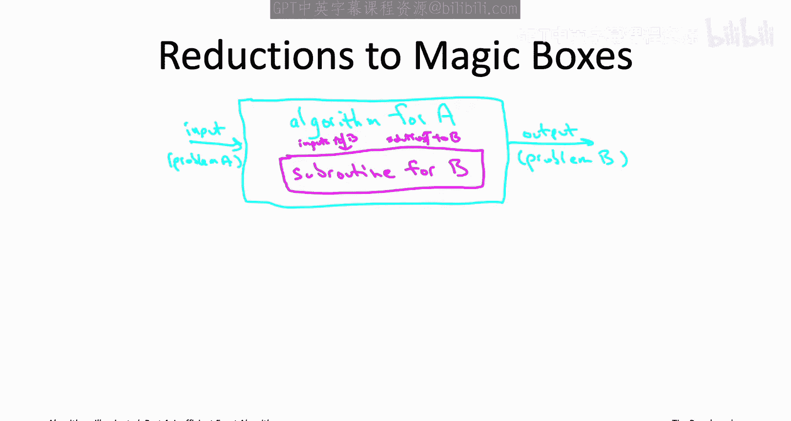
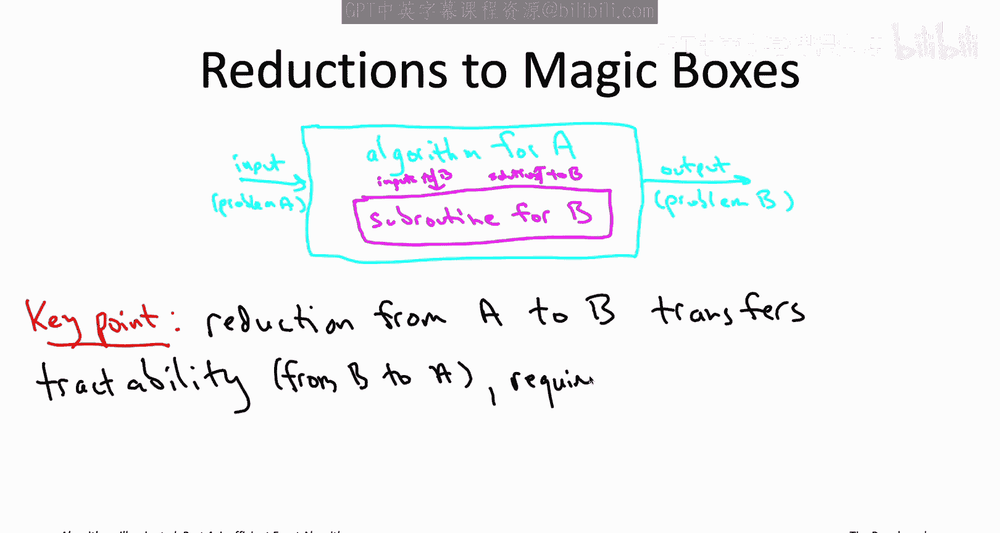
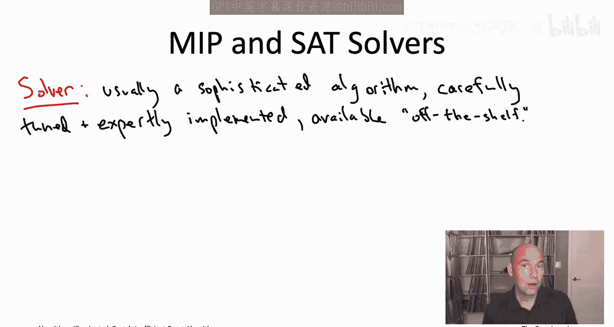
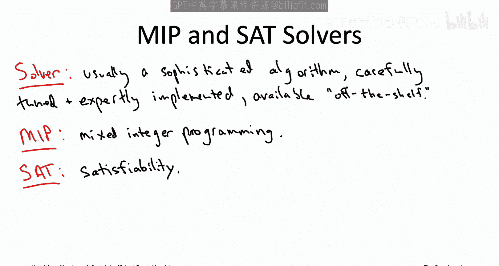
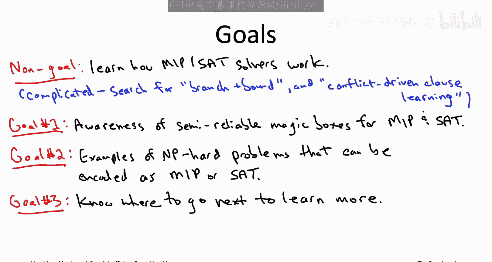

# 022：21.3 问题特定算法与“魔法盒子” 🧙‍♂️

在本节课中，我们将要学习“问题特定算法”与“魔法盒子”式通用求解器之间的区别与联系。我们将探讨如何通过“归约”将新问题转化为已知问题，并介绍两种强大的通用求解器：混合整数规划求解器和可满足性求解器。

---

上一节我们介绍了针对特定NP难问题（如旅行商问题）设计高效算法的方法。本节中，我们来看看另一种强大的策略：利用现成的“魔法盒子”式通用求解器。

我们之前主要关注为特定问题量身定制算法。例如，针对旅行商问题，我们开发了基于动态规划的贝尔曼-赫尔德-卡普算法，使其比穷举搜索更快。同样，针对最小成本K路径问题，我们设计了巧妙的“颜色编码”算法。这类定制算法能深入挖掘问题结构，提供理论保证，非常令人满意。

然而，面对一个新问题时，我们应首先自问：**这个问题是否是我已知如何解决的问题的一个特例或变体？** 如果答案是否定的，那么着手开发问题特定算法是合理的。即使答案是肯定的，但如果针对更通用问题的现有算法性能无法满足应用需求，那么针对特定问题进行优化也是合理的。

---

另一方面，在本系列课程中，我们也见过许多将问题归约为已知问题的例子。第一个例子是计算中位数：对数组排序并返回中间元素即可。我们还看到，全源最短路径问题可以通过对每个起点调用一次单源最短路径子程序来归约。最长公共子序列问题本质上也是序列比对问题的一个特例。

这种从**问题A**（你关心的问题）到**问题B**（你已知如何解决的问题）的**归约**，能够将**问题B**的计算可行性转移到**问题A**上。公式化地，如果存在一个从问题A到问题B的多项式时间归约，且问题B可在多项式时间内解决，那么问题A也可在多项式时间内解决。

---

到目前为止，我们考虑的归约都是将问题归约到我们自己已经知道如何高效解决的问题上。例如，在调用排序子程序计算中位数时，我们已经掌握了快速排序算法。

然而，归约的真正威力在于：**即使你自己从未想出如何高效解决问题B，甚至从未为其编写过代码，只要有人给你一个能高效解决问题B的“魔法盒子”，你就能高效解决问题A。**

你可以将这个“魔法盒子”想象成一个由一群超级聪明的人花费多年时间编写的、深奥难懂的软件。只要你拥有这个能可靠且高效解决问题B的“魔法盒子”，你就可以通过运行归约程序，在需要时调用这个解决**问题B**的子程序，从而解决你的**问题A**。

---

“魔法盒子”听起来可能像纯粹的幻想，类似于独角兽或青春之泉。它们真的存在吗？在接下来的几个视频中，我将介绍两种最接近的近似物：**混合整数规划求解器**和**可满足性求解器**。

这里所说的“求解器”，在实践中通常指一个深奥的软件，它包含非常复杂的算法，经过精心调优和专家级实现，可以作为现成的软件供你使用。

在下一个视频中，我们将首先讨论**混合整数规划求解器**。在随后的视频中，我们将讨论**SAT求解器**，这里的SAT代表**可满足性**。

MIP和SAT都是极其通用的问题，其表达能力足以涵盖本系列书中研究的所有问题作为其特例。尽管它们非常通用，但数十年的工程努力和智慧已经投入到最先进的MIP和SAT求解器中。因此，尽管它们解决的是NP难问题，但这些求解器通常能在合理时间内可靠地处理中等规模的实例。

求解器的性能因问题和许多其他因素而异很大，但为了给你一个概念：对于一个可以自然地编码为MIP或SAT问题的问题，输入规模在数千甚至数万的情况下，你或许有望在一天内甚至更快地解决。在某些应用中，MIP和SAT求解器对于大规模实例（甚至输入规模达百万级）也异常有效。

---

我在接下来两个视频中的目标相当适度。我不会详细讲解这些MIP和SAT求解器实际上是如何工作的，那需要一门完全独立的课程。相反，我希望让你做好准备，成为这些尖端技术的“知情用户”。

对于那些确实想了解更多实现细节的人，你可以搜索 **`分支定界法`** 来了解混合整数规划求解器的工作原理，或者搜索 **`冲突驱动子句学习`** 来了解新一代可满足性求解器。

那么，我们将学习什么呢？首先，我希望你知道这些技术确实存在，并且几乎触手可及。并非所有程序员都意识到，我们拥有这些被称为MIP和SAT求解器的“半可靠魔法盒子”，它们对于解决实际应用中的NP难问题可能极其有用。

其次，我希望让你更深入地理解混合整数规划和可满足性问题的通用性有多强。我将展示一些自然的NP难问题如何被自然地编码为这些求解器可以处理的特例。

最后，我们只会花相对较少的时间讨论MIP和SAT求解器，仅仅是浅尝辄止。但我会提供一些指引，如果你想更深入地学习，无论是了解实现细节（如搜索分支定界法或CDCL求解器），还是想在你自己的应用中实际使用这些工具（例如有哪些可用软件、如何入门），我们都会在接下来的视频中提及。

---

让我通过澄清你可能从这些视频中感受到的一些混合信息来总结。在开篇序列中，我们讨论了NP难性对算法设计者意味着什么，并指出你需要妥协：要么放弃精确性或正确性，要么牺牲运行时间并接受指数级算法。另一方面，我现在又告诉你，在实践中我们拥有这些“半可靠的魔法盒子”，可以解决混合整数规划和可满足性等NP难问题，进而覆盖许多其他问题作为特例。

我们如何调和这两点呢？关键在于，MIP和SAT求解器这些“魔法盒子”并非完全可靠，我只能称其为“半可靠”。当你将MIP或SAT求解器应用于你自己应用中的NP难问题时，基本上你需要“祈求好运”，并准备一个**备用方案B**。备用方案B可以是诸如快速启发式算法之类的东西。如果求解器无法解决问题，你必须有一个后备计划。毫无疑问，总会存在一些实例（包括相当小的实例）能让你的求解器束手无策。

对于NP难问题，MIP和SAT求解器这些“半可靠的魔法盒子”已经是我们能得到的最好工具了。

在下一个视频中，我将帮助你成为第一种“半可靠魔法盒子”——**混合整数规划求解器**——的知情用户。我们下次见。