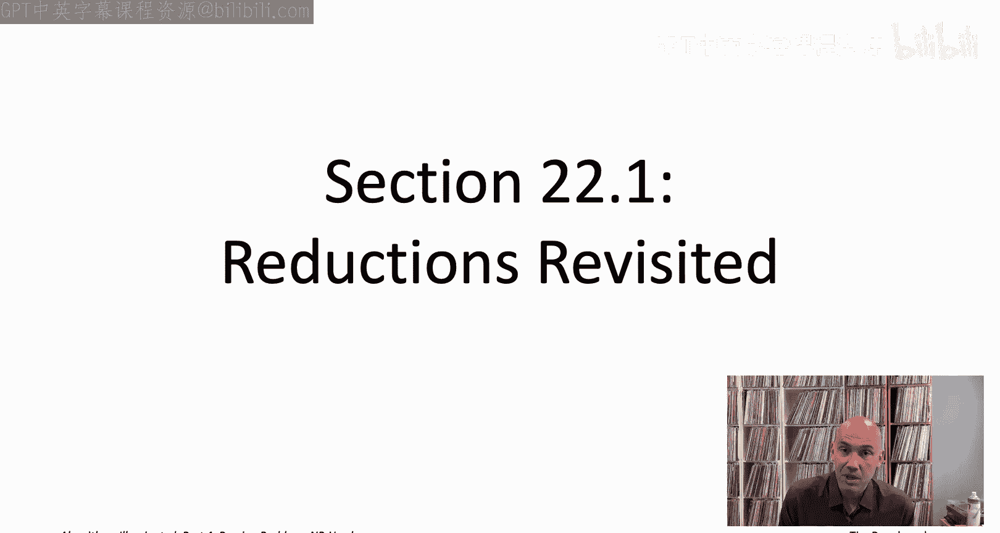
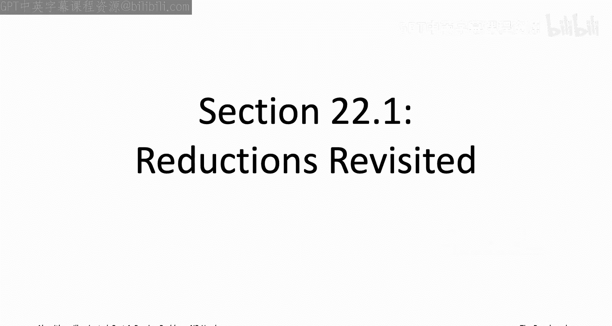
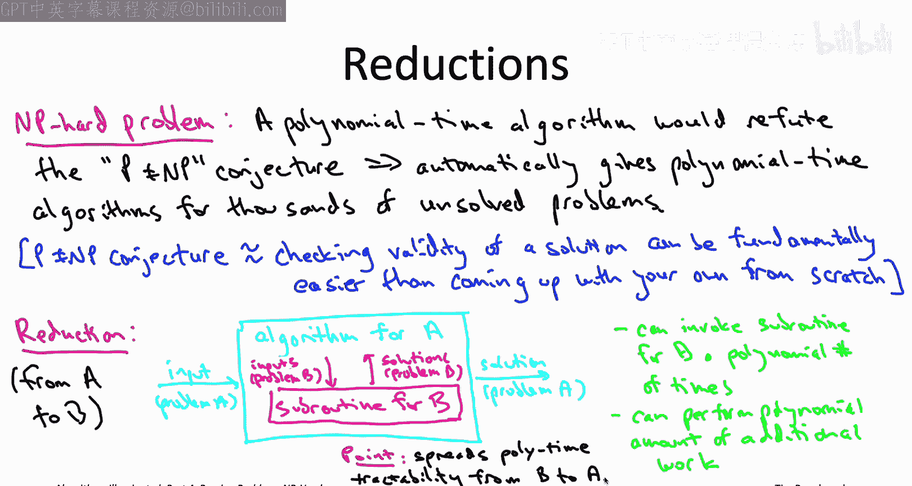
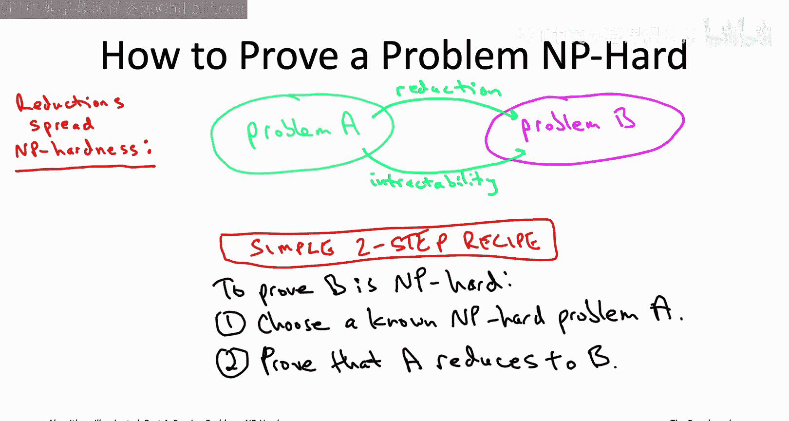
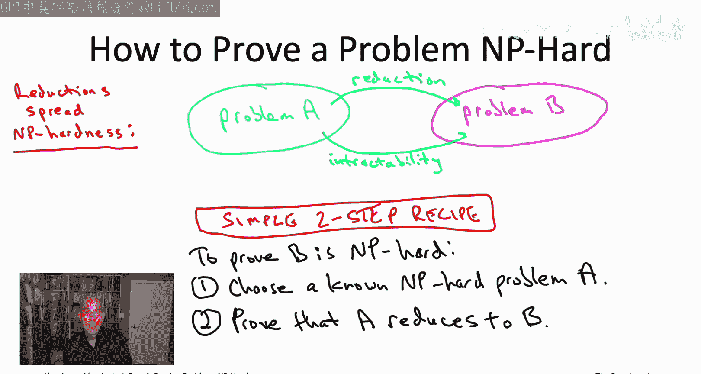
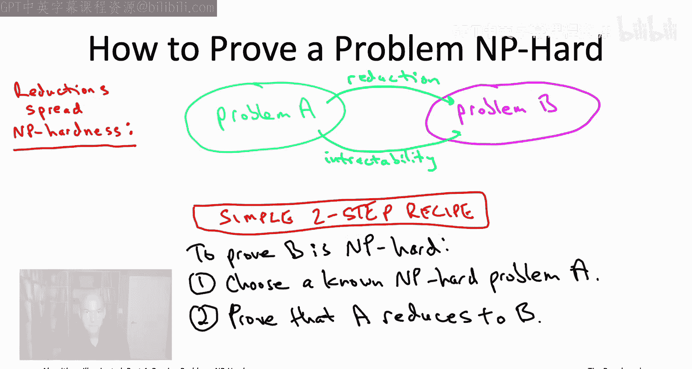

# 025：归约回顾 🔄

在本节课中，我们将要学习如何证明一个问题是NP难的。我们将从回顾归约的基本概念开始，并理解它在证明NP难问题中的核心作用。

上一节我们介绍了NP难问题的基本概念，本节中我们来看看归约是如何成为证明NP难问题的关键工具的。

## 概述

归约是算法设计中的一个核心概念。它本质上是一种论证，表明如果你能高效地解决问题B，那么你就能利用解决B的方法来高效地解决问题A。更正式地说，一个从问题A到问题B的归约是一个算法，它接受问题A的一个实例作为输入，允许以子程序的形式调用解决问题B的算法（多项式次数），并允许在调用之外进行多项式量的额外计算。最终，这个归约算法必须能够正确报告最初输入的问题A实例的答案。

作为算法设计者，我们通常以“传播可解性”的正面形式来思考归约。例如，全对最短路径问题可以归约到单源最短路径问题。这意味着，如果我们知道如何解决单源最短路径问题，我们就自动知道如何解决全对最短路径问题。一般来说，只要存在一个从问题A到问题B的归约，并且存在一个解决B的多项式时间算法，那么这个归约就会自动为你提供一个解决A的多项式时间算法。换句话说，从A到B的归约将可解性从B传播到了A。

然而，在NP难理论中，归约的用途有所不同。它是一种更“狡猾”的用法，不是为了传播计算的可解性，而是为了传播计算的**不可解性**，即传播NP难性，但其传播方向与可解性相反。

当我们以传播可解性的正面形式使用归约时，可解性沿着归约的**相反方向**传播。如果问题A归约到问题B，那么B的可解性意味着A的可解性。因为你可以通过运行归约算法并使用假设的B的高效算法来得到A的算法。

计算不可解性（如NP难性）的传播方向与可解性相反，这意味着它沿着归约的**相同方向**传播。如果A归约到B，并且A是难解的（例如是NP难的），那么B在相同意义上也是难解的。

为了提醒你为什么这是真的，想象问题A是NP难的。这意味着一个解决A的多项式时间算法将推翻P不等于NP猜想。假设问题A归约到问题B。再假设我们实际上为B设计出了一个多项式时间算法。那么，通过这个归约，它将自动转化为一个解决A的多项式时间算法。但我们说过，这将推翻P不等于NP猜想。换句话说，即使是B的多项式时间算法也会推翻P不等于NP猜想，而这正是我们定义一个问题为NP难的临时标准。因此，如果A是NP难的，并且A归约到B，那么B也必须是NP难的。

这对我们来说意味着，存在一个极其简单的“配方”来证明一个问题是NP难的。

## 证明NP难性的简单配方

如果你在自己的项目中遇到了某个问题B，并且你怀疑B可能是NP难的，你可以按照以下步骤来证明它。

以下是证明问题B是NP难的两个步骤：

1.  **选择一个已知的NP难问题A**。这需要你对已知的NP难问题有所了解。在本章中，你将学习19个NP难问题，其中任何一个都可以作为步骤1中问题A的合法选择。如果这19个还不够，书籍中还记载了数百个其他问题。
2.  **设计一个从问题A到你所关心的问题B的归约**。这需要你具备在不同问题之间设计归约的技能。虽然我们之前的训练主要集中在使用归约传播可解性的正面用途上，但那些完全相同的归约技巧也可以反过来用于传播不可解性。随着我们在后续视频中的深入学习，我们将获得大量关于NP难证明中归约特殊技巧的实践。

如果你完成了这两个步骤，那么证明就完成了。你已知问题A是NP难的（根据假设），并且你将它归约到了B。由于难解性（NP难性）沿着归约的相同方向传播（从A到B），因此可以断定问题B也是NP难的。

## 总结

本节课中我们一起学习了归约在证明NP难问题中的核心作用。我们回顾了归约如何既能传播可解性，也能传播不可解性，并理解了其方向性的关键区别。最重要的是，我们掌握了一个简单的两步骤配方来证明新问题是NP难的：首先选择一个已知的NP难问题，然后设计一个从该问题到目标问题的归约。在接下来的课程中，我们将以此为基础，深入探讨具体的NP难问题实例和归约设计技巧。