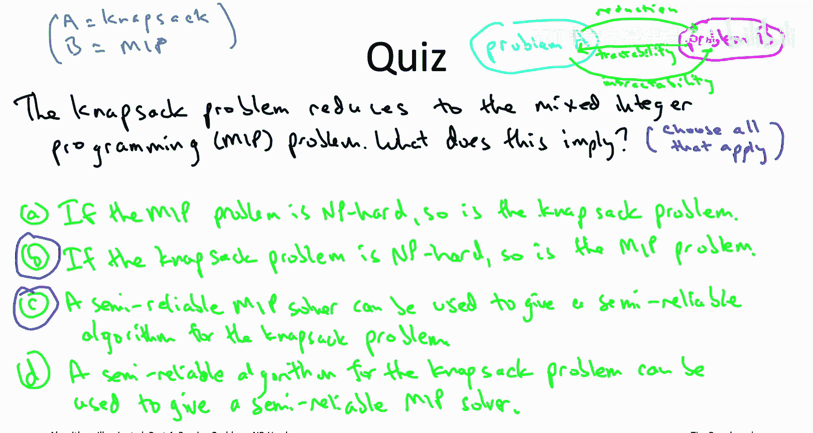
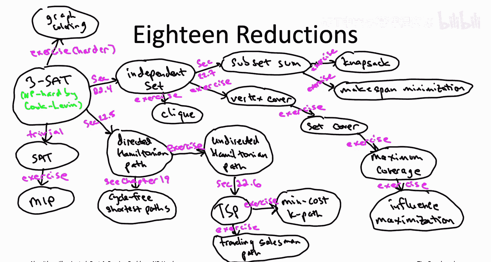

# 027：全局概览 🗺️

在本节中，我们将学习第22章的整体规划。我们将回顾如何通过归约从3SAT问题证明其他问题的NP难性，并梳理本章将要讨论的19个NP难问题及其间的18个归约关系。我们将首先通过一个小测验来巩固对归约方向的理解，然后概览所有问题与归约，并区分哪些归约是简单的，哪些是复杂的。

## 归约方向测验

上一节我们介绍了归约的概念。本节中我们来看看一个关于归约方向的小测验，以确保我们理解计算易处理性和难处理性是如何通过归约传播的。

假设我们已知背包问题可以归约为混合整数规划问题。这意味着存在一个多项式时间算法，可以将任意背包问题的实例转换为一个混合整数规划问题的实例。那么，以下哪些陈述是正确的？

以下是三个选项：
*   A. 混合整数规划问题的计算难处理性意味着背包问题的计算难处理性。
*   B. 背包问题的计算难处理性意味着混合整数规划问题的计算难处理性。
*   C. 混合整数规划问题的计算易处理性意味着背包问题的计算易处理性。

正确答案是B和C。

理解原因最简单的方法是回忆我们关于问题A归约为问题B的示意图，以及易处理性和难处理性的传播方向。假设问题A归约为问题B。当我们谈论传播易处理性时，它沿着与归约相反的方向传播。因此，如果问题B是易处理的（存在多项式时间算法），那么通过将归约算法与问题B的算法组合，我们就能得到问题A的多项式时间算法，从而证明A也是易处理的。

而难处理性则沿着与易处理性相反的方向传播，即与归约相同的方向。回想一下证明问题B是NP难的两步法：我们取一个已知的NP难问题A，然后将A归约为B。这样，难处理性就从A传播到了B。

在这个测验中，背包问题是问题A，混合整数规划问题是问题B。因此，计算难处理性沿着从背包问题到混合整数规划问题的方向传播，这正是选项B所陈述的。选项A将难处理性的传播方向弄反了。同理，选项C也是正确的，因为计算易处理性沿着相反的方向传播：给定一个解决混合整数规划问题的合理算法，通过将其与从背包问题到混合整数规划的归约组合，我们就能得到一个解决背包问题的合理算法。

## 问题与归约关系图

在明确了归约方向后，我们可以开始讨论本章将通过18个归约产生的19个NP难问题。

我们将用19个节点代表19个计算问题，其中包括我们在本系列视频中讨论过的所有问题。如果问题A可以归约为问题B，我们就画一条从A指向B的箭头。难处理性将沿着箭头的方向传播。所有NP难问题的源头——Cook-Levin定理的产物——我们将从3SAT问题开始。

接下来，我们将从3SAT出发，画出一个向外的有向树。NP难性将通过这个有向树从3SAT传播到其他18个问题。

以下是完整的关系图：

这张图可能看起来有些复杂，它包含了很多问题和18个归约。不过，其中一些归约我们已经见过，接下来我们将讨论哪些归约是简单的，哪些是困难的，并将占据接下来的四个视频。

## 简单的归约

在18个归约中，有11个相对简单，它们将作为本章的课后练习出现。以下是这些相对简单的归约及其简要说明。

**从3SAT到SAT**：这个归约是完全平凡的，因为3SAT本身就是SAT的一个特例（每个子句最多包含三个文字）。因此，任何能解决SAT的子程序都能自动解决3SAT。

**从有向哈密顿路径问题到无负环最短路径问题**：这个归约我们在第19章的开头已经见过。我们当时利用归约来传播难处理性，并简要展示了这个两步法的实例。我们当时假设有向哈密顿路径问题是NP难的（本章将证明），然后我们展示了该问题可以相当容易地归约为计算无负环最短路径的问题。这个归约很有趣，因为它解释了我们在本系列前几册中讨论的最短路径算法（如Bellman-Ford和Floyd-Warshall）的局限性：它们只能保证在图中没有负环的特殊情况下计算最短路径距离。正是通过这个归约，我们最终理解了原因：如果这些算法在更一般的情况下（如图中有负环）也能正确工作，那将实际上反驳P≠NP猜想。

**从独立集问题到团问题**：这两个都是关于无向图的问题。独立集是图中两两不相邻的顶点子集，而团则是两两相邻的顶点子集。独立集问题是寻找最大规模的独立集，最大团问题是寻找最大规模的团。如果我们有一个解决团问题的有效子程序，可以很容易地从中提取出解决独立集问题的算法：给定一个独立集问题的实例，我们取其补图（即翻转边的存在性），这样原图中的所有独立集就变成了补图中的团。然后运行假设的求最大团的子程序，得到结果后再将边翻转回来，就得到了原图的最大独立集。

**从独立集问题到顶点覆盖问题**：顶点覆盖问题是寻找一个最小的顶点子集，使得图中的每条边都至少有一个端点在这个子集中。这里的关键在于认识到，在任何图中，一个顶点子集是独立集，当且仅当它的补集是顶点覆盖。因此，如果我们有一个求解最小顶点覆盖的子程序，我们只需调用它找到最小顶点覆盖，然后取其补集，就得到了最大独立集。

**从顶点覆盖问题到集合覆盖问题**：集合覆盖问题的输入类似于最大覆盖问题：有一个基础元素集合，以及该集合的一系列子集。目标是用尽可能少的子集覆盖整个基础集合。顶点覆盖问题实际上是集合覆盖问题的一个特例。我们可以将图的边集视为基础集合，为每个顶点创建一个子集，包含所有与该顶点相连的边。这样，该集合系统的集合覆盖就精确对应于原图的顶点覆盖。

**从集合覆盖问题到最大覆盖问题**：这两个问题的输入几乎相同。区别在于，最大覆盖问题给定一个可以选择子集数量的预算K，目标是覆盖尽可能多的元素；而集合覆盖问题要求必须覆盖所有元素，目标是使用尽可能少的子集。如果我们有一个解决最大覆盖问题的子程序，可以用它来求解集合覆盖：我们依次询问该子程序，使用1个、2个、3个……个子集所能覆盖的最大元素数量。当某个K值首次使得最大覆盖算法能够覆盖整个基础集合时，这个K值以及对应的子集就是原集合覆盖实例的最小集合覆盖。

**从最大覆盖问题到影响力最大化问题**：我们在讨论影响力最大化时提到过，最大覆盖问题基本上是影响力最大化的一个特例。为了将最大覆盖实例视为影响力最大化实例，我们可以构造一个图：顶层顶点对应最大覆盖实例中的每个子集，底层顶点对应基础集合中的每个元素。对于每个子集顶点，我们添加一条指向其包含的每个元素顶点的有向边。将激活概率设置为1。此时，在该图中选择K个顶层顶点以最大化影响力，就精确对应于选择K个子集以最大化覆盖范围。

**从旅行商问题到旅行商路径问题**：旅行商路径问题是TSP的一个变体，它不要求形成闭合回路，而是一条访问所有顶点恰好一次的最短路径。从TSP到该问题的归约并不困难，可以通过对原TSP实例进行一些小的修改，使得当我们把修改后的图输入给求解旅行商路径的子程序时，可以“欺骗”该子程序为我们计算出原图中的最优回路。同样的思路也适用于我们详细讨论过的**最小成本K路径问题**（在带权图中寻找恰好访问K个不同顶点的最短路径），可以证明该问题也是NP难的。

**有向与无向哈密顿路径问题之间的归约**：由于我们关心的某些图问题最自然地出现在有向图中，而另一些则出现在无向图中，因此拥有哈密顿路径问题的两个版本（有向和无向）是有用的。这两个问题本质相同，存在非常简单的双向归约。例如，给定一个无向图和一个解决有向哈密顿路径的子程序，我们可以将每条无向边替换为两条方向相反的有向边。这样，在得到的双向有向图中找到的有向哈密顿路径很容易转换回原无向图中的哈密顿路径。反过来，从有向图到无向图的转换稍微复杂一些，但也不难，通过对图进行一些改造，使得在改造后的无向图中找到的哈密顿路径可以提取出原图中的有向哈密顿路径。

**从SAT问题到混合整数规划问题**：当我们有一个可行性问题（如图着色）时，SAT通常是最自然的编码方式。但如果我们愿意，也可以使用混合整数规划来编码。MIP是关于优化的，但如果我们只是想编码一个SAT实例，可以使用一个占位符目标函数（例如最大化0）。然后，我们需要将SAT实例中的逻辑约束（文字的析取）转换为算术约束（不等式）。通常，我们会为SAT实例中的每个布尔变量引入一个0-1决策变量（1代表真，0代表假）。这样，每个子句都可以很容易地转换为一个不等式。当然，也可以通过其他方式（如背包问题是MIP的特例）来论证MIP是NP难的。

**从子集和问题到背包问题与机器调度最小化完工时间问题**：子集和问题的输入是n个正整数和一个目标值，问题是判断是否存在一个子集，其和恰好等于目标值。我们将证明子集和问题是NP难的。这里需要指出，子集和问题基本上是背包问题和（两机器情况下的）机器调度最小化完工时间问题的一个特例。如果子集和是NP难的，那么这两个更一般的问题自然也是NP难的。对于背包问题，子集和对应物品大小等于物品价值的特殊情况。对于机器调度，则大致对应只有两台机器的特殊情况。

以上就是11个相对简单的归约练习。剩下的5个归约中，有4个我们将在接下来的四个视频中详细讲解。第5个归约（证明图着色问题是NP难的）虽然也不简单，但仍将作为练习。其难度与我们将要看到的归约大致相当。

## 困难的归约与学习目标

剩下的四个较难的归约是我们接下来的重点。

1.  **从3SAT到独立集问题**：在下一个视频中，我们将首先展示如何将3SAT问题归约为独立集问题。一旦完成这个归约，并假设Cook-Levin定理（3SAT是NP难的），难处理性将沿着该路径一直传播到末端，包括最大覆盖和影响力最大化问题。
2.  **从3SAT到有向哈密顿路径问题**：我们的第二个目标是确立旅行商问题的NP难性，这是经典的NP难问题。为此，我们需要两步：第一步是另一个从3SAT到图问题的归约，这次是到有向哈密顿路径问题。这将在第二个视频中完成。
3.  **从（无向）哈密顿路径问题到旅行商问题**：这个归约将从有向哈密顿路径问题（通过前述归约已知是NP难的）出发。由于有向和无向哈密顿路径问题本质相同，我们也知道无向版本是NP难的。然后，存在一个相当简单的从无向哈密顿路径问题到旅行商问题的归约。这将在第三个视频中完成，也是四个归约中最简单的一个，最终兑现旅行商问题是NP难问题的承诺。
4.  **从独立集问题到子集和问题**：最后一个归约在第四个视频中，展示如何将独立集问题（将在第一个视频中证明是NP难的）归约为子集和问题。由于子集和是背包问题和机器调度最小化完工时间问题的特例，这将立即确立这两个问题的NP难性。这个归约特别有趣，因为背包问题和子集和问题的输入只是一堆数字。我们知道可以用依赖于输入数值大小的伪多项式时间算法解决背包问题（及子集和）。但NP难性结果解释了为什么我们无法获得运行时间仅依赖于输入数字位数的真正多项式时间算法。

接下来的四个视频将填补这些空白，展示最后四个归约的证明。在开始之前，需要坦诚相告：NP难性归约，包括我们将要看到的一些，可能会有些繁琐和复杂。老实说，几乎没有人会记住任何NP难性证明的所有细节。尽管如此，学习其中几个仍然有很好的理由。以下是接下来四个视频中学习这些NP难性归约的目标：

**目标一：兑现承诺**。在本系列视频和书中，我们面对一个又一个问题时，总是说“可惜，这是NP难的”，并因此必须在正确性或运行时间上做出妥协。如果不解释为什么这些问题确实是NP难的，以及为什么我们需要那些妥协，会显得有些不够诚实。完成这些归约将兑现我们在第20和21章中做出的承诺。

**目标二：提供工具**。证明一个问题是NP难的两步法的第一步，是选择一个已知的NP难问题。通过学习这些归约，将巩固我们对一系列NP难问题的认识，你可以在自己进行NP难性归约时使用它们。如果19个问题还不够，可以参考Michael Garey和David Johnson的经典著作《Computers and Intractability: A Guide to the Theory of NP-Completeness》（1979年）。该书收录了300多个NP难问题的汇编，是构思自己归约的绝佳资料库。

**目标三：建立信心**。我并不指望你一年后甚至一周后还能记住这些归约的细节。但这个练习应该能让你感到更有能力。如果在未来的某个时候，你的老板交给你一个问题，并说“你今年的加薪取决于你能否在下周前证明这是NP难的”，你应该觉得，如果真有必要，你是可以做到的。它们虽然繁琐且针对特定问题，但看完接下来几个20分钟的视频示例后，你会理解它们，并感到：“是的，如果真需要我做，我可以。”

关于第22章的整体概览就介绍到这里。接下来，让我们深入具体的归约，从独立集问题开始。我们下一个视频见。

## 总结

本节课中，我们一起学习了第22章的全局规划。我们通过一个小测验巩固了对归约方向的理解，明确了计算易处理性和难处理性是如何传播的。我们概览了本章将要涉及的19个NP难问题和18个归约，并将它们分为11个简单的归约（多作为练习）和5个较难的归约。我们还明确了接下来四个视频的学习目标：详细讲解四个关键的归约，以证明独立集、有向哈密顿路径、旅行商以及子集和（进而背包和机器调度）等问题的NP难性，从而兑现之前的承诺，并为读者提供进行NP难性证明的工具和信心。