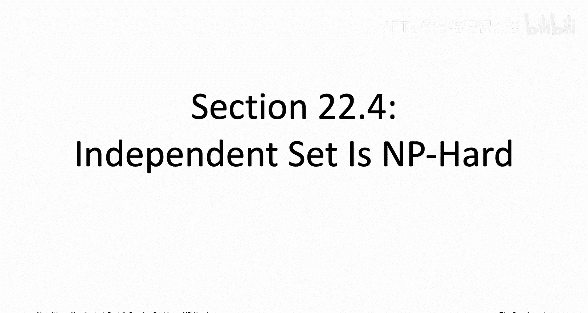
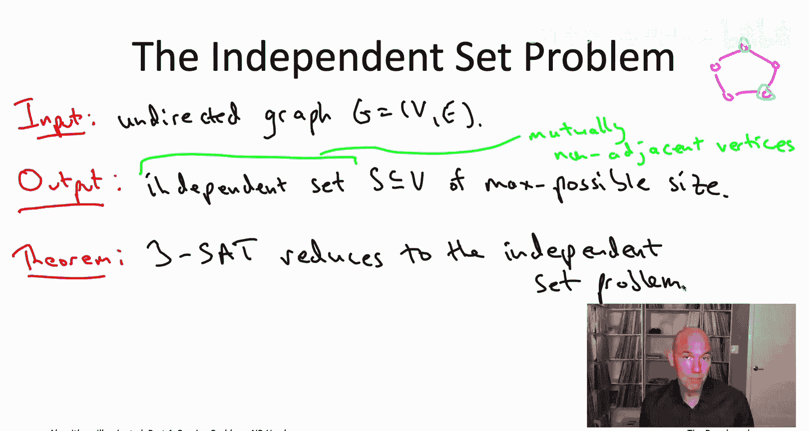
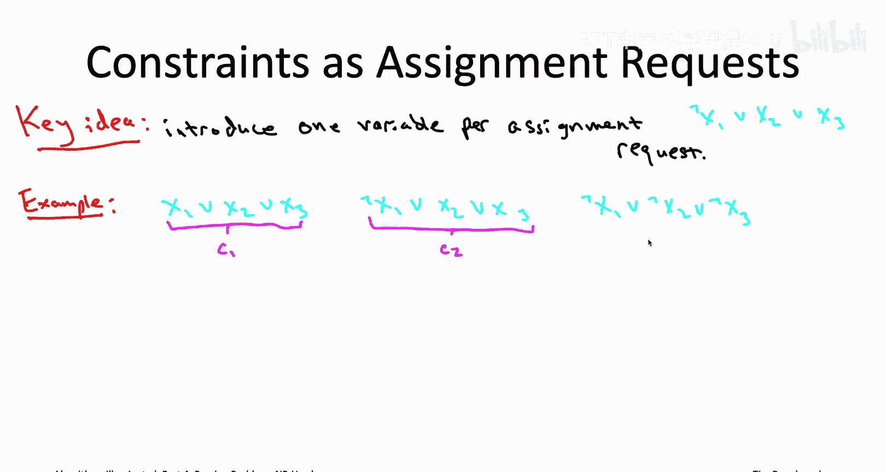
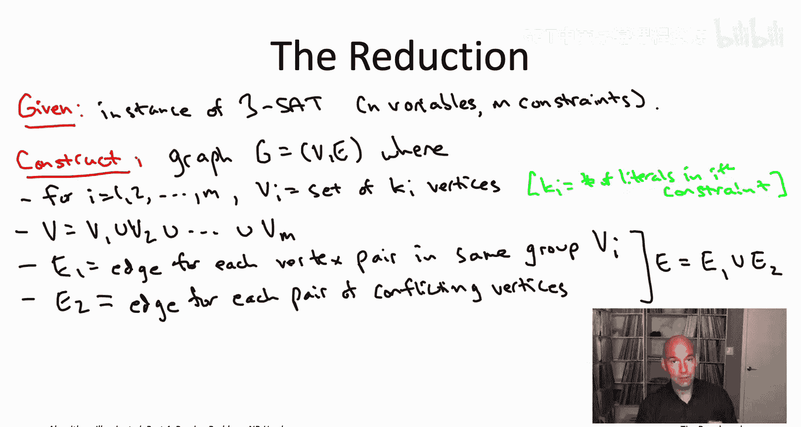
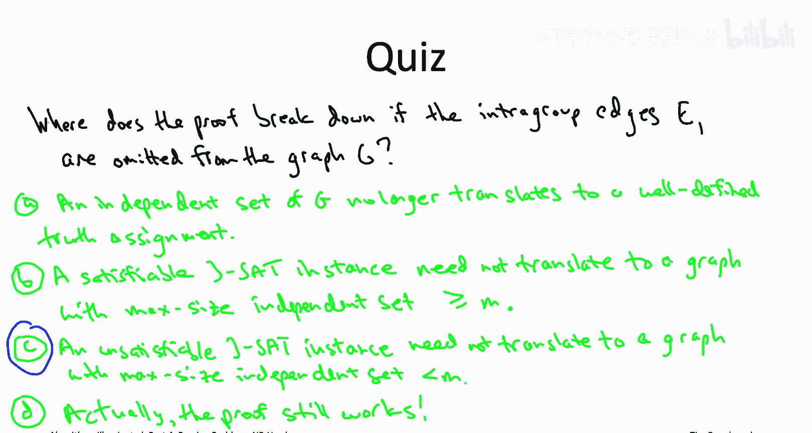

# 028：独立集问题是NP难的 🧩

在本节课中，我们将学习如何证明独立集问题（Independent Set Problem）是NP难问题。我们将通过一个从3-SAT问题到独立集问题的归约来完成证明。理解这个归约是掌握NP完全性理论的关键一步。

## 概述

我们将遵循一个两步走的“配方”来证明独立集问题是NP难的。首先，我们选择一个已知的NP难问题作为起点。目前，我们唯一已知的NP难问题是3-SAT问题（由Cook-Levin定理保证）。然后，我们将展示如何将任意一个3-SAT问题的实例，高效地转化为一个独立集问题的实例。如果这个转化（归约）是正确的，那么独立集问题的计算难度至少和3-SAT问题一样高，从而证明独立集问题也是NP难的。

## 独立集问题回顾

在开始归约之前，让我们快速回顾一下独立集问题。

*   **输入**：一个无向图 `G = (V, E)`。
*   **目标**：计算一个**独立集**，即一个顶点子集 `S ⊆ V`，其中任意两个顶点都不相邻（即没有边连接）。我们通常寻找**最大可能尺寸**的独立集。

例如，在一个5个顶点构成的环（5-cycle）中，最大独立集的尺寸是2。你无法选出3个互不相邻的顶点。

我们之前讨论过带权独立集问题，每个顶点有一个非负权重，目标是找到总权重最大的独立集。而这里我们关注的是所有顶点权重均为1的特殊情况（即最大尺寸独立集）。我们将看到，即使这个特殊情况，对于一般图来说也是NP难的。

## 归约的核心思想

现在，我们面临一个挑战：如何将一个关于逻辑公式（3-SAT）的问题，转化成一个关于图（独立集）的问题？

3-SAT问题的输入是一组子句（clauses），每个子句是至多三个文字（literals，即变量或其否定）的析取（disjunction）。例如，一个子句可能是 `(¬x1 ∨ x2 ∨ x3)`。这个子句在请求：“请将 `x1` 设为假，或者将 `x2` 设为真，或者将 `x3` 设为真”。只要满足其中任何一个请求，该子句就被满足。

归约的关键想法是：在我们构造的图中，**为每个子句中的每个文字（即每个变量赋值请求）创建一个顶点**。

例如，对于子句 `(¬x1 ∨ x2 ∨ x3)`，我们创建三个顶点，分别代表“设 `x1` 为假”、“设 `x2` 为真”和“设 `x3` 为真”。

## 构造图 G

假设我们有一个3-SAT实例，有 `n` 个变量和 `m` 个子句。我们按以下步骤构造一个无向图 `G = (V, E)`：

1.  **创建顶点（Vertices）**：
    *   对于第 `i` 个子句（它有 `k_i` 个文字，`k_i ∈ {1,2,3}`），我们创建 `k_i` 个顶点。
    *   总顶点集 `V` 就是所有子句对应的顶点集合的并集。

2.  **添加边（Edges）**：
    *   边集 `E` 包含两种类型的边：
        *   **组内边（E1）**：在同一个子句对应的所有顶点之间添加边（即形成完全图）。这意味着，对于每个子句，其对应的顶点两两相连。如果子句有3个文字，则这3个顶点构成一个三角形。
        *   **冲突边（E2）**：如果两个顶点（来自不同的子句）对同一个变量提出了**相反**的赋值请求（例如，一个请求 `x` 为真，另一个请求 `x` 为假），则在它们之间添加一条边。

这样构造的图 `G` 就编码了原始3-SAT实例的所有约束信息。

## 归约算法

有了构造图 `G` 的方法，我们现在可以描述完整的归约算法。假设我们有一个能解决独立集问题的“黑盒子”子程序（即我们的“洋红色框”）。

我们的目标是构建一个解决3-SAT问题的算法（“浅蓝色框”），其步骤如下：

1.  **输入**：一个3-SAT公式，包含 `n` 个变量和 `m` 个子句。
2.  **构造图**：按照上述方法，从3-SAT实例构造出对应的图 `G`。
3.  **调用子程序**：将图 `G` 输入到独立集问题的子程序中，获得一个最大尺寸的独立集 `S`。
4.  **判断与输出**：
    *   如果独立集 `S` 的尺寸**等于**子句数量 `m`，那么我们可以从 `S` 中导出一个满足原始3-SAT公式的真值赋值（具体方法见下文），并输出这个赋值。
    *   如果独立集 `S` 的尺寸**小于** `m`，那么我们断定原始的3-SAT公式是**不可满足的**，并输出“不可满足”。

这个算法除了调用一次独立集子程序外，构造图 `G` 只需要 `O(m + n)` 的额外时间。

## 正确性证明

我们需要证明这个归约总是正确的：当原始3-SAT公式可满足时，算法输出一个解；当不可满足时，算法正确报告不可满足。

首先，观察图 `G` 的两个基本性质，它们由构造方式保证：

*   **性质1（由边E1保证）**：任何独立集最多只能包含每个子句组（三角形）中的一个顶点。因此，图 `G` 中独立集的最大可能尺寸不超过子句数 `m`。
*   **性质2（由边E2保证）**：任何独立集中的顶点所代表的变量赋值请求都是**一致的**，即不会对同一个变量既要求真又要求假。因此，从任何一个独立集 `S`，我们都可以导出一个（可能不唯一）与 `S` 中所有请求一致的真值赋值。

现在，我们分两种情况证明：

**情况一：3-SAT实例是可满足的。**
假设存在一个满足所有子句的真值赋值。对于每个子句，至少有一个文字在这个赋值下为真。我们从每个子句中**挑选一个**在这个赋值下为真的文字所对应的顶点。这样我们得到了一个包含 `m` 个顶点的集合 `S‘`。
*   `S‘` 中每个子句只有一个顶点，因此没有违反边E1。
*   因为 `S‘` 中的所有赋值请求都被同一个真值赋值所满足，它们之间不可能冲突，因此没有违反边E2。
所以，`S‘` 是图 `G` 中一个尺寸为 `m` 的独立集。因此，最大独立集尺寸至少为 `m`，结合性质1，可知最大独立集尺寸就是 `m`。我们的算法获得的独立集 `S` 尺寸为 `m`，并且根据性质2，我们可以从 `S` 导出一个满足所有子句的真值赋值。算法输出正确。

**情况二：3-SAT实例是不可满足的。**
我们使用反证法。假设在这种情况下，图 `G` 中存在一个尺寸为 `m` 的独立集 `S`。
*   根据性质1，`S` 必须恰好包含每个子句组中的一个顶点（因为尺寸已达上限 `m`）。
*   根据性质2，从 `S` 我们可以导出一个一致的真值赋值。
*   由于 `S` 包含了每个子句的一个顶点，这意味着导出的真值赋值满足了每个子句（因为每个被选中的顶点代表该子句的一个被满足的请求）。
但这与“3-SAT实例不可满足”的前提矛盾。因此，假设不成立。当3-SAT实例不可满足时，图 `G` 的最大独立集尺寸**小于** `m`。我们的算法会得到尺寸小于 `m` 的独立集，从而正确报告“不可满足”。

## 一个关键的细节：为什么需要组内边（E1）？

在归约中，组内边（E1）至关重要。考虑一个修改版的归约：我们只添加冲突边（E2），而省略组内边（E1）。

*   此时，一个独立集可能从一个子句中选取多个顶点。
*   假设一个3-SAT实例是不可满足的。虽然我们仍然不可能找到一个包含每个子句至少一个顶点的独立集（否则就能导出满足赋值），但**我们可能会找到一个尺寸为 `m` 的独立集**，它通过在某些子句中选取两个顶点，而在另一些子句中跳过顶点来凑够 `m` 个顶点。
*   这样，我们的算法在遇到不可满足实例时，仍可能获得一个尺寸为 `m` 的独立集，从而错误地试图导出一个满足赋值，或者导致矛盾。这使得情况二的正确性证明失效。

因此，组内边（E1）确保了独立集的尺寸上限 `m` 与“覆盖所有子句”紧密绑定，这是归约正确的关键。

## 总结

本节课中，我们一起学习了如何通过归约来证明独立集问题是NP难的。

1.  我们首先回顾了独立集问题的定义。
2.  我们选择了3-SAT这个已知的NP难问题作为归约的起点。
3.  我们详细描述了如何将任意一个3-SAT实例转化为一个无向图 `G`：为每个子句的每个文字创建顶点，并添加两种边（组内边和冲突边）来编码子句内部和变量赋值的一致性约束。
4.  我们给出了完整的归约算法，并证明了其正确性，核心在于：**原始3-SAT公式可满足当且仅当构造出的图 `G` 存在尺寸为 `m`（子句数）的独立集**。
5.  最后，我们通过一个思考题强调了归约中细节（组内边）的重要性。

这个归约是NP完全性理论中的一个经典范例。一旦我们证明了独立集是NP难的，就可以用它作为跳板，通过更简单的归约去证明其他问题（如团问题、顶点覆盖问题等）也是NP难的，就像推倒一系列多米诺骨牌。在接下来的课程中，我们将看到更多这样的归约。