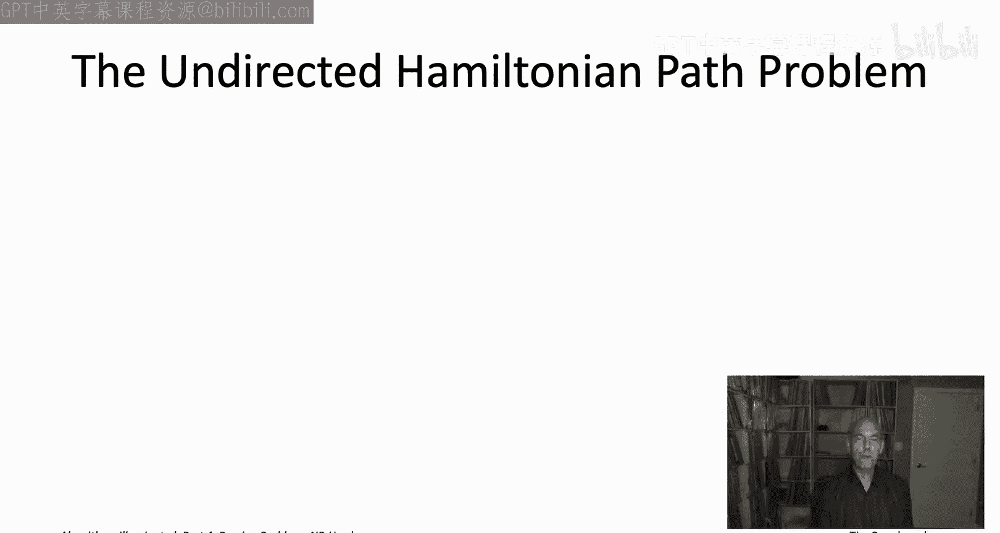
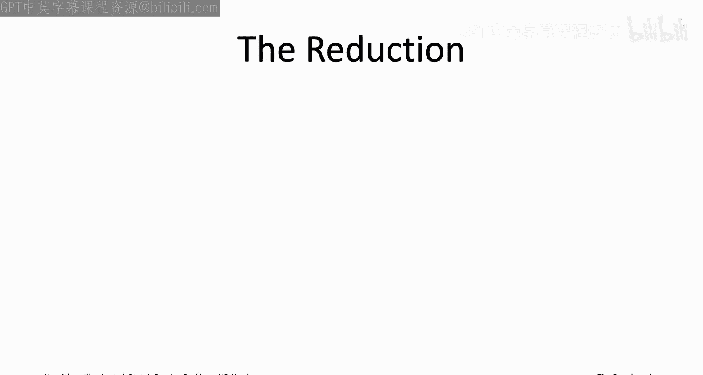
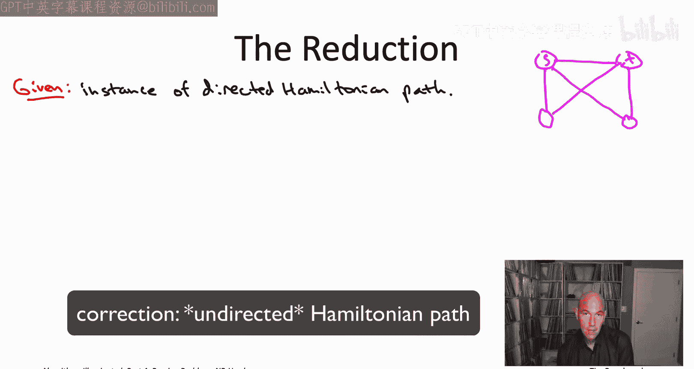
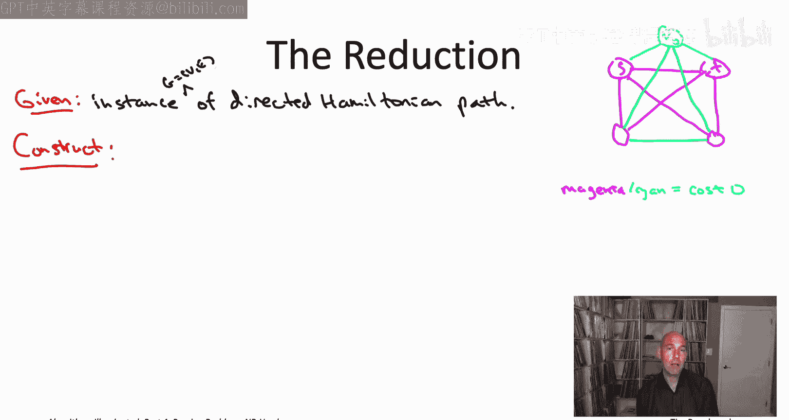
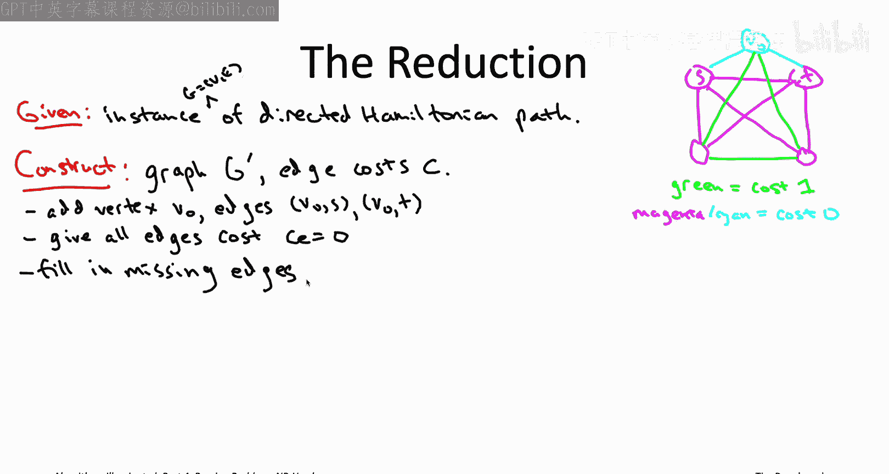
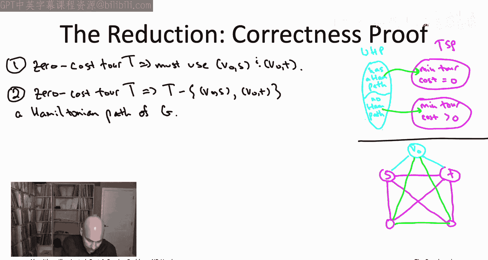
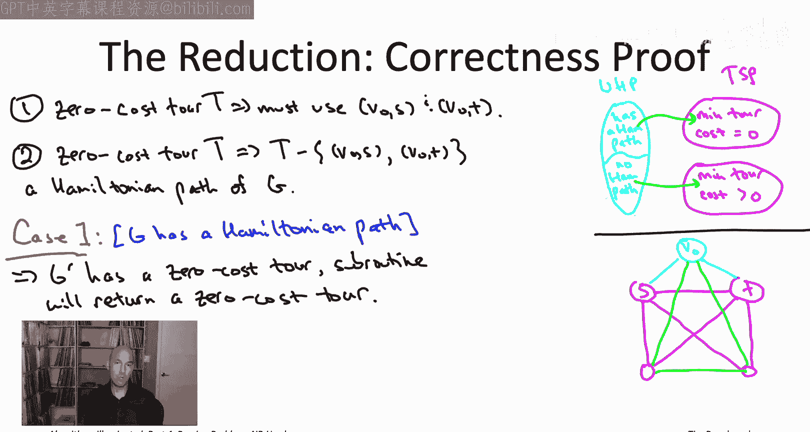
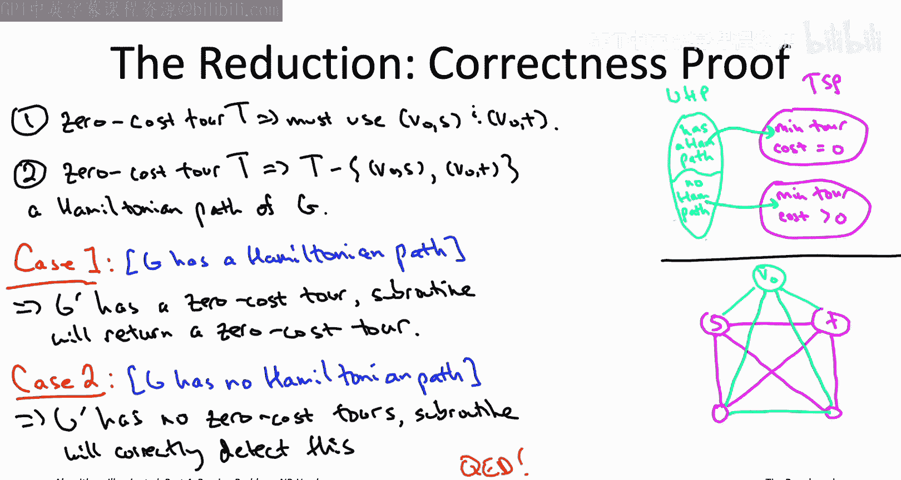
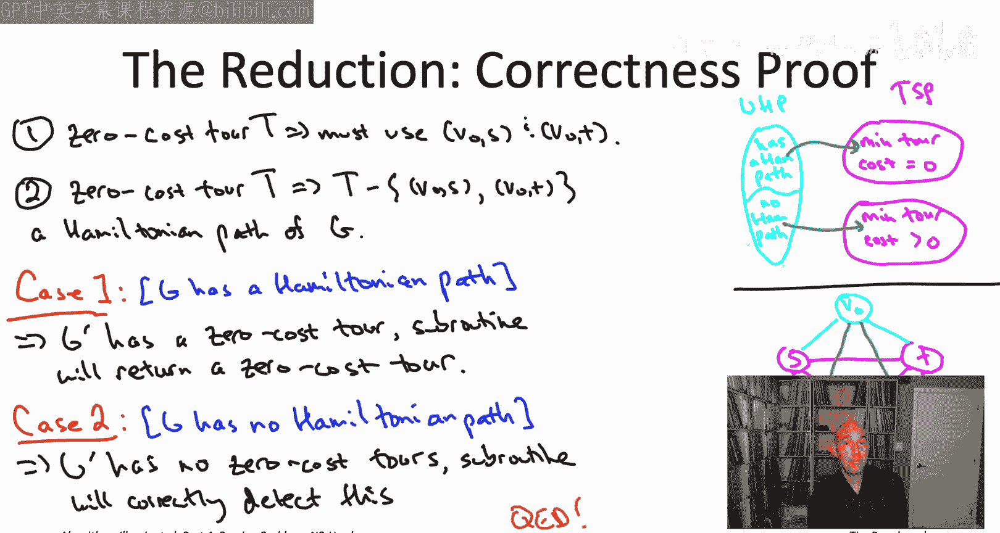
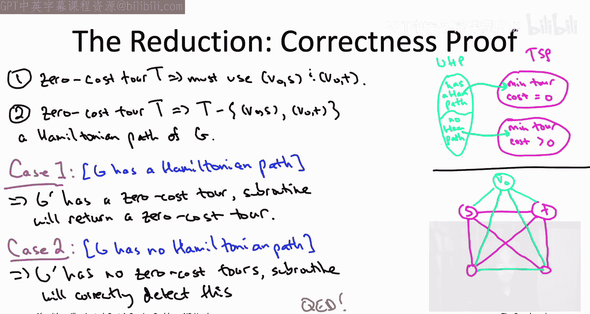

# 030：证明旅行商问题是NP难的 🧳

在本节课中，我们将学习如何证明著名的旅行商问题是NP难问题。我们将通过一个归约来完成证明，这个归约将已知的NP难问题——无向哈密顿路径问题，转化为旅行商问题。

## 概述

上一节我们证明了有向哈密顿路径问题是NP难的。本节中，我们将利用这个结果，通过一个归约来证明旅行商问题同样是NP难的。这个归约的核心思想与我们之前证明“无环最短路径”问题是NP难时所用的方法类似，但需要处理图的有向与无向性质差异。

## 无向哈密顿路径问题

首先，我们明确归约的起点：无向哈密顿路径问题。该问题的输入与有向版本类似，但图是无向的。具体来说，给定一个无向图、一个起点 **S** 和一个终点 **T**，目标是计算一条从 **S** 到 **T** 的路径，该路径需要**恰好访问每个顶点一次**。如果图中不存在这样的路径，算法应正确报告。

我们知道有向哈密顿路径问题是NP难的。虽然我们尚未直接证明无向版本也是NP难的，但在这两个版本之间存在相当简单的相互归约。因此，基于有向版本的NP难性，无向哈密顿路径问题同样是NP难的。本节我们将以此作为已知的NP难问题。

## 归约计划

我们的计划是将这个已知的NP难问题——无向哈密顿路径问题，归约到旅行商问题，从而证明旅行商问题也是NP难的。

与之前几节中需要将逻辑问题（如3-SAT）归约到图问题不同，本节的两个问题都涉及在无向图中寻找特定路径，因此它们之间的联系更加直观，归约过程也相对简单。

我们假设可以访问一个能解决旅行商问题的子程序（一个“黑盒”）。我们的目标是：给定一个无向哈密顿路径问题的实例，如何利用这个旅行商问题求解器，来获知原图中是否存在哈密顿路径。

## 归约构造

归约的起点是一个无向哈密顿路径问题的实例。例如，我们可能得到一个如右图所示的四顶点图。图中除了底部两个顶点之间的边缺失外，其他边都存在。可以注意到，在这个特定图中，实际上不存在从 **S** 到 **T** 的哈密顿路径。

我们将通过两个简单的步骤来修改这个图：

1.  **添加额外顶点**：我们向图中添加一个名为 **v₀** 的新顶点。我们只将 **v₀** 与顶点 **S** 和 **T** 相连。这样就得到了一个新图，它比原图多一个顶点和两条边。
2.  **构造完全图并分配边成本**：旅行商问题要求输入是一个完全图，并且每条边都有成本。因此，我们需要将上一步得到的图补充为完全图，并为所有边分配成本。
    *   对于原图中存在的边（包括我们添加的两条连接 **v₀** 与 **S**、**T** 的边），我们赋予成本 **0**。
    *   对于所有缺失的、我们在这一步补充的边，我们赋予成本 **1**。

现在，我们得到了一个完全图 **G‘**，并且每条边都有成本（绿色边成本为1，其他边成本为0）。此时，我们有了可以输入到假设的旅行商问题求解器中的实例。

我们调用这个求解器，它会返回一个最小成本的旅行商环路。这个环路的成本要么是 **0**（意味着它只使用了成本为0的边），要么至少为 **1**（意味着它使用了至少一条成本为1的边）。这个成本值将成为我们判断原图是否存在哈密顿路径的关键线索。

具体来说：
*   如果旅行商求解器返回一个总成本为 **0** 的环路，我们如何从中提取出原图的 **S-T** 路径呢？在接下来的正确性证明中我们会看到，任何成本为0的环路必然包含连接额外顶点 **v₀** 的那两条边。我们只需从环路中移除这两条边，剩下的部分将是一条从 **S** 到 **T**、访问了原图所有顶点的路径，即原图的一个哈密顿路径。
*   如果返回的环路成本大于 **0**，那么我们就得出结论：原图 **G** 中不存在哈密顿路径。

这就是整个归约过程。它只调用了一次假设的旅行商问题求解器。在调用之外，它只需要构造图 **G‘**，这最多需要 **O(n²)** 的时间（n是顶点数）。因此，这确实是一个有效的归约：只调用一次子程序，并辅以多项式时间的额外工作。

## 正确性证明

现在我们来证明这个归约的正确性。记住归约的方向：我们从无向哈密顿路径问题归约到旅行商问题。我们希望，无论初始图 **G** 是否包含哈密顿路径，这种状态都能反映在我们所构造的旅行商问题实例 **G‘** 的最优环路成本上。

我们需要证明两点：
1.  如果 **G** 有哈密顿路径，那么 **G‘** 存在成本为 **0** 的环路。
2.  如果 **G** 没有哈密顿路径，那么 **G‘** 的所有环路成本都严格大于 **0**。

### 观察：成本为0的环路

首先观察一下，如果存在一个成本为0的环路，它必须是什么样子。额外顶点 **v₀** 在原图 **G** 中只与 **S** 和 **T** 相连。在 **G‘** 中，连接 **v₀** 与 **S**、**T** 的边成本为0，而连接 **v₀** 与其他任何顶点的边成本都为1。

因此，任何旅行商环路都必须访问 **v₀**，而要以0成本做到这一点，唯一的方法就是使用那两条连接 **v₀** 与 **S**、**T** 的成本为0的边。

给定这样一个0成本的环路，如果我们移除这两条已知的边（连接 **v₀** 到 **S** 和 **T** 的边），剩下的是什么？我们得到了一条访问除 **v₀** 外所有顶点的路径，其端点正是 **S** 和 **T**。

由于环路的总成本为0，这条 **S-T** 路径中的所有边成本也必须为0。而记住，只有那些在原图 **G** 中存在的边（或我们添加的两条特殊边）成本才为0。因此，这条 **S-T** 路径必然只由原图 **G** 中的边组成。这意味着它本身就是原图 **G** 中的一条哈密顿路径。

**结论**：如果旅行商求解器返回一个总成本为0的环路，我们可以立即从中提取出输入图 **G** 的一个哈密顿路径。

### 情况一：G 有哈密顿路径

假设原图 **G** 确实有一条哈密顿路径。我们声称，这样构造出的旅行商实例 **G‘** 确实存在一个成本为0的环路。

构造方法很简单：取 **G** 中的那条哈密顿路径，然后添加上我们添加的那两条连接 **S** 和 **T** 到 **v₀** 的边。这样，我们就将一个哈密顿路径变成了一个环路。这个环路只使用了 **G‘** 中成本为0的边（原图的边加上那两条特殊边）。因此，**G‘** 存在成本为0的环路。

当我们调用假设的完美旅行商求解器时，它会返回一个成本为0的环路。根据之前的观察，我们可以从这个环路中提取出一个哈密顿路径。因此，在这种情况下，归约会正确地找到并返回一条哈密顿路径。

### 情况二：G 没有哈密顿路径

假设原图 **G** 没有哈密顿路径。那么，我们构造的旅行商实例 **G‘** 不可能存在成本为0的环路。因为从任何成本为0的环路中，我们都能提取出一条哈密顿路径。既然这样的路径不存在，那么成本为0的环路也不可能存在。

因此，**G‘** 的最小环路成本严格大于0。当我们调用旅行商求解器时，它会告诉我们最小环路成本大于0。此时，归约会查看这个“昂贵”的环路，并正确地得出结论：输入的图 **G** 没有哈密顿路径。

## 总结

在本节课中，我们一起学习了如何证明旅行商问题是NP难的。我们通过一个归约，将已知的NP难问题——无向哈密顿路径问题，转化为旅行商问题。这个归约的构造直观而简洁：
1.  向原图添加一个只连接起点和终点的额外顶点。
2.  将图补全为完全图，原边成本设为0，新增边成本设为1。
3.  利用旅行商问题求解器计算最小成本环路。
4.  根据环路成本是0还是大于0，判断原图是否存在哈密顿路径。

我们详细证明了该归约的正确性，涵盖了原图有哈密顿路径和没有哈密顿路径两种情况。由于无向哈密顿路径问题是NP难的，通过这个多项式时间的归约，我们证明了旅行商问题同样是NP难的。

接下来，我们将看到即使是只涉及数字的问题（例如即将介绍的背包问题）也可以是NP难的。