# 031：子集和问题是NP难的 🧩

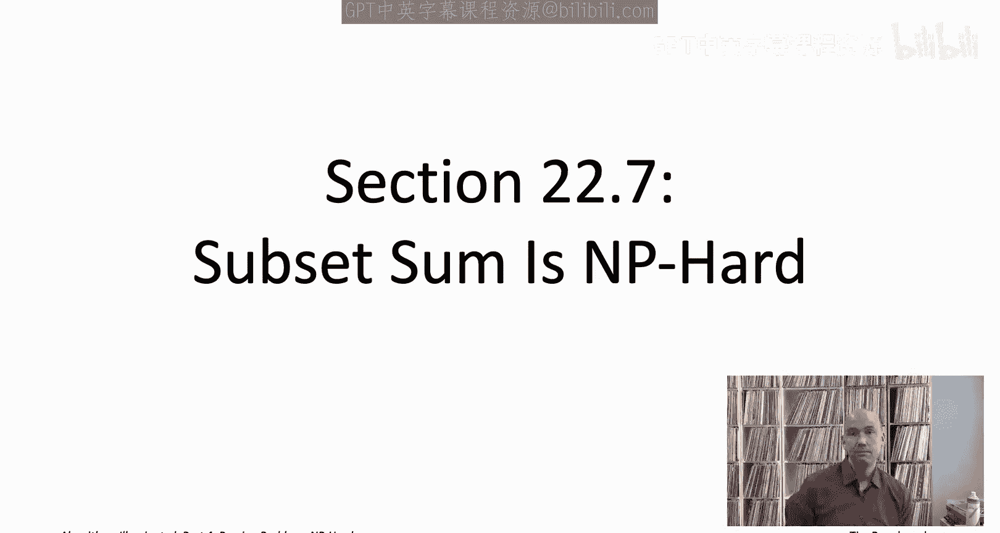

在本节课中，我们将学习如何证明一个看似简单的数字问题——子集和问题——是NP难的。我们将通过从独立集问题到子集和问题的归约来完成证明。这个证明过程也将同时证明背包问题和最小化最大完工时间问题是NP难的。

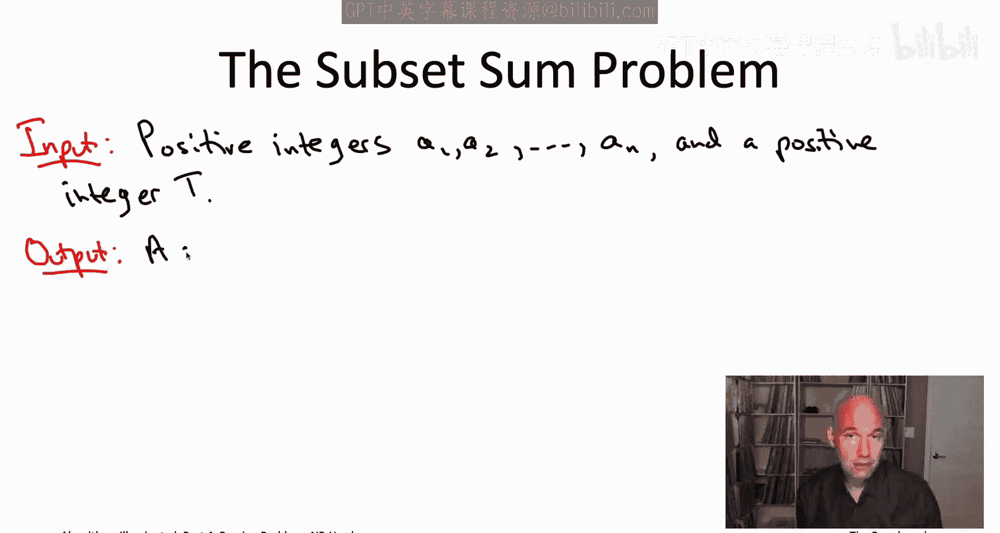

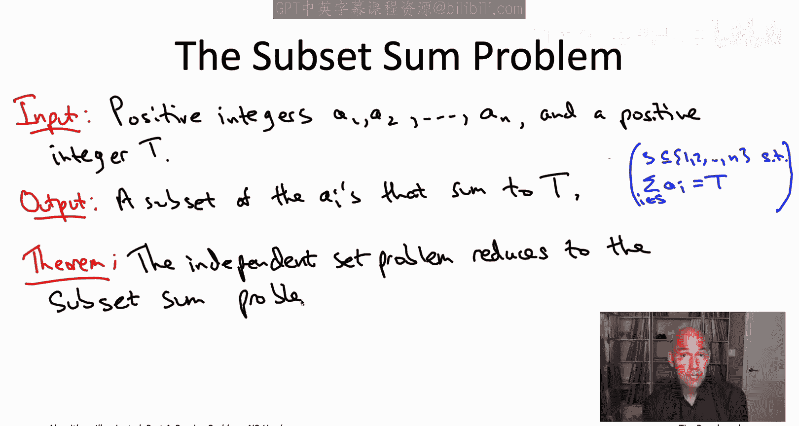

## 概述

子集和问题是一个关于数字的简单问题：给定一组正整数和一个目标值，判断是否存在一个子集，其元素之和恰好等于该目标值。我们将展示，尽管这个问题看起来很简单，但它实际上是NP难的。证明方法是将其与一个已知的NP难问题——独立集问题——联系起来。

## 子集和问题定义

子集和问题的输入包括：
*   `n` 个正整数：`A1, A2, ..., An`
*   一个目标值 `T`

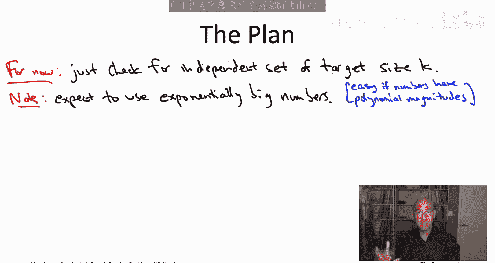

问题的目标是：判断是否存在一个子集 `S ⊆ {A1, A2, ..., An}`，使得该子集中所有元素的和恰好等于 `T`。

用数学语言描述，即：
**是否存在 S ⊆ {1, 2, ..., n}，使得 Σ_{i∈S} Ai = T？**

## 归约计划

为了证明子集和问题是NP难的，我们需要从独立集问题归约到它。这意味着，如果我们假设有一个能高效解决子集和问题的“黑盒子”（子程序），那么我们就可以利用它来高效地解决独立集问题。由于独立集问题是NP难的，这也就证明了子集和问题同样是NP难的。

上一节我们介绍了归约的基本思想，本节中我们来看看具体的构造方法。我们需要将图论问题（独立集）的实例，转化为一个数字问题（子集和）的实例。

## 归约构造思路

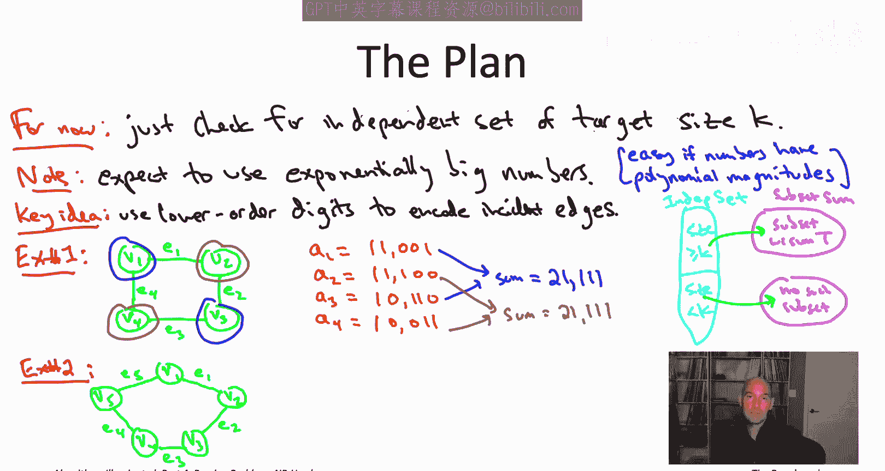

给定一个图 `G = (V, E)`，其中顶点集 `V = {v1, v2, ..., vn}`，边集 `E = {e1, e2, ..., em}`，以及一个目标独立集大小 `k`。我们的目标是构造一组数字和一个目标值 `T`，使得存在和为 `T` 的子集，当且仅当图 `G` 中存在一个大小至少为 `k` 的独立集。

一个关键的观察是：为了使构造出的子集和实例是“困难”的，我们必须使用非常大的数字（例如，指数级大小）。因为如果数字很小，子集和问题（以及更一般的背包问题）实际上可以在多项式时间内通过动态规划解决。

以下是构造的核心思想：
1.  为图中的每个顶点 `vi` 创建一个数字 `Ai`。
2.  为图中的每条边 `ej` 创建一个数字 `Bj`。
3.  每个数字 `Ai` 由一个高位数字（代表顶点）和 `m` 个低位数字（编码与该顶点相连的边）组成。
4.  数字 `Bj` 的作用是“修正”在求和过程中可能出现的 `0` 位。

## 具体构造方法

让我们通过一个简单的例子来理解这个构造。假设我们有一个4个顶点的环（4-cycle）。

首先，为每个顶点创建一个数字 `Ai`。每个 `Ai` 的最高位（第 `m+1` 位）设为 `1`，代表这是一个顶点。后面的 `m` 位（对应 `m` 条边）中，如果边 `ej` 与顶点 `vi` 相连，则第 `j` 位为 `1`，否则为 `0`。

对于4-cycle：
*   `A1` (对应 `v1`，与边 `e1`, `e4` 相连): `1 1001` (即 `11001`)
*   `A2` (对应 `v2`，与边 `e1`, `e2` 相连): `1 1100` (即 `11100`)
*   `A3` (对应 `v3`，与边 `e2`, `e3` 相连): `1 0110` (即 `10110`)
*   `A4` (对应 `v4`，与边 `e3`, `e4` 相连): `1 0011` (即 `10011`)

现在，考虑一个大小为2的独立集，例如 `{v1, v3}`。计算 `A1 + A3 = 11001 + 10110 = 21111`。有趣的是，另一个独立集 `{v2, v4}` 的和 `A2 + A4 = 11100 + 10011 = 21111` 也是这个值。而非独立集（如 `{v1, v2}`）的和则是不同的值（`22101`）。

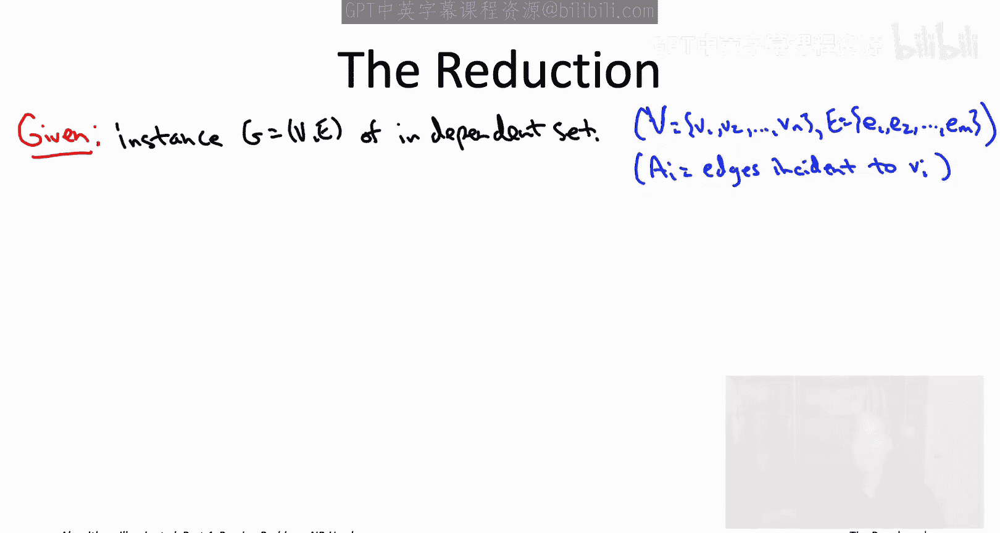

然而，对于奇数环（如5-cycle），这个简单构造会失败，因为不同的独立集可能产生不同的和（低位可能出现 `0`）。为了解决这个问题，我们引入边数字 `Bj`。

对于每条边 `ej`，我们创建数字 `Bj`，它仅在对应的第 `j` 个低位上是 `1`，其余位都是 `0`。例如，对于5条边，`B1 = 10000`, `B2 = 01000`, `B3 = 00100`, `B4 = 00010`, `B5 = 00001`。

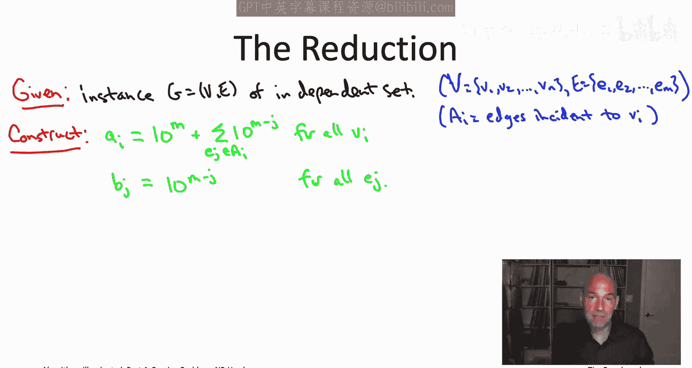

现在，我们的目标值 `T` 设置为：高位等于我们寻找的独立集大小 `k`，所有 `m` 个低位都等于 `1`。例如，对于寻找 `k=2` 的独立集，`T = 2 11111`。

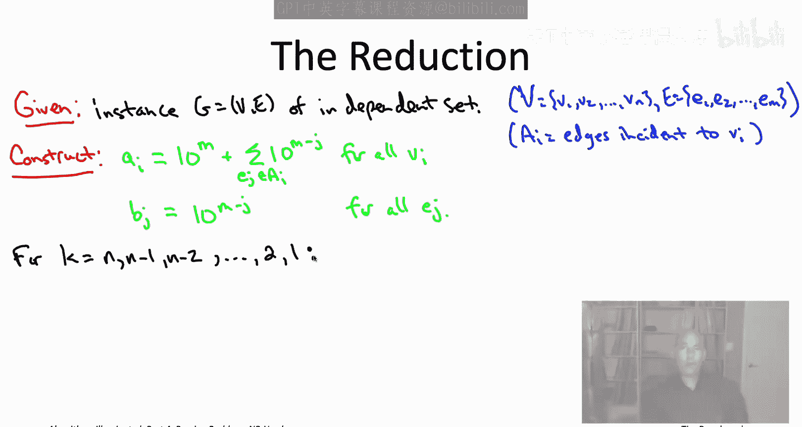

如果一个顶点子集 `S` 是一个独立集，那么对于每条边，最多只有一个端点在 `S` 中。因此，在求和 `Σ_{vi∈S} Ai` 中，每个低位要么是 `1`（该边的一个端点在 `S` 中），要么是 `0`（该边的两个端点都不在 `S` 中）。对于结果为 `0` 的低位，我们可以简单地加上对应的 `Bj` 将其修正为 `1`。这样，我们就能得到目标和 `T`。

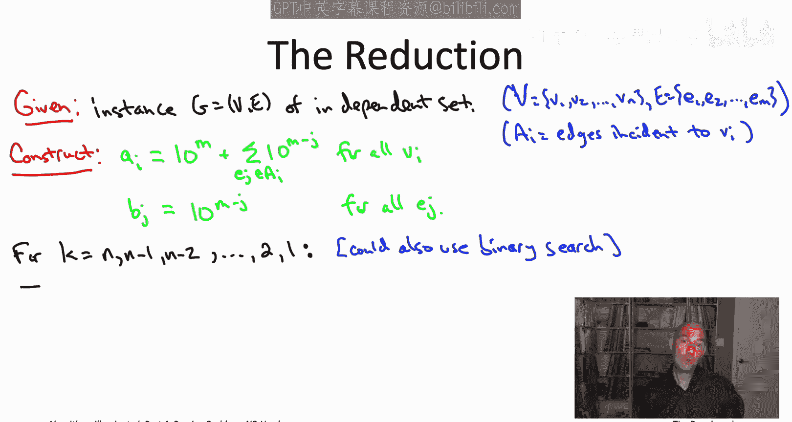

反之，如果一个顶点子集 `S` 不是独立集，即包含某条边的两个端点，那么在求和时，对应的低位将会是 `2`（因为两个 `1` 相加）。此时，即使加上 `Bj`（值为 `1`），也会得到 `3`，而无法通过选择其他数字（因为只有 `Ai` 和 `Bj` 能贡献 `1`）将其降回 `1`。因此，无法达到目标 `T`。

## 正式归约算法

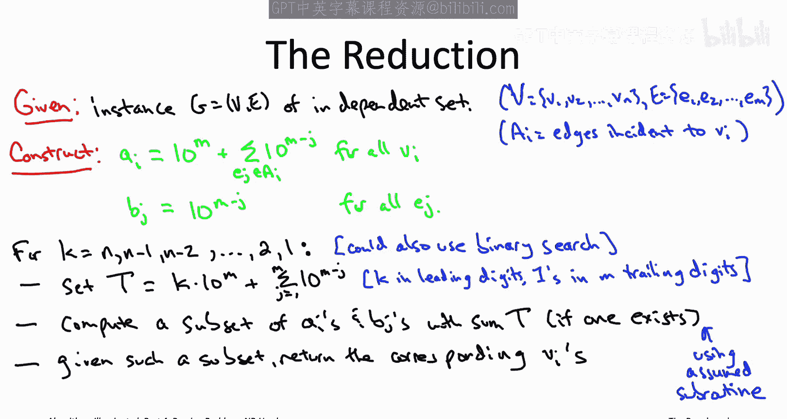

基于上述思路，我们可以形式化地描述从独立集问题到子集和问题的归约算法。

**输入**：一个图 `G = (V, E)`，`|V| = n`，`|E| = m`。
**输出**：图 `G` 的最大独立集。

**算法步骤**：
1.  **构造数字**：
    *   对于每个顶点 `vi`，令 `Ai = 10^m + Σ_{ej ∈ Incident(vi)} 10^(m-j)`。这里 `10^m` 提供高位的 `1`，求和项在 `vi` 关联的边对应的低位上放置 `1`。
    *   对于每条边 `ej`，令 `Bj = 10^(m-j)`。这仅在对应 `ej` 的低位上有一个 `1`。
2.  **搜索最大独立集大小 `k`**：
    *   从 `k = n` 开始向下迭代到 `1`（也可以使用二分搜索优化）。
    *   对于每个 `k`，构造目标值 `T = k * 10^m + (10^m - 1) / 9`。这个数字的高位是 `k`，后面 `m` 位全是 `1`。
    *   调用假设存在的子集和问题子程序，询问在数字集合 `{A1,...,An, B1,...,Bm}` 中，是否存在和为 `T` 的子集。
    *   如果子程序返回“是”并给出一个子集，则从该子集中提取出所有 `Ai` 对应的顶点 `vi`。这些顶点构成了一个大小为 `k` 的独立集。由于我们是降序搜索 `k`，这第一个找到的 `k` 就是最大独立集大小，返回这些顶点即可。
    *   如果子程序返回“否”，则继续尝试更小的 `k`。

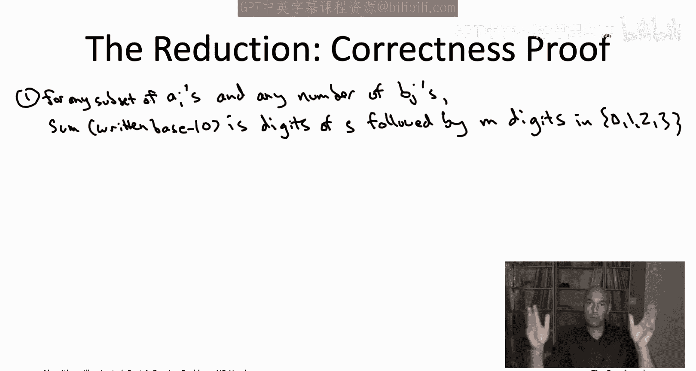

## 正确性证明

现在我们来论证这个归约的正确性。我们需要证明两点：
1.  **完备性**：如果图 `G` 有一个大小为 `k` 的独立集，那么构造出的子集和实例存在和为 `T` 的子集。
2.  **可靠性**：如果构造出的子集和实例存在和为 `T` 的子集，那么图 `G` 有一个大小为 `k` 的独立集。

**证明**：
*   **完备性**：设 `S` 是 `G` 的一个大小为 `k` 的独立集。我们构造子集和问题的解如下：
    *   包含所有对应 `S` 中顶点的数字 `Ai`。
    *   对于每条边 `ej`，如果它的两个端点都不在 `S` 中（即求和 `Σ_{vi∈S} Ai` 中第 `j` 位为 `0`），则包含数字 `Bj`。
    由于 `S` 是独立集，每条边最多有一个端点在 `S` 中，所以初始求和 `Σ Ai` 中每个低位是 `0` 或 `1`。通过添加 `Bj`，我们将所有 `0` 位修正为 `1`。同时，高位恰好有 `k` 个 `1`（来自 `k` 个 `Ai`）。因此，总和恰好等于目标 `T`。
*   **可靠性**：假设存在一个子集 `X ⊆ {A1,...,An, B1,...,Bm}`，其和为 `T`。
    *   观察高位：只有 `Ai` 在高位有 `1`，`Bj` 的高位都是 `0`。由于 `T` 的高位是 `k`，所以 `X` 中必须恰好包含 `k` 个 `Ai`。设这 `k` 个 `Ai` 对应的顶点集合为 `S`。
    *   观察低位：`T` 的每个低位都是 `1`。对于任意边 `ej`，能影响第 `j` 位的数字只有 `Bj` 和关联边 `ej` 的两个顶点的 `Ai`。如果 `S` 包含了 `ej` 的两个端点，那么即使不加 `Bj`，第 `j` 位已经是 `2`；如果加 `Bj` 则变成 `3`，都无法得到 `1`。因此，`S` 不可能同时包含 `ej` 的两个端点。这意味着 `S` 中的任意两个顶点都不相邻，即 `S` 是图 `G` 的一个独立集，且大小为 `k`。

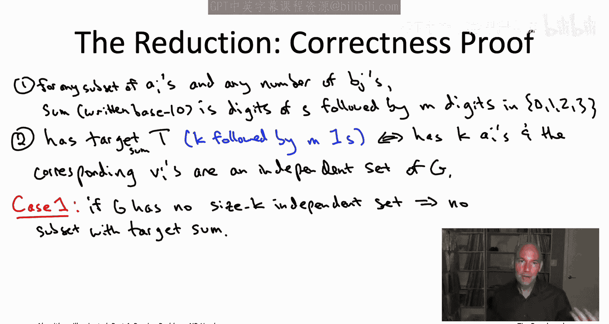

综上，归约是正确的。由于独立集问题是NP难的，且该归约是多项式时间的，因此子集和问题也是NP难的。

## 推论：其他问题的NP难性

子集和问题实际上是两个我们熟悉问题的特例：
1.  **背包问题**：子集和是背包问题在物品价值等于物品重量时的特例。
2.  **最小化最大完工时间问题**（在 identical machines 上）：可以证明，子集和问题可以归约到该问题。

因此，通过证明子集和问题是NP难的，我们也一并证明了**背包问题**和**最小化最大完工时间问题**是NP难的。

## 总结与后续

本节课中我们一起学习了如何证明子集和问题是NP难的。我们通过一个巧妙的归约，将图上的独立集问题转化为数字的子集和问题。这个证明不仅解决了子集和问题的复杂度分类，还连带证明了背包问题和最小化最大完工时间问题的NP难性。

通过这一系列NP难问题的归约证明，希望大家能够：
1.  理解为什么之前课程中提到的许多问题需要启发式算法或指数级算法。
2.  积累一批已知的NP难问题，作为未来证明新问题NP难性的基础。
3.  掌握NP难性证明的基本模式和技巧，即使细节复杂，其核心思想是清晰可循的。

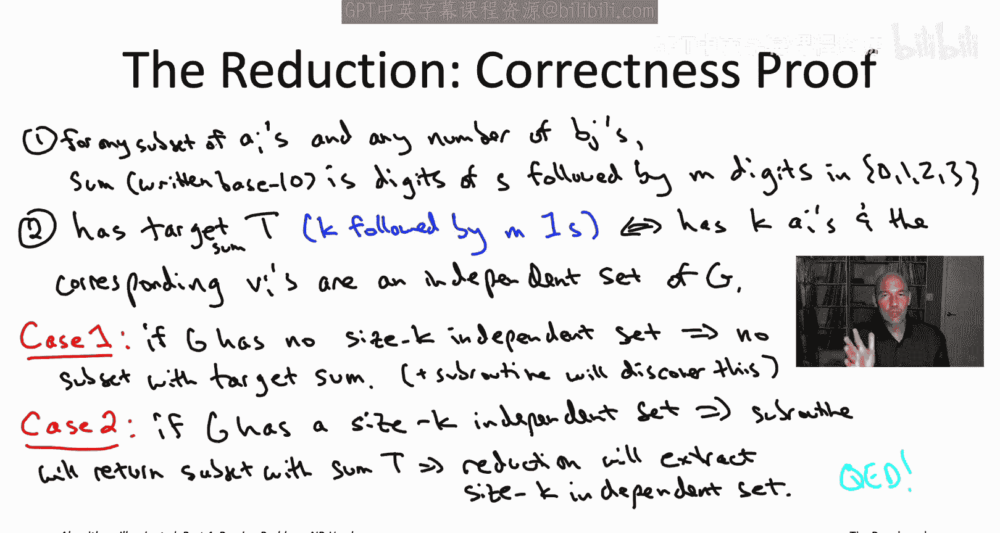

在接下来的课程中，你可以选择深入探讨NP完全理论背后的数学基础（如P vs NP问题），也可以跳转到具体的算法案例研究，看看如何将这些算法工具应用于解决实际中的复杂问题。