# 034：NP类问题与易于验证的解

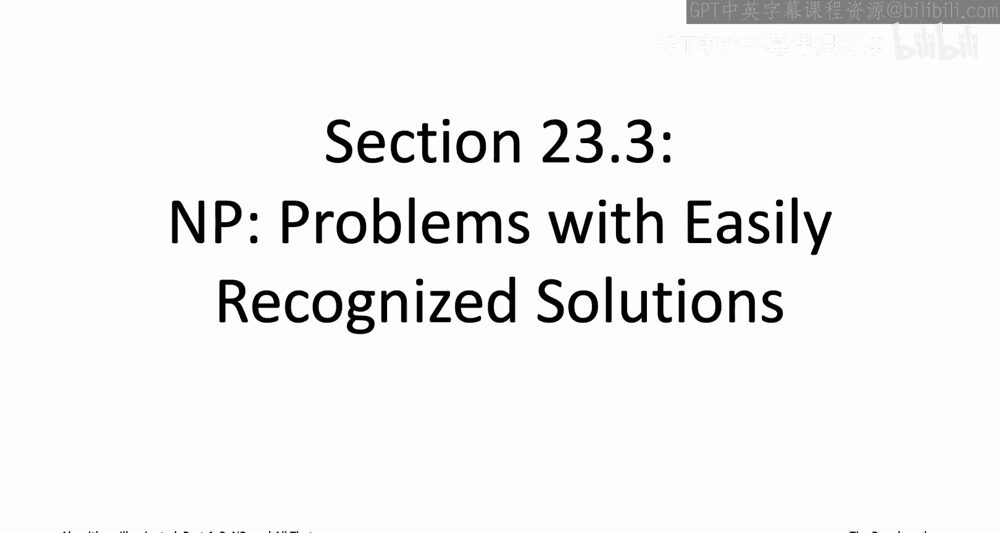

在本节课中，我们将要学习计算复杂性理论的核心概念之一：**NP类**。我们将了解NP类问题的定义、其与“朴素穷举搜索”的关系，以及为什么NP完全性问题是理解计算难度的关键。

---

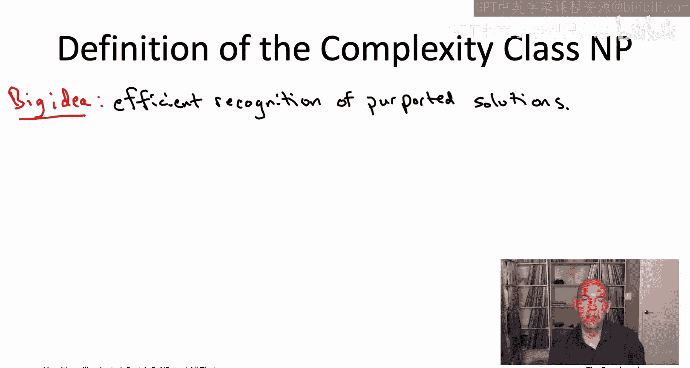

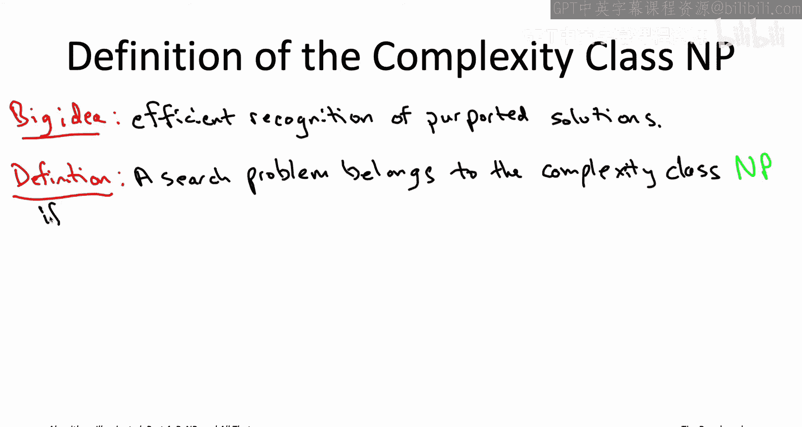

## 概述：什么是NP类？

上一节我们介绍了如何通过归约来证明问题的难度。本节中，我们来看看一个形式化的概念：**NP类**。NP类包含了所有那些“**解易于验证**”的搜索问题。这意味着，如果有人给你一个候选答案，你可以在多项式时间内快速检查它是否正确。

---

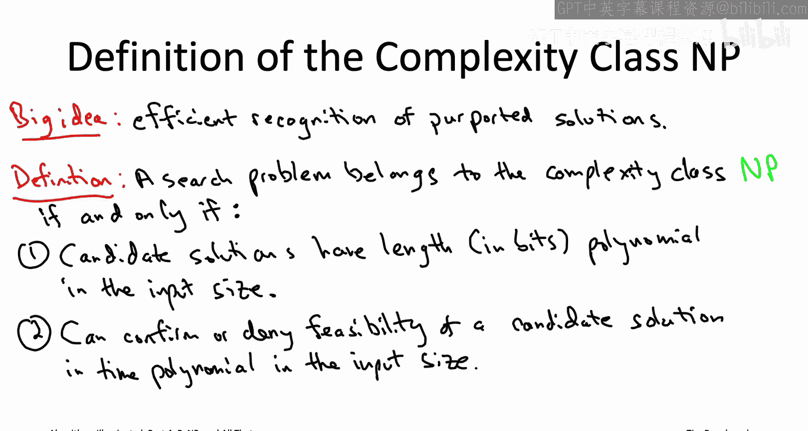

## NP类的正式定义

NP类专门由**搜索问题**构成。一个搜索问题包含可行解的概念，算法需要返回一个可行解，或者正确报告不存在可行解。

一个搜索问题属于NP类，需要满足两个条件：

以下是两个核心条件：

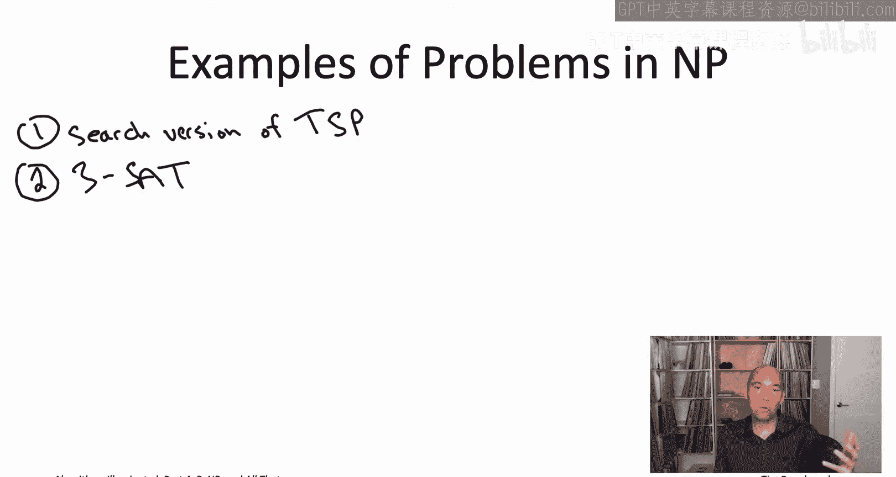

1.  **多项式长度描述**：任何候选可行解都可以用输入规模的多项式长度的比特串来描述。即，存在常数 `c` 和 `d`，使得描述长度不超过 `c * n^d`，其中 `n` 是输入规模。
2.  **高效可验证性**：给定一个候选解（其长度已由条件1限定），存在一个多项式时间算法，能够验证该候选解是否确实是一个可行解。即，验证时间不超过某个 `c' * n^d'`。

这就是计算机科学中最重要的定义之一：**NP类的定义**。需要提醒的是，NP代表“**非确定性多项式时间**”，源于其另一种基于非确定性图灵机的等价定义。但在算法研究的语境下，我们始终应将其理解为“**具有高效可验证解的问题**”。

---

## NP类问题示例

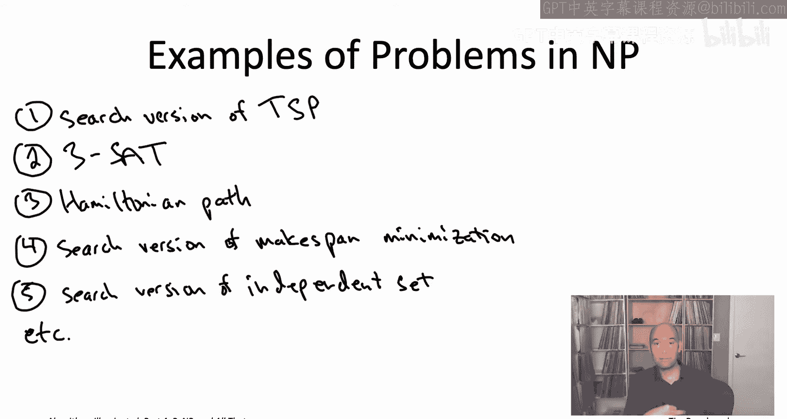

我们之前见过的许多问题都满足这两个条件。

以下是几个典型的NP类问题示例：

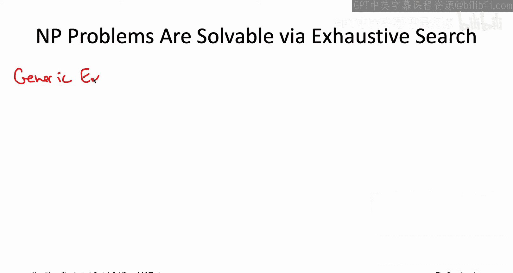

*   **旅行商问题的搜索版本**：给定图、边成本和目标值 `T`，要求找到总成本不超过 `T` 的环游，或报告不存在。
    *   **候选解**：一个顶点序列，描述长度为 `O(n log n)`。
    *   **验证**：检查序列是否为合法环游（每个顶点恰好出现一次），并计算总成本是否 ≤ `T`。这可以在多项式时间内完成。
*   **3-SAT问题**：给定一个3-CNF布尔公式，要求找到一个满足所有子句的真值赋值，或报告不可满足。
    *   **候选解**：一个对 `n` 个布尔变量的真值赋值，可用 `n` 个比特描述。
    *   **验证**：遍历所有子句，检查每个子句中是否至少有一个文字与赋值相符。这可以在多项式时间内完成。
*   **哈密顿路径问题**：给定图，要求找到一条经过每个顶点恰好一次的路径，或报告不存在。
    *   **候选解**：一个顶点序列。
    *   **验证**：检查序列中的每条边是否存在于图中，且每个顶点恰好出现一次。
*   **调度问题（Makespan Minimization）的搜索版本**：给定作业、机器和目标完工时间 `T`，要求找到完工时间不超过 `T` 的调度方案，或报告不存在。
    *   **候选解**：一个将作业分配到机器的方案。
    *   **验证**：计算最大机器负载（完工时间），并检查是否 ≤ `T`。
*   **独立集问题的搜索版本**：给定图和目标值 `k`，要求找到大小至少为 `k` 的独立集，或报告不存在。
    *   **候选解**：一个顶点子集。
    *   **验证**：检查该子集中任意两个顶点之间是否没有边相连。

NP类非常庞大，因为其准入条件非常宽松。几乎所有我们能想到的搜索问题的搜索版本都是NP类成员。

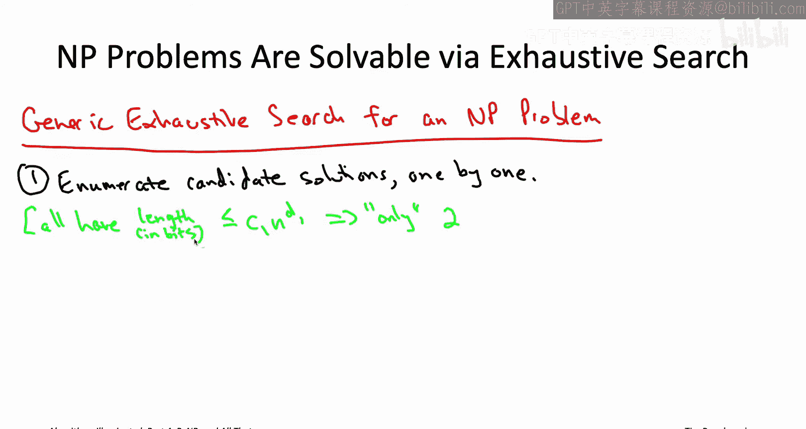

---

## NP类与穷举搜索的关系

在第一章的第一个视频中，我们讨论过通过将大量问题归约到TSP来积累其难解性证据。最理想的目标是，将所有“**同样能用朴素穷举搜索解决**”的问题都归约到TSP。

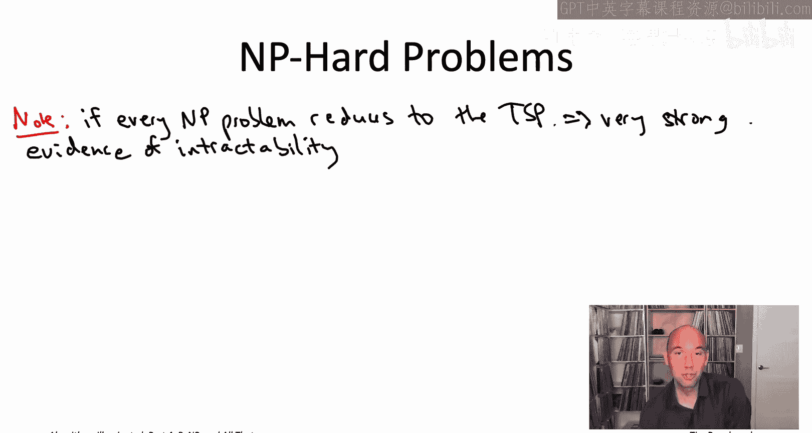

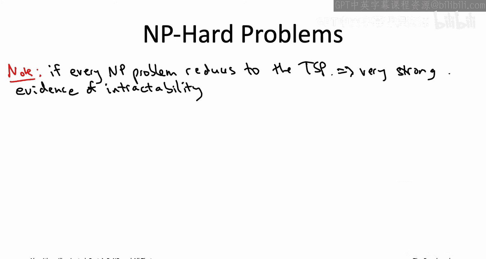

现在，我们有了NP类的形式化定义（基于高效验证）。让我们将“高效验证”与“可用朴素穷举搜索解决”这两个概念联系起来。

**任何NP问题都可以用与解决TSP类似的朴素穷举搜索算法来解决。**

以下是该通用穷举搜索算法的步骤：

1.  **枚举所有候选解**：根据NP定义的条件1，候选解的长度最多为 `O(n^{d1})`。因此，需要枚举的候选解总数最多是 `2^{O(n^{d1})}`，这是一个指数级数量。
2.  **逐个验证**：对于枚举出的每个候选解，利用NP定义的条件2，用一个多项式时间算法（`O(n^{d2})` 时间）来检查它是否是一个可行解。
3.  **输出结果**：如果找到一个可行解，则输出它；如果枚举完所有候选解都未找到，则正确报告无解。

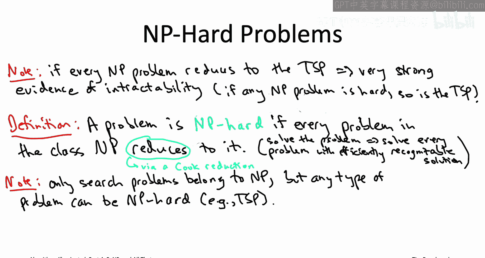

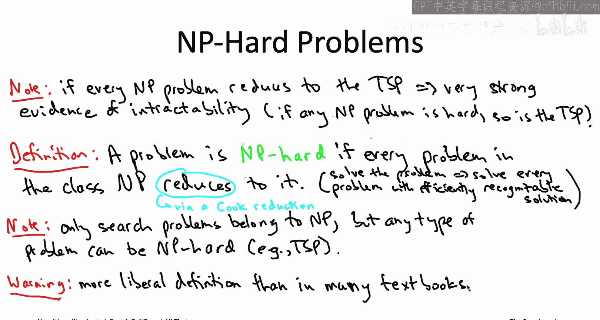

这个通用算法的正确性是显然的，因为它检查了每一个可能的候选解。由于枚举步骤最多有指数级数量，而每一步验证需要多项式时间，因此整个算法的运行时间是指数级的 `(2^{O(n^{d1})} * O(n^{d2}))`。

---

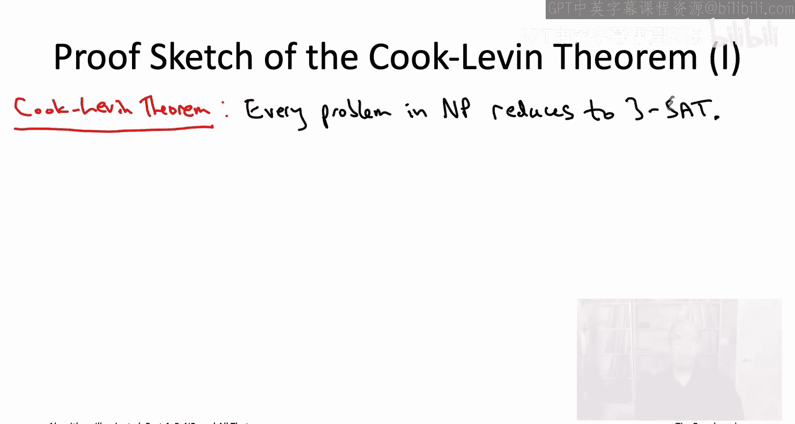

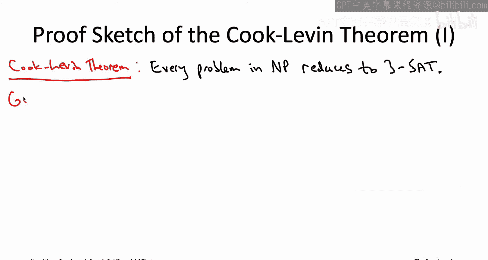

## NP难问题的定义

NP类的准入条件很弱，因此几乎所有的搜索问题都属于NP。这意味着，如果像旅行商问题这样的问题，**每一个NP问题都能归约到它**，那将是TSP难解性的极强证据。因为如果存在TSP的多项式时间算法，那么将自动得到**所有NP问题**的多项式时间算法。

这种强难解性证据正是 **NP难问题** 的形式化定义：

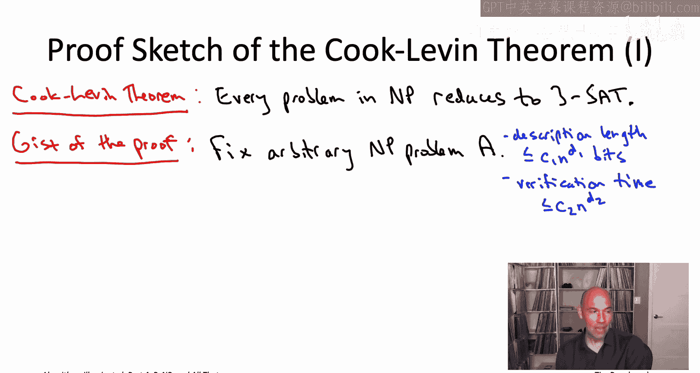

> **一个问题被称为是NP难的，当且仅当NP类中的每一个问题都能（通过Cook归约）归约到这个问题。**

换句话说，一个NP难问题的多项式时间算法将自动为NP类中的所有问题提供多项式时间算法。

**注意**：我们之前强调NP类只包含搜索问题。但**优化问题**（如TSP的优化版本）虽然不属于NP类，却**可以**是NP难的。事实上，本课程中讨论的所有优化问题都是NP难的。这里我们使用的是更宽松的Cook归约定义，它允许我们直接说“TSP是NP难的”。许多教材使用更严格的Karp归约（或称“多一归约”），在那定义下，只有搜索问题才能是NP难的。

---

## 库克-列文定理重温

现在我们已经理解了NP难的精确定义，可以更准确地理解库克-列文定理的意义。

库克-列文定理断言：**3-SAT问题是NP难的**。

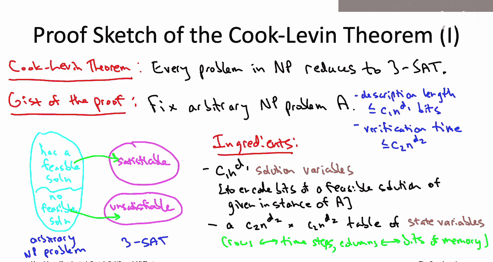

这意味着，**每一个NP问题**（每一个具有高效可验证解的问题）都可以归约到3-SAT问题。考虑到NP类的庞大规模和3-SAT表面上的简单性，这似乎令人难以置信。

**证明思路简述**：
1.  任取一个NP问题 `A`。根据NP定义，我们知道：
    *   其候选解描述长度不超过 `c1 * n^{d1}`。
    *   存在一个多项式时间验证算法 `V`，能在 `c2 * n^{d2}` 步内验证一个候选解。
2.  构造一个从 `A` 到 3-SAT 的归约。
3.  **变量设计**：
    *   **解变量**：用一组布尔变量直接编码一个候选解的比特位（利用了条件1）。
    *   **状态变量**：用一张二维表（行代表时间步，列代表内存位）的布尔变量，来编码验证算法 `V` 在给定候选解下的整个执行过程（利用了条件2和多项式时间限制）。
4.  **子句（约束）设计**：
    *   添加大量3-CNF子句，以强制状态变量表必须编码一个合法的、从初始状态开始、根据输入实例和候选解变量正确运行、并最终到达“接受”状态的计算过程。由于图灵机单步计算非常局部和简单，这些约束可以用3-CNF子句来表达。
5.  **归约完成**：如果构造出的3-SAT实例可满足，那么从满足赋值的“解变量”部分可以直接读出问题 `A` 的一个可行解。如果不可满足，则问题 `A` 没有可行解。

因此，给定一个能解决3-SAT的“魔法黑盒”，我们就可以解决任何NP问题。这正证明了3-SAT是NP难的。

---

## 总结

本节课中我们一起学习了：
1.  **NP类的定义**：由那些“**候选解具有多项式长度描述**”且“**存在多项式时间验证算法**”的搜索问题组成。
2.  **NP类与穷举搜索**：任何NP问题都可以通过枚举所有多项式长度候选解并逐一验证的指数时间算法来解决。
3.  **NP难的定义**：如果**所有**NP问题都能归约到某个问题，则该问题是NP难的。这为该问题的内在难度提供了最强形式的证据。
4.  **库克-列文定理的核心意义**：3-SAT问题是NP难的，这意味着它是“NP世界”中最难的问题之一，所有NP问题都可以转化为3-SAT问题来求解。

理解NP类和NP难的概念，是探索计算复杂性前沿和识别那些可能不存在高效算法的问题的基石。下一节，我们将探讨著名的 **P vs NP 问题**。