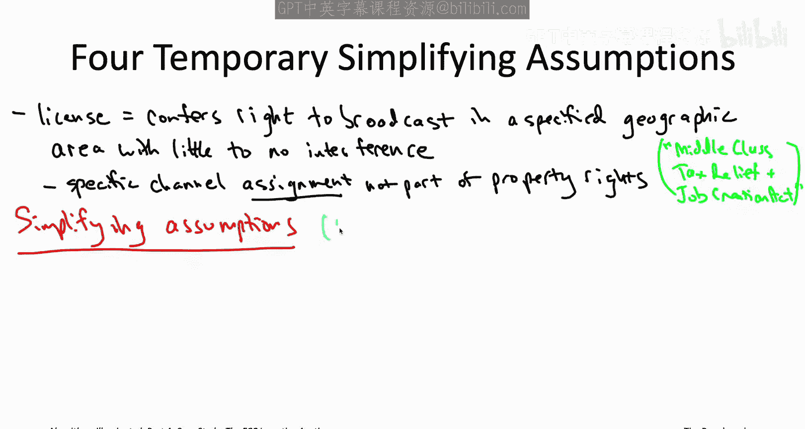
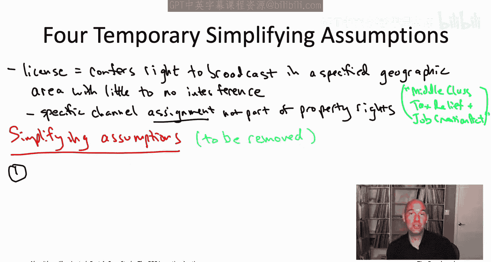
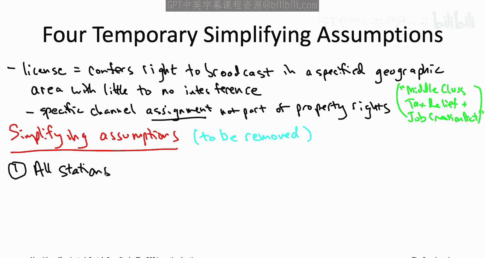
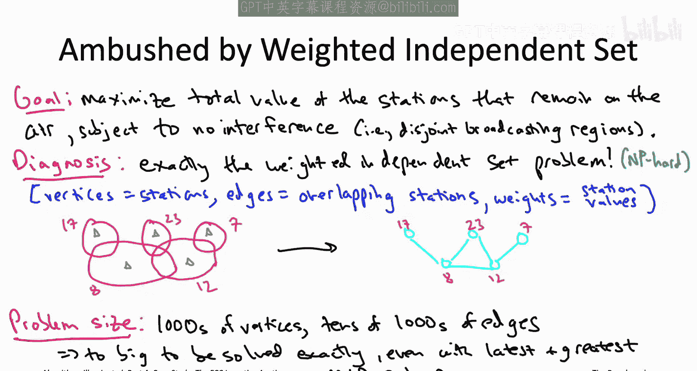
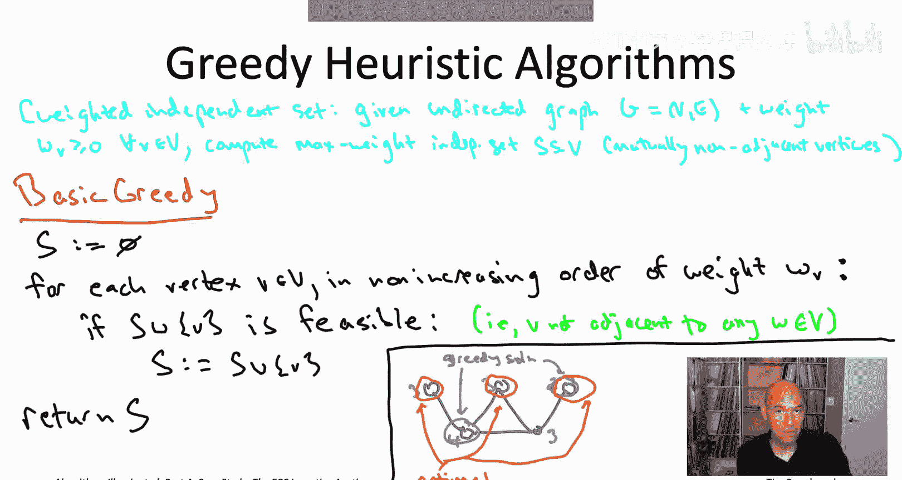
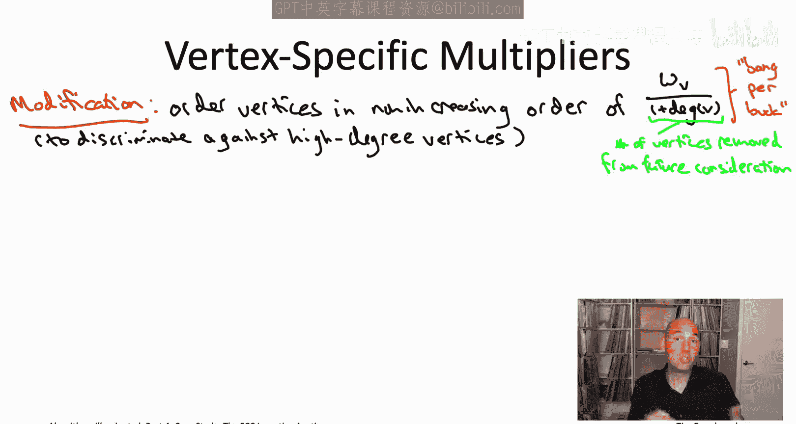
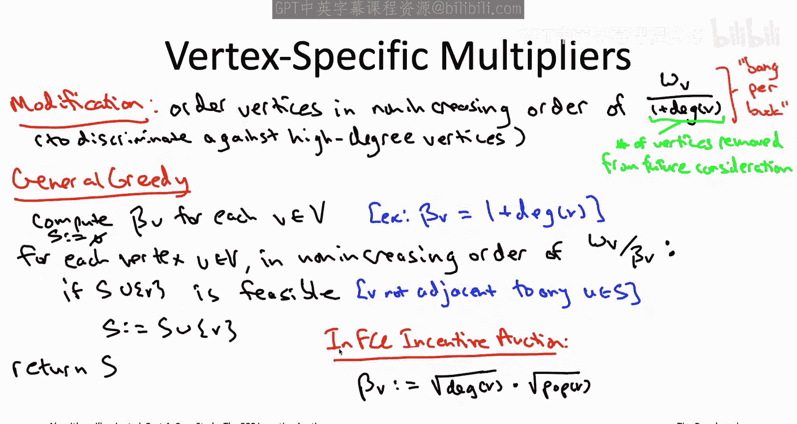

# 038：FCC激励拍卖中的许可证回购贪心启发式算法（第一部分）

在本节中，我们将学习美国联邦通信委员会激励拍卖中的一个核心问题：如何通过反向拍卖从电视台回购许可证以释放目标频谱。我们将从一系列简化假设开始，将问题建模为加权独立集问题，并探讨如何设计贪心启发式算法来求解这个NP难问题。

---

## 概述：FCC激励拍卖与反向拍卖

FCC激励拍卖包含两个部分：一个决定哪些电视台应切换频道或停播、并确定相应补偿的反向拍卖，以及一个决定谁将获得新释放的频谱区块及其支付价格的前向拍卖。本节我们将聚焦于该拍卖中最具创新性的部分：前所未有的反向拍卖，即从电视台回购许可证。

---

## 问题建模：从电视台回购许可证

首先，我们需要明确政府在反向拍卖中从电视台回购的具体内容。电视台的广播许可证由FCC授予，授权其在特定地理区域的某个频道上进行广播。FCC负责确保各电视台在其广播区域内受到极少或没有干扰。

值得注意的是，对于FCC激励拍卖而言，电视台的特定频道分配（例如第41频道）并不被视为许可证所有者的财产权的一部分。因此，需要国会授权这一解释，并允许拍卖根据需要重新分配频道。2012年，美国国会通过了《中产阶级税收减免和就业创造法案》，该法案授权了FCC激励拍卖。

反向拍卖的目标是从电视台收回足够的许可证，以释放目标数量的频谱，例如由第38至51频道占用的84 MHz频谱。

---

## 简化假设与问题形式化

为了初步理解“收回足够许可证以释放目标频谱”这一问题，我们从四个简化假设开始。这些假设并不完全合理，但有助于我们理解问题，后续我们将逐步放宽它们。

以下是四个初始简化假设：

1.  **单频道假设**：所有在播电视台都被强制在同一个频道（例如第14频道）上广播。
2.  **无干扰条件**：两个电视台可以在同一频道上同时广播，当且仅当它们的广播区域没有重叠。
3.  **已知价值**：我们知道每个电视台的价值（以美元计）。
4.  **单边决策**：政府可以单方面决定让任何电视台停播（后续我们将讨论实际的自愿补偿机制）。

在这些假设下，我们可以形式化我们面临的计算问题。

我们做出的根本决策是：决定哪些电视台保持播出，哪些电视台停播。

我们关心的目标函数是：最大化保持播出的电视台的总价值。

约束条件则由前两个简化假设指定：第二个假设禁止任何广播区域重叠的电视台在同一频道上广播；结合第一个假设（只有一个可用频道），这意味着我们只能允许广播区域互不相交的电视台同时保持播出。

总结来说，在这四个简化假设下，我们真正感兴趣的优化问题是：**在保持播出的电视台广播区域互不相交的约束下，最大化这些电视台的总价值**。

---

## 识别问题：加权独立集

初次见到一个计算问题时，我们总希望识别它是否是我们已知问题的特例。那么，你认出这个优化问题了吗？

这实际上正是**加权独立集问题**。

图中的顶点对应于我们可能希望保持播出的电视台。在独立集问题中，边代表冲突。在这里，如果两个电视台的广播区域重叠，则对应的两个顶点（电视台）存在冲突。

例如，假设有五个电视台，每个圆圈代表其广播区域，灰色三角形表示发射器。这张图将对应一个有五个顶点的图，每个电视台一个顶点。每对重叠的圆圈之间会有一条边。

电视台的价值将转化为顶点的权重。

认识到这个问题本质上是加权独立集问题，对我们来说不一定是好消息。在第22章的对应视频中，我们证明了独立集问题是NP难的，即使所有顶点权重都相同（例如权重均为1）。我们在第三部分的动态规划课程中看到，可以在路径图或更一般的树状图上解决加权独立集问题。但电视台的干扰模式远非树状结构。例如，纽约市的每个电视台都会与纽约市的其他每个电视台相互干扰，这将在图中形成一个大的团（即所有顶点都两两相邻），与树结构截然不同。

因此，我们已将问题识别为加权独立集问题，并且它似乎不是独立集问题中可在多项式时间内解决的特殊情况。

---

## 应对NP难问题：从精确算法到启发式算法

但无需放弃。本系列视频的核心观点就是：NP难并非死刑判决。我们现在拥有丰富的工具箱，可以尝试多种方法来解决这个加权独立集问题的实例。

我们可以从最雄心勃勃的目标开始：尝试精确解决这个问题，即真正找到广播区域互不相交、且总价值最大的电视台子集。我们能否在可容忍的时间内（例如一周或更短的计算时间）做到这一点？

答案一如既往地取决于问题规模的大小。如果我们只有大约30个电视台，甚至可以使用穷举搜索来找到无干扰且价值最大的电视台子集。但不幸的是，在美国，需要处理的是数千个电视台和数万个干扰约束，这远远超出了穷举搜索甚至第21章视频中讨论的动态规划技术的能力范围。

这意味着，如果我们真的想要一个精确算法，我们工具箱中只剩下一种可以尝试的工具：即我们讨论过的“半可靠魔法盒子”。对于优化问题（在无干扰约束下最大化总社会价值/电视台价值），首先应该想到的魔法盒子是**混合整数规划求解器**。

确实，加权独立集问题很容易编码为混合整数规划。我鼓励你思考一下这种形式化会是什么样子，它非常直接。事实上，使用混合整数规划求解器正是FCC尝试的第一件事。

不幸的是，FCC面临的问题（数千个电视台和数万个干扰约束）规模太大，即使最新、最强大的混合整数规划求解器也难以处理。公平地说，最新、最强大的求解器是在我们将在后面讨论的更复杂的多频道版本问题上遇到了困难。

在100%正确算法的所有选项都用尽后，FCC此时别无选择，只能在正确性上做出妥协，转而使用快速的启发式算法。

---

## 贪心启发式算法设计

对于加权独立集问题，与许多其他NP难问题一样，贪心算法设计范式是开始构思快速启发式算法的绝佳起点。与许多问题类似，很容易想出多种可以使用的贪心算法。

你可能想到的第一个用于解决加权独立集问题的贪心算法，是模仿Kruskal算法背后的思想。Kruskal算法按从最具吸引力到最不具吸引力的顺序单遍扫描边，只要保持可行性就将其纳入解中。我们可以在这里做类似的事情。不过我们选择的是顶点。

因此，我们将对图的顶点进行单遍扫描。“最具吸引力”意味着最高权重，“最不具吸引力”意味着最低权重。所以我们将按顶点权重的降序进行遍历，然后只要当前顶点不破坏可行性（即该顶点不与我们在先前迭代中已选定的任何顶点相邻），就将其纳入我们的解中。

我们称该算法为**基础贪心算法**。它接收一个加权独立集问题的实例作为输入（即一个无向图以及每个顶点的非负权重），其职责是输出一个独立集（即一个所有顶点互不相邻的子集），并且在满足独立集条件的前提下，尽可能最大化独立集的总权重。

这个基础贪心算法可能是最自然的起点。我们并不一定期望它是最惊人的快速启发式算法，我们可能期望做得更好。这真的只是我们头脑风暴的开始，但它将通过探索它在一些例子上的表现，帮助我们更好地理解问题的复杂性。

让我们从一个五顶点的例子开始，看看这个算法会做什么。

这是我们之前用于展示电视台选择问题与独立集问题对应关系的完全相同的图。我已经用洋红色标出了五个顶点的权重。

如果基础贪心算法以这个图作为输入，它会做什么？它会单遍扫描顶点，从权重最高的顶点开始，到权重最低的顶点结束。这里权重最高的顶点是左下角那个，权重为4。贪心算法从空集开始，因此第一个顶点与它目前所选内容之间没有冲突（因为目前还没有选择任何内容）。所以贪心算法总是会在第一次迭代中选择该顶点。在这个例子中，它肯定会选择那个权重为4的顶点。

在第二、第三和第四次迭代中，算法将考虑三个权重为3的顶点（顺序任意）。但顺序实际上无关紧要，因为我们已经选定了权重为4的顶点，而该顶点与所有三个权重为3的顶点都相邻。因此，在第二次、第三次、第四次迭代中，当我们测试是否可以将这个新顶点纳入当前解而不破坏可行性时，答案是否定的。如果我们试图纳入其中一个权重为3的顶点，它将破坏可行性，因为每个这样的顶点都有一条边连接到我们已经选定的权重为4的顶点。

在第五次迭代（最后一次）中，贪心算法考虑权重最低的顶点（权重为2）。你会注意到该顶点实际上并不与权重为4的顶点相邻，因此纳入权重为2的顶点是安全的。这将结束贪心算法的运行，因此它将在其解中选择左下角和右上角的顶点。

因此，基础贪心算法的输出是一个总权重为6的独立集。很容易看出这不是最优解，不是最大权独立集。因为如果我们选择顶部的所有三个顶点，那也是一个独立集，总权重为8。而这正是最优解，即最大权独立集。

我们应该如何看待这个例子呢？目前还不明确。加权独立集问题众所周知是NP难问题，而这个基础贪心算法显然在多项式时间内运行。因此，我们完全预期会遇到这类输出非最优的例子。如果不存在这类输入，我们就将驳斥P等于NP的猜想，而这并不是我们预期会发生的事情。

但这里有一个更令人不安的例子，它表明我们可能实际上需要重新审视贪心算法并使用不同的变体。

在这个例子中，我们有一个星形图：有一个中心顶点，权重为2；然后有许多“辐条”顶点（在幻灯片上有11个辐条），每个外围顶点的权重为1。

基础贪心算法在这里会做什么？它将从权重最高的顶点开始，即权重为2的中心顶点，并选择它、锁定它，从而阻止它选择任何辐条顶点。

这对贪心算法来说是一个非常糟糕的结果。它只输出这个单顶点的独立集，总权重为2。我们希望它做什么？我们希望它选择了所有辐条顶点。在这种情况下，选择由所有辐条顶点组成的独立集将获得总权重11。

这个例子出了什么问题？基础贪心算法表现如此糟糕的原因在于，它只片面关注顶点的权重，而没有考虑将某个顶点纳入解中所带来的其他影响。特别是，基础贪心算法没有考虑到，选择这个中心顶点将阻止所有辐条顶点在未来被考虑。

---

## 改进贪心算法：考虑顶点度数与成本效益分析

为了避免基础贪心算法的错误，我们可以“歧视”那些具有高度数（即有许多邻居）的顶点，因为如果选择它们，会使得一大批其他顶点无法被考虑。

例如，我们可以进行成本效益分析。对于一个顶点V，我们可以说：如果选择这个顶点，我们获得其权重（比如10）。另一方面，如果选择这个顶点，它会使得一批顶点无法被考虑。具体来说，顶点V本身将永远不会再被考虑，而且V的所有邻居也将被排除在未来选择的范围之外。因此，我们“消耗”了 `度数(V) + 1` 个顶点（+1是V本身），获得的收益是 `w(V)`（该顶点的权重）。

因此，与其仅仅按权重从高到低单遍扫描顶点，我们可以考虑“性价比”，即选择该顶点所获得的权重与被排除在未来考虑之外的顶点数量之比。这将是一种替代的贪心算法，它会歧视高度数顶点。

更一般地，贪心算法可以在预处理步骤中，以任意方式计算顶点特定的乘数 `β(v)`，然后按缩放后的权重（即 `w(v)/β(v)`）的非递减顺序访问顶点。我们称之为**通用贪心算法**。

我一直称其为贪心算法，但这实际上是一整个贪心算法家族。对于如何计算 `β(v)` 的每个公式，你都会得到一个不同的贪心算法。

我们之前讨论的基础贪心算法对应于为每个顶点v设置 `β(v) = 1`。我们也讨论了通过设置 `β(v) = 1 + 顶点v的度数` 来歧视高度数顶点的可能性。当然，你也可以尝试其他公式。

那么问题来了：在所有这些贪心算法中，你应该使用哪一个？这些顶点特定乘数的最佳选择是什么？

请记住，无论你使用多么聪明的公式来计算 `β(v)`，总会有一些例子使得贪心算法无法返回最大权独立集，而是返回次优解。我这么说，是假设 `β(v)` 可以在多项式时间内计算，因此整个算法在多项式时间内运行，并且像往常一样，假设P不等于NP猜想成立。但对于任何你可能想到的合理 `β(v)`，你都不会期望贪心算法在所有情况下都正确。

那么，你应该如何在定义这些 `β(v)` 的不同竞争方式中进行选择呢？最佳选择将取决于你所感兴趣的应用中通常出现的问题实例。这意味着，找出使用哪个 `β(v)` 的最佳方法是**经验性的**，即通过在代表性实例上尝试大量不同的可能性。

这实际上与处理实际应用中的NP难问题的一些通用建议相关联：**尽可能利用领域特定知识**。希望你能为你的应用获得一些代表性实例，这些实例可用于以最佳方式调整这些顶点特定乘数。

在FCC激励拍卖中，设计者拥有的一个优势是他们确实拥有代表性实例。他们确实拥有关于他们关心的加权独立集问题实例的领域知识，包括我们将在下一部分开始讨论的多频道泛化。你已经可以部分看出这一点：例如，这个独立集问题中的图是什么？顶点对应电视台，他们事先知道将参与FCC激励拍卖的所有电视台。图的边由干扰约束（重叠的广播区域）衍生而来，这些也是事先完全已知的，由所有电视台的现有许可证规定。至于顶点权重（即电视台价值），虽然不完全清楚（这些价值由许可证所有者掌握，FCC不一定事先知道），但可以根据历史数据（例如过去许可证的售价）做出有根据的猜测，并尝试一系列合理的可能性。

然后，他们使用这些代表性实例来调整参数，选择如何计算 `β(v)`。他们发现，通过仔细调整这些参数，在他们的代表性实例上，这个贪心算法通常能返回总权重非常接近最大可能值（即接近最优）的解，在大多数情况下超过最优值的90%。

你可能很想知道，在真实的FCC激励拍卖中，这些 `β(v)` 参数是如何设置的。我将真实的 `β(v)` 公式放在幻灯片底部。

在FCC激励拍卖中，一个电视台 `v` 的 `β(v)` 被定义为该电视台**度数（即与其重叠的电视台数量，也就是会阻止其被分配到同一频道的电视台数量）的平方根**，乘以**该电视台所服务人口的平方根**。

我们已经看到了让 `β` 依赖于顶点（电视台）度数的意义：用于歧视高度数顶点，或者等价地说，歧视与许多其他电视台重叠、会阻止许多其他电视台播出的电视台。这里通过取平方根，对高度数顶点的惩罚比原始公式要轻一些，但其作用仍然是歧视与许多电视台重叠的电视台。

第二项（人口平方根项）的意义则更为微妙，坦白说也更具争议性。它的效果实际上是**减少政府向可能无论如何都会停播的小型电视台支付的补偿**，并且确实产生了这种预期效果。

---

## 总结

在本节中，我们一起学习了FCC激励拍卖中反向拍卖问题的建模过程。我们首先通过一系列简化假设，将“选择电视台以最大化总价值且避免干扰”的问题识别为**加权独立集**这一NP难问题。由于问题规模庞大，精确算法（如混合整数规划）可能不可行，因此我们转向设计快速的启发式算法。

我们探讨了最基础的贪心算法及其在星形图等实例上的局限性。为了改进，我们引入了**通用贪心算法框架**，它通过顶点特定乘数 `β(v)` 对顶点权重进行缩放，从而能够在决策时考虑顶点的度数（即选择该顶点会排除的潜在选择数量）。我们了解到，`β(v)` 的最佳选择依赖于具体的应用实例，需要通过经验性调参来确定。最后，我们看到了FCC在实际拍卖中使用的 `β(v)` 公式，它结合了电视台的度数和所服务人口，以达到特定的经济与政策目标。

下一节，我们将放宽最初的简化假设，探讨更复杂的多频道场景下的算法挑战。