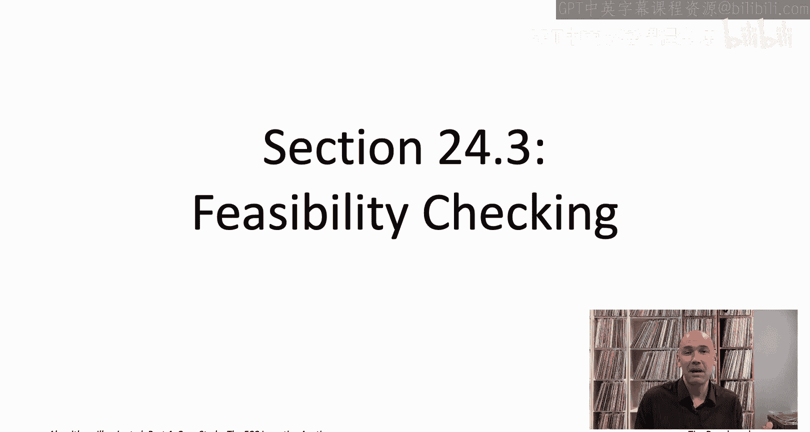
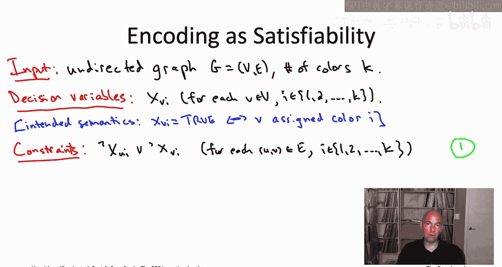
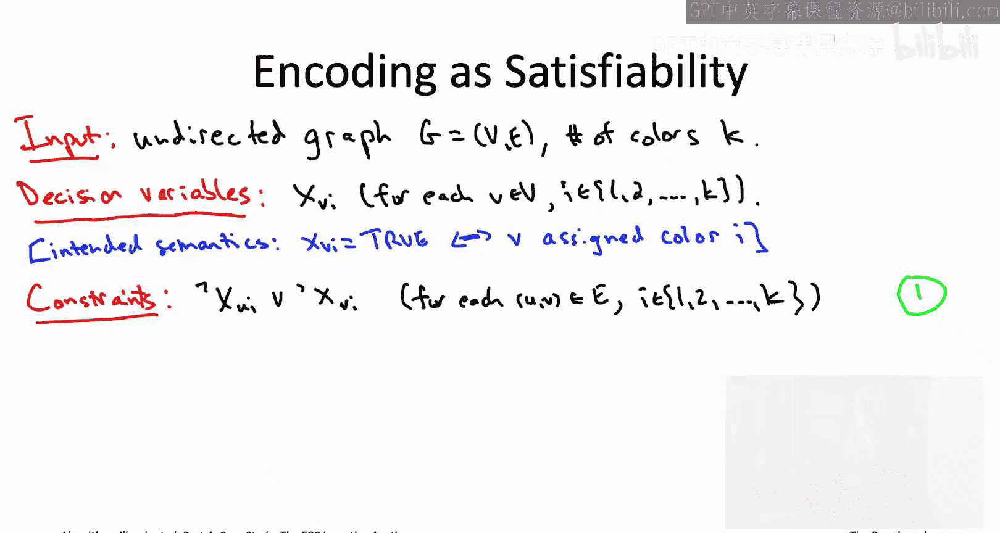
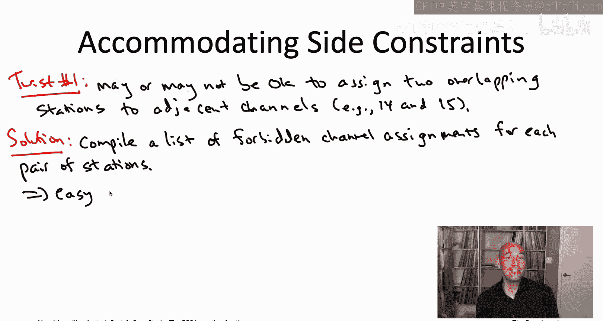
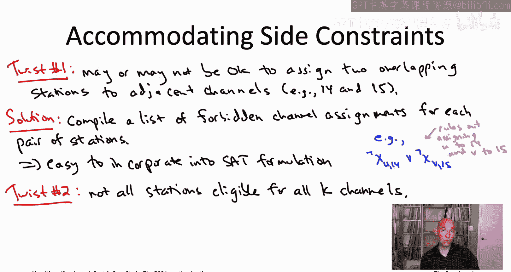
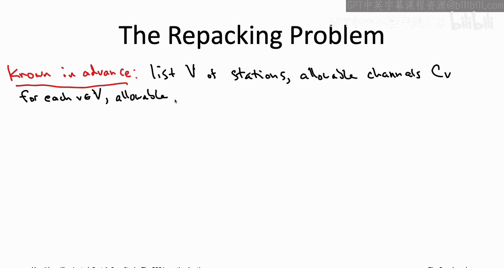
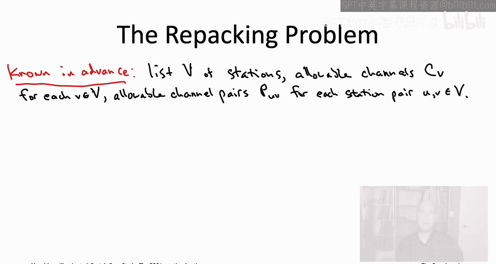

# 039：24.3 可行性检查（第1部分）

在本节中，我们将学习如何将FCC激励拍卖中的可行性检查问题，即“重新打包”问题，转化为一个可满足性问题，并探讨其编码方式。我们将看到，尽管这是一个NP难问题，但通过巧妙的编码，我们可以利用现代的SAT求解器来尝试解决它。

## 从优化到可行性检查

在上一节中，我们为价值最大化问题开发了一种贪心启发式算法，目标是在给定频道数量下，打包价值最高的电视台，同时确保它们之间互不干扰。我们看到，在该贪心算法的每次循环中，都需要进行一次可行性检查，这本质上归结为一个图着色问题，而图着色问题是NP难的。

然而，该视频的一个启示是：如果我们能有一个“魔法盒子”来为我们执行可行性检查，那么我们实际上就可以运行那个贪心算法，并有望通过仔细调整那些电视台特定的乘数，可靠地生成总价值接近最大可能值的解决方案。

当然，谈论“魔法盒子”是美好的，但在这个案例研究中，我们对魔法盒子的梦想已经破灭过一次。原始的优化问题对于最先进的混合整数规划求解器来说都过于困难。你可能会问，为什么我们这次能期望做得更好呢？

我们这次的优势在于，贪心算法所需的子程序只负责可行性检查。给定一个图，判断它是否可以用K种颜色着色。而之前我们讨论的是优化问题，即在一个图中所有K可着色的子图中，找到总价值最高的那个。这是一个更难的问题。因此，这带来了希望：对于这个虽然仍是NP难但相对简单的可行性检查问题，我们或许能拥有一个“魔法盒子”，即使我们无法为更难的优化问题找到一个半可靠的“魔法盒子”。

鉴于我们已决定使用贪心方法来解决价值最大化问题，这种从优化思维到可行性检查思维的转变，也提示我们需要改变所使用的语言和技术。我们将从最初使用的算术和混合整数规划求解器，转向逻辑和可满足性求解器的语言。

## 将图着色编码为可满足性问题

我们第一次遇到图着色问题，是在介绍可满足性求解器的视频中。在那个视频中，我们展示了如何将图着色问题——即检查一个图是否K可着色——编码为一个可满足性问题的实例。这个公式化方法在这里直接适用于FCC激励拍卖。

首先，我们来回顾一下可满足性问题的基本要素。它包含决策变量和约束。决策变量非常简单，只能是布尔值（真或假）。约束同样简单，只是文字的析取（逻辑或），而文字要么是决策变量，要么是其否定。

起初，将图着色与可满足性问题结合可能显得别扭。因为在图着色中，你似乎需要的不是布尔变量，而是每个顶点一个K值变量，用于指定它被分配的颜色。而在可满足性问题中，我们只能使用简单的真/假变量。

但有一个简单的解决方法：对于每个顶点，我们不只使用一个决策变量，而是使用K个决策变量。即，为每个顶点v和每种颜色i设置一个决策变量 `X_vi`。这个变量的预期语义是：在一个真值赋值中，如果 `X_vi` 为真，则表示顶点v被分配了颜色i；如果它被分配了任何其他颜色，则 `X_vi` 应为假。

以下是编码的具体步骤：

### 约束一：防止相邻顶点同色

对于输入图的每条边 (u, v)，我们需要K个约束，其中第i个约束禁止u和v同时被分配颜色i。这K个约束共同确保u和v获得不同的颜色。

如何实现呢？对于给定的边 (u, v) 和颜色 i，我们只需添加约束：`¬X_ui ∨ ¬X_vi`。这个析取式要求我们至少将 `X_ui` 或 `X_vi` 之一设为假。唯一不满足该约束的情况是将两者都设为真，而这正好对应于将u和v都着为颜色i。因此，这第一类约束防止了任何一对相邻顶点被分配相同的颜色。

### 约束二：确保每个顶点至少获得一种颜色

仅有第一类约束还不够，因为将所有变量设为假就能轻易满足它们（这相当于不给任何顶点着色）。因此，我们需要第二类约束来强制每个顶点至少获得一种颜色。

对于每个顶点v，我们希望禁止其所有K个决策变量 `X_v1` 到 `X_vK` 同时为假。这可以通过析取式实现：`X_v1 ∨ X_v2 ∨ … ∨ X_vK`。

这些约束允许一个顶点有多个变量为真（即被分配多种颜色）。但即便如此，只要你从分配给每个顶点的颜色中任选一种，你仍然会得到一个有效的K着色，因为第一类约束已经排除了顶点u的任何颜色与顶点v的任何颜色之间的冲突。

### 约束三（可选）：确保每个顶点仅获得一种颜色

如果你介意一个顶点可能被分配多种颜色，可以添加第三类约束来明确禁止这种情况。对于每个顶点v和每一对不同的颜色i和j，添加约束：`¬X_vi ∨ ¬X_vj`。这确保顶点v不会同时被分配颜色i和j。

以上就是将图着色问题编码为可满足性问题的全部内容。正如我们在关于SAT求解器的视频中所见，这正是你可以直接输入最先进的SAT求解器并观察其性能的格式。

## 适应FCC拍卖的实际约束

在实际的FCC激励拍卖中，可行性检查子程序基本上是一个图着色问题，但并不完全等同。存在一些需要调整的“曲折”之处，这涉及到我们之前四个简化假设中的第二个。

我们的第二个简化假设是：判断两个电视台是否干扰的测试非常简单，即仅当它们被分配到同一频道且广播区域重叠时才干扰。这大致解释了干扰的大部分情况，但存在一些复杂因素。

例如，对于某些特定的电视台对和频道对，将重叠的电视台分配到相邻频道（如频道14和15）也是不允许的。在某些情况下，它们之间需要至少两个频道的间隔。不幸的是，具体哪些电视台对和频道对会导致干扰是相当特殊的。

在FCC激励拍卖中，处理这个问题的方法是：由另一个团队负责编制一份清单，明确指出每一对电视台，哪些频道分配组合是被禁止的（即会产生干扰）。这份清单虽然编制不易，但一旦完成并交给负责构建可行性检查算法的团队，就非常容易整合到我们已有的可满足性公式中。

具体来说，回忆基本可满足性公式中的第一类约束。其中一个约束的形式是 `¬X_Ui ∨ ¬X_Vi`。这个约束确保不会出现电视台U被分配到频道i，同时电视台V也被分配到频道i的情况。

但仔细想想，同样的约束逻辑完全适用于两个不同频道i和j的情况。例如，约束 `¬X_U,14 ∨ ¬X_V,15` 将禁止将电视台U分配到频道14，同时将电视台V分配到相邻的频道15。

因此，给定另一个团队编制的这份“禁止频道分配对”清单，清单中的每一项都可以直接转化为可满足性公式中的一个约束。对于清单中的每一行，你只需添加一个这种形式的约束，包含两个文字，以排除那对特定的电视台接收那对特定的频道分配。

这样，我们就去掉了四个简化假设中的第二个。我们从一个非常简单的干扰判断假设，转向了实际应用中相当复杂但可被清单化的规则，而这份复杂清单正是我们实际在可满足性公式中使用的。

## 适应额外的资格限制

还有一个需要调整的“曲折”：在图着色实例中，任何顶点都可以接收K种颜色中的任何一种。但在FCC激励拍卖的应用中，情况并非完全如此。并非所有电视台都有资格使用所有23个可能的频道。

例如，与墨西哥接壤的电视台不能被分配到会干扰墨西哥境内现有电视台的频道。这种限制很容易在可满足性公式中适应。

具体做法是：每当有一个电视台v被禁止使用某个频道i时，我们只需在公式中省略那个决策变量 `X_vi`。这样，就没有机会将该电视台分配到频道i了。就这么简单。

我们能够如此轻松地调整基本的图着色可满足性公式，以适应这个特定应用中出现的特殊侧约束，这实际上说明了一个普遍原则（并非总是成立，但经常成立）：像MIP和SAT求解器这样的半可靠“魔法盒子”，通常比专门为特定问题设计的算法更具灵活性。通常可以轻松调整一个MIP或SAT公式以适应侧约束，正如我们这里所做的。而有时，添加侧约束可能会严重破坏一个特定问题的算法，迫使你重新回到绘图板，重新思考如何设计算法。

## 定义“重新打包”问题

至此，我们已经了解了FCC激励拍卖中必须解决的可行性检查问题的定义。它几乎是一个图着色问题，但由于上一节提到的侧约束，又不完全是。让我们给这个可行性检查问题起一个自己的名字：**重新打包问题**。

当我们之前讨论使用代表性实例来调整那些电视台特定乘数β_v时，我们提到过，实际上重新打包问题的许多方面是预先已知的。

例如，预先知道所有可能需要处理的电视台（大约几千个）。对于每个电视台，你确切知道它可以被分配到23个频道中的哪些（即它的资格集合 `C_v`）。此外，由于另一个团队开发的成对干扰约束清单，你也预先知道对于每一对电视台 (u, v)，它们被允许接收哪些频道分配对（即允许的配对集合 `P_uv`）。

所有这些信息都是预先知道的。因此，我鼓励你将它们视为算法本身固有的一部分，而不是每次问题输入本身的一部分。但是，你预先不知道的是，当你在FCC贪心算法中对电视台进行单遍扫描时，具体会出现什么样的重新打包实例序列。因为你需要检查可行性的电视台集合，将取决于之前所有可行性检查问题的结果。所以，这实际上是问题的一个输入，正如我们在整个视频播放列表中所理解的那样。

实时地，算法将获得一个电视台子集，并负责判断它们是否可以被“重新打包”。

**重新打包问题的正式定义如下：**
给定一个电视台集合S（实时输入），算法需要判断它们是否能够同时播出。即，是否存在一种分配方式，为每个电视台v分配一个它符合条件的频道（来自集合 `C_v`），使得所有成对约束得到尊重：对于每一对电视台 (u, v)，它们的频道分配对是允许的（属于集合 `P_uv`）。

如果存在这样的分配（即所有电视台可以在不产生干扰的情况下，使用K个频道重新打包），那么算法的责任是返回一个具有该属性的分配方案。如果不存在，那么算法的责任是正确报告该电视台集合是“不可打包的”，即无法让它们全部在不产生干扰的情况下播出。

这个重新打包问题，正是FCC贪心算法在其每次循环迭代中需要解决的问题。

## 问题规模与性能挑战

那么，我们如何解决它呢？正如我们所看到的，我们可以将其表述为可满足性问题。每当你遇到像这样的、可以自然编码为可满足性问题的可行性检查问题时，你都应该尝试使用最新、最先进的SAT求解器来解决它，看看它们表现如何。

那么，问题实例有多大呢？同样，我们谈论的是几千个电视台，数万个干扰约束。考虑到我们有23个频道，经过我们刚才讨论的可满足性公式化后，我们得到的SAT实例将拥有数万个决策变量和超过一百万个约束。

这是一个相当大的可满足性问题实例：数万个决策变量，超过一百万个约束。尽管如此，至少为了划定基准线，你可以将最新、最先进的SAT求解器应用于它们，看看表现如何。

它们的表现相当不错，考虑到SAT实例的规模，这仍然令人印象深刻。但是，来自最新SAT竞赛的现成求解器，在解决代表性的重新打包实例时，仍然经常需要10分钟或更长时间。

而这对于FCC来说实际上还不够好。FCC有一些非常雄心勃勃的算法目标：他们希望解决重新打包问题，不是在10分钟或更长时间内，而是在**一分钟或更短**的时间内。同样，当你拥有数万个变量和超过一百万个约束时，这听起来相当疯狂。

他们解决一个重新打包问题的时间预算如此之少，其中一个原因你已经看到：你不仅仅解决一次重新打包问题。在那个FCC贪心算法中，你需要在每次迭代中解决一个，而迭代有数千次。在下一个视频中，当我们讨论将FCC贪心算法实现为降序时钟拍卖时，我们会看到实际需要解决的重新打包实例数量更像是10万个。

这就是为什么FCC愿意给予的时间预算如此之小，这也部分解释了为什么拍卖需要很长时间才能完成——它花了几个月才完成，因为在此过程中你必须解决10万个重新打包实例。

那么，我们如何弥合我们已经达到的水平与我们所需水平之间的差距呢？即，最新现成SAT求解器解决这些问题所需的10多分钟，与我们目标的1分钟之间的差距。

为了做得更好，我们将不得不全力以赴，动用所有可能的方法。这将是下一节的内容。

## 本节总结

在本节中，我们一起学习了如何将FCC激励拍卖中的核心子问题——可行性检查（重新打包问题）——建模并编码为一个可满足性问题。我们回顾了将图着色问题转化为SAT实例的标准方法，并详细说明了如何通过添加约束来适应实际应用中的复杂干扰规则和资格限制。我们定义了“重新打包问题”，并了解了其问题规模以及对求解速度的严苛要求，为下一节探讨性能优化奠定了基础。