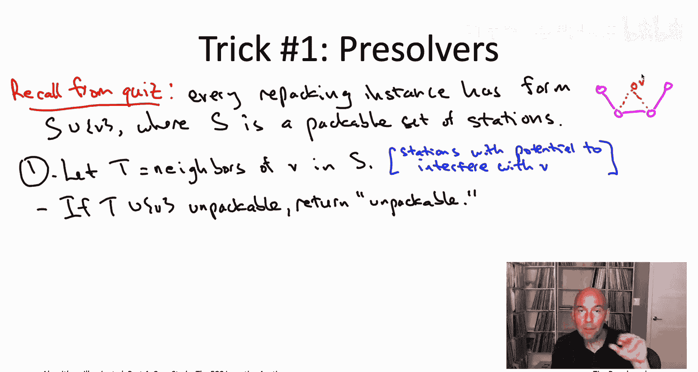
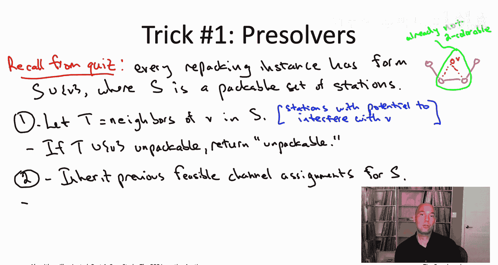
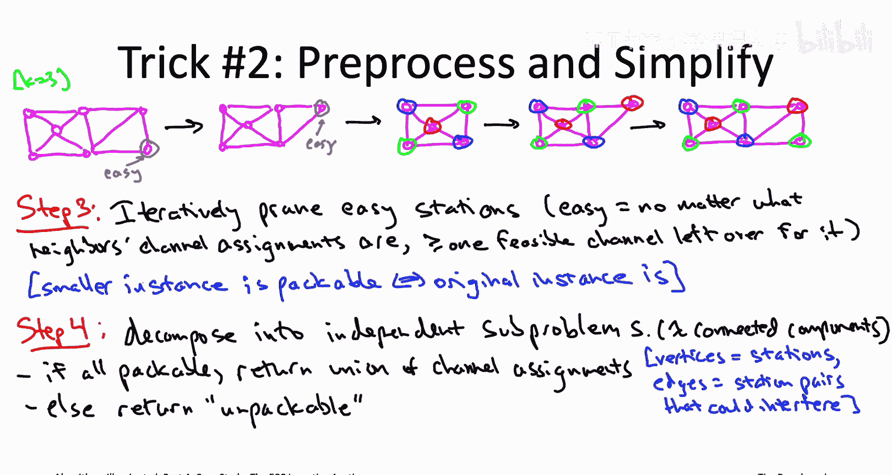
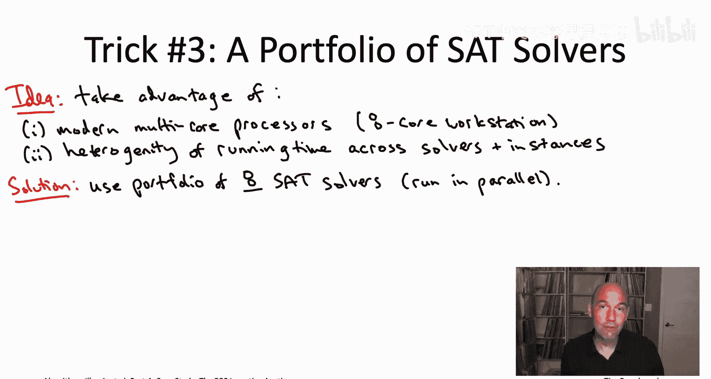
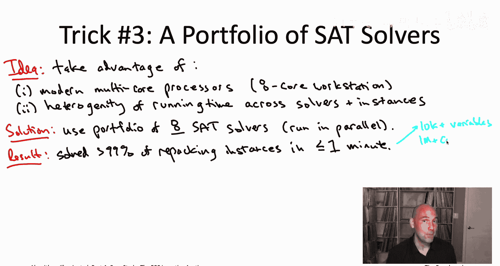

# 040：可行性检查（第二部分）

## 📖 概述
在本节课中，我们将学习美国联邦通信委员会激励拍卖的设计者们，为了在一分钟或更短时间内可靠地解决“重新打包”实例，所使用的三种关键技术。这些技术包括预求解器、预处理步骤以及并行SAT求解器组合。

---

## 🔍 预求解器：快速筛选简单实例

上一节我们介绍了可行性检查的嵌套结构。本节中，我们来看看设计者如何利用这种结构快速筛选出简单实例。

预求解器是用于快速检查实例是否可行（可打包）或不可行（不可打包）的快速检查方法。它们利用了FCC贪婪算法过程中产生的可行性检查实例的嵌套结构。

### 预求解器一：邻居子集检查
第一个预求解器是一个快速检查不可行性的方法。我们提出一个问题：假设我们只关注新站点V在集合S中可能产生干扰的邻居站点，构成子集T。我们检查是否至少能将新站点V与它的邻居子集T一起打包。如果连这个子集都无法打包，那么包含所有S的更大集合也肯定无法打包。

在纯图着色问题中，这相当于检查一个新顶点V及其邻居构成的子图是否K可着色。如果该子图不是K可着色的，那么整个大图也不是。

**核心逻辑**：
*   如果 `T ∪ V` 不可打包，则可正确推断 `S ∪ V` 不可打包。
*   如果 `T ∪ V` 可打包，则 `S ∪ V` 的状态仍不确定，可能可行也可能不可行。

### 预求解器二：局部扩展检查
第二个预求解器显式地利用了集合S是可打包的这一事实，并且我们从前一次迭代中继承了S中所有站点的可行信道分配方案。

这个预求解器的目标是，以“懒惰”的方式，尝试将继承来的信道分配方案扩展到新站点V。我们只允许有限的自由度：对于所有不与新站点V相邻的站点（即 `S - T` 中的站点），我们固定其信道分配不变。然后，我们尝试在V的邻居集合T内，为T和V重新分配信道，以找到满足所有约束的分配方案。

**核心逻辑**：
*   如果成功找到 `T ∪ V` 的信道分配，且与固定的 `S - T` 分配兼容，则我们证明了 `S ∪ V` 是可打包的。
*   如果失败（在固定 `S - T` 的条件下无法分配），`S ∪ V` 的真实状态仍不确定，因为解除固定约束后可能变得可行。

#### 图着色示例
考虑一个纯图着色场景，S是一条有9个顶点的品红色路径，已有一个三着色方案（红、蓝、绿）。现在尝试加入橙色顶点V。

*   **情况一（成功）**：在继承的着色方案下，V的三个邻居分别是蓝、绿、红。通过将蓝色邻居重新着为绿色（其邻居为红色，可行），V的邻居变为绿、绿、红，从而可以将V着为蓝色。预求解器成功。
*   **情况二（失败）**：如果继承的路径着色方案略有不同（例如第三个顶点从红变为绿），则V的三个邻居颜色被固定为蓝、绿、红，且均无法改变（因为各自的邻居颜色限制）。此时V无法获得任何不冲突的颜色。预求解器失败，尽管整个图实际上是三可着色的。

**动机**：专注于新站点的邻居（集合T），而非整个S，是因为S可能包含数千个站点，而T通常只有个位数或十位数个站点。因此，检查 `T ∪ V` 的打包状态可以使用现成的SAT求解器快速完成。

---

## 🛠️ 预处理步骤：简化难题实例

对于通过了预求解器检查的较难实例，接下来会应用两个快速的预处理步骤来简化或缩小问题规模。这些步骤属于“几乎免费”的原语操作，执行速度极快。

### 步骤三：修剪“简单”站点
第一个想法是，从输入中修剪掉那些约束非常少、无关紧要的站点。

在纯图着色例子中，如果一个顶点的度数小于可用颜色数K，那么无论其邻居如何着色，总有一种颜色剩余可以分配给它。这样的顶点可以先被移除（修剪）。修剪后，可能会出现新的低度数顶点，可以继续修剪。这个过程反复进行，直到没有顶点可修剪为止。

**好处**：
1.  最终得到的较小图的K可着色性，与原图完全一致。
2.  在较小的图上运行着色算法会快得多。
3.  如果小图可着色，可以按修剪的逆序，将“简单”顶点加回去并赋予一个可用的颜色，从而轻松得到原图的着色方案。

在重新打包问题中，我们寻找类似的“简单”站点（即无论其邻居如何分配信道，总有一个信道可用），并进行修剪。

### 步骤四：分解为连通分量
第二个预处理步骤利用了图论中的连通分量概念。

在纯图着色问题中，如果一个图是不连通的，包含多个连通分量，那么各分量的着色问题完全独立。只需分别检查每个连通分量是否K可着色。只要有一个分量不可着色，整个图就不可着色；如果所有分量都可着色，则合并着色方案即可得到全图的着色。

在重新打包问题中，我们将站点视为图的顶点，如果两个站点可能相互干扰，则在它们之间连一条边。这样，不同连通分量中的站点绝不可能相互干扰。因此，重新打包问题可以完全分解为各个连通分量上的独立子问题。

**好处**：对于运行时间为超线性（如 `O(n^2)`）的算法，分别解决多个较小实例的总时间，通常远小于直接解决一个大型实例的时间。这带来了显著的加速效果。

---

## ⚡ 并行SAT求解器组合：攻克最难题

那些通过了所有预求解器和预处理步骤的“最硬”重新打包实例，需要更强大的工具。直接使用现成的SAT求解器，虽然对一部分实例有效，但无法满足FCC“在一分钟内可靠解决”的要求。

设计者随后利用了两点：

1.  **现代多核处理器**：他们使用八核工作站，可以并行运行八个算法。
2.  **SAT求解器的性能异质性**：对于不同的实例，同一个求解器的运行时间可能相差数个数量级；对于同一个实例，不同求解器的运行时间也可能相差巨大。不同求解器在不同类型的实例上各有专长。

基于以上观察，他们采用了**并行SAT求解器组合**策略。同时运行8个不同的SAT求解器，只要其中任何一个成功解决了实例，就立即返回答案。

**组合的构建**：这8个求解器的选择，本身也使用了一种贪心启发式算法（类似于第20章讨论的最大覆盖和影响力最大化问题）。他们顺序选择求解器，每次选择能在代表性实例上，相对于已入选组合的求解器，带来最大边际运行时间改善的那个求解器。

**局部搜索的作用**：值得一提的是，在这个组合中的几个SAT求解器，本身就是局部搜索算法。它们通过不断微调真值赋值来满足更多约束，在该案例中发挥了基础性作用。

综合运用预求解器、预处理和并行SAT求解器组合，最终使得FCC激励拍卖能够在一分钟内解决超过99%的重新打包实例，这些实例通常包含数万个变量和超过一百万个约束。

---

## 🛡️ 处理超时与算法鲁棒性

你可能会问，那剩下的1%实例怎么办？如果可行性检查子程序超时（一分钟内未返回结果），贪婪算法该如何处理？

FCC贪婪算法对其可行性检查子程序的失败具有高度容忍性。当子程序超时，意味着它无法确定 `S ∪ V` 是否可打包。

在这种情况下，算法必须遵循一个铁律：最终选定的站点集合必须是可打包的。因此，在缺乏可行性保证时，贪婪算法会选择**保守策略**，假设无法将V加入S，从而放弃V。

虽然这可能导致损失一些潜在价值（因为实际上V可能是可以加入的），但只要超时情况不频繁（正如实际拍卖中那样），这种价值损失是微小的。更重要的是，算法总能在一个可预测的时间内完成，并保证输出一个可行的解决方案。

---

## 🎯 总结
本节课我们一起学习了FCC激励拍卖中，用于高效解决NP难可行性检查问题的核心算法思想：
1.  **预求解器**：利用问题结构的嵌套性，快速筛选出明显可行或不可行的简单实例。
2.  **预处理**：通过修剪无关站点和分解连通分量，大幅简化难题实例的规模。
3.  **并行求解**：利用SAT求解器的性能异质性和多核计算能力，并行运行一个精心挑选的求解器组合，以快速攻克最难实例。
4.  **鲁棒性设计**：当检查超时时，算法采取保守策略以保证最终结果的可行性，使整个系统对子程序失败具有容忍性。

这些技术的结合，使得处理大规模、复杂的实际NP难问题成为可能。