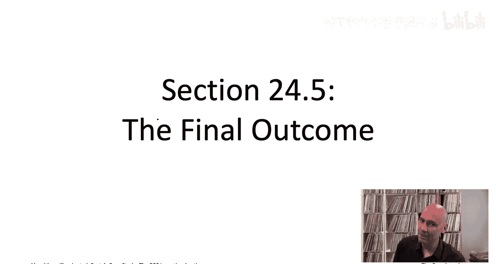
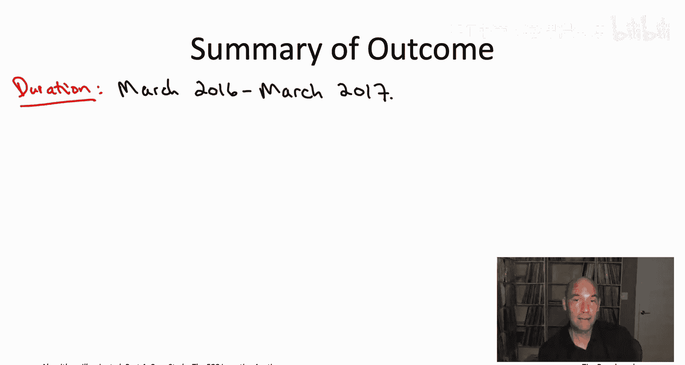

# 041：最终成果 🏆

在本节课中，我们将总结FCC激励拍卖的最终成果。我们将回顾拍卖的关键数据、其多阶段运行过程，并理解算法工具如何促成这一复杂项目的成功。

上一节我们详细探讨了FCC激励拍卖的反向拍卖机制。本节中，我们来看看整个拍卖的最终运行结果和实际影响。

## 拍卖概况与结果

FCC激励拍卖持续了将近一年时间，从2016年3月开始，到2017年3月结束。

以下是拍卖的核心成果数据：

*   **参与方与补偿**：在反向拍卖中，有近3000个电视台参与。其中，175个电视台放弃了它们的广播牌照以换取补偿。总补偿金额约为**100亿美元**，平均每个牌照约5000万美元，但不同地区的差异很大。
*   **频道重新分配**：大约有1000个电视台被重新分配了广播频道。

## 正向拍卖与收入

接下来我们看看正向拍卖的情况，即政府将频谱出售给出价最高的竞标者。

我们从本系列的第一个视频中了解到，被释放的频谱经过了重组。原本是38至51频道，总计84 MHz的频谱，被重组为**7对5 MHz的区块**。每对区块中，一个用于上行传输，另一个用于下行传输。

在正向拍卖中，电信公司竞标的就是这些频谱“商品”。在全国416个被称为“部分经济区”的区域中，每个区域都出售这7对牌照中的每一个。这导致在正向拍卖中，同时售出了大约**3000个牌照**。

正向拍卖的总收入为**200亿美元**。

## 政府盈余与多阶段设计

这意味着FCC激励拍卖产生了近**100亿美元的利润**。在覆盖拍卖成本并处理完几项指定用途后，剩余超过70亿美元被直接用于减少美国财政赤字。这本身就是国会当初授权此拍卖的计划之一。

看到这些数字，你可能会想：政府很幸运，正向拍卖的200亿美元收入刚好超过了反向拍卖约100亿美元的采购成本。实际上，这引出了另一个问题：是谁决定了清理84 MHz（即14个频道）是最合适的频谱量？

事实上，实际的FCC激励拍卖还有一个我之前未提及的**外层循环**。这个额外的外层循环会向下搜索，以找到最佳的待清理频道数量。这也是拍卖持续近一年的原因之一，因为它经历了多个阶段，尝试了不同的清理目标。

以下是其多阶段搜索过程的简述：

1.  **第一阶段**：拍卖非常雄心勃勃地尝试清理**21个频道**（126 MHz），这足以在每个区域创建10对牌照用于正向拍卖。此阶段严重失败，因为采购成本总计约860亿美元，而正向拍卖收入仅约230亿美元。
2.  **后续阶段**：由于政府无意亏损600亿美元，拍卖进入第二阶段，清理目标降至19个频道。拍卖从第一阶段停止的地方恢复进行。
3.  **最终成功阶段**：拍卖在**第四阶段**停止，即清理了14个频道（38至51频道）。这是第一个收入覆盖并超过成本的阶段，在该阶段产生了100亿美元的盈余。

## 总结与意义

至此，你已从算法角度了解了关于FCC激励拍卖的几乎所有关键信息。

这次拍卖取得了巨大成功。它将无线频谱从价值相对较低的地面电视用途，重新分配给了价值高得多的未来宽带应用。事实上，在未来几年我们享受5G网络时，许多网络使用的正是这次激励拍卖所释放的频谱。

除此之外，拍卖还创造了数十亿美元的盈余，用于减少政府赤字。通过本系列视频的学习，希望你能清楚地看到，若没有用于在实践中解决NP难问题的最先进算法工具箱，这种成功是绝不可能实现的。现在，在学完本书和本系列视频之际，这个工具箱你也可以宣称属于你了。😊