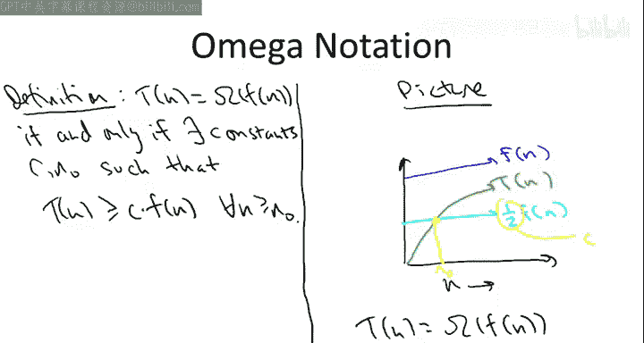
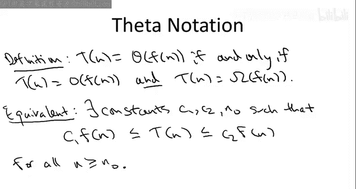
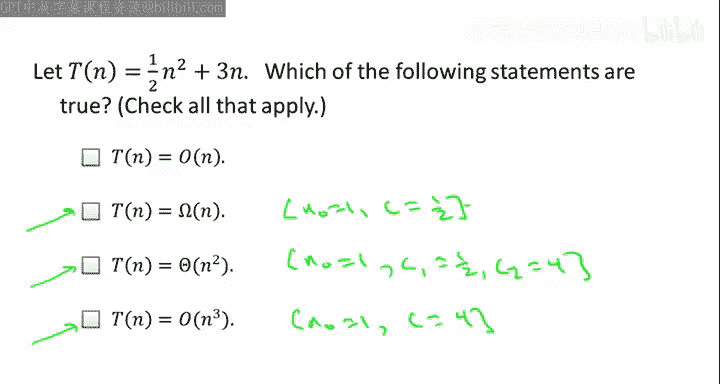
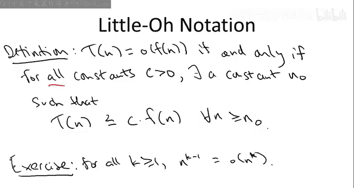

# 算法启蒙：第1册：基础篇｜第11讲：大Ω与Θ符号 🧮

在本节课中，我们将继续学习渐近符号的正式定义。我们已经讨论了大O符号，它是渐近符号中最为重要且应用最广泛的概念。为了内容的完整性，本节将介绍大O符号的两个近亲：大Ω符号和大Θ符号。如果大O符号类似于“小于或等于”，那么大Ω和大Θ符号则分别类似于“大于或等于”和“等于”。接下来，让我们更精确地理解它们。

## 大Ω符号的定义 📈

大Ω符号的形式定义与大O符号的定义非常相似。我们说一个函数 **T(n)** 是另一个函数 **f(n)** 的大Ω，如果**最终**（即对于足够大的n），**T(n)** 被 **f(n)** 的一个常数倍所下界约束。我们用与之前完全相同的方式来量化“常数倍”和“最终”这两个概念，即明确给出两个常数 **c** 和 **n₀**，使得对于所有足够大的n（即所有 n ≥ n₀），都有 **T(n) ≥ c * f(n)**。

与大O符号类似，我们可以用图像来直观理解。假设我们有一个函数 **T(n)**，其图像可能像一条绿色曲线。而另一个函数 **f(n)** 的图像在 **T(n)** 之上。但当我们用常数 **c**（例如1/2）乘以 **f(n)** 后，得到的曲线最终会始终位于 **T(n)** 之下。在这个例子中，**T(n)** 就是 **f(n)** 的大Ω。其中，常数 **c** 就是1/2，而 **n₀** 则是两条曲线相交的点，即在此点之后，**c * f(n)** 永远位于 **T(n)** 下方。

## 大Θ符号的定义 ⚖️

大Θ符号相当于“等于”。它意味着一个函数同时是 **f(n)** 的大O和大Ω。另一种等价的思考方式是：**最终，T(n) 被夹在两个不同的 f(n) 的常数倍之间**。我们可以这样表述：存在常数 **c₁**、**c₂** 和 **n₀**，使得对于所有 n ≥ n₀，都有 **c₁ * f(n) ≤ T(n) ≤ c₂ * f(n)**。你可以自行验证这两种定义是等价的。

## 算法设计中的常见用法 💻

算法设计者有时会有些“随意”，他们经常使用大O符号来代替大Θ符号。这是一种常见的惯例，在本课程中我也会经常遵循。让我举个例子：假设我们有一个子程序，它对一个长度为n的数组进行线性扫描，检查每个元素并对每个元素执行常数量的工作。例如，归并子程序就大致属于这种类型。尽管这种算法/子程序的运行时间显然是 **Θ(n)**（因为它对n个元素中的每一个都做常数工作），但我们通常只会说它的运行时间是 **O(n)**，而不会特意强调它是 **Θ(n)**。

我们这样做是因为，作为算法设计者，我们真正关心的是**上界**——我们想要算法运行时间的保证。因此，我们自然更关注上界，而不是下界。所以，请不要感到困惑。有时，一个量明显是 **Θ(f(n))**，但我可能只会给出较弱的陈述，说它是 **O(f(n))**。

## 理解测验 ✅

接下来的测验旨在检查你对大O、大Ω和大Θ这三个概念的理解。

假设 **T(n) = 3n² + 2n + 1**。以下哪些陈述是正确的？
1.  **T(n) = O(n²)**
2.  **T(n) = Ω(n)**
3.  **T(n) = Θ(n²)**
4.  **T(n) = O(n³)**

最后三个陈述都是正确的。从高层次直觉来看，原因应该相当清楚：**T(n)** 显然是一个二次函数。我们知道，随着n增大，线性项的影响不大。既然它是二次增长，那么第三个陈述（**Θ(n²)**）就是正确的。同时，它也是 **Ω(n)**。虽然 **Ω(n)** 作为 **T(n)** 渐近增长率的下界并不精确，但它是合法的。确实，作为一个二次增长函数，它至少和线性函数增长得一样快，所以它是 **Ω(n)**。同理，**O(n³)** 虽然不是一个很好的上界，但也是一个合法的上界。**T(n)** 的增长率最多是三次的（实际上最多是二次的），但它确实最多是三次的。

如果你想正式证明这三个陈述，只需给出合适的常数即可。例如：
*   要证明它是 **Ω(n)**，可以取 **n₀ = 1**，**c = 12**。
*   要证明它是 **O(n³)**，可以取 **n₀ = 1**，**c = 4**。
*   要证明它是 **Θ(n²)**，可以类似地组合两个常数，例如取 **n₀ = 1**，**c₁ = 12**，**c₂ = 4**。

你可以自行验证，使用这些常数选择，大Ω、大Θ和大O的形式定义都能得到满足。

## 小o符号简介 🔍

最后介绍一个渐近符号，我们不会经常使用它，但偶尔会见到，所以我想简要提一下。这被称为**小o符号**，与大O符号相对。如果说大O符号非正式地类似于“小于或等于”关系，那么小o符号就是“严格小于”关系。直观上，它意味着一个函数的增长速度**严格慢于**另一个函数。

形式上，我们说函数 **T(n)** 是 **f(n)** 的小o，当且仅当：**对于所有常数 c > 0，都存在一个常数 n₀，使得对于所有 n ≥ n₀，都有 T(n) ≤ c * f(n)**。

这个定义与大O符号的区别在于：要证明一个函数是另一个函数的大O，我们只需要找到一个常数 **c**，使得 **c * f(n)** 最终成为 **T(n)** 的上界。相比之下，要证明某个函数是另一个函数的小o，我们需要证明一个强得多的命题：**对于每一个常数 c（无论多小），都存在一个足够大的 n₀，使得在此之后 T(n) 都被 c * f(n)** 所上界约束。

对于那些希望更深入了解小o符号的同学，我留一个练习：证明对于所有多项式幂次 k，**n^(k-1)** 确实是 **n^k** 的小o。即：**n^(k-1) = o(n^k)**。

还有一个表示一个函数增长**严格快于**另一个函数的**小ω符号**，但这个符号不常见，我就不再赘述了。

## 历史背景与总结 📜

让我用一段引用来结束本视频。这段话出自我的同事**高德纳**在1976年发表的一篇文章，他被广泛认为是算法形式分析的奠基人。通常很难明确指出某种符号是在何时何地成为某个领域的通用语言的，但对于渐近符号来说，这一点非常清楚。这种符号并非由算法设计者或计算机科学家发明，它在19世纪起就在数论中使用了。但正是高德纳在1976年提出，这应该成为讨论增长率（特别是算法运行时间）的标准语言。

他在文章中说道：“基于这里讨论的问题，我建议SIGACT（ACM特别兴趣小组，专注于理论计算机科学，特别是算法分析）的成员以及科学和数学期刊的编辑们采用上述定义的大O、大Ω和大Θ符号，除非能在合理的时间内找到更好的替代方案。”

显然，更好的替代方案并未出现。自那时起，这便成为了讨论算法运行时间增长率的标准方式，也是我们将在本课程中使用的方式。

## 本节课总结 🎯

在本节课中，我们一起学习了渐近符号家族的另外两个重要成员：
*   **大Ω符号 (Ω)**：表示函数的**渐近下界**，类似于“大于或等于”。
*   **大Θ符号 (Θ)**：表示函数的**紧确界**，当函数同时具有相同增长率的上界和下界时使用，类似于“等于”。

我们还了解了算法设计中常用大O符号来泛指上界的惯例，并简要介绍了表示“严格小于”关系的**小o符号**。最后，我们回顾了渐近符号成为计算机科学标准语言的历史渊源。掌握这些符号对于精确分析和比较算法的效率至关重要。