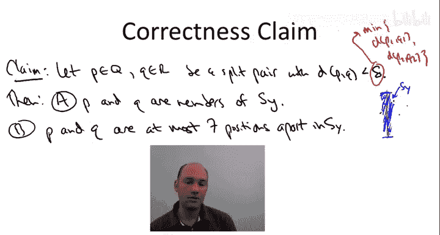
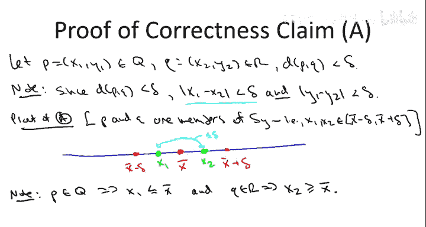
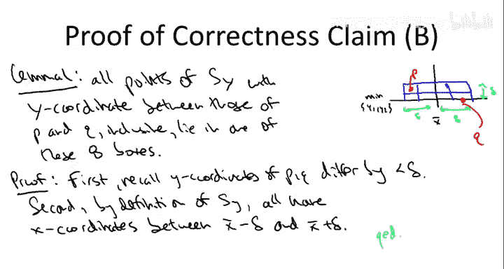
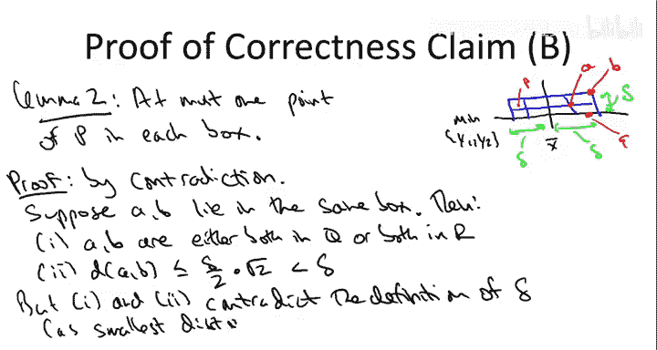
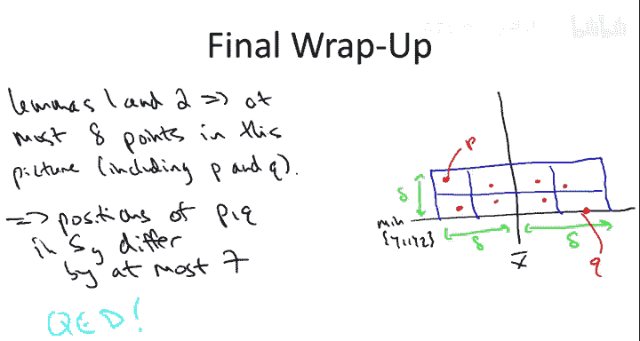

# 算法启蒙：第16讲：最近点对算法正确性证明 🧮

在本节课中，我们将证明上一讲中讨论的分治最近点对算法的正确性。我们将逐步分析算法的核心步骤，并证明其能在线性时间内找到跨越左右两部分的最近点对。

## 算法回顾

给定平面上的 n 个点，算法步骤如下：
1.  首先按 x 坐标和 y 坐标对点进行排序，耗时 **O(n log n)**。
2.  进入递归分治阶段：
    *   **划分**：将点集分为左半部分 Q 和右半部分 R。
    *   **征服**：递归计算左半部分 Q 和右半部分 R 各自的最近点对距离，记为 **δ**。
    *   **合并**：存在一种“幸运”情况，即全局最近点对完全位于左侧或右侧，此时递归调用已给出答案。但还存在“不幸运”情况，即最近点对跨越左右两侧。为了获得 **O(n log n)** 的总运行时间，我们需要一个线性时间的子程序，用于计算跨越左右两侧的最佳点对（即“分裂对”）。

上一讲中，我们已论证了算法的整体运行时间为 **O(n log n)**。本节课的核心任务是证明其正确性。

## 核心子程序与正确性声明

分裂点子程序的工作流程如下：
1.  **过滤步骤**：考虑一个位于点集中间位置的垂直条带（以 x̄ 为中心，左右各延伸 δ）。只保留落入此条带的点，构成按 y 坐标排序的列表 **Sy**。
2.  **线性扫描**：遍历 Sy 中的点。对于每个索引 i，仅检查其后最多 7 个位置（即索引 j 满足 i < j ≤ i+7）的点。计算这些点对的距离，并记录最佳的一对。

算法的正确性可归结为以下声明的证明：

**正确性声明**：考虑任意一个分裂对 (p, q)，其中 p 来自左侧 Q，q 来自右侧 R。假设该点对是“有趣的”，即其欧几里得距离小于 δ（δ 是左右两侧各自内部最近点对距离的最小值）。那么：
*   **(A)** p 和 q 都会通过过滤步骤，出现在列表 Sy 中。
*   **(B)** p 和 q 在数组 Sy 中的位置索引差不超过 7，因此会被上述双循环检查到。

如果此声明成立，则算法正确。下面我们开始证明。

## 证明部分 A：点对位于垂直条带内

假设点 p 坐标为 (x₁, y₁)，点 q 坐标为 (x₂, y₂)。根据假设，它们的欧几里得距离小于 δ。

一个简单但关键的观察是：如果两点欧几里得距离小于 δ，那么它们在每个坐标轴上的差值也必然小于 δ。即：
*   |x₁ - x₂| < δ
*   |y₁ - y₂| < δ

现在证明部分 (A)。我们需要证明 x₁ 和 x₂ 都位于垂直条带内，即满足：x̄ - δ ≤ x ≤ x̄ + δ。

*   由于 p 来自左半部分 Q，而 x̄ 是左半部分最右侧点的 x 坐标，因此有 **x₁ ≤ x̄**。
*   由于 q 来自右半部分 R，而 x̄ 是左半部分最右侧点的 x 坐标，因此有 **x₂ ≥ x̄**。
*   结合 |x₁ - x₂| < δ，我们可以想象 x₁ 和 x₂ 被一条长度小于 δ 的“绳子”拴着。
    *   x₁ 不能移动到 x̄ 右侧。即使 x₁ 移动到最右侧的 x̄，x₂ 由于被绳子牵引，也无法移动到超过 x̄ + δ 的位置。
    *   同理，x₂ 不能移动到 x̄ 左侧。即使 x₂ 移动到最左侧的 x̄，x₁ 也无法移动到超过 x̄ - δ 的位置。

因此，x₁ 和 x₂ 都位于区间 [x̄ - δ, x̄ + δ] 内，即它们都包含在垂直条带中，并进入过滤后的列表 Sy。部分 (A) 得证。

## 证明部分 B：点对在 Sy 中位置接近

部分 (B) 的断言更令人惊讶：它不仅要求 p 和 q 在 Sy 中，还要求它们在按 y 坐标排序的列表中几乎相邻（索引差 ≤ 7）。这意味着，在过滤后，我们只需对 Sy 中的点进行线性扫描（检查每个点与其后最多 7 个点），就足以找到最近的分裂对。

论证的核心是一个思想实验：我们绘制 8 个边长为 δ/2 的小方格。

*   **方格布局**：以垂直条带中心线 x = x̄ 为界，左右各布置两列，上下共两行，总计 8 个方格。
*   **垂直范围**：方格的底部对齐点 p 和 q 中较小的 y 坐标（记为 y_min），顶部在 y_min + δ 处。

以下是论证所需的两条引理：

**引理 1**：所有 Sy 中 y 坐标介于 p 和 q 之间的点，都必须落在这 8 个方格之内。
*   **y 坐标论证**：由于 |y₁ - y₂| < δ，因此 p 和 q 的 y 坐标差值小于 δ。所有 y 坐标介于它们之间的点，其 y 坐标自然也在 [y_min, y_min + δ] 范围内。
*   **x 坐标论证**：根据 Sy 的定义，其中的点 x 坐标必须在 [x̄ - δ, x̄ + δ] 内，而这正是这 8 个方格覆盖的横向范围。
因此，引理 1 成立。

**引理 2**：每个方格内至多包含点集中的一个点。
*   我们使用反证法。假设某个方格内有两个点 A 和 B。
*   **推论 1**：A 和 B 必须位于点集的同一侧（同属左侧 Q 或同属右侧 R）。因为每个方格完全位于 x̄ 的左侧或右侧，因此其中的点只能来自同一半部分。
*   **推论 2**：A 和 B 的距离很近。即使它们位于方格的对角位置，其最大距离也为 √((δ/2)² + (δ/2)²) = δ/√2 < δ。
*   **矛盾**：δ 的定义是左右两侧各自内部最近点对距离的最小值。但推论 1 和 2 展示了一对位于同一侧且距离严格小于 δ 的点 (A, B)，这与 δ 的定义矛盾。
因此，假设不成立，引理 2 得证。

## 完成证明

结合引理 1 和引理 2：
*   引理 1 指出，所有相关的竞争点（y 坐标在 p, q 之间）都位于这 8 个方格内。
*   引理 2 指出，每个方格至多有一个点。
*   因此，在这 8 个方格内，点的总数不超过 8 个。这包括了点 p 和 q 本身（它们占据两个方格）。

在最密集的情况下，除了 p 和 q 所在的方格外，其余 6 个方格可能各有一个点，且这些点的 y 坐标都介于 p 和 q 之间。这意味着，在按 y 排序的列表 Sy 中，从 p（或 q）的位置开始，向后扫描最多 7 个位置，就一定能遇到另一个点 q（或 p）。

因此，任何距离小于 δ 的分裂对，都必然会被我们“检查每个点与其后 7 个点”的双重循环所发现。部分 (B) 得证。

## 总结

本节课中，我们一起学习了如何严格证明分治最近点对算法的正确性。我们首先回顾了算法框架，然后将其正确性归结为一个核心声明的证明。通过几何直观和严谨的数学推导（利用 δ 的定义和反证法），我们证明了：
1.  任何距离足够近的跨越点对，都会被过滤步骤保留在垂直条带内。
2.  这些点对在按 y 排序的列表中是如此接近，以至于只需检查每个点与其后常数个（7个）点，就一定能找到它们。

这最终确立了该算法是一个正确且运行时间为 **O(n log n)** 的优美算法，用于求解平面最近点对问题。