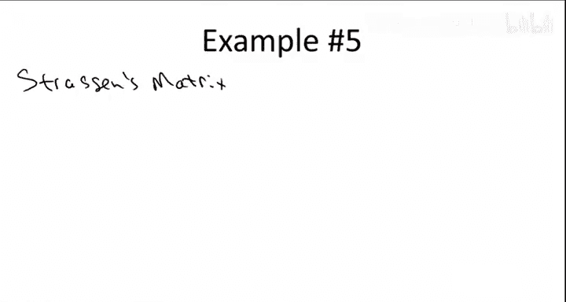
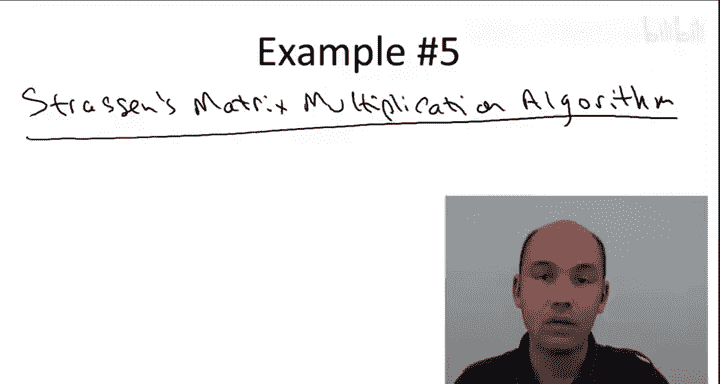
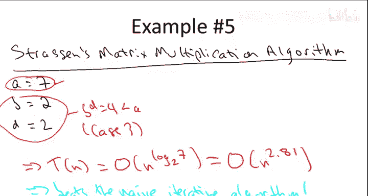
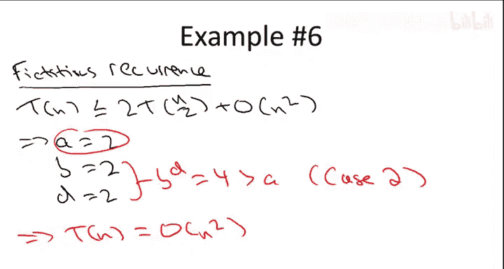

# 算法启蒙：第1册：基础篇｜第19章：主定理应用示例 🧮

在本节课中，我们将通过六个具体的例子来应用主定理，以求解不同分治算法的运行时间。我们将回顾主定理的三种情况，并通过实例理解如何确定参数并得出结果。

## 主定理回顾 📚

上一节我们介绍了主定理的基本形式。本节中，我们来看看如何具体应用它。主定理适用于特定格式的递归式，该格式由三个常数 **A**、**B** 和 **D** 参数化。

*   **A** 指递归调用的次数，即需要解决的子问题数量。
*   **B** 是子问题规模相对于原问题规模的缩小因子。
*   **D** 是递归调用之外所做工作的运行时间指数。

递归式的形式为：
```
T(n) ≤ A * T(n/B) + O(n^D)
```
此外，还有一个未写出的基本情况：当问题规模降至某个常数以下时，可以直接在常数时间内解决问题。

给定一个符合此格式的递归式，其运行时间由以下三种情况之一给出，具体取决于 **A**（递归调用次数）与 **B^D** 之间的关系：

1.  **情况一**：当 `A = B^D` 时，运行时间为 `O(n^D * log n)`。
2.  **情况二**：当 `A < B^D` 时，运行时间上界为 `O(n^D)`。
3.  **情况三**：当 `A > B^D` 时，运行时间为 `O(n^(log_B A))`。

主定理初看可能难以理解，因此让我们通过一些具体示例来掌握它。

## 示例分析 🔍

以下是六个具体的算法示例，我们将逐一应用主定理进行分析。

### 示例一：归并排序

我们从已知运行时间的算法开始，即归并排序。主方法的优势在于，我们只需识别三个相关参数 **A**、**B** 和 **D** 的值，然后代入即可得到答案。

*   **A** 是递归调用次数。在归并排序中，我们进行两次递归调用，所以 `A = 2`。
*   **B** 是子问题规模缩小因子。我们对数组的一半进行递归，所以 `B = 2`。
*   **D** 是递归调用外工作的指数。归并排序在递归调用外进行归并操作，这是线性时间子程序，所以 `D = 1`。

关键触发条件是 **A** 与 **B^D** 的关系。这里 `A = 2`，`B^D = 2^1 = 2`，两者相等。这属于**情况一**。因此，运行时间上界为 `O(n^D * log n) = O(n^1 * log n) = O(n log n)`。这与我们已知的结果一致，验证了主定理的正确性。

### 示例二：二分查找

接下来，我们看看二分查找算法。主定理同样适用于此，并能告诉我们其运行时间。

以下是二分查找的参数确定过程：
*   **A**：在二分查找中，每次只进行一次递归调用（根据比较结果递归左半部分或右半部分），所以 `A = 1`。
*   **B**：每次递归处理一半的数组，所以 `B = 2`。
*   **D**：递归调用外只进行一次比较，这是常数时间操作，所以 `D = 0`。

我们再次处于**情况一**，因为 `A = 1` 且 `B^D = 2^0 = 1`。因此，递归式的解为 `O(n^D * log n) = O(n^0 * log n) = O(log n)`。这确认了二分查找的运行时间为对数级。

### 示例三：整数乘法（朴素递归）

现在，我们转向一些更复杂的例子，从第一个整数乘法的递归算法开始。该算法对四个 n/2 位数的乘积进行递归，然后通过补零和线性时间加法重新组合。

以下是该算法的参数：
*   **A**：该算法进行四次递归调用，所以 `A = 4`。
*   **B**：每次递归处理数字位数减半，所以 `B = 2`。
*   **D**：递归调用外进行加法和补零操作，这是线性时间，所以 `D = 1`。

接下来确定主定理的情况：`A = 4`，`B^D = 2^1 = 2`。由于 `A > B^D`，我们处于**情况三**。运行时间由公式 `O(n^(log_B A))` 给出。代入参数：`O(n^(log_2 4)) = O(n^2)`。这与我们在小学学到的迭代算法具有相同的平方级操作数，表明在没有高斯技巧的情况下，递归方法并未带来改进。

### 示例四：整数乘法（使用高斯技巧）

如果我们利用高斯技巧，将递归调用次数从四次减少到三次，运行时间会如何变化？

以下是使用高斯技巧后的参数：
*   **A**：递归调用次数减少到 3，所以 `A = 3`。
*   **B**：子问题规模仍为一半，`B = 2`。
*   **D**：递归调用外的工作仍是线性时间，`D = 1`。

我们仍然处于**情况三**，因为 `A = 3` 仍大于 `B^D = 2`。运行时间为 `O(n^(log_B A)) = O(n^(log_2 3))`。`log_2 3` 约等于 1.59，因此运行时间约为 `O(n^1.59)`。这优于平方时间 `O(n^2)`，尽管不如 `O(n log n)` 快。总结来说，结合递归和高斯技巧，我们可以超越小学所学的迭代算法。

### 示例五：斯特拉森矩阵乘法



第五个例子针对看过斯特拉森矩阵乘法算法视频的观众。该算法的关键思想类似于整数乘法中的高斯技巧。



以下是斯特拉森算法的参数：
*   **A**：通过巧妙计算，递归调用次数从 8 次减少到 7 次，所以 `A = 7`。
*   **B**：每个子问题规模是原问题的一半，`B = 2`。
*   **D**：递归调用外的工作量与矩阵规模（维度）呈线性关系，但就矩阵条目数（n^2）而言是二次的，所以 `D = 2`。

我们再次处于**情况三**，因为 `A = 7` 大于 `B^D = 4`。运行时间为 `O(n^(log_2 7))`，约等于 `O(n^2.81)`。这优于朴素迭代算法所需的立方时间 `O(n^3)`，再次展示了巧妙分治法的优势。

### 示例六：虚构示例（展示情况二）

前五个例子涵盖了情况一和情况三。为了完整性，我们看一个触发情况二的虚构递归式。



考虑以下递归式：`T(n) = 2T(n/2) + O(n^2)`。它与归并排序类似，但合并步骤的工作量从线性变为二次。


其参数为：
*   **A**：两次递归调用，`A = 2`。
*   **B**：子问题规模减半，`B = 2`。
*   **D**：递归调用外工作为二次，`D = 2`。

这里 `B^D = 4`，严格大于 `A = 2`。这触发了**情况二**。情况二的运行时间就是 `O(n^D)`，即 `O(n^2)`。这个结果可能有点反直觉：与归并排序的 `O(n log n)` 相比，仅仅将合并步骤从线性改为二次，总运行时间就变成了平方级，而不是 `O(n^2 log n)`。主定理给出了更紧的上界，表明整个算法的运行时间主要由最外层递归调用（递归树的根）之外的工作决定。

## 总结 📝



本节课中，我们一起学习了如何应用主定理分析六种不同分治算法的运行时间。我们回顾了主定理的三种情况，并通过归并排序、二分查找、两种整数乘法算法、斯特拉森矩阵乘法以及一个虚构示例，实践了如何确定参数 **A**、**B**、**D** 并判断所属情况，从而快速得出运行时间上界。主定理是分析符合特定格式的递归式的强大工具，能帮助我们高效理解算法的效率。