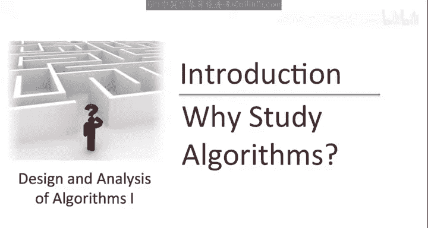
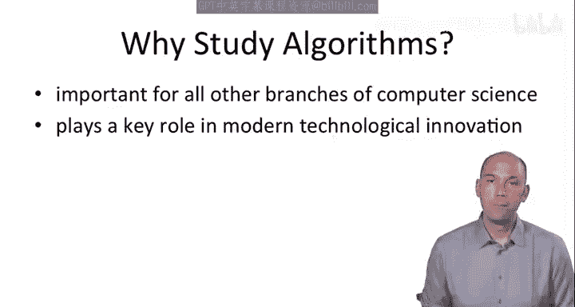

# 算法启蒙（第1册）：基础篇：1.1：为什么学习算法

在本节课中，我们将探讨学习算法设计与分析的重要性。我们将从算法的基本定义开始，逐步了解其在计算机科学及其他领域的核心作用。

---

## 什么是算法？

算法是一组明确定义的规则，本质上是一个用于解决特定计算问题的“配方”。

例如：
*   你可能有一组数字，需要将它们重新排列成有序序列。
*   你可能有一张地图、一个起点和一个终点，需要计算从起点到终点的最短路径。
*   你可能面临多个需要在不同截止日期前完成的任务，需要确定完成这些任务的顺序，以确保所有任务都能在各自的截止日期前完成。

---

## 为什么学习算法？

上一节我们介绍了算法的基本概念，本节中我们来看看学习算法的几个关键原因。

**首先**，理解算法和数据结构的基础知识，对于从事计算机科学几乎所有分支的严肃工作都至关重要。这也是为什么在斯坦福大学，本系提供的每一个学位——学士、硕士和博士——都要求学习这门课程。

以下是算法在不同领域应用的一些例子：
*   通信网络中的路由依赖于经典的**最短路径算法**。
*   公钥密码学的有效性依赖于**数论算法**。
*   计算机图形学需要**几何算法**提供的计算原语。
*   数据库索引依赖于**平衡搜索树**数据结构。
*   计算生物学使用**动态规划算法**来测量基因组相似性。
*   这样的例子还有很多。

**其次**，算法在现代技术创新中扮演着关键角色。举一个最明显的例子：搜索引擎使用一系列复杂的算法来高效计算各个网页与给定搜索查询的相关性。其中最著名的搜索算法是谷歌目前使用的**PageRank算法**。

事实上，在2010年12月提交给美国白宫的一份报告中，总统科技顾问委员会指出，在许多领域，**算法改进带来的性能提升，甚至远远超过了处理器速度提升所带来的显著性能增益**。

**第三**，尽管这超出了本课程的范围，但算法正越来越多地被用作观察计算机科学和技术之外过程的新视角。

例如：
*   对量子计算的研究为量子力学提供了一个新的计算视角。
*   经济市场中的价格波动可以被富有成效地视为一种**算法过程**。
*   甚至进化也可以被有效地看作一种**异常高效的搜索算法**。

**最后**，学习算法还有两个听起来可能有些轻率，但都包含不少真理的原因。我不知道你们怎么想，但当我还是学生时，我最喜欢的课程总是那些具有挑战性的课程，在我努力攻克之后，会觉得自己比开始时聪明了一些。我希望这门课程能为你们中的许多人提供类似的体验。

此外，我希望到课程结束时，我能说服你们中的一些人同意我的观点：**算法设计与分析本身就充满乐趣**。这是一项需要精准性与创造性罕见结合的事业。它有时确实会令人沮丧，但也非常令人着迷。

---

## 从抽象到具体

现在，让我们从这些崇高的概括中回到具体层面，并记住：**我们从小就开始学习和使用算法了**。

---

本节课中我们一起学习了算法的基本定义，并探讨了学习算法的多重重要性，包括其在计算机科学各领域的核心应用、对技术创新的推动作用，以及其作为一种思维工具的广泛价值。