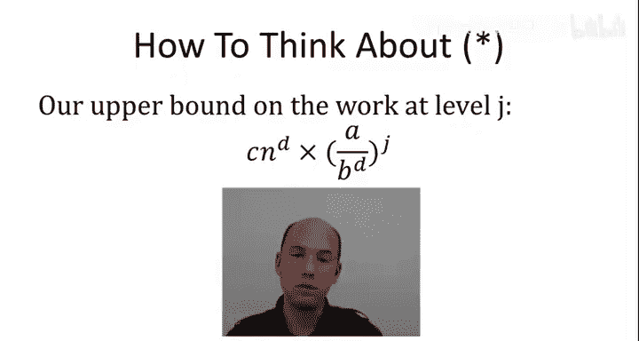
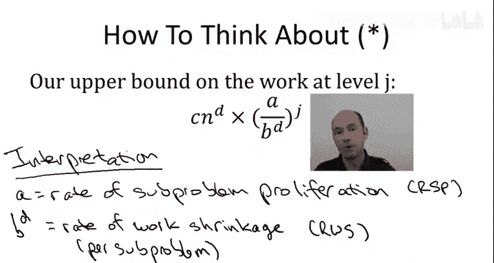
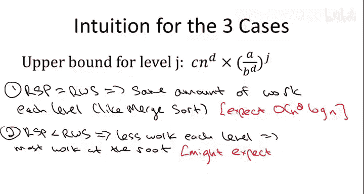

# 算法启蒙：第1册：基础篇｜第21讲：主定理三种情况的解读 🧮

在本节课中，我们将学习如何解读主定理的三种情况。我们将通过理解递归树中“子问题增殖”与“单子问题工作量缩减”之间的博弈，来直观地解释为什么算法运行时间会呈现三种不同的渐近行为。


---

在上一节视频中，我们通过递归树方法，对符合特定形式的递归式所描述的算法运行时间进行了上界分析。我们得到了一个复杂的表达式。本节中，我们不进行任何计算，而是专注于为这个表达式赋予语义，理解这种解读如何自然地引出主定理的三种情况，并为主定理中出现的运行时间提供直观解释。



回顾上一节的内容，我们对算法总工作量的界定方法是：聚焦于递归树的第 `J` 层。该层的工作量计算公式为：该层的子问题数量 `a^J` 乘以每个子问题的工作量 `c * (n / b^J)^d`。这给出了如下表达式：
```
c * n^d * (a / b^d)^J
```
上一节结尾的表达式 `(star)` 正是这个表达式在所有对数级别 `J` 上的总和。

尽管这个表达式看起来很复杂，但我们可能正走在正确的道路上。主定理有三种情况，具体属于哪种情况由 `a` 与 `b^d` 的比较关系决定。而在这个表达式中，我们恰好看到了这个比值：`a / b^d`。让我们深入理解，为什么这个比值对于分治递归算法的性能至关重要。

主定理的本质是两种对立力量之间的“拔河比赛”：一方是“善的力量”，另一方是“恶的力量”。它们分别对应量 `b^d` 和 `a`。

让我们从参数 `a` 开始。`a` 定义为算法进行的递归调用次数，即递归树中一个节点的子节点数量。因此，`a` 从根本上代表了随着递归深度增加，子问题增殖的速率。它是下一层子问题数量相对于上一层的增长因子。我们可以将 `a` 视为 **子问题增殖速率**。

“恶的力量”就体现在这里：算法可能运行缓慢的原因在于，随着我们深入递归树，子问题会越来越多，这有些令人担忧。

“善的力量”则在于，随着递归层数 `J` 的增加，每个子问题所需的工作量在减少。工作量减少的程度 precisely 由 `b^d` 决定。我们将其称为 **工作量缩减速率**。

你可能会问，为什么是 `b^d`，而不是 `b`？请记住 `b` 表示随着递归层数 `J` 增加，输入规模缩小的因子。但我们真正关心的不是子问题的输入规模本身，而是它如何决定解决该子问题所需的工作量。这就是参数 `d` 发挥作用的地方。

例如，考虑递归调用外的工作量是线性的（`d=1`）还是二次的（`d=2`）。如果 `b=2` 且 `d=1`（即对一半输入进行递归，并做线性工作），那么不仅输入规模以因子 2 下降，每个子问题的工作量也以因子 2 下降。这正是归并排序中的情况。如果 `d=2`（每个子问题做二次工作），输入规模减半意味着递归调用只做当前层 25% 的工作量（因为 `2^2 = 4`）。因此，输入规模以因子 `b` 下降，但我们真正关心的每个子问题工作量的下降因子是 `b^d`。这就是为什么 `b^d` 是主导“善的力量”的基本量。

那么，问题就在于这两种对立力量之间的“拔河比赛”结果如何。主定理的三种情况，本质上对应了“工作量缩减速率”与“子问题增殖速率”之间博弈的三种可能结果：平局、恶的力量获胜（`a > b^d`）以及善的力量获胜（`b^d > a`）。

为了更好地理解，请思考以下问题：根据 `a` 与 `b^d` 的比较关系，递归树中每层的工作量是随着层数增加而上升、下降，还是保持不变？

以下是关于这个问题的陈述，其中三个为真，一个为假：
1.  如果 `a < b^d`，则每层工作量随着递归树深度增加而减少。
2.  如果 `a > b^d`，则每层工作量随着递归树深度增加而增加。
3.  如果 `a = b^d`，则每层工作量随着递归树深度增加而增加。
4.  如果 `a = b^d`，则每层工作量相同。



让我们逐一分析。首先，考虑第一种情况：假设子问题增殖速率 `a` 严格小于工作量缩减速率 `b^d`。这是“善的力量”占优的情况。每个子问题工作量的节省速度超过了子问题的增殖速度。虽然子问题数量在增加，但每个子问题的节省增加得更多。因此，随着递归树层数加深，我们做的工作越来越少。

第二种情况为真，原因完全相同。如果子问题增殖如此迅速，以至于超过了每个子问题带来的节省，那么随着深入递归树，我们将看到工作量在增加。

既然前两种为真，第三种陈述就是错误的。我们可以根据子问题增殖速率是严格大于还是严格小于工作量缩减速率来得出结论。

最后，第四种陈述也是正确的。这是“善的力量”与“恶的力量”之间的完美平衡。子问题在增殖，但我们每个子问题的节省以完全相同的速率增加。两种力量相互抵消，使得递归树的每一层都完成完全相同的工作量。这正是我们分析归并排序算法时发生的情况。

---

让我们总结一下，并通过这种解读来理解它如何帮助我们预测主定理中看到的一些运行时间上界。

主定理的三种情况对应了子问题增殖与单子问题工作量缩减之间博弈的三种可能结果：一种是平局，一种是子问题增殖更快，一种是工作量缩减更快。

在速率完全相同的平局情况下，工作量在递归树的每一层都相同。在这种情况下，我们可以轻松预测运行时间：我们知道有对数数量的层，每层工作量相同，并且我们肯定知道根节点做了多少工作（根据原始递归式，根节点渐近地完成 `n^d` 的工作量）。因此，对于每个对数层都有 `n^d` 的工作量，我们期望运行时间为 `n^d * log n`。

正如我们刚才讨论的，当每个子问题的工作量缩减速度甚至快于子问题增殖速度时，随着递归树层数加深，我们做的工作越来越少。特别是，工作量最大的层（最坏情况）出现在根层。最简单可能的结果是，根层的工作量主导了整个算法的运行时间，其他层的工作量在常数因子内无关紧要。虽然这不明显为真，但如果我们期待最简单的结果（即根节点工作量最大），我们可能期望运行时间与根节点的运行时间成正比。正如刚才讨论的，我们知道根节点是 `n^d`。

基于同样的推理，当不等式翻转（`a > b^d`），子问题增殖如此迅速，以至于超过了每个子问题带来的节省时，工作量随着递归层数增加而增加。这里，最坏情况将出现在叶子节点，那一层的工作量将比其他任何层都多。同样，如果你期待最简单的结果，也许叶子节点的工作量就主导了算法在第三种情况下的运行时间（在常数因子内）。考虑到叶子节点对应基本情况，每个叶子节点做常数工作量，在最简单的场景下，我们期望运行时间与递归树中的叶子节点数量成正比。



---

让我们总结在本节视频中学到的内容。我们现在理解了，从根本上存在三种不同类型的递归树：
1.  每层工作量相同的树。
2.  工作量随层数增加而减少的树（根节点是最坏层）。
3.  工作量随层数增加而增加的树（叶子节点是最坏层）。

此外，正是 `a`（子问题增殖速率）与 `b^d`（单子问题工作量缩减速率）之间的比值，决定了我们处理的是这三种递归树中的哪一种。

更进一步，直观上，我们现在对三种情况下期望看到的运行时间有了预测：
*   对于情况一（平局），我们相当确信是 `n^d log n`。
*   对于情况二（根节点最坏），我们期望（或希望）运行时间是 `n^d`。
*   对于情况三（叶子节点最坏，每个叶子/基本情况做常数时间），我们期望它与叶子节点数量成正比。

现在，让我们根据主定理的正式陈述来检验这种直觉，我们将在下一个视频中更正式地证明它。

在三种情况的正式陈述中，我们看到它们至少与我们的直觉在两点或三点上匹配：
*   在第一种情况下，我们看到了预期的 `n^d * log n`。
*   在第二种情况下（根节点最坏），最简单的可能结果 `O(n^d)` 正是其断言。
*   在第三种情况下，仍然有一个谜团有待解释。我们的直觉说，这应该与叶子节点数量成正比，但我们却得到了一个有趣的公式：`O(n^{log_b a})`。在下一个视频中，我们将揭开这个联系的神秘面纱，并为这些断言提供正式的证明。

---


本节课中，我们一起学习了如何通过“子问题增殖”与“工作量缩减”的博弈来直观解读主定理的三种情况。我们理解了比值 `a / b^d` 如何决定递归树中工作量随深度变化的趋势（增加、减少或不变），并据此对算法总运行时间做出了直观预测。这为我们接下来正式证明主定理奠定了坚实的理解基础。