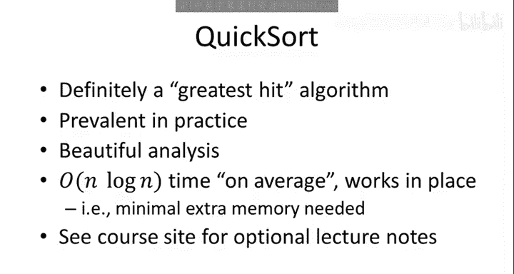
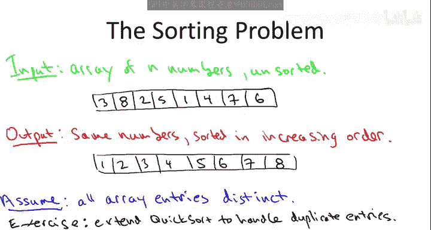
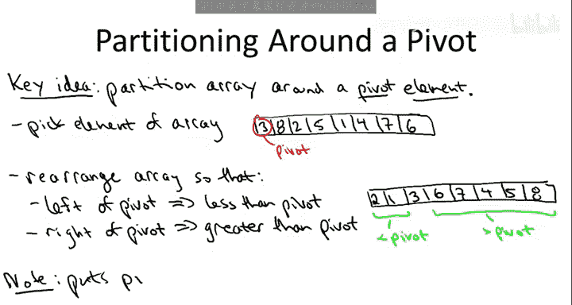
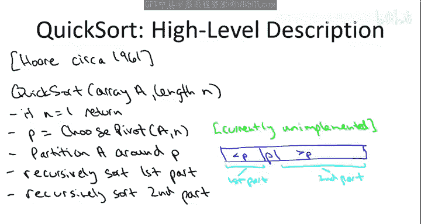
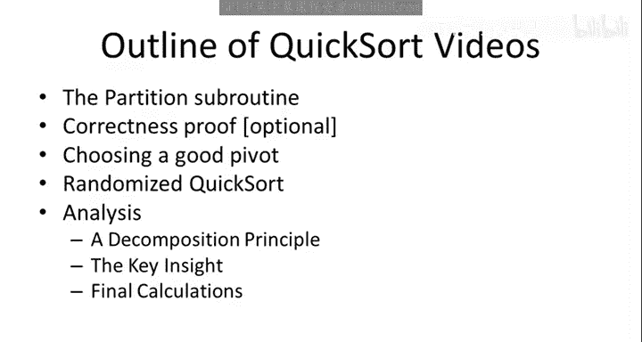

# 算法启蒙（第1册）：基础篇｜Algorithms Illuminated, Part 1： The Basics：P23：快速排序概述

在本节课中，我们将要学习著名的快速排序算法。快速排序因其高效、优雅和实用性，深受计算机科学家和程序员的喜爱。我们将了解其核心思想、工作原理以及为何它在实际应用中常常优于归并排序。

## 排序问题回顾



上一节我们介绍了归并排序，本节我们来看看快速排序。首先，我们回顾一下排序问题。

排序问题的输入是一个包含 `n` 个数字的数组，这些数字以任意顺序排列。例如，输入数组可能如下所示：
```
[3, 8, 2, 5, 1, 4, 7, 6]
```
我们的目标是输出这些相同数字的一个版本，但要求按递增顺序排列。为了简化讨论，我们假设输入数组中没有重复元素。



## 核心子程序：分区

快速排序的核心思想在于一个名为 **分区** 的子程序。这个子程序围绕一个 **枢轴元素** 来重新排列数组。

以下是分区的具体步骤：
1.  **选择枢轴**：从数组中选择一个元素作为枢轴。目前，我们可以简单地选择数组的第一个元素。
2.  **重新排列**：重新排列数组，使得所有小于枢轴的元素都位于其左侧，所有大于枢轴的元素都位于其右侧。

例如，对于数组 `[3, 8, 2, 5, 1, 4, 7, 6]`，选择 `3` 作为枢轴。一种合法的分区结果是：
```
[2, 1, 3, 8, 5, 4, 7, 6]
```
*   左侧 `[2, 1]` 的所有元素都小于枢轴 `3`。
*   右侧 `[8, 5, 4, 7, 6]` 的所有元素都大于枢轴 `3`。



请注意，分区并不要求左侧或右侧桶内的元素自身有序，它只完成了部分的排序工作。然而，枢轴元素本身已经被放置在了其在最终有序数组中正确的位置上。

## 分区为何重要


分区之所以是关键，基于以下两个重要特性：
1.  **线性时间复杂度**：分区可以在 **O(n)** 时间内完成，其中 `n` 是数组大小。更重要的是，它的实现只需要进行元素交换，几乎不需要额外的内存空间。
2.  **缩小问题规模**：分区后，原始排序问题被分解为两个更小的子问题——排序左侧元素和排序右侧元素。这自然引出了分治法的解决方案。

## 快速排序算法的高层描述

快速排序算法由托尼·霍尔大约在1961年发现，它是一个典型的分治算法。

以下是其高层描述（伪代码）：
```
function quicksort(array, left, right):
    if left >= right:
        return  // 基本情况：数组为空或只有一个元素
    pivot_index = choose_pivot(array, left, right) // 选择枢轴
    pivot_index = partition(array, left, right, pivot_index) // 分区，返回枢轴最终位置
    quicksort(array, left, pivot_index - 1) // 递归排序左侧
    quicksort(array, pivot_index + 1, right) // 递归排序右侧
```
与归并排序不同，快速排序在递归调用**之后**没有“合并”步骤。一旦完成分区并递归排序了两侧，整个数组就已经是有序的了。



## 后续内容预告

在接下来的课程中，我们将深入探讨快速排序的各个细节：
*   **分区实现**：展示如何在 **O(n)** 时间内、仅通过交换完成分区操作。
*   **正确性证明**：形式化地证明快速排序算法的正确性。
*   **枢轴选择策略**：探讨不同的枢轴选择方法如何影响算法性能。
*   **随机化快速排序**：介绍通过随机选择枢轴来获得良好平均性能的版本。
*   **运行时间分析**：分三部分进行数学分析，证明随机化快速排序的平均运行时间为 **O(n log n)**，且隐藏的常数因子很小。我们将学习使用指示器随机变量和期望的线性性质来分析复杂随机变量的通用方法。

## 总结



本节课中我们一起学习了快速排序算法的概述。我们了解到，快速排序通过一个高效的分区子程序，将数组围绕枢轴元素分成两部分，然后递归地对这两部分进行排序。其代码优雅、运行高效且是原地排序算法，这些特点使其成为最受欢迎的排序算法之一。在接下来的课程中，我们将深入其实现细节并完成严谨的数学分析。