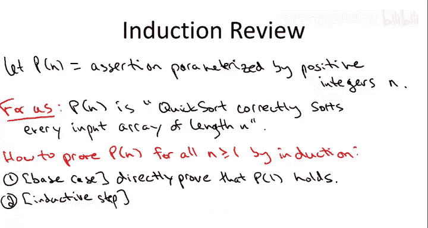

# 算法启蒙：第1册：基础篇｜第25章：快速排序正确性回顾 🧠

在本节中，我们将学习如何使用数学归纳法来严格证明快速排序算法的正确性。我们将回顾归纳法的基本结构，并将其应用于快速排序，确保无论选择何种枢轴元素，算法都能正确排序任意长度的数组。

---

## 归纳法证明格式回顾

上一节我们介绍了快速排序的基本思想，本节中我们来看看如何用归纳法证明其正确性。首先，我们需要回顾归纳法证明的标准格式。

归纳法用于证明一个关于正整数 `n` 的断言 `P(n)` 对所有正整数都成立。证明分为两个部分：**基础情况**和**归纳步骤**。

以下是归纳法证明的两个核心步骤：

1.  **基础情况**：证明断言 `P(1)` 成立。
2.  **归纳步骤**：假设对于所有小于 `n` 的正整数 `k`，断言 `P(k)` 都成立（这称为**归纳假设**），然后证明在此假设下，断言 `P(n)` 也成立。

如果成功完成这两个步骤，就证明了 `P(n)` 对所有正整数 `n` 都成立。

---

## 快速排序的正确性断言

现在，让我们将归纳法应用于快速排序。我们关心的断言 `P(n)` 定义如下：

**P(n)**：快速排序算法总能正确排序长度为 `n` 的任意数组。

我们的目标是证明 `P(n)` 对所有 `n ≥ 1` 都成立。

---

## 基础情况：n = 1

基础情况非常简单。当数组只有一个元素时，它本身就是有序的。快速排序在 `n=1` 时直接返回输入数组，不做任何处理。因此，它返回的确实是一个有序数组。

通过这个简单的论证，我们直接证明了 `P(1)` 成立。

---

## 归纳步骤：n ≥ 2

现在进入归纳步骤。我们固定一个 `n ≥ 2` 的值，并假设归纳假设成立：即对于所有 `k < n`，`P(k)` 都成立。换句话说，我们假设快速排序能正确排序任何长度小于 `n` 的数组。

我们需要证明，在此假设下，`P(n)` 也成立。为此，我们考虑一个任意的长度为 `n` 的输入数组 `A`。

以下是快速排序在数组 `A` 上的操作步骤：

1.  **选择枢轴**：算法任意选择一个元素作为枢轴 `p`。枢轴的选择方式不影响正确性，只影响运行时间。
2.  **分区**：算法围绕枢轴 `p` 对数组进行分区。分区完成后，数组被重新排列，使得：
    *   枢轴 `p` 位于某个最终位置。
    *   所有小于 `p` 的元素都在 `p` 的左侧（我们称这部分为 `L`）。
    *   所有大于 `p` 的元素都在 `p` 的右侧（我们称这部分为 `R`）。

关键观察是，分区后，枢轴 `p` 已经位于它在最终排序数组中的正确位置。

设 `L` 的长度为 `k1`，`R` 的长度为 `k2`。由于枢轴 `p` 本身不属于 `L` 或 `R`，因此 `k1` 和 `k2` 都严格小于 `n`（即 `k1, k2 ≤ n-1`）。

根据我们的归纳假设 `P(k1)` 和 `P(k2)`，我们知道快速排序能正确排序子数组 `L` 和 `R`。因此：

*   对 `L` 的递归调用会将其元素正确排序。
*   对 `R` 的递归调用会将其元素正确排序。

最后，将排序好的 `L`、枢轴 `p` 和排序好的 `R` 按顺序拼接起来，就得到了原始数组 `A` 的一个完整排序版本。

由于数组 `A` 是任意选择的，这便证明了断言 `P(n)` 成立。又因为 `n` 是任意大于等于2的整数，我们完成了归纳步骤。

---

## 总结

本节课中我们一起学习了如何用数学归纳法严格证明快速排序算法的正确性。我们首先回顾了归纳法的证明格式，然后定义了关于快速排序的正确性断言 `P(n)`。通过证明基础情况 `P(1)` 和归纳步骤（在假设 `P(k)` 对所有 `k < n` 成立的前提下证明 `P(n)`），我们得出结论：无论采用何种方式选择枢轴元素，快速排序总能正确排序任意长度的输入数组。这个证明框架同样适用于分析其他分治算法的正确性。