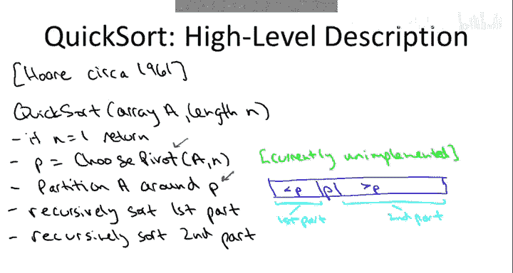
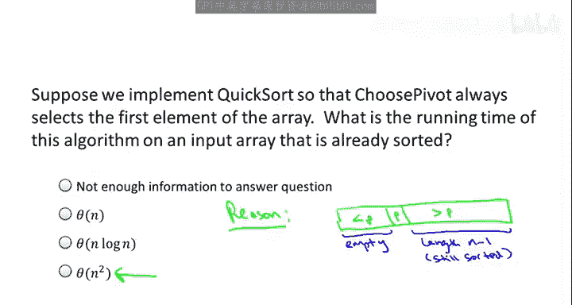
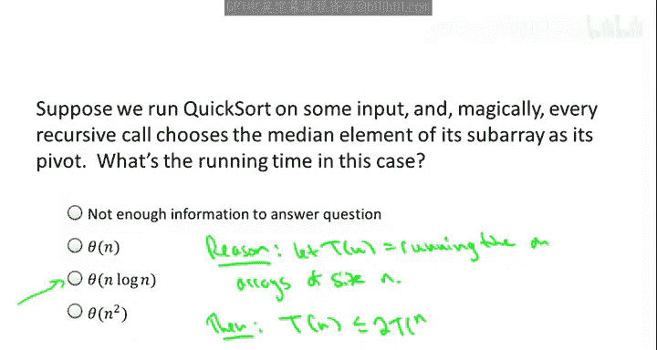
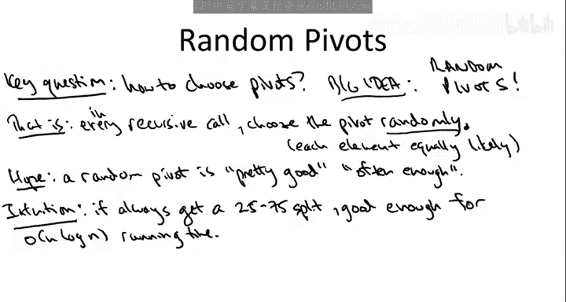
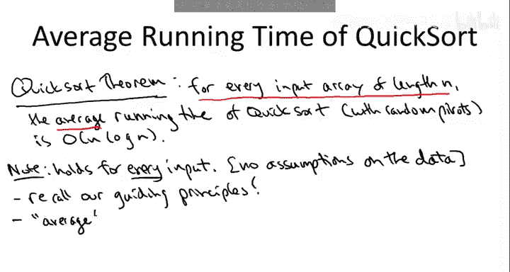

# 算法启蒙：第26讲：选择好的枢轴元素 🎯

在本节课中，我们将深入探讨快速排序算法的核心环节——如何选择枢轴元素。枢轴元素的选择直接决定了算法的效率，我们将看到，一个糟糕的选择可能导致算法性能急剧下降，而一个聪明的随机化策略则能保证算法在绝大多数情况下都表现出色。

## 快速排序算法回顾 🔄

上一节我们介绍了快速排序算法的基本框架。快速排序的核心思想是“分而治之”，其高层描述如下：

1.  **选择枢轴**：从输入数组中选取一个元素作为枢轴。
2.  **分区**：围绕枢轴重新排列数组，使得小于枢轴的元素都在其左侧，大于枢轴的元素都在其右侧。枢轴元素本身则被放置在其最终的正确位置上。
3.  **递归排序**：对枢轴左侧和右侧的两个子数组递归地调用快速排序。

一旦分区完成，我们只需递归地解决两个子问题，无需像归并排序那样需要一个额外的“合并”步骤。我们之前已经看到，分区子程序可以在线性时间内完成，并且是原地操作，几乎不需要额外的存储空间。

## 枢轴质量的重要性 ⚖️

现在，大家可能会问：快速排序是一个好算法吗？它运行得快吗？这个标准很高，因为我们已经有归并排序这样一个非常优秀且实用的 O(n log n) 算法。

目前，我们尚无法讨论快速排序的运行时间，因为我们缺少关键信息：**快速排序的运行时间严重依赖于枢轴元素的选择方式，即所选枢轴的质量**。

那么，什么是枢轴的质量呢？简单来说：
*   一个**高质量**的枢轴能将数组**大致均匀地**分割成两个子问题。
*   一个**低质量**的枢轴会导致**极不平衡**的子问题。

为了理解枢轴质量的含义及其影响，让我们通过几个小测验来探索。

## 最坏情况分析：糟糕的枢轴选择 😱

第一个测验旨在探索快速排序算法的一种最坏情况执行。当为特定的输入数组选择非常不合适的枢轴时会发生什么？

具体来说，假设我们使用最朴素的`choosePivot`实现，就像在分区视频中讨论的那样：我们总是选取数组的**第一个元素**作为枢轴。同时，假设快速排序的输入数组是一个**已经排好序**的数组（例如，数字1到8按顺序排列）。

**问题**：如果我们总是使用子数组的第一个元素作为枢轴，那么快速排序在这个已排序数组上的运行时间是多少？

**答案**是：**O(n²)**。

对于排序算法来说，平方阶的运行时间是不理想的。如果我们满足于平方阶，就不需要这些相对复杂的排序算法，直接使用插入排序即可。

**原因分析**：
让我们思考一下在这个已排序数组 `[1, 2, 3, ..., n]` 上会发生什么。
1.  **第一层递归**：枢轴是第一个元素 `1`。分区后，小于 `1` 的部分为空，大于 `1` 的部分是 `[2, 3, ..., n]`，长度为 `n-1`，并且仍然有序。
2.  **第二层递归**：在子数组 `[2, 3, ..., n]` 上，枢轴是 `2`。分区后，我们得到空数组和 `[3, 4, ..., n]`。
3.  **后续递归**：这个过程会持续下去，每次递归都只减少一个元素的大小（`n-2`, `n-3`, ...），直到最后处理单个元素。

**运行时间计算**：
在每一层递归中，我们都需要调用分区子程序，它需要查看传递给它的数组中的每个元素。因此，总工作量至少是：
`n + (n-1) + (n-2) + ... + 1`

这个和是 **Θ(n²)**。一个简单的理解方式是：这个和的前 `n/2` 项每一项都至少是 `n/2`，所以总和至少是 `(n/2) * (n/2) = n²/4`。显然，总和也至多是 `n²`。

因此，在这种糟糕的输入和枢轴选择下，快速排序的运行时间是**平方阶**的。

## 最好情况分析：理想的枢轴选择 ✨

理解了最坏情况后，让我们来讨论其最佳情况运行时间。我们通常不单纯为了最佳情况而分析算法，但这样做有助于：
1.  更好地理解算法的工作原理。
2.  为后续的平均情况分析设定一个目标（平均情况不可能优于最佳情况）。

那么，什么是最好的情况？我们能期望的最高质量枢轴是什么？理想情况下，我们希望选择一个能将数组**完美地**分成两半的枢轴，即**中位数**——恰好有一半元素小于它，一半元素大于它。这将给我们一个完美的 50-50 分割。

**问题**：假设在每一次递归调用中，我们都神奇地选到了当前子数组的**中位数**作为枢轴，从而在每次递归前都得到一个完美的 50-50 分割。在这种神奇的、最佳可能的情况下，算法的运行时间是多少？

**答案**是：**O(n log n)**。

**原因分析**：
在这种情况下，支配快速排序运行时间的递归式与支配归并排序运行时间的递归式**完全匹配**，而我们已知后者的解是 O(n log n)。

具体来说，对于长度为 `n` 的数组，运行时间 `T(n)` 满足：
`T(n) = 2 * T(n/2) + O(n)`

*   `2 * T(n/2)`：因为枢轴是中位数，所以会产生两个递归调用，每个处理的子问题规模最多为 `n/2`。
*   `O(n)`：这是递归调用之外的工作量，包括选择枢轴（假设为线性时间）和执行分区（已知为线性时间）。

根据主定理或与归并排序相同的论证，这个递归式给出了 **O(n log n)** 的运行时间上界。实际上，由于分区子程序确实需要 Θ(n) 的时间，我们可以将结果加强为 **Θ(n log n)**。

这个测验的要点是：即使在最佳情况下，即使我们在整个快速排序过程中神奇地获得了完美的枢轴，我们能期望的最好结果也是 O(n log n) 上界，不会比这更好了。

## 关键问题：如何选择枢轴？ 🤔

前面的测验指出了一个关于快速排序实现的核心问题：**我们究竟该如何选择枢轴？** 我们现在知道，枢轴的选择对算法运行时间有巨大影响，可能差至 O(n²)，也可能好至 O(n log n)。我们当然希望处于 O(n log n) 这一边。

快速排序将成为我们看到的第一个“随机化算法”的杀手级应用。随机化算法的思想是允许算法在代码中“抛硬币”，从而在平均情况下获得良好的性能。

**核心思想是：随机选择枢轴。**

具体来说，每次递归调用快速排序时，面对一个长度为 `k` 的子数组，我们在 `k` 个候选枢轴元素中**随机均匀地**选择一个（每个元素被选中的概率为 `1/k`）。每次递归调用都会做出一个新的随机选择。

这是我们第一个随机化算法的例子。在随机化算法中，即使你输入完全相同的数据，不同的执行过程也可能不同，因为算法代码内部存在随机性。

## 随机化为何有效？直觉与希望 🌈

在深入严谨的数学分析之前，让我们先建立一些直觉，理解为什么随机选择枢轴可能是一个好主意。

**第一步：近乎平衡的分割就足够好**
在最后一个测验中，我们看到如果每次都能选中位数，就能得到 O(n log n) 的运行时间。但事实上，要获得 O(n log n) 的运行时间，并不需要每次都神奇地选中位数。只要我们能获得**大致平衡**的分割，结果就会很好。

具体来说，假设我们总是能选择一个保证 **25-75 分割或更好**的枢轴（即两个递归调用处理的子数组大小都不超过原数组的 75%）。那么，快速排序在这种情况下的运行时间仍然是 **O(n log n)**。这意味着，一个能产生“足够好”平衡的枢轴就足以保证我们期望的效率。

**第二步：获得“足够好”的枢轴并不难**
现在，关键是要意识到，我们并不需要非常幸运才能获得一个 25-75 分割。这是一个相当适中的目标，而这个适中的目标就足以带来 O(n log n) 的运行时间。

考虑一个包含数字 1 到 100 的数组。
*   哪些元素能给我们 25-75 或更好的分割？
*   任何在 **26 到 75 之间**（包含两端）的元素都可以！因为如果选择 ≥26 的元素，左侧子问题至少包含元素 1-25（≥25%）；如果选择 ≤75 的元素，右侧子问题至少包含元素 76-100（≥25%）。
*   在 100 个元素中，有 50 个元素（26到75）满足条件，即 **50% 的概率**我们能选到一个“足够好”的枢轴。

所以，高层次的希望是：**足够频繁地**（比如一半的时间），我们能得到这些“足够好”的 25-75 或更好的分割，这似乎暗示着平均 O(n log n) 的运行时间是一个合理的期望。

## 定理陈述：随机化快速排序的保证 📜

上述直觉虽然令人鼓舞，但我们需要严谨的数学分析来确认它是否真的有效。这正是算法研究中反复出现的主题：当你有一个新想法时，最终需要借助数学分析来从根本上解释其好坏。

在接下来的视频中，我们将证明关于快速排序的以下定理：

> **定理**：对于**每一个**长度为 `n` 的输入数组（不对数据做任何假设），采用随机选择枢轴实现的快速排序的**平均运行时间**为 **O(n log n)**（实际上是 Θ(n log n)）。

这是一个关于随机化快速排序非常酷的定理。需要明确的是，这是一个关于输入的**最坏情况保证**。定理开头说“对于每一个输入数组”，意味着我们**绝对没有对数据做任何假设**。这是一个完全通用的排序子程序，你可以在任何情况下使用它，即使你不知道数据来自何处，这些保证仍然成立。

定理中出现的“平均”一词，**不是**对输入数据随机性的假设。输入数组可以是任何东西。这里的“平均”完全来源于我们算法代码**内部**的随机性，即我们自己引入并负责的随机性。

随机化算法有一个有趣的特性：即使在相同的输入上反复运行，也会得到不同的执行过程，因此运行时间会变化。我们的测验表明，快速排序在给定输入上的运行时间可以在 O(n log n) 的最佳情况和 O(n²) 的最坏情况之间波动。这个定理告诉我们，对于**每一个**可能的输入数组，虽然运行时间确实在这两个边界之间波动，但**最佳情况在平均意义上占主导地位**。平均而言，它几乎和最佳情况一样好，这就是快速排序如此神奇的原因。O(n²) 的情况偶尔可能出现，但这无关紧要，你几乎永远不会看到它；在随机化快速排序中，你总是会看到类似 O(n log n) 的行为。

## 总结 📝

本节课我们一起学习了快速排序中枢轴选择的关键性。我们了解到：
1.  **枢轴质量决定性能**：糟糕的选择（如已排序数组中选择第一个元素）会导致 O(n²) 的最坏情况；而理想的选择（中位数）则能带来 O(n log n) 的最佳情况。
2.  **随机化是解决方案**：通过在每个递归步骤中**随机均匀地**选择枢轴，我们可以将算法的命运交给概率。
3.  **直觉与保证**：虽然不一定每次都能选中位数，但有很大概率（例如50%）选到能产生近似平衡分割的“足够好”的枢轴，这足以保证良好的平均性能。
4.  **严谨的结论**：数学分析证明，对于**任何**输入，随机化快速排序的**平均运行时间**为 **O(n log n)**，这是一个强大的最坏情况输入、平均性能保证。

这标志着随机化算法作为一个强大工具登上了舞台。在接下来的课程中，我们将深入进行概率论回顾（可选）并完成该定理的严谨分析。