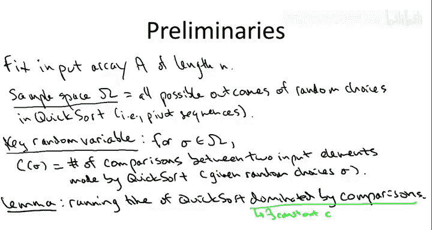
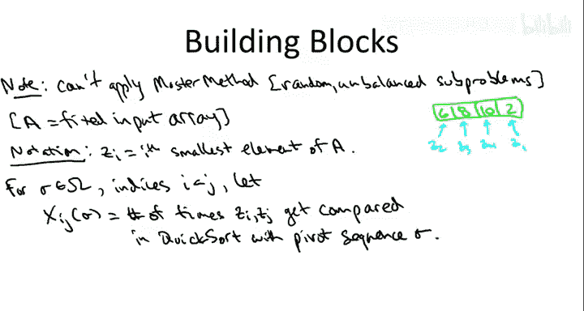
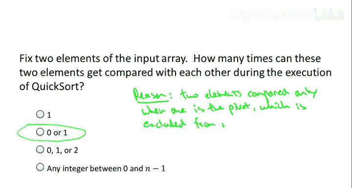
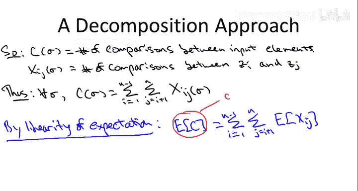
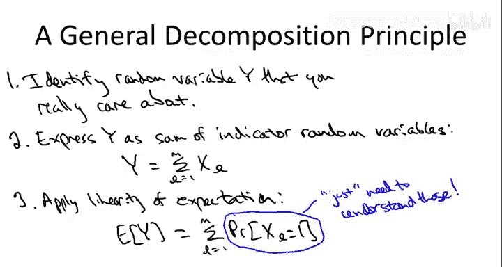

# 快速排序算法分析：第1部分：分解原理 🧩

在本节课中，我们将开始对随机化快速排序算法的运行时间进行数学分析。具体来说，我们将证明快速排序的平均运行时间是 **O(n log n)**。这是我们课程中遇到的第一个随机化算法，因此其分析也将是我们首次需要运用概率论知识。

## 预备知识 📚

在开始分析之前，你需要了解离散概率论的一些基本概念：
*   **样本空间**：如何建模所有可能发生的事件，即随机选择的所有可能结果。
*   **随机变量**：定义在样本空间上、取实数值的函数。
*   **期望值**：随机变量的平均值。
*   **期望的线性性质**：这是分析快速排序所需的一个关键且非常简单的性质。

如果你对这些概念不熟悉或感到生疏，建议在继续观看前进行复习。你可以参考课程网站上的概率论复习视频，或者阅读 Eric Lehman 和 Tom Leighton 的免费在线讲义《计算机科学数学》，其中涵盖了所有必要知识。

## 定理陈述与目标 🎯

我们之前提到，对于随机化实现的快速排序算法（即在每个递归子调用中均匀随机地选择一个主元），有以下断言：对于任意长度为 `n` 的输入数组（即使是“最坏情况”的输入），算法内部随机性（而非输入数据）所导致的**平均**运行时间为 **O(n log n)**。

我们知道快速排序的最佳情况运行时间是 `O(n log n)`，最坏情况是 `O(n²)`。这个定理断言，无论输入数组是什么，快速排序的典型行为都更接近最佳情况，而非最坏情况。接下来的视频将证明这一点。

## 建立分析框架 🔧

首先，我们需要建立必要的符号，并明确样本空间和我们关心的随机变量。

1.  **固定输入**：我们固定一个任意的、长度为 `n` 的输入数组 `A`。在整个分析过程中，我们都将针对这个固定的数组进行。
2.  **样本空间 Ω**：样本空间包含了算法中所有可能的随机性结果。在这里，随机性来自于我们选择的随机主元序列。因此，Ω 就是快速排序可能选择的所有主元序列的集合。
3.  **核心随机变量 C**：对于给定的主元序列 σ（即样本空间中的一个点），我们定义随机变量 `C(σ)` 为快速排序执行的**比较次数**。这里的“比较”特指对输入数组中两个不同元素进行的比较（例如，比较第三个元素和第七个元素哪个更小）。给定主元序列后，快速排序就变成了一个确定性算法，因此比较次数 `C(σ)` 是一个确定的数字。
4.  **运行时间与比较次数的关系**：我们真正关心的是运行时间，而不仅仅是比较次数。但可以论证，快速排序所做的主要工作就是元素比较。更正式地说，存在一个常数 `c`，使得对于任何主元序列 σ，快速排序执行的总操作数 `RT(σ)` 满足：
    `RT(σ) ≤ c * C(σ)`
    这意味着运行时间主要由比较次数决定。因此，要证明平均运行时间是 `O(n log n)`，我们只需证明平均比较次数是 `O(n log n)`。

**我们的目标**：证明对于任意固定的长度为 `n` 的输入数组 `A`，随机变量 `C`（比较次数）的期望值满足：
`E[C] = O(n log n)`

## 分解原理介绍 🧠

我们确定了关心的随机变量 `C`，但它本身非常复杂，其值在 `O(n log n)` 和 `O(n²)` 之间波动，难以直接处理。

我们曾用递归式和分析递归树的方法来分析分治算法。但对于随机化的快速排序，传统的“主定理”并不直接适用，因为子问题的大小是随机的（取决于随机选择的主元质量），而主定理通常要求子问题大小相同。

因此，我们将采用一种称为**分解原理**的方法。其核心思想是：将一个我们关心的、复杂的随机变量，分解为许多简单的、我们并不直接关心但易于分析的随机变量之和，然后利用**期望的线性性质**将它们重新组合起来。这种方法将成为我们分析快速排序（以及后续课程中如哈希等其他主题）的主要工具。

## 定义基础构件：指示器随机变量 🧱

为了应用分解原理，我们需要定义一组简单的随机变量作为基础构件。这些变量将记录特定元素对之间的比较情况。

首先引入一些符号：
*   我们用 `z_i` 表示输入数组 `A` 中第 `i` 小的元素（也称为第 `i` 阶顺序统计量）。注意，`z_i` 不是原始未排序数组中第 `i` 个位置的元素，而是排序后最终会出现在第 `i` 个位置上的元素。

现在，我们为每一对元素定义一个指示器随机变量：
*   对于给定的主元序列 σ，以及满足 `1 ≤ i < j ≤ n` 的索引 `i` 和 `j`，定义随机变量 `X_{ij}(σ)` 为：在快速排序执行过程中，元素 `z_i` 和 `z_j` 被比较的次数。

**关键观察**：对于任意一对元素 `(z_i, z_j)`，它们在整个快速排序过程中最多被比较一次，也可能一次都没有。因此，`X_{ij}` 是一个**指示器随机变量**，它只能取值为 0 或 1。`X_{ij} = 1` 表示 `z_i` 和 `z_j` 被比较了一次。

**为什么最多比较一次？** 回顾快速排序的 `partition` 子程序，所有的元素比较都发生在这里，并且每次比较都涉及当前递归调用中选定的**主元**。假设 `z_i` 和 `z_j` 第一次被比较，那么此时其中一个是主元。在这次比较之后，该主元会被排除在后续的所有递归调用之外，因此 `z_i` 和 `z_j` 再也没有机会在同一个递归调用中相遇并被比较。

## 应用分解原理与期望线性性质 ⛓️

现在，我们可以将复杂的随机变量 `C`（总比较次数）用这些简单的随机变量 `X_{ij}` 表示出来。因为每一次比较都恰好涉及一对元素 `(z_i, z_j)`（其中 `i < j`），所以有：

`C = Σ_{i=1}^{n-1} Σ_{j=i+1}^{n} X_{ij}`

这个双重求和遍历了所有可能的元素对 `(i, j)`，并将它们对应的比较指示器变量加起来，就得到了总比较次数。

接下来，我们应用期望的线性性质。该性质指出，**和的期望等于期望的和**，并且无论这些随机变量是否相互独立，该性质都成立。这一点非常重要，因为 `X_{ij}` 之间并不是独立的。

`E[C] = E[ Σ_{i=1}^{n-1} Σ_{j=i+1}^{n} X_{ij} ] = Σ_{i=1}^{n-1} Σ_{j=i+1}^{n} E[X_{ij}]`

由于每个 `X_{ij}` 都是取值为 0 或 1 的指示器随机变量，它的期望值恰好等于 `X_{ij} = 1` 的概率：

`E[X_{ij}] = 0 * Pr(X_{ij}=0) + 1 * Pr(X_{ij}=1) = Pr(X_{ij}=1)`

而 `Pr(X_{ij}=1)` 正是元素 `z_i` 和 `z_j` 在快速排序过程中被比较的概率。

将上述结果结合起来，我们得到了一个关键的表达式（记为 **(*)**）：

`E[C] = Σ_{i=1}^{n-1} Σ_{j=i+1}^{n} Pr( z_i 与 z_j 被比较 )`

## 本节总结与后续计划 📝

在本节中，我们一起学习了如何为快速排序的平均情况分析建立框架。我们通过分解原理，将分析复杂的总比较次数期望 `E[C]` 的问题，转化为了分析许多简单的、关于特定元素对是否被比较的概率 `Pr(z_i 与 z_j 被比较)` 的问题。

**分解原理的一般步骤**：
1.  **确定目标**：明确你关心的复杂随机变量 `Y`（例如，快速排序的比较次数）。
2.  **分解为和**：将 `Y` 表示为一系列更简单的随机变量（通常是指示器变量）之和：`Y = Σ X_l`。
3.  **应用线性期望**：利用期望的线性性质，得到 `E[Y] = Σ E[X_l]`。
4.  **计算概率**：对于指示器变量，`E[X_l] = Pr(X_l = 1)`。因此，问题最终归结为计算一系列特定事件的概率。

现在，我们成功地将问题简化了。在下一节中，我们将深入探讨这个概率：对于给定的 `i` 和 `j`，`z_i` 和 `z_j` 被比较的概率究竟是多少？我们将得到一个关于 `i` 和 `j` 的精确表达式。然后，在第三部分，我们将把这个表达式代入上面的求和式 `(*)` 中，并计算出总和，最终证明它等于 `O(n log n)`。让我们继续前进，找出这个概率的精确表达式。