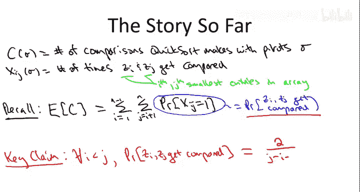
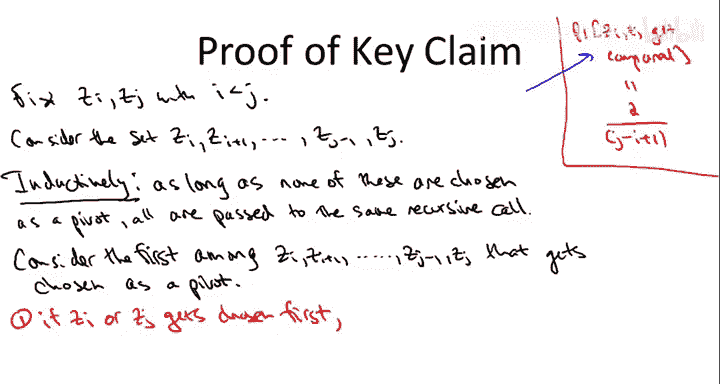
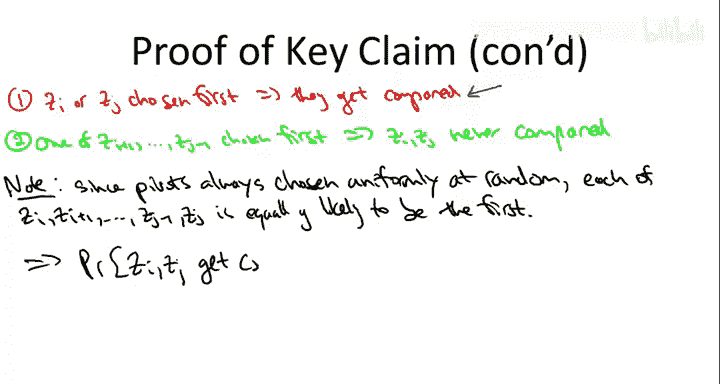

# 快速排序算法分析：第2章：关键洞察与概率推导 🧠

在本节课中，我们将继续证明随机化快速排序的平均运行时间为 **O(n log n)**。我们将深入探讨一个核心概念：如何精确计算输入数组中任意两个元素在排序过程中被比较的概率。

---

## 概述

上一节我们介绍了分析框架，定义了随机变量 **C**（总比较次数）和指示变量 **X_ij**（元素 **Z_i** 和 **Z_j** 是否被比较）。通过期望的线性性质，我们将问题转化为计算每个 **X_ij** 等于 1 的概率。本节的核心目标是推导出这个概率的精确表达式。

---



## 关键洞察：比较何时发生？

考虑输入数组中第 **i** 小和第 **j** 小的元素，记为 **Z_i** 和 **Z_j**（其中 **i < j**）。我们关注的是从 **Z_i** 到 **Z_j**（包含两端）的这组元素，即集合 **{Z_i, Z_i+1, ..., Z_j}**，共 **j - i + 1** 个元素。

在快速排序的执行过程中，只要选择的枢轴（pivot）不来自这个集合，那么整个集合就会被传递到同一个递归调用中。这些元素“和谐共处”，直到其中一个首次被选为枢轴。

当集合中某个元素首次被选为枢轴时，有两种情况：

1.  **枢轴是 Z_i 或 Z_j**：在这种情况下，**Z_i** 和 **Z_j** **必定**会被比较，因为枢轴在分区（partition）过程中会与子数组中的所有其他元素进行比较。
2.  **枢轴是 Z_i+1 到 Z_j-1 中的某个元素**：在这种情况下，**Z_i** 和 **Z_j** **永远不会**被比较。因为：
    *   在本次分区中，只有枢轴会与其他元素比较，而 **Z_i** 和 **Z_j** 都不是枢轴。
    *   由于枢轴的值介于 **Z_i** 和 **Z_j** 之间，分区操作会将 **Z_i** 划入左子数组，将 **Z_j** 划入右子数组。此后，它们将在不同的递归调用中处理，再无相遇机会。

因此，**Z_i** 和 **Z_j** 被比较的**充要条件**是：在集合 **{Z_i, Z_i+1, ..., Z_j}** 中，**Z_i** 或 **Z_j** 是**第一个**被选为枢轴的元素。

---

## 推导精确概率

我们的快速排序实现总是从当前子数组中**均匀随机**地选择枢轴。因此，在集合 **{Z_i, Z_i+1, ..., Z_j}** 的 **j - i + 1** 个元素中，每个元素首次成为枢轴的概率是相等的。

*   **导致比较的枢轴选择**：有 **2** 种（即选择 **Z_i** 或 **Z_j**）。
*   **总的可能首次枢轴选择**：有 **j - i + 1** 种。

所以，**Z_i** 和 **Z_j** 被比较的概率为：

**概率公式：**
```
P(Z_i 与 Z_j 被比较) = 2 / (j - i + 1)
```



例如，对于第 3 小和第 7 小的元素（i=3, j=7），它们被比较的概率是 `2 / (7 - 3 + 1) = 2/5 = 40%`。

---

## 整合到期望计算中

现在，我们可以将这个精确的概率表达式代入上一节得到的期望公式中。快速排序在给定输入数组上的平均比较次数 **E[C]** 为：

**期望公式：**
```
E[C] = Σ_{i=1}^{n-1} Σ_{j=i+1}^{n} P(Z_i 与 Z_j 被比较)
     = Σ_{i=1}^{n-1} Σ_{j=i+1}^{n} [2 / (j - i + 1)]
```

我们得到了一个关键的表达式（记为 **★**）。这个双重求和代表了算法所有可能的元素对比较概率的总和。

---



## 本节总结

在本节中，我们完成了快速排序平均情况分析中最核心、最概念化的部分：

1.  我们明确了分析目标：计算任意两个元素 **Z_i** 和 **Z_j** 被比较的概率。
2.  我们获得了**关键洞察**：两个元素被比较，当且仅当在它们之间的所有元素中，其中一个元素是第一个被选为枢轴的。
3.  利用随机枢轴选择的均匀性，我们推导出了该概率的精确公式：**`P = 2 / (j - i + 1)`**。
4.  我们将此公式代入期望表达式，得到了一个需要求和的式子 **★**。

至此，所有困难的概念性工作已经完成。下一节，我们将通过代数运算来评估这个求和式 **★**，并最终证明它属于 **O(n log n)**，从而完成整个证明。