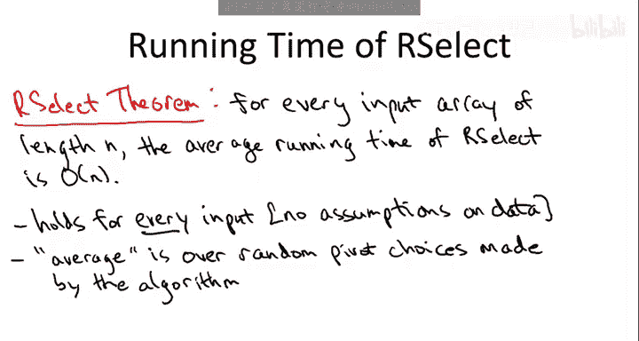
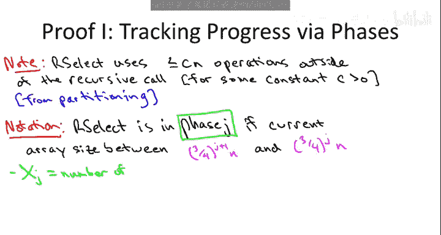
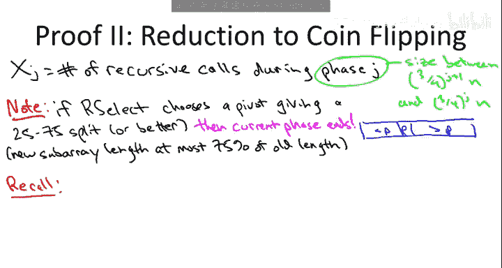
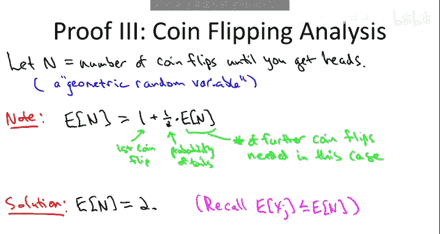
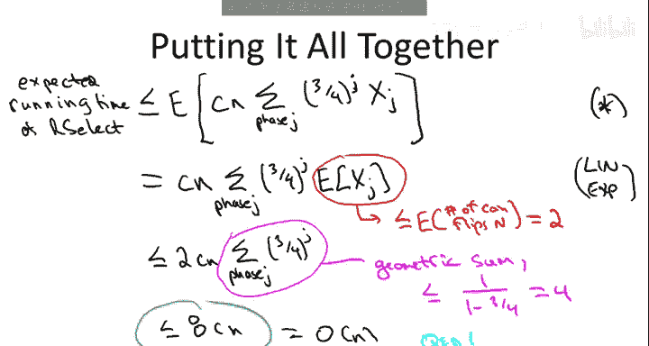

# 算法启蒙：第1册：基础篇：P33：随机选择算法分析



在本节课中，我们将要学习随机线性时间选择算法的数学分析。我们将证明，对于任意长度为N的输入数组，该算法的平均运行时间是线性的。这非常了不起，因为它几乎不比读取输入所需的时间多，并且比排序更快。这表明选择问题本质上比排序问题更容易，无需先排序，可以直接在O(n)时间内解决。

## 算法回顾

上一节我们介绍了随机选择算法的基本思想，本节中我们来看看其具体的分析过程。首先，让我们回顾一下算法步骤。

该算法与快速排序类似，围绕一个枢轴进行分区，但只进行一次递归，而不是两次。给定一个长度为n的数组，我们要寻找第i小的元素（第i阶统计量）。

以下是算法的核心步骤：
1.  **基本情况**：如果数组只有一个元素，则直接返回该元素。
2.  **选择枢轴**：从输入数组中均匀随机地选择一个元素作为枢轴P。
3.  **分区**：围绕枢轴P对数组进行分区，将数组分为小于P的元素和大于P的元素两部分。
4.  **判断与递归**：
    *   设枢轴P在分区后的新位置为j。
    *   如果 `j == i`，则P就是我们要找的第i小元素，直接返回P。
    *   如果 `j > i`，说明目标元素在枢轴左侧（较小的部分）。我们在左侧子数组（长度为 `j-1`）上递归寻找第i小的元素。
    *   如果 `j < i`，说明目标元素在枢轴右侧（较大的部分）。我们在右侧子数组（长度为 `n-j`）上递归寻找第 `(i-j)` 小的元素。

## 分析思路

我们可能会想沿用分析快速排序时的方法，即定义指示器随机变量来计算元素比较的期望次数。虽然这也能得出线性时间的平均界，但过程稍显繁琐。

由于选择问题的特殊结构（只进行一次递归），我们可以采用一种更巧妙的方法。算法的核心工作与快速排序相同，都是分区（`partition`）子程序，其时间复杂度为线性，记为 `O(n)`。为了清晰，我们用一个常数 `C` 来表示分区操作及递归调用外的其他工作，即每次递归调用外的工作量不超过 `C * (当前数组长度)`。

我们的目标是追踪算法递归过程中数组长度的缩减进度。为此，我们引入“阶段”的概念。

## 核心概念：阶段 (Phase)



我们定义算法的执行处于 **阶段j**，如果当前递归调用处理的数组长度 `m` 满足：
```
(3/4)^(j+1) * n <= m < (3/4)^j * n
```
其中 `n` 是原始输入数组的长度。

**公式解释**：
*   当 `j=0` 时，阶段0的数组长度在 `(3/4)*n` 和 `n` 之间。最外层的递归调用必然处于阶段0。
*   阶段编号 `j` 越大，对应的数组长度上限 `(3/4)^j * n` 越小，表示算法取得了越多的进展（数组被缩减得越多）。
*   从一个阶段进入下一个更高级的阶段，意味着数组长度至少缩减了25%。

我们定义随机变量 `X_j`，它表示算法在整个执行过程中，处于阶段 `j` 的递归调用的总次数。

## 运行时间上界

基于阶段和 `X_j` 的定义，我们可以对算法的总运行时间 `T` 给出一个上界。

在每个阶段 `j` 的递归调用中：
1.  该次调用外的工作量不超过 `C * (当前数组长度)`。
2.  根据阶段定义，阶段 `j` 中的数组长度不超过 `(3/4)^j * n`。

因此，算法总运行时间满足：
```
T <= Σ_j [ X_j * C * ( (3/4)^j * n ) ]
```
我们称这个上界为不等式 `(★)`。注意，`T` 和 `X_j` 都是随机变量，其值取决于算法运行时随机选择的枢轴。

我们的目标是求期望运行时间 `E[T]`。根据期望的线性性质，我们有：
```
E[T] <= Σ_j [ E[X_j] * C * ( (3/4)^j * n ) ]
```

## 关键步骤：期望 `E[X_j]` 的上界



现在，问题的核心转化为估算每个阶段 `j` 中递归调用次数的期望值 `E[X_j]`。

这里需要一个重要的观察：**如果一个枢轴产生了25-75或更好的分割**（即分区后，左右两部分都至少包含25%且至多包含75%的元素），那么无论接下来算法递归到哪一边，新的子问题规模都将不超过原问题的75%。这**保证**了本次递归调用结束后，算法一定会进入一个编号更大的阶段（即 `j` 会增加）。

在随机选择枢轴时，获得这样一个“好枢轴”的概率是多少？对于一个元素各不相同的数组，恰好有50%的元素（排名在25%到75%之间的元素）可以作为这样的好枢轴。因此，**每次递归调用中，选到好枢轴的概率至少是1/2**。

于是，我们可以将“阶段 `j` 中的递归过程”与一个简单的抛硬币实验联系起来：
*   **抛到正面**：对应选到一个好枢轴，导致阶段 `j` 结束。
*   **抛到反面**：对应选到一个坏枢轴，算法可能仍停留在阶段 `j`（考虑最坏情况）。

那么，阶段 `j` 中递归调用的次数 `X_j`，其期望值 `E[X_j]` 就不超过“持续抛一枚公平硬币，直到第一次出现正面所需抛掷次数”的期望值。

## 抛硬币实验的期望

设随机变量 `N` 为抛一枚公平硬币直到第一次出现正面所需的抛掷次数。计算其期望 `E[N]` 有一个巧妙的方法：

考虑第一次抛掷的结果：
*   有1/2的概率得到正面，此时 `N=1`。
*   有1/2的概率得到反面，此时我们需要重新开始抛掷，期望抛掷次数为 `1 + E[N]`（1代表第一次已抛，`E[N]`代表重新开始后的期望次数）。



因此，我们可以建立方程：
```
E[N] = (1/2) * 1 + (1/2) * (1 + E[N])
```
解这个方程：
```
E[N] = 1/2 + 1/2 + (1/2)E[N]
E[N] - (1/2)E[N] = 1
(1/2)E[N] = 1
E[N] = 2
```
所以，平均需要抛掷2次才能看到第一次正面。由此我们得到结论：对于任意阶段 `j`，`E[X_j] <= 2`。

## 完成证明

现在，我们将 `E[X_j] <= 2` 代入之前得到的期望运行时间上界：
```
E[T] <= Σ_j [ E[X_j] * C * ( (3/4)^j * n ) ]
     <= Σ_j [ 2 * C * ( (3/4)^j * n ) ]
     = 2 * C * n * Σ_j [ (3/4)^j ]
```
剩下的工作是计算几何级数 `Σ_j (3/4)^j` 的和。这是一个公比为 `r = 3/4 < 1` 的无穷几何级数，其和为 `1 / (1 - r)`。
```
Σ_{j=0}^{∞} (3/4)^j = 1 / (1 - 3/4) = 1 / (1/4) = 4
```
因此，
```
E[T] <= 2 * C * n * 4 = 8 * C * n
```
由于 `C` 是一个常数，我们证明了随机选择算法的期望运行时间是 `O(n)`，即线性的。

## 总结



本节课中我们一起学习了随机线性时间选择算法的严格数学分析。我们通过引入“阶段”的概念来追踪算法进度，并将阶段内的递归调用次数与抛硬币实验类比。利用期望的线性性质和一个几何级数的求和，我们最终证明了对于任何输入数组，该算法的平均运行时间都是线性的（`O(n)`）。这个结果非常强大，它表明我们可以在不比读取输入多太多时间的情况下，解决选择问题，且无需先对数组进行排序。