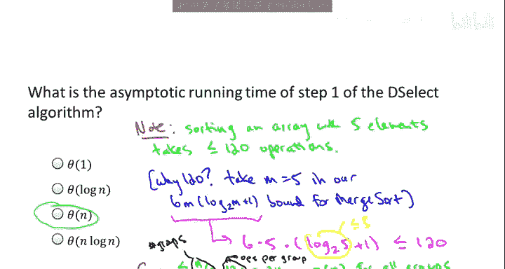
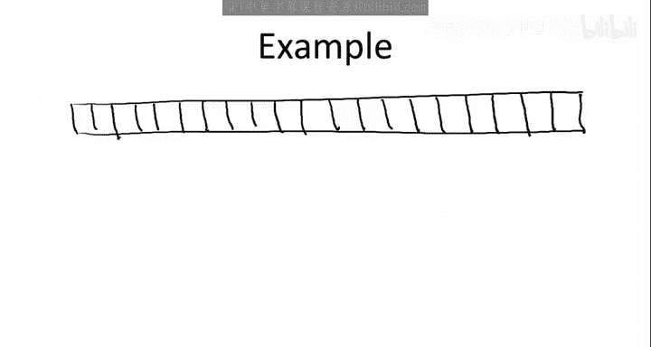
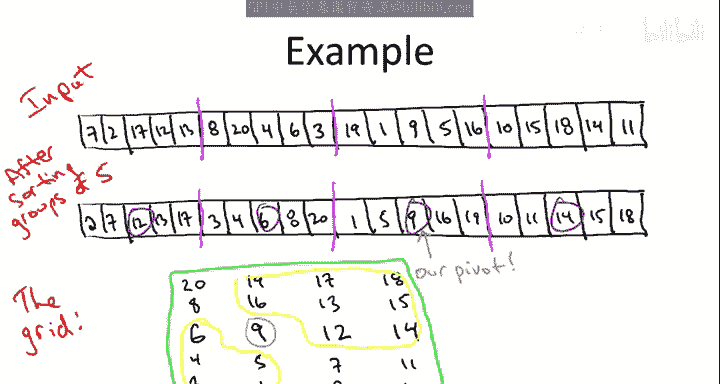

# 算法启蒙：第1册：基础篇：第34章：确定性选择算法分析（第一部分） 🧮

在本节中，我们将深入分析由Blum、Floyd、Pratt、Rivest和Tarjan提出的确定性选择算法。我们的目标是证明该算法在任何输入上都能在线性时间内运行。我们将首先回顾算法步骤，然后逐步分析其时间复杂度，并证明其核心引理：算法保证能找到一个“30-70分割”或更好的枢轴元素。

## 算法回顾 🔄

上一节我们介绍了随机选择算法，本节中我们来看看其确定性版本。该算法的核心思想是，不再随机选择枢轴，而是通过一个精心设计的子程序来选择一个有质量保证的枢轴。

以下是 `choose_pivot` 子程序的关键步骤，它本质上实现了一个两轮淘汰赛：



1.  **第一轮比赛**：将输入数组 `A` 划分为若干组，每组5个元素（最后一组可能少于5个）。对每组内的5个元素进行排序（例如使用归并排序）。每组排序后的中位数（即第三大的元素）成为该组的“胜者”。
2.  **收集胜者**：将所有 `n/5` 个第一轮胜者（即各组的中位数）复制到一个新数组 `C` 中。
3.  **第二轮比赛（决赛）**：递归地在数组 `C` 上调用 `DSelect` 算法，以找到 `C` 的中位数。这个中位数就是我们的最终枢轴 `p`。
4.  得到枢轴 `p` 后，算法流程与随机选择算法相同：围绕 `p` 对原数组 `A` 进行划分，得到左右两部分，然后根据目标顺序统计量的位置，递归地在左侧或右侧子数组中继续查找。

## 时间复杂度初步分析 ⏱️

现在，让我们分析这个算法的工作量。我们将采用分析确定性分治算法的经典范式：建立递归式。递归式 `T(n)` 表示算法在长度为 `n` 的输入上的最大操作数，它由两部分组成：递归调用在更小子问题上的工作，以及递归调用之外本地完成的工作。

以下是算法各步骤的工作量估算：

*   **步骤1：排序每组5个元素**。排序一个长度为5的数组是常数时间操作（例如，归并排序约需120次操作）。我们有 `n/5` 组，因此总时间为 `O(n)`。
*   **步骤2：复制胜者到数组C**。这显然是 `O(n)` 时间。
*   **步骤3：递归调用寻找中位数**。这是在数组 `C` 上递归调用 `DSelect`，`C` 的长度为 `n/5`。因此，这部分工作量记为 `T(n/5)`。
*   **步骤4：围绕枢轴划分**。划分操作是线性时间的，即 `O(n)`。
*   **步骤6或7：在子数组上递归**。这里有一次递归调用，但其输入规模未知，取决于划分后子数组的大小。我们暂时将其记为 `T(?)`。


综合以上，我们得到以下递归式：
```
T(1) = 1
T(n) ≤ c*n + T(n/5) + T(?)   (对于某个常数 c > 0)
```
我们似乎卡住了，因为 `T(?)` 的大小未知。为了解决这个问题，我们需要一个关键引理来界定这个未知递归调用的大小。

## 关键引理：保证良好的分割比 🔑

上一节我们列出了递归式，但被未知的递归规模所阻碍。本节中我们来看看一个关键引理，它将证明我们精心选择的枢轴能保证产生一个良好的分割。

**引理**：由 `choose_pivot` 子程序选择的枢轴 `p`，能保证将原数组划分为两部分，使得每一部分至少包含 `30%` 的元素。也就是说，我们得到了一个“30-70分割”或更好的结果。


**证明思路**：
为了证明至少有30%的元素小于 `p`，我们进行一个思维实验。将 `n` 个元素排列成一个 `5` 行、`n/5` 列的网格：
*   每列对应一个5元素组，且列内元素从下到上递增（最小在底部）。
*   每列的中间元素（即第三行）是该组的中位数（第一轮胜者），我们用特殊标记表示。
*   各列从左到右按照其中位数的值递增排列。


设 `k = n/5`，`x_i` 为第 `i` 小的中位数。那么我们的枢轴 `p` 就是 `x_{k/2}`（即所有中位数的中位数）。

现在考虑网格中位于 `p` **西南方向**（即左下方）的所有元素：
1.  由于列按中位数排序，`p` 左边的所有中位数 `x_1, x_2, ..., x_{k/2 - 1}` 都小于 `p`。
2.  在每一列中，中位数下方的两个元素也小于该列的中位数。
3.  根据“小于”关系的传递性，`p` 左边各列的中位数下方的两个元素，必然也小于 `p`。



因此，整个西南区域（大约占网格的 `(k/2) * 3 ≈ (n/10) * 3 = 3n/10` 个元素）都小于 `p`。这证明了至少有约 `30%` 的元素小于枢轴。

对称地，考虑 `p` **东北方向**（即右上方）的所有元素，可以证明至少有约 `30%` 的元素大于枢轴。

因此，无论递归调用发生在划分后的哪一边，其输入规模最多为原数组的 `70%`。我们可以用 `T(7n/10)` 来替换递归式中的 `T(?)`。

## 本节总结 📝

本节课中我们一起学习了确定性选择算法时间分析的第一个关键部分。

1.  **算法回顾**：我们回顾了通过“中位数的中位数”方法选择枢轴的确定性选择算法步骤。
2.  **建立递归式**：我们分析了算法各步骤的复杂度，并建立了包含未知子问题规模的递归式：`T(n) ≤ c*n + T(n/5) + T(?)`。
3.  **证明关键引理**：我们通过巧妙的网格思维实验，证明了算法选择的枢轴能保证至少产生一个“30-70分割”。这意味着递归式中未知的部分 `T(?)` 可以替换为 `T(7n/10)`。



至此，我们得到了一个完整的递归关系：`T(n) ≤ c*n + T(n/5) + T(7n/10)`。在下一节中，我们将求解这个递归式，最终证明 `T(n) = O(n)`，即确定性选择算法在线性时间内运行。虽然为了得到这个良好的枢轴我们付出了额外的递归代价（`T(n/5)`），但下一节的分析将表明，这个代价是可控的，不会影响整体的线性时间复杂度。