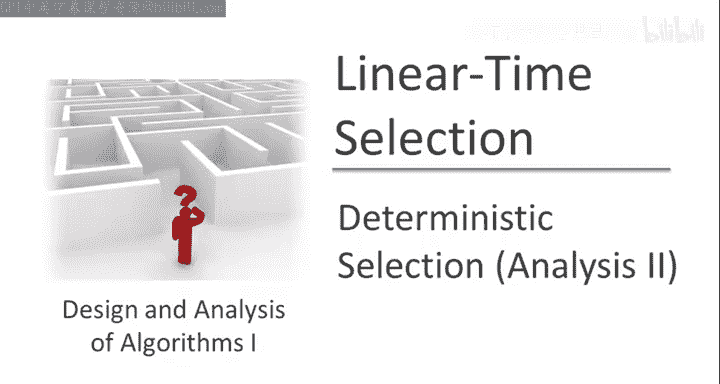
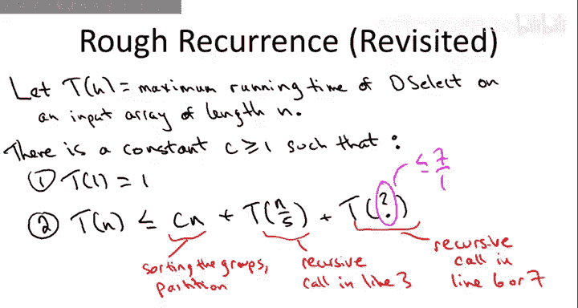
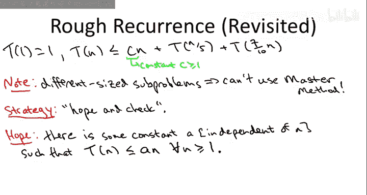
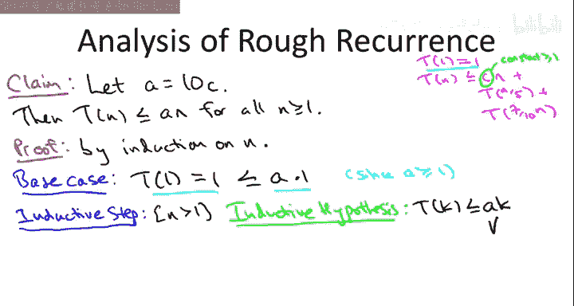

# 算法启蒙：第1册：基础篇｜第35章：确定性选择算法分析（第二部分）🎯

在本节课中，我们将完成确定性选择算法线性时间复杂度的证明。我们已经讨论了算法核心思想——通过“中位数的中位数”方法选择枢轴，并证明了该枢轴能保证至少30-70的分割比。本节我们将分析算法的整体运行时间，并证明其确实为线性时间复杂度。

---

## 递归关系式回顾

上一节我们介绍了确定性选择算法（`dselect`）的递归结构。现在，我们来正式定义其运行时间。

令 **T(n)** 表示 `dselect` 算法在输入数组长度为 **n** 时的最坏情况运行时间。

在递归调用之外，算法执行以下线性时间操作：
1.  将数组逻辑分组（每组5个元素）并排序。
2.  复制中位数数组。
3.  根据枢轴进行划分（Partitioning）。

这些步骤的总工作量不超过 **c * n**，其中 **c** 是一个大于1的常数。

算法包含两次递归调用：
1.  第一次递归调用（第3行）：用于计算“中位数的中位数”作为枢轴。它总是在 **n/5** 大小的数组上执行。
2.  第二次递归调用（第6或7行）：在划分后的子数组上执行。根据我们证明的关键引理（30-70引理），最坏情况下，子数组的大小不超过 **0.7n**。

因此，我们可以得到以下递归关系式：

**T(n) ≤ c*n + T(n/5) + T(0.7n)**

我们的目标是求解这个递归式，并希望证明 **T(n) = O(n)**。

---

## 求解递归式：猜测与验证法

我们之前学习的归并排序、Strassen算法等递归式都可以直接套用主定理（Master Method）求解。然而，主定理要求所有子问题的规模相同，而我们的递归式包含两个不同规模（**n/5** 和 **0.7n**）的子问题，因此无法直接应用。

这里，我们将采用一种更灵活的方法：**猜测与验证法**（Guess and Check）。我们首先猜测算法运行时间是线性的，然后通过数学归纳法来验证这个猜测。

**我们希望证明**：存在一个常数 **A**（与 **n** 无关），使得对于所有 **n ≥ 1**，都有 **T(n) ≤ A * n**。

如果上述成立，根据大O符号的定义，即可证明 **T(n) = O(n)**。

为了方便证明，我们直接给出常数 **A** 的选择：**A = 10c**。这里的 **c** 就是递归式中代表线性工作量的那个常数。

---

## 归纳法证明

现在，我们使用数学归纳法来证明命题：对于所有 **n ≥ 1**，**T(n) ≤ A * n**，其中 **A = 10c**。

### 1. 基础情况 (Base Case)
当 **n = 1** 时，根据算法定义，**T(1) = 1**。
我们需要验证 **T(1) ≤ A * 1**。
由于 **A = 10c** 且 **c ≥ 1**，因此 **A ≥ 10**。显然，**1 ≤ A** 成立。基础情况得证。

### 2. 归纳假设 (Inductive Hypothesis)
假设对于所有 **k < n**，命题都成立，即 **T(k) ≤ A * k**。

### 3. 归纳步骤 (Inductive Step)
我们需要证明当输入规模为 **n** 时，命题也成立，即 **T(n) ≤ A * n**。

我们从递归关系式出发：
**T(n) ≤ c*n + T(n/5) + T(0.7n)**

根据归纳假设，因为 **n/5 < n** 且 **0.7n < n**，我们可以将 **T(n/5)** 和 **T(0.7n)** 用上界替换：
**T(n) ≤ c*n + A*(n/5) + A*(0.7n)**

合并含有 **n** 的项：
**T(n) ≤ n * [c + A/5 + 0.7A]**
**T(n) ≤ n * [c + (0.2A + 0.7A)]**
**T(n) ≤ n * [c + 0.9A]**

现在，代入我们选择的 **A = 10c**：
**T(n) ≤ n * [c + 0.9*(10c)]**
**T(n) ≤ n * [c + 9c]**
**T(n) ≤ n * [10c]**
**T(n) ≤ A * n**

这正是我们需要证明的结论。归纳步骤完成。

---

## 结论

通过数学归纳法，我们成功证明了对于递归式 **T(n) ≤ c*n + T(n/5) + T(0.7n)**，其解满足 **T(n) = O(n)**。

由于 **T(n)** 代表确定性选择算法 `dselect` 的最坏情况运行时间，因此我们最终得出结论：**基于“中位数的中位数”方法实现的确定性选择算法，其最坏情况时间复杂度是线性的，即 O(n)**。

本节课中，我们一起学习了如何分析一个具有不同规模子问题的递归算法。我们回顾了算法的递归结构，建立了递归关系式，并巧妙地运用“猜测与验证法”结合数学归纳法，最终证明了该确定性选择算法具备线性时间复杂度这一重要性质。