# 算法启蒙：03：Karatsuba乘法

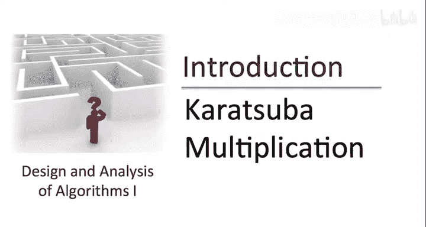

在本节课中，我们将要学习一种不同于小学所学的整数乘法算法——Karatsuba乘法。我们将通过一个具体的例子来了解其基本思想，然后系统地学习其递归实现原理，并理解它如何通过巧妙的数学变换减少计算量。

上一节我们回顾了小学的整数乘法算法，本节中我们来看看一种截然不同的方法。

## 🧩 一个神秘的例子

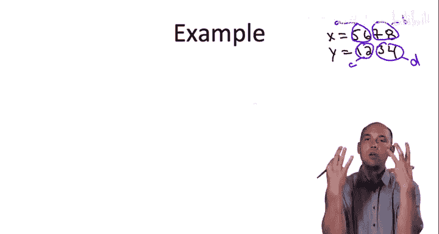

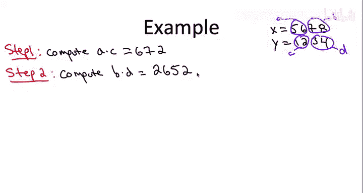

首先，我们通过一个具体例子来感受Karatsuba乘法的计算过程。我们将计算两个整数 `X = 5678` 和 `Y = 1234` 的乘积。

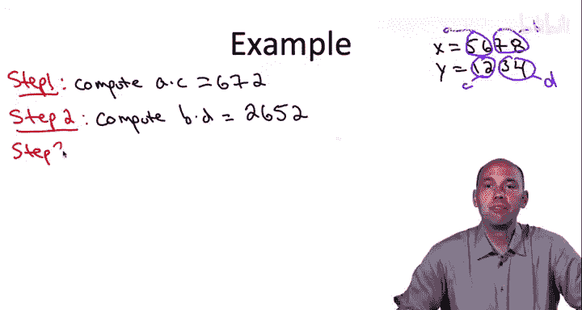

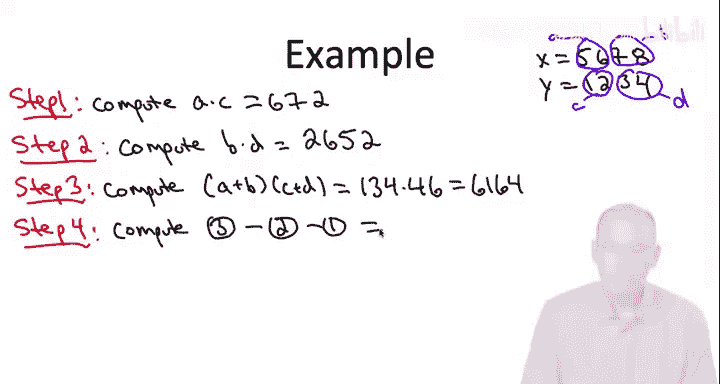

以下是计算步骤：
1.  将每个数字分成两半。令 `A = 56`, `B = 78`, `C = 12`, `D = 34`。
2.  计算 `A * C = 56 * 12 = 672`。
3.  计算 `B * D = 78 * 34 = 2652`。
4.  计算 `(A + B) * (C + D) = (56+78) * (12+34) = 134 * 46 = 6164`。
5.  计算 `(A+B)*(C+D) - A*C - B*D = 6164 - 672 - 2652 = 2840`。
6.  最后，将上述结果按如下方式组合：
    *   将 `A*C` 的结果 `672` 后补4个零，得到 `6720000`。
    *   将步骤5的结果 `2840` 后补2个零，得到 `284000`。
    *   将 `B*D` 的结果 `2652` 保持不变。
    *   将这三个数相加：`6720000 + 284000 + 2652 = 7006652`。

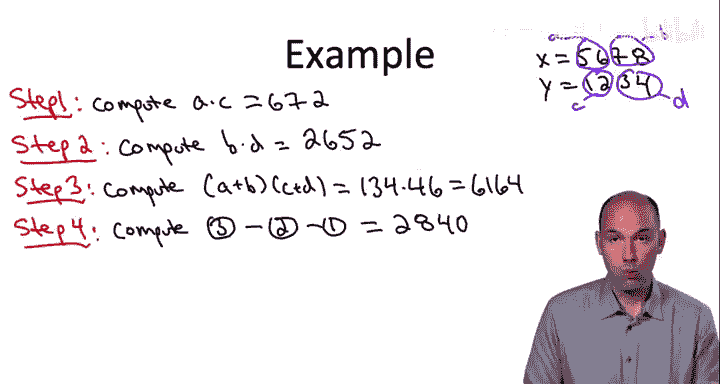

这个结果 `7006652` 正是 `5678 * 1234` 的正确乘积。这个计算过程看起来像是魔术，但它揭示了一个重要事实：**整数乘法存在多种不同的算法**。

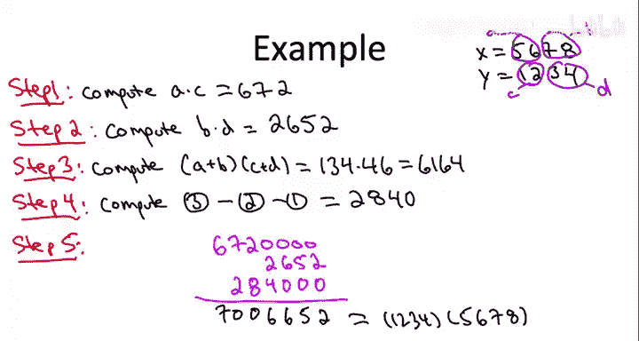

## 🔍 递归思想的引入

在解释Karatsuba乘法之前，我们先看一个更直观的递归乘法思路。假设我们有两个n位数 `X` 和 `Y`。

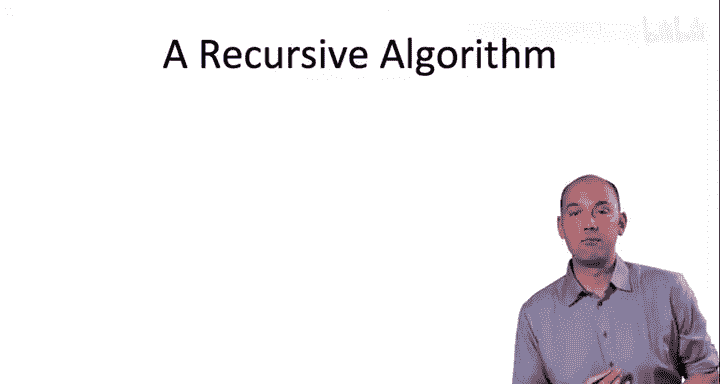

我们可以将 `X` 和 `Y` 分别表示为前后两半的组合：
*   `X = A * 10^(n/2) + B`
*   `Y = C * 10^(n/2) + D`

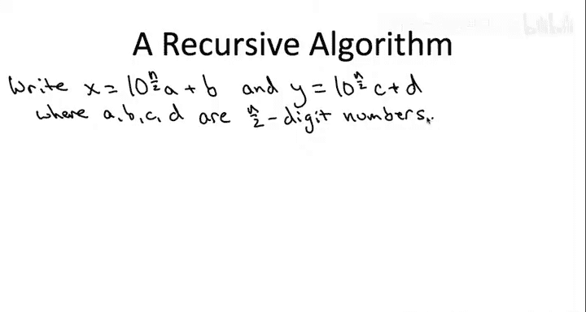

其中 `A, B, C, D` 都是 `n/2` 位的数。那么它们的乘积可以展开为：

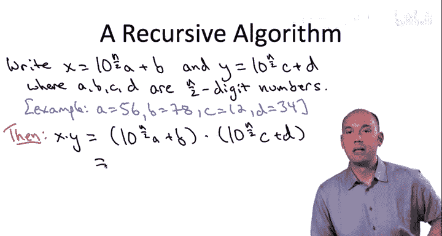

```
X * Y = (A * 10^(n/2) + B) * (C * 10^(n/2) + D)
      = A*C * 10^n + (A*D + B*C) * 10^(n/2) + B*D
```

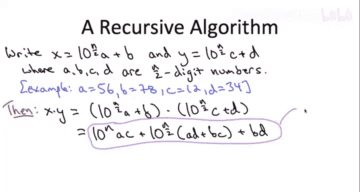

我们称这个表达式为 **公式（*）**。

这个表达式直接给出了一个递归算法：要计算 `X*Y`，我们只需要递归地计算四个更小的乘积 `A*C`, `A*D`, `B*C`, `B*D`，然后将结果按公式（*）组合起来。当数字小到只有一位时（递归的基准情况），直接相乘即可。

## 🚀 Karatsuba乘法的优化

上一节我们介绍了一个需要四次递归调用的朴素递归算法。Karatsuba乘法的精妙之处在于，它发现我们只需要**三次**递归调用。

观察公式（*），我们真正关心的系数只有三个：`A*C`, `(A*D + B*C)`, `B*D`。Karatsuba的关键技巧是，我们并不需要分别计算 `A*D` 和 `B*C`，而只需要计算它们的和。

以下是具体做法：
1.  递归计算 `P1 = A * C`。
2.  递归计算 `P2 = B * D`。
3.  递归计算 `P3 = (A + B) * (C + D)`。

现在，注意 `P3` 展开后是：
```
P3 = (A+B)*(C+D) = A*C + A*D + B*C + B*D
```

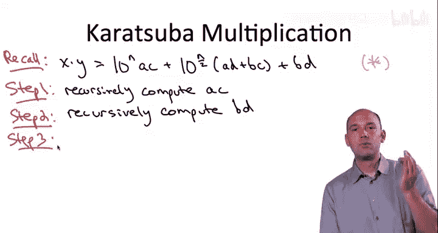

那么，我们需要的中间项 `(A*D + B*C)` 可以通过一个简单的减法得到：
```
(A*D + B*C) = P3 - P1 - P2
```

这样，我们仅通过三次递归调用就得到了公式（*）所需的全部三个系数。之后，我们像之前一样，将 `P1` 左移 `n` 位，将 `(P3-P1-P2)` 左移 `n/2` 位，再加上 `P2`，就得到了最终结果。

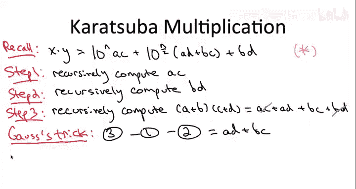

## 📝 总结

本节课中我们一起学习了Karatsuba乘法算法。我们从一个小例子出发，感受到了算法设计空间的丰富性。然后，我们推导了整数乘法的递归表达式，并在此基础上，学习了Karatsuba如何利用 `(A+B)*(C+D)` 这一个额外的乘积，通过巧妙的加减运算，将所需的递归调用次数从四次减少到三次。这展示了即使在整数乘法这样基础的问题上，也存在着令人惊叹的优化空间。至于Karatsuba算法是否真的比小学算法更快，我们将在后续课程中学习“分治算法”的分析工具后给出答案。