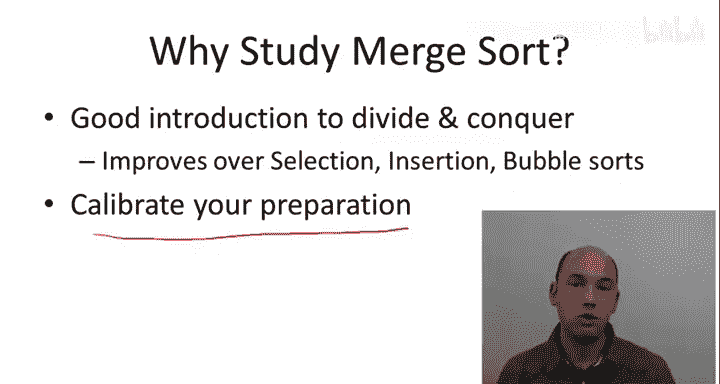
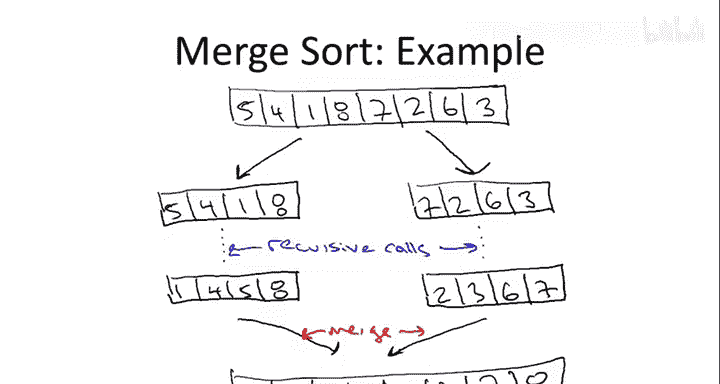

# 算法启蒙：第1章：归并排序的动机与示例 🧩

在本节课中，我们将学习如何分析一个算法。我们将通过回顾著名的归并排序算法，并给出其运行时间上界的数学精确描述，来初步了解算法分析的实际过程。

## 概述

归并排序是一个经典的排序算法，它完美地体现了“分治”这一算法设计范式。尽管它已有数十年的历史，但因其高效性，至今仍在许多编程库中被广泛使用。本节课，我们将详细探讨归并排序的工作原理，并分析其性能。

## 为什么从归并排序开始？

选择归并排序作为起点有多个原因。首先，它是分治范式的典型应用，能清晰地展示该范式的思想、分析挑战及其带来的优势。其次，与一些更简单直观的排序算法（如选择排序、插入排序、冒泡排序）相比，归并排序能提供更好的性能。这些简单算法通常具有**O(n²)**的运行时间，而归并排序，正如我们将看到的，性能更优。

此外，讨论归并排序有助于你评估自己的预备知识水平。本课程假设你具备扎实的编程基础，能够将算法的高层思想转化为实际代码。归并排序的分析也将自然地引出本课程分析算法的一般方法：我们关注最坏情况下的行为，进行**渐近分析**（即关注运行时间的增长率，而非低阶项或常数因子的微小变化），并使用**递归树**方法进行计算。这种方法具有很好的通用性，可用于分析多种递归和分治算法。

## 排序问题

归并排序旨在解决排序问题。其输入是一个包含n个任意顺序数字的数组，目标是输出一个从小到大排序的数组。

例如，给定输入数组：
`[5, 4, 1, 8, 7, 2, 6, 3]`
目标输出数组为：
`[1, 2, 3, 4, 5, 6, 7, 8]`

为简化讨论，我们假设输入数组中的元素互不相同。你可以思考，如果存在重复元素，算法和分析会有何不同。

## 归并排序图解

归并排序是递归算法，它通过调用自身来解决更小的子问题。其核心思想是典型的分治策略：将输入数组分成两半，递归地对每一半进行排序，然后将两个已排序的子数组合并成一个完整的排序数组。

让我们通过一个例子来图解这个过程。考虑上面的输入数组 `[5, 4, 1, 8, 7, 2, 6, 3]`。

1.  **分解**：算法首先将数组分成左右两半。
    *   左半部分：`[5, 4, 1, 8]`
    *   右半部分：`[7, 2, 6, 3]`
    （可以想象这些子数组被复制到新数组中，再传递给递归调用。）

2.  **递归求解**：通过递归调用的“魔力”（或归纳法），每个递归调用将正确排序其接收的子数组。
    *   对左半部分递归调用后，得到排序结果：`[1, 4, 5, 8]`
    *   对右半部分递归调用后，得到排序结果：`[2, 3, 6, 7]`

3.  **合并**：最后一步是**合并**。算法需要将这两个已排序的长度为4的子数组合并，产生最终的8元素排序数组 `[1, 2, 3, 4, 5, 6, 7, 8]`。

合并步骤需要以计算高效的方式实现。基本思路是使用两个指针分别遍历两个已排序的子数组，比较指针所指元素，将较小的元素复制到输出数组中，并移动相应的指针。我们将在后续内容中提供更多细节。

## 总结

本节课我们一起学习了归并排序算法的动机和基本示例。我们了解到归并排序是分治算法的典范，通过递归地将问题分解、解决子问题再合并结果，来实现高效的排序。我们还明确了本课程分析算法的基本框架：关注最坏情况、进行渐近分析、并使用递归树方法。在接下来的课程中，我们将深入探讨归并排序的具体实现、合并操作的细节，并正式分析其运行时间。