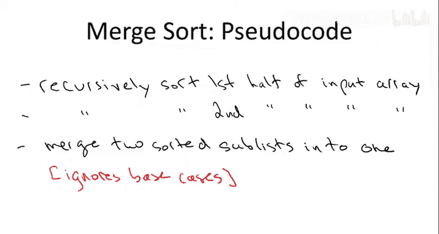
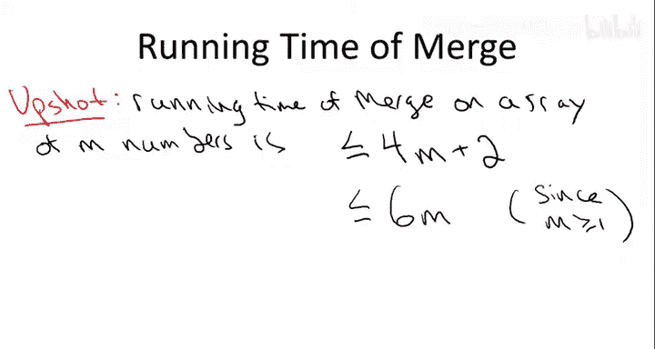
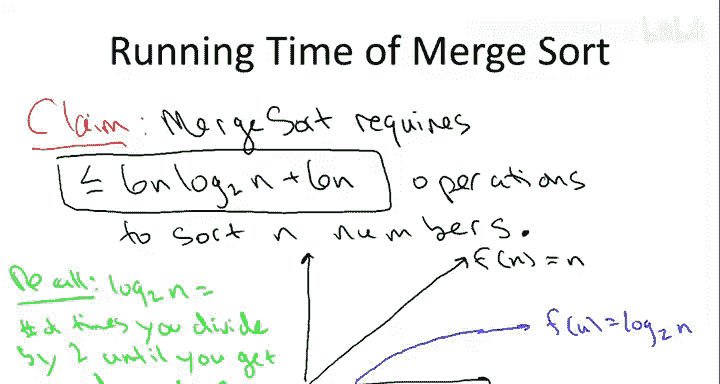

# 算法启蒙：第1册：基础篇｜第5章：归并排序伪代码

## 概述

在本节课中，我们将学习归并排序算法的伪代码实现。我们将详细探讨算法的递归结构，并重点分析合并步骤的实现细节。最后，我们将开始讨论归并排序的运行时间，并将其与更简单的排序算法进行比较。

---

## 归并排序伪代码

上一节我们介绍了归并排序的基本思想，本节中我们来看看它的伪代码实现。

首先，我们讨论归并排序算法的高层伪代码，暂时忽略合并子程序的具体实现。在这个层面上，算法应该非常简单明了。



算法将包含两次递归调用，然后是一个合并步骤。

需要说明的是，这里的伪代码并非可以直接翻译成代码，虽然非常接近。我忽略了一些细节，以便我们专注于核心概念。

以下是几个被忽略的细节：
1.  在任何递归算法中，都需要有基准情况。当输入足够小时，我们不进行递归，直接返回一个简单的答案。对于排序问题，基准情况是当数组有零个或一个元素时，它已经是有序的，无需任何操作，直接返回即可。为了清晰起见，我没有在伪代码中写出基准情况，但在实际实现中必须包含。
2.  我忽略了当数组长度为奇数时该如何处理。例如，一个有9个元素的数组，显然需要将其拆分为5和4或4和5。你可以选择任意一种方式，这没有问题。
3.  我没有讨论如何将子数组传递给递归调用的具体细节。这在一定程度上取决于编程语言。这正是我希望避免的，我希望讨论的是超越任何特定编程语言实现的概念。

因此，我将在这个层面上描述算法。


---

## 合并步骤的实现

相对而言，困难的部分是如何实现合并步骤。递归调用已经完成了它们的工作，我们得到了两个已排序的、各包含一半数字的子数组（左半部分和右半部分）。我们如何将它们合并成一个有序数组？

在上一节中，我已经用文字描述了基本思想：通过并行遍历两个已排序的子数组，按顺序填充输出数组。现在让我们更详细地看看这个过程。

以下是合并步骤的伪代码。

首先，为我们将要讨论的角色引入一些名称：
*   用 **C** 表示输出数组。这是我们最终要输出的、按排序顺序排列的数字数组。
*   用 **A** 和 **B** 表示两次递归调用的结果。第一次递归调用给了我们数组 **A**，它包含输入数组的左半部分，且已排序。类似地，**B** 包含输入数组的右半部分，也已排序。

我们需要并行遍历两个已排序的子数组 **A** 和 **B**。因此，我引入两个计数器：
*   **I** 用于遍历 **A**。
*   **J** 用于遍历 **B**。

**I** 和 **J** 初始化为1，指向各自数组的开头。

现在，我们将对输出数组进行一次简单的遍历，按递增顺序填充它。我们总是从两个已排序子数组的并集中取出最小的元素。

合并步骤的核心思想是认识到：在 **A** 和 **B** 中，你尚未查看的最小元素必定位于两个列表之一的**最前面**。

例如，在算法开始时，整体最小元素在哪里？无论它落在 **A** 还是 **B** 中，它都必须是该数组中最小的元素。因此，整体最小元素要么是 **A** 中的最小元素，要么是 **B** 中的最小元素。你只需检查这两个位置，将较小的那个复制过来，然后重复这个过程。

变量 **K** 的作用是从左到右遍历输出数组，这是我们填充数组的顺序。我们当前查看的是第一个数组的第 **I** 个位置和第二个数组的第 **J** 个位置，这表示我们已经深入到这两个数组的程度。我们比较哪个位置的元素当前最小，然后将最小的那个复制过来。

如果 **A** 中第 **I** 个位置的元素较小，我们就复制它。当然，我们必须递增 **I**，以便更深入地探查列表 **A**。对于 **B** 中当前位置元素较小的情况，操作是对称的。

再次说明，为了专注于整体思路而不被细节困扰，我忽略了一些边界情况。如果你真的想实现这个算法，必须添加一些额外的检查来处理当 **I** 或 **J** 到达数组末尾的情况。此时，你需要将剩余的所有元素复制到 **C** 中。

以下是清理后的伪代码版本，与上一张幻灯片上写的内容相同，即合并步骤的伪代码。

```pseudocode
Merge (A, B):
    Let C be an empty output array.
    Initialize i = 1, j = 1.
    For k = 1 to n:
        If A[i] < B[j]:
            C[k] = A[i]
            i = i + 1
        Else:
            C[k] = B[j]
            j = j + 1
    Return C
```

这就是合并算法。

---

## 归并排序的运行时间分析

现在，让我们进入本讲的核心部分：归并排序能产生一个有序数组，那么是什么（如果有的话）使它比更简单的非分治算法（例如插入排序）更好？换句话说，归并排序算法的运行时间是多少？

我不会给出运行时间的完全精确定义，这有充分的理由，我们稍后会讨论。但直观上，你应该这样理解算法的运行时间：想象你正在调试器中运行算法，每次按下回车键，程序就通过调试器前进一步。基本上，运行时间就是执行的操作数量，即执行的代码行数。所以问题是，在程序最终终止之前，你需要在调试器中按多少次回车键。

我们感兴趣的是，当输入数组有 **n** 个数字时，归并排序会执行多少行这样的代码。这是一个相当复杂的问题。

让我们从一个更适中的目标开始。与其思考归并排序这个不断调用自身的疯狂递归算法执行了多少次操作，不如先思考当我们对两个已排序的子数组执行一次合并时，会执行多少次操作。这似乎是一个更容易入手的起点。

让我提醒你合并子程序的伪代码。

让我们来计算一下将执行多少次操作。

首先是初始化步骤。我们为这两个初始化各计一次操作，称之为 **2次操作**。即 `i = 1` 和 `j = 1`。

然后是这个 `for` 循环。显然，`for` 循环总共执行 **n** 次。

在这个 `for` 循环的每一次迭代中，执行了多少条指令？
1.  我们有一次比较：比较 `A[i]` 和 `B[j]`。
2.  无论比较结果如何，我们都会再做两次操作：进行一次赋值（`C[k] = A[i]` 或 `C[k] = B[j]`），然后递增相关变量（`i = i + 1` 或 `j = j + 1`）。
3.  也许我还会说，为了递增 `k`，我们将其计为第四次操作。

因此，在这个 `for` 循环的 **n** 次迭代中，每次我们将执行 **4次操作**。

综上所述，合并子程序的运行时间结论是：**对于一个包含 m 个数字的数组，合并子程序的运行时间最多是 `4m + 2`**。

需要说明几点：
1.  我改变了字母表示，请不要混淆。在上一张幻灯片中，我们考虑的是输入大小为 **N**。这里我将变量名改为了 **M**，这在我们考虑归并排序递归处理更小的子问题时会很方便，但本质上是相同的。
2.  在具体计算代码行数时存在一些模糊性。也许你会争辩说，实际上每次循环迭代应该计为两次操作，而不是一次，因为你不仅需要递增 `k`，还需要将其与上限 `n` 进行比较。那样的话，可能是 `5m + 2` 而不是 `4m + 2`。

事实证明，如何计算执行的代码行数上的这些微小差异并不重要，我们很快就会明白原因。所以，让我们约定：对于恰好有 **M** 个条目的数组，合并操作需要 `4M + 2` 次操作。

现在，请允许我稍微滥用一下我们的约定，使用一个虽然正确但极其粗略的不等式。我保证这会让未来的计算更简单。与其用 `4M + 2`（这有点让我烦恼），我们干脆称之为**最多 `6M`**。因为 **M** 至少为 1，所以 `6M` 总是大于等于 `4M + 2`。这非常粗略，对于大的 **M**，这些数字并不接近，但为了未来的简单性，我们就继续粗略下去吧。

我不指望有人会对合并子程序完成执行所需代码行数的这个相当粗糙的上界留下深刻印象。关键问题是，归并排序需要多少行代码来正确排序输入数组，而不仅仅是这个子程序。

实际上，分析归并排序似乎要令人生畏得多，因为它会不断产生自身的递归版本。当我们考虑递归的各个层级时，需要分析的事物数量呈指数级增长。

然而，我们有一个有利因素：每次进行递归调用时，输入都比开始时小得多，只有输入数组的一半大小。因此，一方面存在子问题数量的爆炸式增长，另一方面连续的子问题只需要解决越来越小的子问题。调和这两种力量将推动我们对归并排序的分析。

好消息是，我将能够向你展示对归并排序所需代码行数的完整分析，并且事实上能够给出一个非常精确的上界。



以下是我们将在本讲剩余部分证明的论断：

**论断**：归并排序从不需要超过 `6n * log₂n + 6n` 次操作，就能正确排序一个包含 **n** 个数字的输入数组。


让我们讨论一下：这个结果好吗？知道这是归并排序所需代码行数的上界，这是一个胜利吗？

是的，它是。它展示了分治范式的优势。回想一下我们简要讨论过的更简单的排序方法，如插入排序、选择排序和冒泡排序，我声称它们的性能由输入大小的二次函数主导，即它们需要常数乘以 `n²` 次操作来排序长度为 **n** 的输入数组。

相比之下，归并排序最多需要常数乘以 `n * log n`（不是 `n²`，而是 `n * log n`）行代码来正确排序输入数组。

为了感受这是一种什么样的优势，让我提醒一下那些生疏的或者出于某种原因对对数感到恐惧的人，对数到底是什么。

理解对数的方式如下：考虑 **X轴** 代表 **N**，从 1 到无穷大。为了比较，让我们考虑恒等函数 `f(n) = n`。

让我们将其与对数进行对比。就我们的目的而言，我们可以这样理解对数：`log₂(n)` 就是你在计算器中输入数字 **n**，然后不断除以 2，直到得到的数小于 1，你数一数总共除以 2 的次数。

例如：
*   如果你输入 32，你需要除以 2 五次才能降到 1，所以 `log₂(32) = 5`。
*   如果你输入 1024，你需要除以 2 十次才能降到 1，所以 `log₂(1024) = 10`。

关键在于，如果 `log(1000)` 大约是 10，那么对数比输入本身要**小得多**。

从图形上看，对数函数看起来像一条随着 **n** 增大而迅速变得非常平坦的曲线。我鼓励你在家使用计算机或图形计算器更精确地绘制一下，但**对数函数的增长速度比恒等函数慢得多**。

因此，运行时间与 `n * log n` 成正比的排序算法，尤其是当 **n** 很大时，比运行时间为常数乘以 `n²` 的排序算法要**快得多**。

---

## 总结



本节课中，我们一起学习了归并排序算法的伪代码实现。我们首先概述了算法的高层结构，包括递归调用和合并步骤。接着，我们深入探讨了合并步骤的具体实现，理解了如何通过并行遍历两个已排序的子数组来高效地合并它们。最后，我们开始了对归并排序运行时间的分析，通过估算合并子程序的操作次数，并初步将其与简单排序算法的二次方运行时间进行对比，揭示了归并排序 `n * log n` 时间复杂度所带来的显著性能优势，特别是在处理大规模数据时。在接下来的课程中，我们将完成对这个运行时间上界的严格证明。