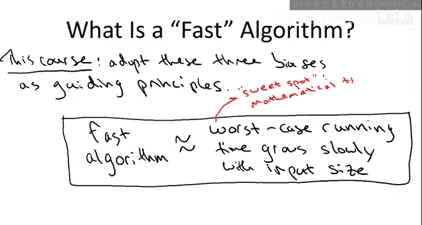

# 算法分析：01：算法分析的三大指导原则 🧭

在本节课中，我们将学习算法分析的三个核心指导原则。这些原则构成了我们后续课程中定义“快速算法”和进行算法推理的基础。

## 概述

我们已经完成了对归并排序算法的首次分析，即对其运行时间上界的推导。接下来，我们将退一步，明确在分析归并排序并解释结果时所做的三个假设。这三个假设将被我们采纳为指导原则，用于在后续课程中推理算法，并定义所谓的“快速算法”。

## 原则一：最坏情况分析

上一节我们介绍了对归并排序的分析，本节中我们来看看第一个指导原则：**最坏情况分析**。

最坏情况分析意味着，我们推导出的上界（例如 `6n log n + 6n`）适用于**每一个**长度为 `n` 的输入数组。我们在分析时，除了输入长度 `n` 之外，没有对输入数据做任何假设。即使存在一个“对手”，其唯一目的就是构造出能让算法运行最慢的恶意输入，我们的上界依然成立。

你可能会问，还有其他分析方法吗？确实存在，例如**平均情况分析**和**基准测试**。平均情况分析是在假设不同输入出现频率的基础上，分析算法的平均运行时间。基准测试则是预先商定一组被认为能代表算法典型或实际输入的测试用例。这两种方法在某些场景下很有用，但它们要求你对问题领域有深入了解，知道哪些输入更常见或更具代表性。

相比之下，最坏情况分析不假设任何输入分布，因此特别适用于**通用子程序**的设计，即你无法预知其将被如何使用或处理何种输入。此外，最坏情况分析在数学上也通常比分析特定输入分布下的平均性能或特定基准测试下的行为**更易于处理**。我们在归并排序分析中已经看到了这一点，我们并没有刻意去分析最坏情况，但推理过程自然导出了最坏情况下的上界。

## 原则二：忽略常数因子和低阶项

在第一个原则中，我们明确了分析的范围。现在，我们来看第二个指导原则：在分析算法时，我们**不过度关注小的常数因子和低阶项**。

这个原则在我们分析归并排序的合并子程序时已经体现。我们首先将其代码行数上界定为 `4m + 2`（对于长度为 `m` 的数组），但随后我们简化为 `6m`，使用了一个更简单、更宽松的上界来进行后续分析。

以下是采用此原则的三个理由：

1.  **数学上的简便性**：不过分纠结于精确的常数因子和低阶项，数学分析会**容易得多**。
2.  **分析层次的匹配性**：在本课程描述的算法抽象层次上，过度关注精确常数是**不合适的**。我们使用伪代码描述算法，其转换为具体编程语言（如 C 或 Java）时，代码行数会因实现细节（如循环计数方式）而产生微小差异。进一步编译成机器码后，差异还会因处理器、编译器及优化选项而更大。因此，精确常数最终由更底层的、机器相关的因素决定。
3.  **实践中的可行性**：对于本课程讨论的问题，即使忽略常数因子和低阶项，我们仍能获得**极强的预测能力**。当数学分析表明一个算法快速时，实践中它通常确实快速；反之亦然。我们虽然损失了一些信息的粒度，但没有丢失我们真正关心的核心：准确判断哪些算法比另一些更快。

需要明确的是，**我并非说常数因子在实践中不重要**。对于关键程序，常数因子极其重要，应尽力优化。但就本课程所要进行的算法分析而言，纠结于微小的常数因子是不合适的粒度。

## 原则三：渐近分析

在明确了不过度关注常数细节后，我们来看第三个指导原则：**渐近分析**。

这意味着我们将**聚焦于大规模输入**，关注算法性能随输入规模 `n` 增大（趋于无穷）时的表现。这个焦点在我们解释归并排序的上界时已经显现。我们声称其操作数正比于 `n log n`，并断言这优于任何运行时间与 `n` 成二次方关系的算法（如插入排序的 `(1/2)n²`）。

这是一个数学陈述，**当且仅当 `n` 足够大时才成立**。对于小的 `n`，由于常数因子更小，二次方项可能反而更小。但当我们说归并排序优于插入排序时，隐含的假设是我们关注的是大规模输入。

这个假设合理吗？答案是肯定的。原因如下：

*   **只有大规模问题才真正有趣**：如果你只需要排序100个数字，在现代计算机上任何方法都能瞬间完成，无需了解分治等高级范式。
*   **摩尔定律的反向效应**：计算机速度的不断提升（摩尔定律）并未降低算法分析的重要性，反而**提升了我们对计算规模的野心**。我们自然会更关注更大规模的问题，此时 `n log n` 算法与 `n²` 算法之间的性能鸿沟会**越来越宽**。
*   **可解决问题规模的放大效应**：假设计算机速度提升4倍。对于运行时间与 `n` 成正比的算法，你能解决的问题规模也提升4倍。而对于运行时间与 `n²` 成正比的算法，你只能解决大约2倍大的问题。

为了更直观地说明，请看下图，它比较了归并排序的上界 `6n log₂ n + 6n`（实线）和插入排序的估计运行时间 `(1/2)n²`（虚线）。

可以看到，在 `n` 较小时（大约90以下），由于常数因子更小，插入排序的曲线更低。但一旦超过这个交叉点，二次增长的 `n²` 项就会压倒常数因子的优势，使得归并排序的曲线更低。随着 `n` 进一步增大（例如到1500，这仍然是现代计算机上微不足道的问题规模），二次依赖带来的差距已经非常明显。对于真正有趣的大规模问题，这个差距将是巨大的。

当然，这并不意味着在实现算法时应完全无视常数因子。事实上，许多高度优化的归并排序库会在问题规模降到某个阈值（如7个元素）以下时，切换到常数因子更小的插入排序。对于小规模问题，使用常数因子小的算法；对于大规模问题，使用增长率更优的算法。

## 总结与展望

本节课中我们一起学习了算法分析的三大指导原则：

1.  **最坏情况分析**：为所有可能的输入提供性能保证。
2.  **忽略常数因子和低阶项**：在适当的抽象层次上进行简化分析。
3.  **渐近分析**：聚焦于算法在大规模输入下的增长率。

将这三个原则结合起来，我们得到了一个“快速算法”的数学定义：**我们追求那些最坏情况运行时间随输入规模增长缓慢的算法**。

*   **左侧（目标）**：实际运行快速的算法。
*   **右侧（数学代理）**：具有良好渐近运行时间的算法（即运行时间随输入规模增长缓慢）。

这个定义是一个“甜点”：一方面，它足够抽象，忽略常数细节，使我们能够进行大量数学推理和证明定理；另一方面，它保留了强大的预测能力，理论推荐的算法在实践中也确实是已知的高效算法。

那么，“增长缓慢”具体指什么？这取决于上下文，但对于本课程将讨论的大多数问题，**圣杯是获得线性时间算法**，即运行时间与输入规模 `n` 成正比。这比归并排序的 `n log n` 还要好。虽然并非总能达到线性时间，但这将是我们追求的目标。

展望接下来的课程，我们将有两个目标：
1.  **分析方面**：正式介绍渐近运行时间的概念，引入大O记号及其变体，解释其数学定义并举例说明。
2.  **设计方面**：获得更多应用分治范式解决其他问题的经验。

下次见。