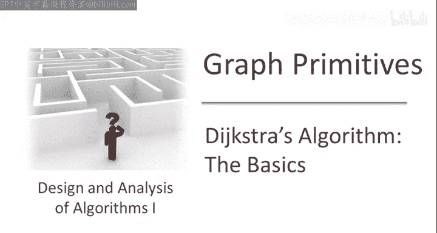
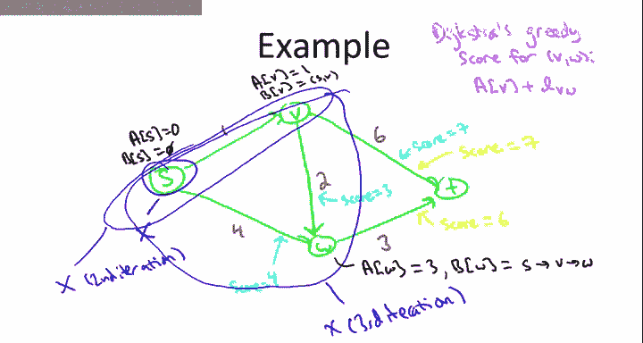
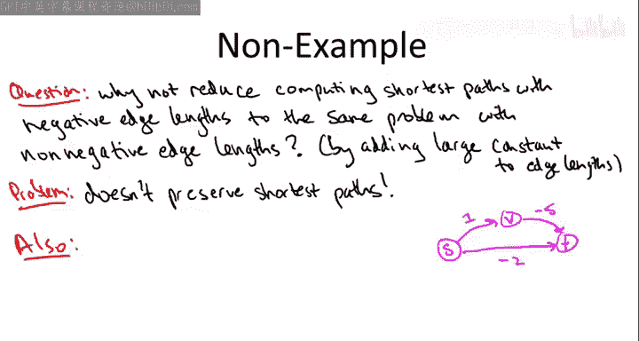

# 算法启蒙（第2册）：图算法和数据结构｜Part 2 Graph Algorithms and Data Structures：13-11：Dijkstra算法示例与局限性

在本节课中，我们将通过一个具体示例，详细演示Dijkstra算法如何计算单源最短路径。我们还将探讨该算法的一个关键限制：它无法正确处理包含负权边的图。

## 🧭 Dijkstra算法示例演示

上一节我们介绍了Dijkstra算法的核心思想和伪代码。本节中，我们来看看该算法在一个具体图上的执行过程。

我们将使用以下带权有向图作为示例，目标是计算从源点 `S` 到所有其他顶点的最短路径。

### 初始化阶段

算法开始时，我们以最直接的方式进行初始化。

*   从源点 `S` 到其自身的最短路径距离 `A[S]` 设为 `0`。
*   从 `S` 到其自身的最短路径 `B[S]` 设为空路径。
*   初始时，已处理顶点集合 `X` 仅包含源点 `S`。

### 第一轮迭代

现在，我们进入主 `while` 循环。在循环中，我们扫描所有“跨越边界”的边，即尾端在集合 `X` 内、头端在集合 `X` 外的边。

以下是第一轮迭代中需要扫描的边：

*   边 `(S, V)`，其Dijkstra贪心评分为：`A[S] + 边长 = 0 + 1 = 1`。
*   边 `(S, W)`，其Dijkstra贪心评分为：`A[S] + 边长 = 0 + 4 = 4`。

由于边 `(S, V)` 的评分更低，我们选择它。这对应了上一节幻灯片中的 `(v*, w*)`。

算法随后指示我们：
1.  将顶点 `V` 加入集合 `X`。现在 `X = {S, V}`。
2.  计算 `V` 的最短路径信息：
    *   `A[V] = 1`（即其贪心评分）。
    *   `B[V] = B[S] + 边(S, V) = 空路径 + (S, V)`。

### 第二轮迭代

现在，我们进入下一轮 `while` 循环，此时集合 `X` 包含 `S` 和 `V`。

以下是本轮需要扫描的跨越边及其贪心评分：

*   边 `(S, W)`：`A[S] + 4 = 0 + 4 = 4`。
*   边 `(V, W)`：`A[V] + 2 = 1 + 2 = 3`。
*   边 `(V, T)`：`A[V] + 6 = 1 + 6 = 7`。

边 `(V, W)` 的评分最低，因此我们选择它。

算法随后指示我们：
1.  将顶点 `W` 加入集合 `X`。现在 `X = {S, V, W}`。
2.  计算 `W` 的最短路径信息：
    *   `A[W] = 3`。
    *   `B[W] = B[V] + 边(V, W) = 路径(S, V) + (V, W)`。

### 第三轮（最终）迭代

进入最后一轮迭代，集合 `X` 包含 `S`、`V`、`W`，仅剩顶点 `T` 未被处理。

以下是本轮需要扫描的跨越边及其贪心评分：

*   边 `(V, T)`：`A[V] + 6 = 1 + 6 = 7`。
*   边 `(W, T)`：`A[W] + 3 = 3 + 3 = 6`。

边 `(W, T)` 的评分更低，因此我们选择它。

算法随后指示我们：
1.  将顶点 `T` 加入集合 `X`。现在 `X = {S, V, W, T}`。
2.  计算 `T` 的最短路径信息：
    *   `A[T] = 6`。
    *   `B[T] = B[W] + 边(W, T) = 路径(S, V, W) + (W, T)`。

### 最终结果

算法结束。最终，集合 `X` 包含了所有顶点。`A` 数组给出了从源点 `S` 到所有顶点的最短路径距离，`B` 数组给出了对应的具体路径。通过对比之前的测验，可以确认Dijkstra算法在这个例子中计算出了正确的最短路径。

然而，我必须再次强调，仅凭一个简单的例子就断定算法总是正确是不严谨的。有些算法在小例子上运行良好，但在更复杂的情况下会失效。因此，我需要提供一个证明，说明Dijkstra算法不仅在当前网络，而且在任何边权非负的网络中都能正确工作。实际上，它**只**在边权非负的网络中保证正确。为了帮助你理解这一点，让我们通过一个反例来展示当图中存在负权边时，Dijkstra算法会出什么问题。

## ⚠️ Dijkstra算法的局限性：负权边

在展示具体的反例之前，让我先回答一个你可能想到的非常好的问题：为什么负权边会带来这么大的麻烦？我们能否通过某种方式，将包含负权边的最短路径问题，转化为我们已经知道如何解决的非负权边问题呢？

### 一个看似合理的错误想法

作为计算机科学家或严谨的程序员，面对问题时，你总是希望寻找方法将其简化为已知如何解决的更简单问题。一个很自然的想法是：给图中所有边的权值加上一个足够大的常数，使得所有边权变为非负，然后直接运行Dijkstra算法。

**这个想法行不通。**

原因在于，图中不同的路径可能包含不同数量的边。假设一条路径有5条边，另一条有2条边。如果你给每条边都加上常数 `C`，那么第一条路径的长度会增加 `5C`，而第二条只增加 `2C`。由于不同路径的长度变化量不同，这可能会彻底改变哪条路径是最短的。在新的边权下最短的路径，未必是原始边权下最短的路径。

### 具体反例说明

考虑一个非常简单的三顶点图，顶点为 `S`、`V`、`T`，边权如下所示：`(S, V)=1`，`(V, T)=-5`，`(S, T)=-2`。

在这个图中：
*   两跳路径 `S -> V -> T` 的长度为 `1 + (-5) = -4`。
*   直接路径 `S -> T` 的长度为 `-2`。
*   显然，`-4 < -2`，所以路径 `S -> V -> T` 才是真正的最短路径。

现在，尝试执行那个“错误想法”：为了消除负权，我们给所有边加上常数 `5`（因为最大的负数是 `-5`）。新的边权变为：`(S, V)=6`，`(V, T)=0`，`(S, T)=3`。

此时：
*   路径 `S -> V -> T` 的新长度为 `6 + 0 = 6`。
*   路径 `S -> T` 的新长度为 `3`。
*   现在，`3 < 6`，路径 `S -> T` 变成了最短路径。

如果我们在这个新图上运行Dijkstra算法，它会错误地报告 `S -> T` 是最短路径，而这在原始图中是错误的。因此，这种简单的“加常数”归约方法是无效的。

### Dijkstra算法在负权图上的失败

不仅如此，即使我们直接在原始（含负权）图上运行Dijkstra算法，它也会产生错误的输出。让我们看看为什么。

算法初始化：`A[S] = 0`，`X = {S}`。

第一轮迭代，扫描跨越边：
*   边 `(S, V)` 的贪心评分：`A[S] + 1 = 0 + 1 = 1`。
*   边 `(S, T)` 的贪心评分：`A[S] + (-2) = 0 - 2 = -2`。

边 `(S, T)` 的评分 `-2` 更小，因此算法会选择它。于是：
1.  将 `T` 加入集合 `X`。
2.  计算 `T` 的最短路径信息：`A[T] = -2`，`B[T] = (S, T)`。

**但这是错误的！** 我们之前已经看到，从 `S` 到 `T` 真正的最短路径长度是 `-4`（路径 `S -> V -> T`），而不是 `-2`。Dijkstra算法在这个简单的三节点图上就计算出了错误的最短路径距离。

## 📝 总结

本节课中我们一起学习了Dijkstra算法的具体执行步骤，并通过一个示例演示了其工作过程。更重要的是，我们探讨了Dijkstra算法的一个关键限制：它**无法正确处理包含负权边的图**。我们不仅通过逻辑推理解释了为何不能简单地将负权图转化为非负权图来求解，还通过一个具体的反例展示了Dijkstra算法在负权图上会直接得出错误结果。

到目前为止，我们为Dijkstra算法在非负权图上的正确性提供了一些合理性，但也埋下了怀疑的种子。要断言Dijkstra算法在非负权图中总是正确，我们需要一个严密的证明。这正是下一节视频的主题。