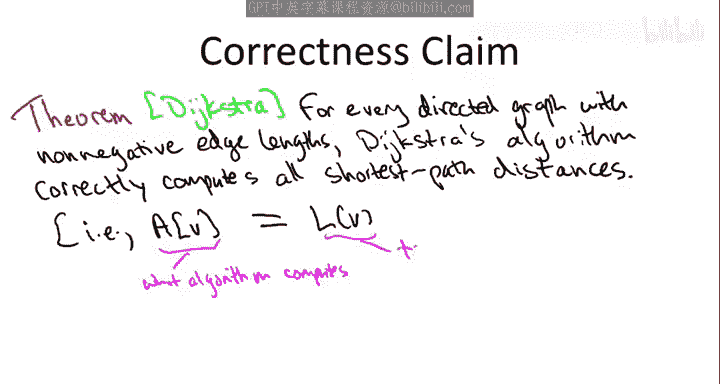
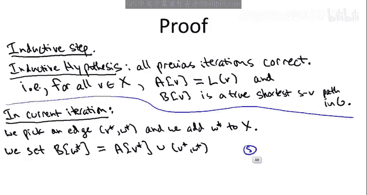
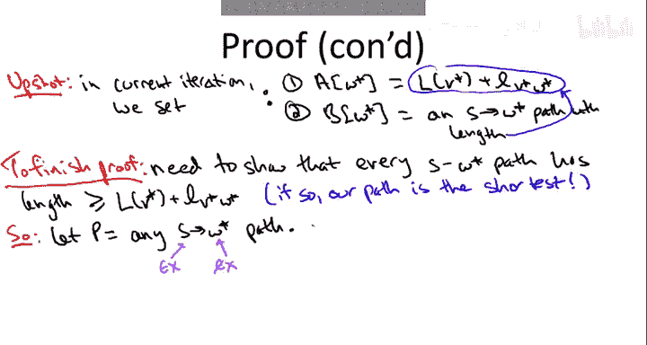
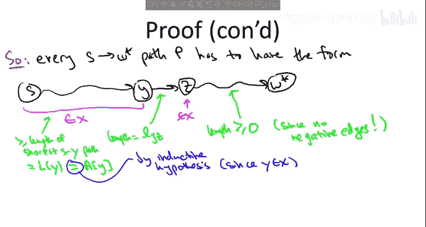

# 算法启蒙（第2册）：图算法和数据结构｜Part 2 Graph Algorithms and Data Structures：P14：-14-11   3   Dijkstra算法正确性证明（高级）

在本节课程中，我们将学习并证明Dijkstra算法在边权均为非负值的任意有向图中，确实能计算出正确的最短路径。

## 概述

我们将证明Dijkstra算法的正确性。证明的核心思想是使用数学归纳法，并依赖于一个关键事实：算法在每一步都选择具有最小“Dijkstra贪婪分数”的边来扩展已处理的顶点集合。我们将看到，只要所有边的长度都是非负的，这个贪心策略就能保证我们找到的路径确实是最短的。

## Dijkstra算法回顾

首先，让我们回顾一下Dijkstra算法的基本框架。它的精神与我们之前学过的图搜索原语（特别是广度优先搜索）非常相似。

*   算法维护一个已处理顶点的集合 **X**。
*   初始时，**X** 只包含源顶点 **S**。从 **S** 到自身的距离为0，最短路径为空路径。
*   算法进入一个主循环，共进行 **n-1** 次迭代，每次迭代将一个当前不在 **X** 中的顶点加入 **X**。

我们维护一个不变式：对于集合 **X** 中的所有顶点，我们已经计算出了从源点 **S** 到该顶点的最短路径距离的估计值，并且也计算出了最短路径本身。我们始终假设从源点 **S** 到其他每个目标顶点 **V** 至少存在一条路径，我们的任务是计算最短的那条。此外，我们必须假设所有边的长度都是非负的，否则Dijkstra算法可能会失败。

## 算法的关键选择

Dijkstra算法的核心在于如何谨慎地选择下一个从 **X** 外部加入 **X** 的顶点。具体做法如下：

我们扫描跨越“前沿”的边。所谓“前沿”，指的是连接已处理区域（**X** 内）和未处理区域（**X** 外）的边。也就是说，我们查看所有尾在 **X** 内、头在 **X** 外的边。

对于每一条这样的边，我们计算其 **Dijkstra贪婪分数**。该分数的定义是：我们已经计算出的、从 **S** 到尾顶点 **v** 的最短路径距离（因为 **v** 在 **X** 中），再加上这条边 **vw** 本身的长度。

在所有从左到右跨越前沿的边中，我们选择具有最小贪婪分数的边。记这条边为 **(v\*, w\*)**。顶点 **w\*** 将被加入 **X**。

然后，我们计算这个新顶点 **w\*** 的最短路径距离：它等于到 **v\*** 的最短路径距离加上边 **(v\*, w\*)** 的长度。而最短路径本身，就是之前计算出的到 **v\*** 的最短路径，再在末尾加上这条边 **(v\*, w\*)**。

## 待证明的命题

我们将要证明的正式命题是：对于任意有向图，只要没有负边权，Dijkstra算法就能完美地计算出所有正确的最短路径距离。这意味着算法实际计算出的距离 **A[v]**，恰好等于真实的最短路径距离 **L[v]**。

这个算法及其正确性由荷兰计算机科学家Edsger Dijkstra在20世纪50年代末确立，他后来在1972年获得了图灵奖。

## 证明结构：归纳法

我们的证明将采用归纳法。基本思想是：算法的每一次迭代，当我们承诺某个新顶点的最短路径距离时，这个承诺都是正确的。因此，归纳的形式是基于Dijkstra算法的迭代次数。

和大多数归纳法证明一样，**基础情况**是平凡的。在开始主循环之前，我们承诺从 **S** 到 **S** 的最短路径距离为0，最短路径为空路径。这显然是正确的（这里也利用了边权非负的假设，因为任何非空路径的长度都不可能小于0）。

困难的部分在于**归纳步骤**，即证明算法未来的所有决策都是正确的。在证明中，我们必须用到“每条边长度非负”这个假设，否则定理就不成立。

## 归纳步骤：设定与目标

现在，让我们进入归纳步骤。首先，我们需要陈述**归纳假设**：我们假设到目前为止没有犯任何错误。

更正式地说，对于集合 **X** 中的每一个顶点 **v**（即我们已经处理过的所有顶点），我们计算出的最短路径距离估计值 **A[v]** 实际上就是真实的最短路径距离 **L[v]**。同时，我们计算出的最短路径 **B[v]** 实际上就是一条从 **S** 到 **v** 的真实最短路径。

我们假设这在当前迭代之前的所有迭代中都成立，并将在证明当前迭代的正确性时利用这个假设。

在当前迭代中，我们选择了一条边 **(v\*, w\*)**，并将这条边的头顶点 **w\*** 加入集合 **X**。

根据算法的定义，我们为 **w\*** 指定的“最短路径”是：之前计算出的（据称是）从 **S** 到 **v\*** 的最短路径 **B[v\*]**，然后在末尾加上直接边 **(v\*, w\*)**。

用图表示，就是我们已经有了一条从 **S** 到 **v\*** 的路径，然后我们在末尾加上一跳到达 **w\***。我们将把这一整条路径赋值给 **B[w\*]**。

现在，让我们使用归纳假设。归纳假设说所有之前的迭代都是正确的，因此我们之前为 **v\*** 计算出的路径 **B[v\*]** 确实是一条从 **S** 到 **v\*** 的真实最短路径。所以，这条路径的长度就是 **L[v\*]**（**L[v\*]** 的定义就是从 **S** 到 **v\*** 的真实最短路径距离）。

因此，我们为 **w\*** 展示的这条路径（即 **B[v\*]** 加上边 **(v\*, w\*)**）的长度就是 **L[v\*] + l(v\*, w\*)**。根据算法，我们为 **w\*** 计算的距离 **A[w\*]** 正是Dijkstra贪婪分数，即到尾部 **v\*** 的计算距离加上边 **(v\*, w\*)** 的长度。根据归纳假设，**A[v\*]** 是正确的，等于 **L[v\*]**，所以 **A[w\*] = L[v\*] + l(v\*, w\*)**。

到目前为止，我们还没有进行证明的核心部分，只是在“摆放多米诺骨牌”。我们在当前迭代中做了两件事：
1.  我们为从源点到新顶点 **w\*** 的距离给出了一个估计值：**L[v\*] + l(v\*, w\*)**。
2.  我们在数组 **B** 中存储了一条从 **S** 到 **w\*** 的真实路径，其长度正好是这个值。

现在，为了完成归纳步骤（从而完成Dijkstra算法的正确性证明），我们需要证明：我们展示的这条从 **S** 到 **w\*** 的路径，不仅仅是任意一条路径，而是所有可能路径中最短的那一条。换句话说，我们需要证明图中任何其他从 **S** 到 **w\*** 的路径 **P**，其长度都至少等于这个画圈的值 **L[v\*] + l(v\*, w\*)**。

## 证明核心：任意路径的下界

让我们开始证明。考虑任意一条从 **S** 到 **w\*** 的路径 **P**。我们需要证明它的长度至少是 **L[v\*] + l(v\*, w\*)**。

这条路径 **P** 可能看起来非常复杂，但我们有一个关键观察：任何从 **S** 开始、到达 **w\*** 的路径，都必须穿越“前沿”。因为路径始于 **S**，而 **S** 始终在集合 **X** 内；路径终于 **w\***，而 **w\*** 在本轮迭代开始时不在 **X** 内。因此，路径 **P** 在某个时刻必须从 **X** 内部穿越到 **X** 外部。

让我们关注路径 **P** 第一次穿越前沿的时刻。假设它通过一条从顶点 **y** 到顶点 **z** 的边穿越前沿。也就是说，路径 **P** 的形式是：先是一段完全在 **X** 内的前缀（从 **S** 到 **y**），然后通过边 **(y, z)** 第一次离开 **X** 到达 **z**，之后可能再随意游走，但最终到达 **w\***。注意，**z** 和 **w\*** 可能是同一个顶点，这完全不影响论证。

现在，我们利用这个结构来给出路径 **P** 长度的下界。

我们将路径 **P** 分解为三部分：
1.  **前缀**：从 **S** 到 **y**，完全在 **X** 内。
2.  **跨越边**：从 **y** 到 **z** 的直接边 **(y, z)**。
3.  **后缀**：从 **z** 到 **w\*** 的剩余部分。

让我们分别分析这三部分的长度下界：

*   **后缀 (z -> w\*)**：这部分路径可能包含多条边。由于我们假设所有边长度非负，因此这部分路径的总长度至少为 **0**。这是我们在证明中第一次（也是唯一一次）使用“边权非负”的假设。
*   **跨越边 (y -> z)**：这部分就是边 **(y, z)** 本身的长度 **l(y, z)**。
*   **前缀 (S -> y)**：这部分是从 **S** 到 **y** 的一条路径。显然，它的长度至少等于从 **S** 到 **y** 的最短路径距离 **L[y]**。根据我们的归纳假设，顶点 **y** 在 **X** 中，我们已经正确计算出了它的最短路径距离 **A[y] = L[y]**。因此，前缀的长度至少为 **L[y]**。

将这三部分的下界相加，我们得到路径 **P** 的总长度至少为：
**L[y] + l(y, z) + 0 = L[y] + l(y, z)**

## 应用Dijkstra贪婪准则

为什么这个下界有用呢？我们还有一个尚未使用的关键假设：Dijkstra算法的贪婪选择准则。

请注意，边 **(y, z)** 是一条从左（**X** 内，**y**）到右（**X** 外，**z**）跨越前沿的边。因此，在本轮迭代中，这条边完全有资格被算法考虑用来扩展前沿。

根据Dijkstra贪婪准则，算法在所有这样的边中，选择了具有最小Dijkstra贪婪分数的那一条，即 **(v\*, w\*)**。贪婪分数的定义正是 **L[尾顶点] + l(边)**。

因此，对于边 **(y, z)**，其贪婪分数 **L[y] + l(y, z)** 必然大于或等于我们选择的边 **(v\*, w\*)** 的贪婪分数 **L[v\*] + l(v\*, w\*)**。因为我们是选取了最小的那个。

于是，我们得到：
**路径 P 的长度 ≥ L[y] + l(y, z) ≥ L[v\*] + l(v\*, w\*)**

这正是我们需要证明的！我们证明了任意一条从 **S** 到 **w\*** 的竞争路径 **P**，其长度都至少等于我们算法为 **w\*** 计算出的路径长度。

## 总结

让我们总结一下证明的所有关键步骤：

1.  **算法构造的路径**：Dijkstra算法为 **w\*** 构造了一条路径：之前计算出的到 **v\*** 的最短路径加上边 **(v\*, w\*)**。这条路径的长度是 **L[v\*] + l(v\*, w\*)**。
2.  **竞争路径分析**：为了证明这是最短的，我们考虑任意一条竞争路径 **P**。我们观察到 **P** 必须穿越前沿，并将其分解为前缀、跨越边和后缀三部分。
3.  **长度下界**：
    *   前缀长度 ≥ 到其终点 **y** 的最短距离 **L[y]**（由归纳假设保证）。
    *   跨越边长度 = **l(y, z)**。
    *   后缀长度 ≥ **0**（由边权非负假设保证）。
    *   因此，**P** 的长度 ≥ **L[y] + l(y, z)**。
4.  **贪婪选择决胜**：边 **(y, z)** 是跨越前沿的候选边。Dijkstra算法选择了贪婪分数最小的边 **(v\*, w\*)**。因此，**L[y] + l(y, z) ≥ L[v\*] + l(v\*, w\*)**。
5.  **得出结论**：结合3和4，得到 **P** 的长度 ≥ **L[v\*] + l(v\*, w\*)**。这意味着算法找到的路径不比其他任何路径长，因此它就是最短路径。

这个论证构成了归纳步骤，证明了单次迭代的正确性。由于我们有一个平凡正确的基础情况，并且每一次迭代的正确性都依赖于之前所有迭代的正确性，因此通过数学归纳法，我们证明了Dijkstra算法的所有迭代都是正确的。最终，算法为所有顶点计算出的最短路径距离都是正确的。

**本节课中，我们一起学习了Dijkstra算法正确性的完整证明。** 我们看到了如何利用归纳法、路径分解、非负边权假设以及算法本身的贪婪选择准则，来严谨地论证该算法在边权非负的有向图中总能找到最短路径。理解这个证明有助于我们深入掌握贪心算法的设计思想及其正确性保证的条件。