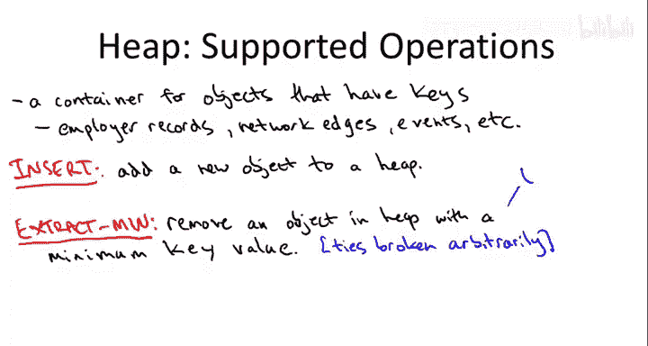
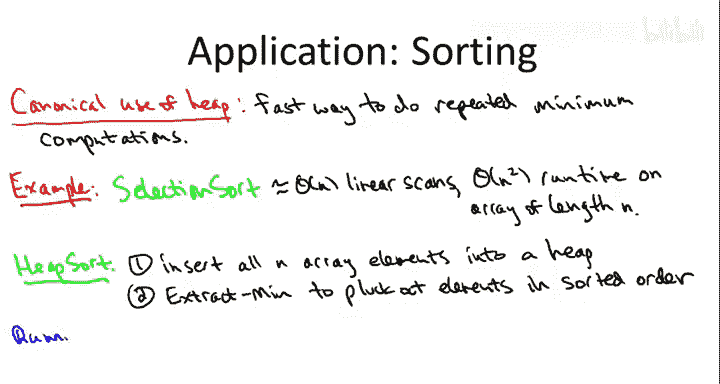
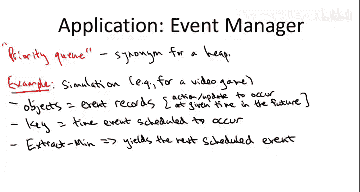
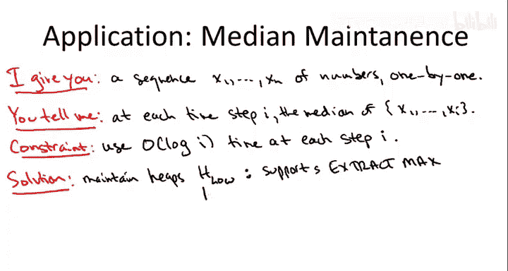
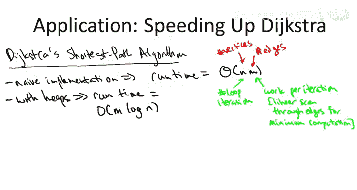

# 算法启蒙（第2册）：图算法和数据结构｜P17：-17-12 堆：操作与应用 🧱

在本节课中，我们将要学习堆（Heap）这种数据结构。我们将明确堆支持哪些操作、这些操作的预期运行时间，并了解堆适用于解决哪些类型的问题。我们首先关注如何作为使用者来使用堆，其具体实现细节将在后续视频中探讨。

## 堆的基本概念

堆是一种用于存储多个对象的容器。每个对象都应有一个键（Key），例如一个数字，以便我们可以比较不同对象的键值大小。

**示例对象与键：**
*   对象可以是员工记录，键是社会保险号。
*   对象可以是网络中的边，键是边的长度或权重。
*   对象可以表示事件，键是该事件预定发生的时间。



## 堆支持的操作与运行时间

对于一个数据结构，首先需要记住它支持哪些操作，其次是这些操作的预期运行时间。

堆本质上支持两个基本操作：
1.  **插入（Insert）**：将一个带键的对象插入堆中。
2.  **提取最小键值对象（Extract Min）**：从堆中移除并返回具有最小键值的对象。

在我们的讨论中，允许键值重复（平局）。当从存在重复最小键值的堆中执行提取操作时，规范并未指定返回哪一个，你只会得到其中一个具有最小键值的对象。

当然，你也可以选择实现一个**最大堆（Max Heap）**，它总是返回具有最大键值的对象。如果你只有最小堆，可以通过在插入前将所有键值取反，然后使用 `Extract Min` 来模拟提取最大键值对象。

**运行时间保证：**
在堆的标准实现中，上述两个操作的运行时间都是**对数级别**的，具体是 `O(log n)`，其中 `n` 是堆中对象的数量。其常数因子通常很小。

## 堆的附加操作

除了核心操作，堆还可以支持一些附加操作，值得了解。

以下是堆可以支持的一些附加操作：
*   **堆化（Heapify）**：此操作可以在线性时间内初始化一个堆。如果你有 `n` 个对象，逐个插入需要 `O(n log n)` 时间，但堆化操作能以 `O(n)` 的时间批量完成。
*   **任意删除（Delete）**：虽然有些微妙，但可以实现从堆中删除任意元素（而不仅仅是最小值），其运行时间也是对数级别的。我们将在使用堆加速迪杰斯特拉算法时用到此操作。



## 堆的应用场景

上一节我们介绍了堆的基本操作，本节中我们来看看堆的典型应用场景。使用堆最常见的原因是，你发现程序正在执行**重复的最小值计算**，尤其是通过穷举搜索的方式。我们将看到，通过简单地应用堆，可以极大地提升这类算法的速度。

### 应用一：堆排序（Heap Sort）

让我们从最经典的计算问题——排序开始。选择排序（Selection Sort）是一种直观但次优的算法：它反复扫描未排序数组，找到最小元素并放到正确位置。这需要进行 `O(n)` 次线性扫描，总时间为 `O(n^2)`。

这正符合“重复进行穷举搜索以计算最小值”的模式。我们可以用堆来优化。

**堆排序算法：**
1.  将数组中的所有元素插入一个最小堆。
2.  反复从堆中提取最小元素，并依次放入结果数组中。

**运行时间分析：**
我们进行了 `n` 次插入和 `n` 次提取，每次操作耗时 `O(log n)`。因此，总运行时间为 `O(n log n)`。

**代码描述：**
```python
def heap_sort(arr):
    heap = MinHeap()
    for num in arr:
        heap.insert(num)
    sorted_arr = []
    while not heap.is_empty():
        sorted_arr.append(heap.extract_min())
    return sorted_arr
```



**总结：**
我们通过识别选择排序中的重复最小值计算模式，引入堆数据结构，成功地将一个 `O(n^2)` 的算法优化为最优的 `O(n log n)` 比较排序算法。堆排序是一个实用且高效的算法。

### 应用二：事件模拟与优先队列（Priority Queue）

在这个应用中，堆通常被称为**优先队列**。设想你需要编写一个物理世界模拟软件，例如篮球视频游戏。

**场景：**
*   对象是**事件记录**（如“球在特定时间到达篮筐”）。
*   键是事件的**时间戳**（预定发生的时间）。
*   模拟需要反复找出**下一个即将发生的事件**（即时间戳最小的事件）。

如果维护一个无序事件列表并通过线性扫描找最小值，效率低下。这同样是重复的最小值计算问题。



**解决方案：**
将所有事件记录存储在一个最小堆中，键为时间戳。每当需要获取下一个事件时，只需执行一次 `O(log n)` 的 `Extract Min` 操作即可。

### 应用三：动态中位数维护（Median Maintenance）

这是一个不那么直观但很能体现堆巧思的应用。

**问题描述：**
你被要求实时接收一系列数字（一张张索引卡）。在每次接收到一个新数字后，你需要立即返回当前所有已接收数字的**中位数**。要求每次计算中位数的耗时仅为 `O(log i)`，其中 `i` 是当前已接收的数字数量。

**解决方案提示：**
使用**两个堆**。

以下是使用两个堆维护动态中位数的核心思路：
*   **`H_low`（低堆）**：一个最大堆，用于存储**较小的一半**数字。
*   **`H_high`（高堆）**：一个最小堆，用于存储**较大的一半**数字。
*   **关键不变量**：始终保持 `H_low` 中的元素是当前所有数字中较小的一半，`H_high` 中的是较大的一半。当总数为奇数时，允许其中一个堆多一个元素。

**算法流程：**
1.  将新数字 `x` 与 `H_low` 的最大值（即当前较小一半中的最大值）比较。
2.  如果 `x` 小于等于该值，则将其插入 `H_low`；否则插入 `H_high`。
3.  **重新平衡**：如果某个堆的元素数量比另一个堆多出超过1个，则从元素多的堆中提取其极值（从 `H_low` 提取最大值，或从 `H_high` 提取最小值），并插入另一个堆。
4.  **查询中位数**：
    *   如果两个堆大小相等，中位数是两个堆顶元素的平均值。
    *   如果大小不等，中位数是元素更多的那个堆的堆顶元素。

每次插入和可能的重新平衡都只涉及常数次堆操作，因此每次更新耗时 `O(log i)`。

### 应用四：加速迪杰斯特拉算法（Dijkstra‘s Algorithm）

迪杰斯特拉最短路径算法有一个核心的 `while` 循环，在朴素实现中，每次循环迭代都需要通过穷举搜索计算一个最小值。这再次落入了堆的“能力范围”。

通过精心部署堆（具体是一个优先队列），我们可以将迪杰斯特拉算法的运行时间从 `O(mn)`（其中 `m` 是边数，`n` 是顶点数）这个较大的多项式时间，显著降低到近乎线性的 `O(m log n)`。虽然比线性多了一个对数因子，但这使得该算法变得极其高效。具体细节将在专门讨论迪杰斯特拉算法优化的视频中阐述。

## 总结 🎯



本节课中我们一起学习了堆数据结构。我们明确了堆的核心是支持**插入**和**提取最小（或最大）值**操作，且这些操作能在 `O(log n)` 的对数时间内完成。我们认识到，当遇到需要**重复计算最小值**（尤其是通过穷举搜索）的问题时，应考虑使用堆来优化。通过堆排序、事件模拟（优先队列）、动态中位数维护以及加速迪杰斯特拉算法等多个应用实例，我们看到了堆如何将低效的算法转化为高效、实用的解决方案。