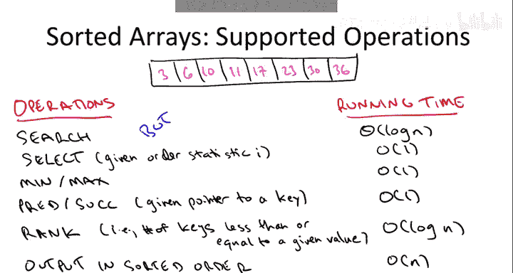
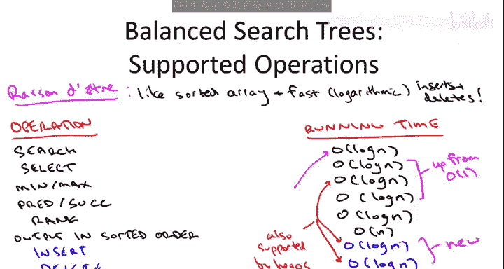

# 算法启蒙（第2册）：图算法和数据结构｜Part 2 Graph Algorithms and Data Structures：P19：-19-13 Balanced Search Trees Operations and Applications

在本节课中，我们将要学习最后一个，但同样重要的数据结构：平衡二叉搜索树。我们将从客户端的视角开始，了解这个数据结构支持哪些操作，以及它的实际用途。接着，我们将深入其内部实现，理解这些操作为何具有特定的运行时间。

## 📚 概述：平衡二叉搜索树是什么？

平衡二叉搜索树可以被视为一个动态版本的排序数组。如果你的数据存储在这种结构中，你几乎可以执行所有在静态排序数组上能进行的操作。此外，它还能高效地处理数据的插入和删除，从而适应动态变化的数据集。

## 🔍 从排序数组看支持的操作

为了理解平衡二叉搜索树支持的操作，让我们先从一个排序数组开始，看看在这种存储方式下可以轻松完成哪些任务。

假设我们有一个存储数值数据的数组。这些数值通常是每条记录的**唯一标识符**，例如员工ID、社保号或网络数据包ID等。

以下是排序数组上容易实现的一些操作：

**1. 搜索**
在排序数组中搜索通常使用**二分查找**。其核心思想是每次递归都将搜索范围缩小一半，因此运行时间为**对数时间** `O(log n)`。

**2. 选择**
选择问题是指，给定一个顺序统计量 `i`，找出数组中第 `i` 小的元素。在排序数组中，这非常简单：直接返回数组中第 `i` 个位置的元素即可，运行时间为**常数时间** `O(1)`。寻找最小值和最大值是选择问题的特例。

**3. 前驱与后继**
给定一个元素（例如23），前驱操作返回数组中比它小的下一个元素（例如17），后继操作返回比它大的下一个元素（例如30）。在排序数组中，这只需要向前或向后移动一个位置，运行时间为**常数时间** `O(1)`。

**4. 排名**
排名操作询问数据集中有多少个键小于或等于给定的键。例如，23的排名是6。实现排名操作与搜索类似：对给定键执行二分查找，搜索终止的位置索引（或相邻位置）即为其排名。其运行时间也为**对数时间** `O(log n)`。

**5. 顺序输出**
按顺序（如从小到大）输出所有存储的键。在排序数组中，只需从左到右扫描一次数组即可，运行时间为**线性时间** `O(n)`。

## 🚀 动态数据的需求与平衡二叉搜索树的优势

上一节我们介绍了排序数组支持的一系列强大操作。然而，现实世界的数据通常是动态变化的。例如，公司员工名单会随着新员工加入和老员工离职而改变。因此，我们需要一个不仅能支持上述操作，还能高效处理插入和删除的数据结构。

在排序数组中，插入和删除操作通常需要移动大量元素以维持有序性，其运行时间为**线性时间** `O(n)`，这在频繁更新的场景下是不可接受的。

**平衡二叉搜索树的设计目标**，正是要实现与排序数组同样丰富的操作集合，同时支持快速的插入和删除。虽然部分操作（如选择、前驱、后继）的运行时间会从常数时间变为对数时间，但所有核心操作（包括插入和删除）都能在对数时间内完成。

以下是平衡二叉搜索树支持的操作及其运行时间总结：

*   **搜索**：`O(log n)`
*   **选择**：`O(log n)` （在排序数组中为 `O(1)`）
*   **最小值/最大值**：`O(log n)` （在排序数组中为 `O(1)`）
*   **前驱/后继**：`O(log n)` （在排序数组中为 `O(1)`）
*   **排名**：`O(log n)`
*   **顺序输出**：`O(n)`
*   **插入**：`O(log n)` （排序数组为 `O(n)`）
*   **删除**：`O(log n)` （排序数组为 `O(n)`）

关键结论是：如果你的数据具有来自全序集（如数值）的键，并且你需要利用这些键的排序信息进行多种处理，那么平衡二叉搜索树是一个非常强大的选择。

## ⚖️ 与其他数据结构的比较

尽管平衡二叉搜索树功能强大，但我们也需要了解其他数据结构的适用场景，因为它们在某些特定任务上可能表现更优。

**1. 排序数组**
如果你的数据集是**静态的**，不需要插入和删除，那么排序数组是最佳选择。它能以常数或对数时间完成所有查询操作，且实现简单高效。

**2. 堆**
堆是一个动态数据结构，支持对数时间的插入和删除（`O(log n)`），并能高效地追踪最小（或最大）元素。然而，它不能同时追踪最小和最大值，也不支持基于键的任意搜索、排名等操作。如果你的应用场景类似于**优先队列**，只需要快速获取最值并进行插入删除，那么堆是更轻量、更高效的选择（常数因子更优）。

**3. 哈希表**
哈希表极其擅长处理**插入、查找（有时包括删除）**，并能提供**平摊常数时间** `O(1)` 的性能。但是，哈希表完全不维护键之间的任何顺序信息。如果你只需要快速判断一个键是否存在或进行快速检索，而不关心最小值、最大值或排序，那么哈希表是比平衡二叉搜索树更优的选择。

## 📝 总结

本节课中，我们一起学习了平衡二叉搜索树的核心概念。我们首先从客户端视角出发，将其理解为动态的排序数组，并详细列举了它支持的一系列丰富操作，包括搜索、选择、前驱后继、排名以及顺序遍历，特别是其高效的对数时间插入和删除能力。

接着，我们探讨了平衡二叉搜索树与其他数据结构的比较：对于静态数据，排序数组更优；对于只需要最值操作的动态场景，堆更高效；对于仅需快速存在性检查的场景，哈希表性能最佳。平衡二叉搜索树的强大之处在于它在一个数据结构中集成了对有序键值的多种动态操作，是处理需要利用顺序信息的动态数据集的理想选择之一。