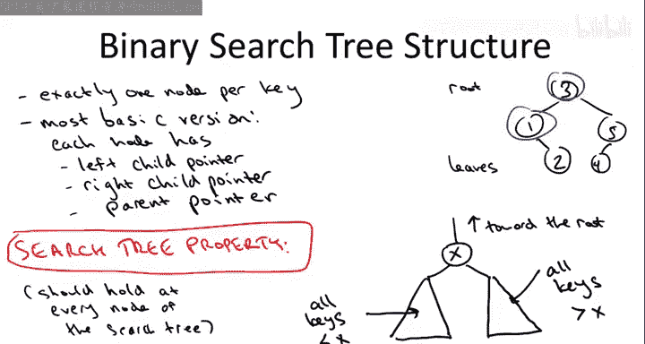
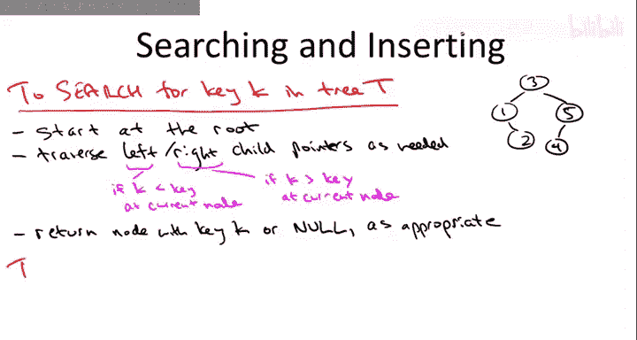

# 算法启蒙（第2册）：图算法和数据结构｜P20：-20-13 二叉搜索树基础，第一部分 🌳

在本节课中，我们将学习如何实现二叉搜索树的基础知识。我们不会在本视频中讨论平衡性，这将在后续视频中深入探讨。我们将关注所有二叉搜索树（无论是否平衡）都具备的通用特性。

## 概述：为什么需要二叉搜索树？ 🎯

首先，让我们回顾一下使用这种数据结构的原因。平衡版本的二叉搜索树本质上是一个**动态版本的排序数组**。它几乎能完成排序数组的所有操作，虽然时间可能稍长，但仍然非常快。更重要的是，它是动态的，支持高效的插入和删除操作。

在排序数组中，每次插入或删除都可能需要线性时间，这在大多数应用中代价过高。相比之下，平衡搜索树可以在对数时间内完成插入、删除和搜索操作。此外，它还能解决选择问题（如查找最小值或最大值），并能在线性时间内按顺序输出所有键值。

## 二叉搜索树的结构 🏗️

接下来，我们来看看二叉搜索树是如何组织的。本节内容对平衡和非平衡搜索树均适用，平衡性将在后续视频中讨论。

二叉搜索树的核心要素是节点和指针。树中的每个节点对应一个存储的键值。在实际数据结构中，节点通常包含一个键值和一个指向更多信息（如员工数据）的指针。为简化讨论，我们假设节点只包含键值。

每个节点包含三个指针：一个指向左子节点，一个指向右子节点，一个指向父节点。这些指针可以为空。例如，在右侧的示例树中，键值为1的节点左子指针为空，右子指针指向键值为2的节点，父指针指向键值为3的节点。

## 搜索树属性 🔑

搜索树属性是二叉搜索树最根本的特性。它断言：对于树中的任意节点，其左子树中的所有键值都小于该节点的键值，其右子树中的所有键值都大于该节点的键值。

用公式表示，若节点键值为 **x**，则：
*   左子树中所有键值 **< x**
*   右子树中所有键值 **> x**

此属性必须对树中的**每一个**节点都成立。我们假设所有键值互异。若允许重复键值，只需约定如何处理相等情况，例如规定左子树键值 **≤ x**，右子树键值 **> x**。

这个属性并非随意设定，而是为了使搜索操作变得简单。它确保了在搜索时，每一步都能明确地排除一半的搜索空间，这与二分查找的思想一致。

## 搜索树属性与堆属性的区别 ⚖️

这里需要区分搜索树属性与之前学过的堆属性。堆属性要求父节点小于（或大于）其子节点，旨在使查找最小（或最大）值变得容易（根节点即是）。而搜索树属性旨在优化搜索过程：要查找更小的值就向左，要查找更大的值就向右。两者服务于不同的操作优化目标。

## 搜索树的形态多样性 🌲

理解搜索树形态的多样性非常重要，这对后续理解平衡性至关重要。对于同一组键值集合，可以存在多种不同的、都满足搜索树属性的树结构。

例如，对于键值集合 {1, 2, 3, 4, 5}，可以构造出高度为2的平衡树，也可以构造出高度为4的链状树（如5->4->3->2->1）。树的高度（从根到叶子的最长路径跳数）可以从最佳情况下的 **O(log n)** 到最坏情况下的 **O(n)**。

## 基本操作实现 ⚙️

理解了二叉搜索树的基本结构后，我们现在可以探讨如何实现其支持的各种操作。以下将逐一介绍这些操作的高层描述，足以指导你编写自己的实现。

### 搜索操作 🔍

搜索操作直接利用了搜索树属性。我们从根节点开始查找键值 **K**：
1.  若当前节点键值等于 **K**，搜索成功。
2.  若 **K** 小于当前节点键值，根据搜索树属性，**K** 只可能存在于左子树中，因此递归搜索左子树。
3.  若 **K** 大于当前节点键值，则递归搜索右子树。
4.  如果沿着指针走到了空值（`null`），则说明 **K** 不在树中，搜索失败。

这个过程确保了每一步都能缩小搜索范围。

### 插入操作 ➕

插入操作建立在搜索的基础上。我们首先假设键值不重复：
1.  首先，搜索要插入的键值 **K**。由于没有重复，搜索必然会失败，并终止于一个空指针。
2.  此时，我们只需将这个空指针（来自其父节点）重新指向一个新创建的、包含键值 **K** 的节点。

例如，要在示例树中插入键值6，搜索会从根3到5，然后试图访问5的右子节点（为空）。我们就在5的右子节点位置插入新节点6。

如果允许重复键值，只需在搜索时约定遇到相等键值后的处理方式（例如，总是继续搜索左子树），最终同样会在一个空指针处插入新节点。

一个值得思考的练习是：按照此过程插入新节点后，整棵树依然保持搜索树属性。

## 总结 📝

本节课我们一起学习了二叉搜索树的基础知识。我们了解了其作为动态排序数组替代品的动机，掌握了其核心的**搜索树属性**，并认识到同一组键值可以构成高度差异巨大的不同搜索树。我们还初步探讨了**搜索**和**插入**这两个基本操作的高层实现逻辑，它们都巧妙地利用了搜索树属性来高效地定位目标位置。在接下来的课程中，我们将继续学习删除、遍历等其他操作，并深入探讨如何维护树的平衡性。