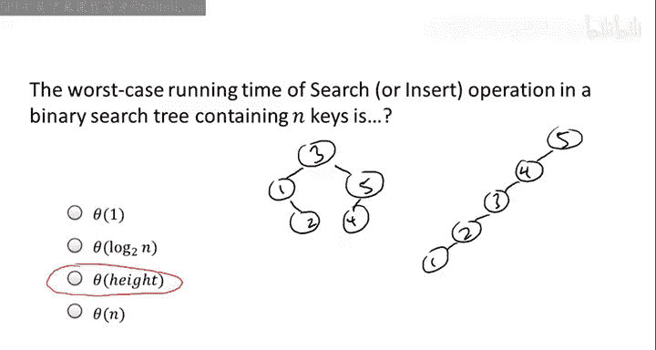
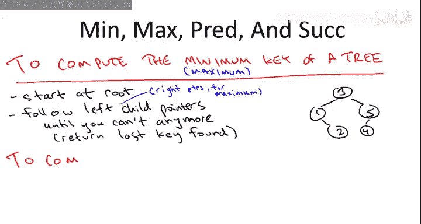
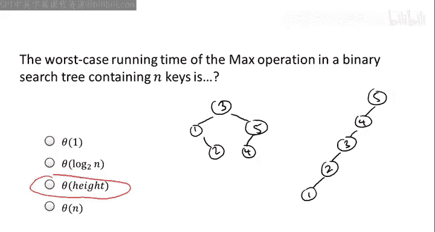
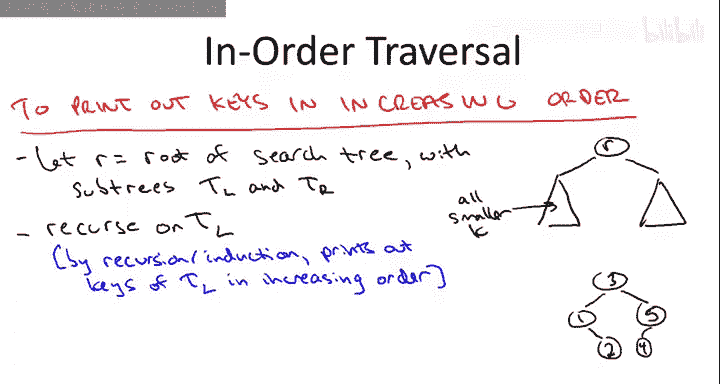
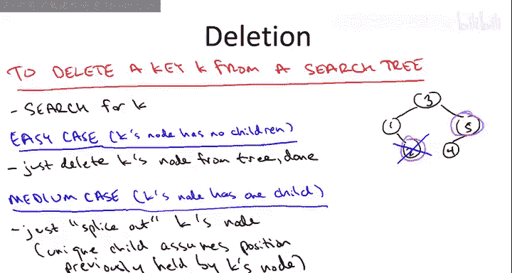
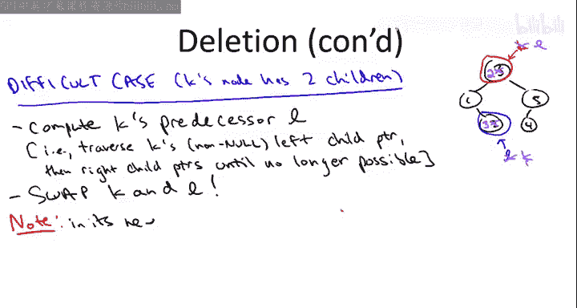
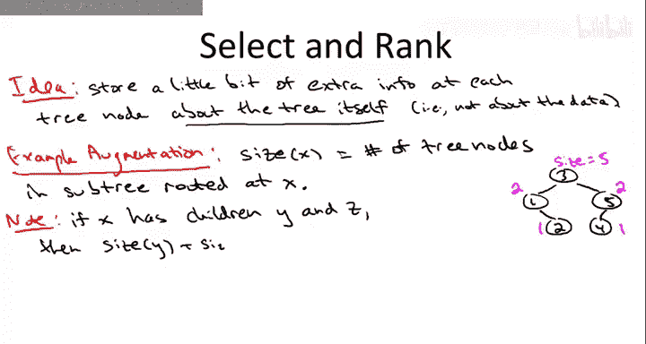
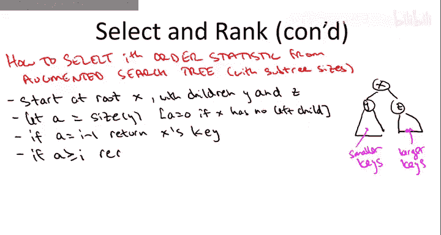

# 算法启蒙（第2册）：图算法和数据结构｜P21：-21-13 二叉搜索树基础（第二部分） 🌳

在本节课中，我们将继续学习二叉搜索树，深入探讨其核心操作的实现原理与时间复杂度。我们将涵盖搜索、插入、查找最小/最大值、查找前驱/后继、中序遍历、删除以及选择与排名等操作，并理解树的高度如何影响这些操作的性能。

---

## 搜索与插入的时间复杂度 ⏱️

上一节我们介绍了二叉搜索树的搜索和插入操作。本节中，我们来看看这些操作在最坏情况下的运行时间受什么因素影响。

二叉搜索树包含N个不同的键，以下哪个参数决定了搜索或插入操作的最坏情况时间？

*   树中键的数量 N
*   树中叶子节点的数量
*   树的高度
*   树中节点的平均深度

正确答案是第三个：**树的高度**决定了搜索或插入操作的最坏情况时间。这意味着，仅知道键的数量N不足以推断最坏情况的搜索时间，还必须了解树的结构。

为了理解这一点，让我们回顾之前用过的两个例子。一个树是平衡良好的，另一个树包含完全相同的五个键，但却是极度不平衡的，实际上就像一个链表。

在任何二叉搜索树中，执行搜索或插入操作的最坏情况时间，与从根节点出发，需要跟随左或右子指针直到遇到空指针的最大次数成正比。当然，在成功的搜索中，你会在遇到空指针之前终止，但在最坏情况或插入操作中，你会一直走到空指针。

*   在左边的平衡树中，你最多需要跟随三个这样的指针。例如，搜索2.5时，你会跟随一个左指针，然后一个右指针，再一个右指针，然后遇到空指针，总共跟随了三个指针。
*   在右边的不平衡树中，你可能需要跟随多达五个指针，然后第五个指针才为空。例如，搜索键0时，你将连续遍历五个左指针，最后在末尾遇到空指针。

因此，在最坏情况下，操作时间与树的高度成正比。如果是一棵像左边那样平衡良好的二叉搜索树，时间复杂度与键的数量N的对数成正比，即 **O(log N)**。如果是一棵像右边那样糟糕的搜索树，时间复杂度则与键的数量N成正比，即 **O(N)**。总的来说，搜索或插入时间与树的高度成正比，即从根节点到叶子节点所需的最大跳数。

---

## 更多支持的操作：最小/最大值、前驱/后继 🔍

让我们继续探讨搜索树支持的一些其他操作，这些操作是堆和哈希表等动态数据结构所不具备的。

首先是最小值和最大值操作。相比之下，在堆中，你可以轻松找到最小值或最大值，但不能同时轻松找到两者。而在搜索树中，可以非常容易地找到最小值或最大值。

让我们从最小值开始。一种思考方式是，在搜索树中搜索负无穷。你从根节点开始，持续跟随左子指针，直到无法继续（遇到空指针）。你最后访问的那个键必然是树中的最小键。因为，假设根节点不是最小值，那么最小值必然在左子树中。你跟随左子指针，然后重复这个论证。如果你还没有找到最小值，那么相对于当前位置，它必然在左子树中。你只需迭代，直到无法再向左移动。

例如，在我们运行的搜索树示例中，如果我们持续跟随左子指针，会从3开始，到1，然后尝试从1向左移动，遇到空指针，于是返回1。1确实是这棵树中的最小键。

既然我们已经了解了如何计算最小值，那么如何计算最大值也就不难猜到了。当然，要计算最大值，我们只需对称地跟随右子指针，这保证能找到树中的最大键，就像搜索正无穷的键一样。

接下来是计算前驱。这意味着给定树中的一个键（树中的一个元素），你想找到下一个最小的元素。例如，3的前驱是2，2的前驱是1，5的前驱是4，4的前驱是3。

我将简要说明，以便在合理时间内覆盖所有操作。需要指出的是，这里有一个非常简单的情况和一个稍复杂的情况。

简单情况是：当包含键K的节点有一个非空的左子树时。在这种情况下，你想要的正是该节点左子树中的最大元素。我留给你去正式证明，对于确实有非空左子树的键，这确实是计算前驱的正确方法。让我们通过检查示例树中具有左子树的节点来验证这一点。实际上只有两个节点有非空的左子树：节点3有一个非空的左子树，其左子树中的最大键确实是2，而2就是3的前驱；节点5的左子树只包含元素4，该子树中的最大值也是4，而4确实是整个搜索树中5的前驱。

较复杂的情况是：如果一个键根本没有左子树，该怎么办？给定这个包含键K的节点，你只有三个指针，根据假设，左指针为空，所以它无法带你去任何地方。右子指针，如果你仔细想想，对于计算前驱是完全无用的，因为前驱是一个小于给定键K的键，而根据二叉搜索树的定义，右子树只包含大于K的键。因此，要找到前驱，我们必须跟随父指针，可能不止一个父指针。

为了说明如何跟随父指针，让我们看看右边我们最喜欢的搜索树中的几个例子。从节点2开始。我们知道必须跟随一个父指针，当我们跟随2的父指针时，我们到达1，而1正是这棵树中2的前驱。所以计算2的前驱似乎只需要跟随父指针。

再看另一个例子，节点4。当我们跟随4的父指针时，我们到达5，而5不是4的前驱，它是4的后继。我们想要一个比我们起始点小的键，我们跟随了父指针，但它变大了。然而，如果我们再跟随一个父指针，我们就到达3。所以从2开始，我们需要跟随一个父指针；从4开始，我们需要跟随两个父指针。关键在于，你只需要持续跟随父指针，直到到达一个键小于你自身键的节点，此时你可以停止，这保证就是前驱。

希望你觉得这很直观。我必须说明，我并没有正式证明这是有效的，对于那些想要更深入理解搜索树及其神奇属性的人来说，这是一个很好的练习。

我还应该提到另一种解释终止条件的方式：当你第一次向左转时，你就会停止对父指针的搜索。也就是说，你第一次从一个右子节点转到其父节点时（即发生了一次向左的转向），你就到达了前驱。例如，当我们从2开始时，我们向左转（2是1的右子节点），我们一步就到达了前驱。相反，当我们从4开始时，第一步是向右（4是5的左子节点，所以它小于5），但当我们下一步向左转时，我们到达了一个节点，它不仅小于5，而且小于我们的起始点4。实际上，你会在第一次向左转时看到一个小于你起始点的键。

这是另一种陈述，我认为很直观，但形式上并不完全明显。我再次鼓励你仔细思考为什么这两种终止条件的描述是完全相同的。无论你是在第一次找到小于起始点的键时停止，还是在第一次跟随一个父指针（该指针从一个节点出发，且该节点是其父节点的右子节点）时停止，你都会在完全相同的时刻停止。我鼓励你思考为什么这些是完全相同的停止条件。

还有一些其他细节：如果你从唯一没有前驱的节点（即最小值节点）开始，你将永远不会触发这个终止条件。例如，如果你从搜索树中的节点1开始，不仅左子树为空（这意味着你应该开始遍历父指针），而且当你遍历父指针时，你只会向右转，永远不会向左转，这是因为没有前驱。这就是你检测自己处于搜索树最小值的方式。当然，如果你想计算一个键的后继而不是前驱，显然只需在整个描述中交换左和右即可。

以上就是对这些不同排序操作（最小值、最大值、前驱、后继）在搜索树中如何工作的高层次解释。让我问你一个与讨论搜索和插入时相同的问题：这些操作在最坏情况下需要多长时间？

答案与之前相同：与树的高度成正比。解释也完全相同。为了理解对高度的依赖，让我们只关注问题中提到的最大值操作。其他三个操作，由于完全相同的原因，在最坏情况下的运行时间也与高度成正比。最大值操作是做什么的？你从根开始，持续跟随右子指针，直到用完它们（遇到空指针）。所以运行时间不会比最长路径更差，它是一条从根到叶子的特定路径。因此，运行时间永远不会超过树的高度。另一方面，从根到最大键的路径很可能就是树中最长的路径，可能就是决定搜索树高度的路径。例如，在我们运行的不平衡例子中，对于最小值操作来说，这将是一棵糟糕的树。如果你在这棵树中寻找最小值，那么你将不得不遍历从5一直到1的每一个指针。当然，对于最大值操作，也存在一个类似的糟糕搜索树，其中1是根，5作为叶子在最底部。

---

## 中序遍历：按序输出所有键 📋

使用搜索树可以做的另一件事是，按排序顺序线性时间打印出所有键，每个元素耗时恒定。这模仿了排序数组的功能。显然，在排序数组中这很简单，你只需使用一个从开始到结束的for循环，逐个打印键。

在搜索树中，有一个非常优雅的递归实现可以完成完全相同的事情，这被称为二叉搜索树的**中序遍历**。

和往常一样，你从起点开始，即搜索树的根节点。用一点符号表示：让我们把以R的左子节点为根的搜索树称为T_L，把以R的右子节点为根的搜索树称为T_R。

在我们的运行示例中，根是3，T_L将对应仅包含元素1和2的搜索树，T_R将对应仅包含元素5和4的子树。

记住，我们想按递增顺序打印键。特别是，我们想打印的第一个键是所有键中最小的。所以我们绝对不想先打印根节点的键。例如，在我们的搜索树示例中，根节点的键是3，我们不想先打印它，我们想先打印1。那么最小值在哪里？根据搜索树属性，它必然在左子树T_L中。所以我们将递归处理T_L。

通过递归的魔力（或者你更喜欢归纳法），递归处理T_L将完成的任务是：我们将按从小到大的顺序打印出T_L中的所有键。这很酷，因为T_L恰好包含所有小于根节点键的键。记住，这是搜索树属性：所有小于根节点键的元素都必须在左子树中，所有大于根节点键的元素都必须在右子树中。

在我们的具体例子中，第一个递归调用将打印出键1和2。现在，如果你想一想，这正是打印根节点键的完美时机。我们想按递增顺序打印所有键。我们已经处理了所有小于根节点键的元素。递归处理右侧将处理所有大于它的元素。所以在两个递归调用之间（这就是为什么它被称为中序遍历），我们想打印出R的键。显然，这在我们的具体例子中是有效的：递归调用打印出1和2，这是打印3的完美时机，然后递归调用将打印出4和5。更一般地说，对右子树的递归调用将再次通过递归或归纳的魔力，按递增顺序打印出所有大于根节点键的键。

这个伪代码是正确的，这个所谓的中序遍历确实按递增顺序打印键，这一事实可以通过一个相当直接的归纳证明来验证。它与我们在课程早期讨论的分治算法正确性的归纳证明精神非常一致。

那么中序遍历的运行时间呢？**声明是：此过程的运行时间是线性的，即O(n)，其中n是搜索树中键的数量。** 原因是对树中的每个节点恰好有一次递归调用，并且在每次递归调用中只做恒定的工作。更详细地说，中序遍历按递增顺序打印键，特别是它恰好打印每个键一次。每个递归调用恰好打印一个键值。所以恰好有n次递归调用，而递归调用所做的只是打印一个东西。因此，n次递归调用，每次恒定时间，总体运行时间为O(n)。

---

## 删除操作：最复杂的部分 🗑️

在大多数数据结构中，删除是最困难的操作，搜索树也不例外。让我们深入探讨删除是如何工作的。删除有三种不同的情况。

首先要做的是定位包含键K的节点，即我们想要删除的节点。例如，假设我们正试图从运行的示例搜索树中删除键2。首先我们需要找出它在哪里。

搜索树中的一个节点可能拥有的子节点数量有三种可能性：它可能有零个子节点，可能有一个子节点，可能有两个子节点。对应于这三种情况，删除的伪代码也将有三种情况。

让我们从最简单的情况开始：当节点有零个子节点时，就像我们想从搜索树中删除键2的情况。那么，我们当然可以毫无保留地直接从搜索树中删除该节点。不会出任何问题，没有子节点依赖于该节点。

然后是中等难度的情况：当包含K的节点有一个子节点时。这里的例子是，如果我们想从搜索树中删除5。中等情况也不算太糟，你需要做的就是将被删除的节点拼接出来。这会在树中创建一个空洞，但随后被删除节点的唯一子节点将占据被删除节点之前的位置。

例如，在我们的五节点搜索树中，如果我们想删除5，我们会把它从树中取出，这会留下一个空洞，但我们只需用其唯一子节点4替换之前由5占据的位置。如果你仔细想想，这工作得很好，因为它保留了搜索树属性。记住，搜索树属性规定，比如说右子树中的所有元素都必须大于该节点的键。我们让4成为3的新右子节点，但4及其可能拥有的任何子节点始终是3的右子树的一部分。所以所有这些元素都必须大于3。因此，将4及其所有后代作为3的右子节点没有问题，搜索树属性实际上被保留了。

最后是困难的情况：当被删除的节点有两个子节点时。在我们运行的五节点例子中，只有当我们想删除根节点（即从树中删除键3）时，才会发生这种情况。问题当然是，你可以尝试将这个节点从树中撕掉，但随后会出现一个空洞，并且不清楚将任一子节点提升到那个位置是否可行。你可能会盯着我们的示例搜索树，试图理解如果你试图将1提升为根或将5提升为根会发生什么问题——问题就会发生。这与我们在堆中遇到相同问题时形成有趣的对比，因为堆属性在某种意义上可能限制较少，当我们想删除具有两个子节点的元素时（假设我们想执行提取最小操作），我们只需提升两个子节点中较小的那个。在这里，我们需要更努力一些。实际上，这将是一个非常巧妙的技巧。我们将做一些事情，将有两个子节点的情况简化为之前已解决的零个或一个子节点的情况。

以下是非常巧妙的方法：我们识别一个节点，我们将对其应用K=0或K=1的操作。我们将从K开始，计算K的前驱。记住，这是树中下一个最小的键。例如，键3的前驱是2，这是树中下一个最小的键。一般来说，让我们称此前驱为L。

这看起来可能很复杂：我们正在实现一个树操作（即删除），却突然调用了另一个树操作（前驱），这是我们几页幻灯片前介绍过的。在某种程度上你是对的，删除是一个非平凡的操作。但情况并不像你想象的那么糟，原因如下：当我们计算这个前驱L时，我们实际上处于前驱操作的简单情况中。概念上，你如何计算前驱？这取决于。它取决于什么？它取决于你是否有非空的左子树。如果你没有非空的左子树，那么你就必须做这件事：向上跟随父指针，直到找到一个小于你起始点的键。但如果你有一个左子树，那就很容易了。你只需找到左子树的最大值，那必然就是前驱。记住，找最大值很容易：你只需持续跟随右子指针，直到无法再跟随为止。很酷的是，因为我们只在节点有两个子节点的情况下才进行此前驱计算，所以我们只需要处理它有非空左子树的情况。因此，当我们说“计算K的前驱L”时，你要做的就是跟随K的非空左子节点（因为它有两个子节点），然后持续跟随右子指针，直到无法再跟随为止，那就是前驱。

现在，这是在搜索树中实现删除操作的相当精彩的部分：你交换这两个键K和L。例如，在我们的运行搜索树中，我们将在根位置放一个2，而不是原来的3；在叶子位置放一个3，而不是原来的2。第一次看到这个，你可能会觉得有点疯狂，甚至像是在作弊，好像我们完全无视了搜索树的规则。实际上，检查一下我们的示例搜索树发生了什么：我们交换了3和2，这不再是一棵搜索树了，对吧？我们有一个3在2的左子树中，而3大于2，这是不允许的，这违反了搜索树属性。哎呀，那么我们怎么能这样做呢？我们可以这样做，因为我们无论如何都要删除3，所以我们最终会得到一棵搜索树。我们可能稍微破坏了搜索树属性，但我们已经将K交换到了一个很容易摆脱的位置。

我们是如何计算K的前驱L的？最终，那是最大值计算的结果，这涉及到持续跟随右子指针直到卡住。L就是我们卡住的地方。“卡住”是什么意思？这意味着L的右子指针为空。它没有两个子节点，特别是它没有右子节点。一旦我们将K交换到L的旧位置，K现在就没有右子节点了。它可能有也可能没有左子节点。在右边的例子中，它在其新位置也没有左子节点。但一般来说，它可能有一个左子节点，但它肯定没有右子节点，因为那是一个最大值计算卡住的位置。

如果我们想删除一个只有零个或一个子节点的节点，嗯，我们知道该怎么做，我们在上一张幻灯片中已经介绍过：要么直接删除它（这就是我们在这个运行例子中所做的），要么在K的新节点确实有一个左子节点的情况下，你会执行拼接操作，即撕掉包含K的节点，该节点的唯一子节点将占据该节点之前的位置。

这里有一个练习，我不会在这里做，但我强烈鼓励你在私下里仔细思考：这个删除操作保留了搜索树属性。粗略地说，当你进行这种交换时，你可能会违反搜索树属性，正如我们在这个例子中看到的，但所有违规都涉及你即将删除的节点。所以一旦你删除了那个节点，就没有其他违反搜索树属性的情况了。因此，你就得到了一棵搜索树。

至于运行时间，这次不难猜出是什么，因为它基本上就是这些前驱计算之一，加上一些指针重连。就像前驱和搜索一样，它**由树的高度决定**。

---

## 选择与排名操作 📊

让我简单谈谈最后提到的两个操作：选择和排名。记住，选择就是选择问题：我给你一个顺序统计量，比如17，我希望你返回树中第17小的键。排名是：我给你一个键值，我想知道树中有多少个键小于或等于该值。

为了高效地实现这些操作，我们实际上需要一个小的新想法：用每个节点的附加信息来增强二叉搜索树。所以现在，一个搜索树不仅包含一个键，还包含关于树本身的信息。

这个想法通常被称为**增强你的数据结构**。对于像这样的搜索树，最经典的增强可能是在每个节点不仅跟踪一个键值，还跟踪以该节点为根的子树中的树节点数量。

让我们称之为`size(x)`，它是以x为根的子树中的树节点数量。

为了确保你明白我的意思，让我告诉你，在我们运行的搜索树示例中，五个节点的`size`字段应该是什么。再次记住，我们考虑的是以给定节点为根的子树中有多少个节点，或者等价地说，从该节点跟随子指针可以到达多少个不同的树节点。

*   从根节点开始，你当然可以到达所有人。每个人都在以根为根的树中。所以那里的`size`是5。
*   相反，如果你从节点1开始，你可以到达1，或者你可以跟随右子指针到达2。所以在节点1，`size`是2。
*   在键值为5的节点，出于同样的原因，`size`是2。
*   在两个叶子节点，以叶子为根的子树就是叶子本身。所以那里的`size`是1。

一旦你知道一个节点的两个子树的`size`，就有一个简单的方法来计算该节点的`size`。如果搜索树中的一个给定节点有子节点Y和Z，那么以X为根的子树中有多少个节点？有那些在左子树（以Y为根）中的节点，有那些在右子树（以Z为根，即可从Z到达的子节点）中的节点，还有X本身。公式为：`size(x) = size(y) + size(z) + 1`。

一般来说，每当你增强一个数据结构时（这是我们讨论红黑树时会再次谈到的事情），你必须付出代价。你维护的额外数据可能有助于加速某些操作，但每当你执行修改树的操作（特别是插入和删除）时，你必须注意保持这些额外数据的有效性，保持它们的维护。

就这些子树大小而言，在插入和删除下维护它们相当直接，不会太影响插入和删除的运行时间，但这确实是你在课外应该思考的事情。例如，当你执行插入时，记住它是如何工作的：你本质上执行一次搜索，跟随左和右子指针向下到树的底部，直到遇到空指针，那就是你插入新节点的地方。现在你需要做的是，沿着那条路径回溯，对新插入节点的所有祖先，将它们的子树大小增加1。

让我们通过展示如何在已增强的搜索树中实现选择过程（给定一个顺序统计量）来结束这个视频。在增强的搜索树中，每个节点都知道以该节点为根的子树大小。

当然，和往常一样，你从起点开始，在搜索树中就是根节点。假设根节点有子节点Y和Z。Y或Z可能为空，这没问题，我们只需将空节点的`size`视为零。

搜索树属性是什么？它说，小于存储在x处的键的键，正是那些在x的左子树中的键；树中大于x处键的键，正是你将在x的右子树中找到的键。

假设我们被要求找到搜索树中的第17个顺序统计量，即树中存储的第17小的键。它会在哪里？我们应该在哪里查找？嗯，这将取决于树的结构，实际上将取决于子树大小——这正是我们跟踪它们的原因，这样我们就可以快速做出关于如何导航通过树的决定。

举个简单的例子，假设x的左子树包含，比如说，25个键。记住，x本地确切地知道其子树中有多少键，所以从x我们可以在恒定时间内计算出y子树中有多少键，假设是25。根据搜索树的定义属性，这些是树中任何地方最小的25个键。x大于它们所有，x右子树中的所有元素也都大于它们所有。所以最小的25个顺序统计量都在以y为根的子树中。显然，我们应该在那里递归，答案就在那里。所以我们递归处理以Y为根的子树，然后我们再次在这个新的、更小的搜索树中寻找第17个顺序统计量。

另一方面，假设当我们从x开始时，我们询问y：你的子树中有多少个节点？也许y本地存储的数字是12，所以x的左子树中只有12个东西。好吧，x本身大于它们所有，所以x将是第13大的顺序统计量，它是树中第13大的元素。其他所有元素都在右子树中。所以特别是，第17个顺序统计量将在右子树中。因此，我们将在右子树中递归。现在我们在寻找什么？我们不再寻找第17个顺序统计量了。最小的12个元素都在x的左子树中，x本身是第13小的，所以我们正在寻找剩余元素中第4小的。这种递归非常类似于我们在课程早期讨论的分治选择算法。

为了填充更多细节，让我们用`a`表示在y处的子树大小。如果x没有左子节点，我们将定义`a`为零。

超级幸运的情况是，当左子树中恰好有`i-1`个节点时，这意味着这里的根x本身就是第`i`个顺序统计量。记住，它大于其左子树中的所有元素，并且小于其右子树中的所有元素。

但在一般情况下，我们要么在左子树递归，要么在右子树递归。
*   当左子树的数量足够大，保证它包含第`i`个顺序统计量时，我们在左子树递归。当左子树的大小至少为`i`时，就会发生这种情况，因为左子树拥有搜索树中任何地方最小的键。
*   在最后一种情况下，当左子树太小，不仅不包含第`i`个顺序统计量，而且x也太小而不能成为第`i`个顺序统计量时，我们在右子树递归，知道我们已经丢弃了原始树中最小的`a+1`个键值。

此过程的正确性几乎与我们早期讨论的选择算法的归纳正确性完全相同。实际上，搜索树的根充当了一个枢轴元素，左子树中的所有元素都小于根，右子树中的所有元素都大于根中的元素。这就是递归正确的原因。

至于运行时间，我希望从伪代码中可以明显看出，每次递归我们做恒定时间的工作。我们能递归多少次？我们不断向下移动树，我们能向下移动的最大次数与树的高度成正比。所以这**再次与高度成正比**。

以上就是选择操作。有一种类似的方法来编写排名操作：记住，这是给你一个键值，你想计算小于或等于该目标值的存储键的数量。同样，你使用这些增强的搜索树，同样你可以获得与高度成正比的运行时间。我鼓励你在课外思考如何实现排名的细节。

---

## 总结 📝

本节课中，我们一起深入学习了二叉搜索树的核心操作及其性能。我们了解到，几乎所有基本操作（搜索、插入、查找最小/最大值、前驱/后继、删除、选择、排名）的运行时间在最坏情况下都与**树的高度**成正比。平衡良好的树（高度为O(log N)）能提供高效的性能，而不平衡的树（高度为O(N)）则性能低下。我们还学习了中序遍历如何以线性时间输出排序后的键，以及通过维护子树大小信息，可以实现高效的选择和排名操作。理解这些基础是后续学习如何保持二叉搜索树平衡（例如通过AVL树、红黑树）的关键。