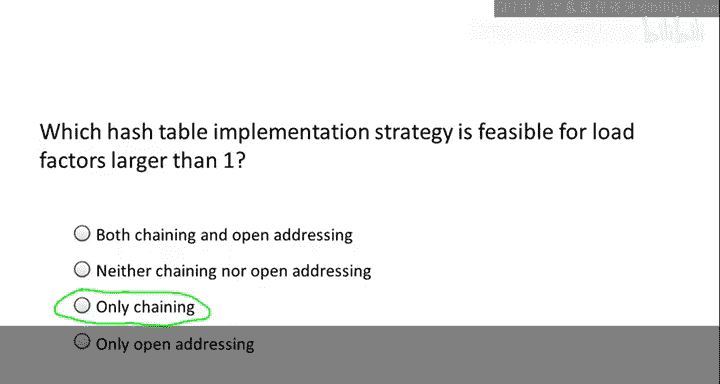
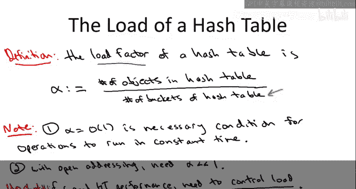

# 算法启蒙（第2册）：图算法和数据结构｜Part 2 Graph Algorithms and Data Structures：P26：病态数据集与通用哈希动机

在本节课中，我们将深入学习哈希表，并更深入地理解它们在何种条件下能表现出优异的性能。我们将探讨一个核心观点：每个哈希函数都有其“克星”——一个特定的病态数据集，这引出了后续视频中需要谨慎处理的数学问题。

## 哈希表快速回顾

哈希表的根本目的是实现极快的查找操作，理想情况下是常数时间查找。当然，为了有数据可查，哈希表也必须支持插入操作。有时，哈希表也允许删除元素，这取决于底层的具体实现。例如，在使用链地址法（每个桶对应一个链表）时，删除操作很容易实现；而在使用开放地址法时，删除可能比较复杂。

我们最初讨论哈希表时，鼓励你像看待数组一样从逻辑上理解它。区别在于，哈希表不是通过数组位置索引，而是通过存储的键来索引。就像数组支持常数时间的随机访问一样，哈希表也旨在支持常数时间的查找。

然而，哈希表有一些附加条件。第一个条件是哈希表必须被正确实现。这包含两层含义：一是桶的数量应与存储的数据量相匹配；二是必须使用一个足够好的哈希函数。我们在之前的视频中讨论过劣质哈希函数的风险，在接下来的视频中，我们将对哈希函数提出更严格的要求。第二个条件是数据不能是“病态的”。在某种意义上，每个哈希表都有其克星，存在一个能使其性能变得非常糟糕的病态数据集。

## 处理冲突的方法

在关于实现细节的视频中，我们讨论了哈希表如何不可避免地处理冲突。在哈希表被填满之前，你就会遇到冲突。因此，你需要某种方法来处理映射到同一个桶的两个不同键。有两种流行的方法：

**链地址法**：这是一个非常自然的想法，你只需将所有哈希到同一个桶的元素都保留在该桶中。你通过一个链表来跟踪所有这些元素。例如，在第17号桶中，你会找到所有哈希到桶17的元素。

**开放地址法**：这种方法要求每个桶只存储一个键。如果两个键都映射到桶17，你必须为其中一个找到另一个位置。处理方式是，你要求哈希函数不仅提供一个桶，而是提供一个完整的探测序列。如果你尝试插入到桶17但17已被占用，你就转到探测序列中的下一个桶尝试插入，如果再次失败，就继续尝试序列中的第三个桶，依此类推。我们简要提过两种指定探测序列的方式：
*   **线性探测**：如果你在桶17失败，就移到18，然后是19、20、21，直到找到一个空桶并插入新元素。
*   **双重哈希**：你使用两个哈希函数的组合。第一个哈希函数指定初始探测的桶，第二个哈希函数指定后续每次探测的偏移量。例如，对于元素“Alice”，如果两个哈希函数分别给出数字17和23，那么对应的探测序列将是：首先尝试17，失败则尝试40，再失败则尝试63，然后是86，以此类推。

在本课程中，我们通常会更多地讨论链地址法，这并不意味着链地址法更重要，而是因为它在数学上更容易分析，使我们能够给出完整的证明。而开放地址法的完整证明超出了本课程的范围。

## 负载因子

有一个非常重要的参数在决定哈希表性能方面起着重要作用，那就是**负载因子**，通常用 α 表示。

负载因子的定义很简单：`α = （已插入且未删除的元素数量） / （哈希表中桶的数量）`。

正如你所料，当你向哈希表中插入越来越多的元素时，负载会增加。在保持哈希表中元素数量不变的情况下增加桶的数量，负载会下降。

为了确保负载因子的概念清晰，并且你清楚不同的冲突解决策略，下一个测验将询问关于链地址法和开放地址法实现中相关α的范围。

正确答案是第三个选项。负载因子大于1对于使用链地址法实现的哈希表是有意义的（尽管可能不是最优的），但对于使用开放地址法的哈希表则没有意义。原因很简单：在开放地址法中，每个桶只能存储一个对象。因此，一旦对象数量超过桶的数量，就没有地方放置剩余的对象，哈希表会在负载因子大于1时崩溃。另一方面，在链地址法中，负载因子大于1没有明显问题。例如，你可以想象负载因子等于2，即向一个有1000个桶的哈希表中插入2000个对象，在理想情况下，每个桶的链表里只有两个对象。

接下来，我们做一个简单但非常重要的观察，这是哈希表获得良好性能的必要条件，这也涉及到第一个注意事项：如果你期望获得良好性能，就必须正确实现哈希表。

第一个要点是：**只有保持负载因子为常数，你才能获得常数时间的查找**。

对于使用开放地址法的哈希表，这一点非常明显，因为你需要α不仅为O(1)，还必须小于1（即小于100%满载），否则哈希表会因为无法容纳所有项目而崩溃。即使对于使用链地址法实现的哈希表，虽然负载因子大于1在逻辑上可行，但如果你想要常数时间的操作，也必须保持负载因子不要远大于1。例如，如果你有一个包含n个桶的哈希表，并哈希了n log n个对象，那么每个桶的平均对象数将是对数级的。记住，当你进行查找时，在哈希到桶之后，你必须遍历该桶中的链表进行穷举搜索。因此，如果你在n个桶的哈希表中存储了n log n个对象，你预期的查找时间更像是对数时间，而不是常数时间。

对于开放地址法，我们讨论过，你不仅需要α等于O(1)，还需要α小于1。实际上，α最好远低于1，你不希望让开放地址表的负载达到90%或类似的程度。所以，我写的是“需要α远小于1”，这意味着你不希望负载增长到太接近100%，否则性能会下降。

再次强调，我希望这一页的要点是清晰的：如果你想要良好的哈希表性能，你需要负责的事情之一就是控制负载因子。对于开放地址法，保持负载因子最多为一个小的常数；对于链地址法，保持负载因子远低于100%。

你可能会想，控制负载是什么意思？毕竟，你编写这个哈希表时，并不知道客户端会用它做什么，他们可以随意插入或删除。那么，如何控制α呢？实际上，在哈希表实现内部，你可以控制的是桶的数量，即α的分母。如果分子（元素数量）开始增长，你可以在某个点让分母也增长。实际的哈希表实现会跟踪哈希表的人口（存储的对象数量）。随着插入的东西越来越多，实现会确保分母以相同的速率增长，即桶的数量也增加。如果α超过了某个目标值（比如0.75或0.5），你可以将哈希表中的桶数量翻倍。你定义一个新的哈希表，使用一个范围加倍的新哈希函数。现在，由于分母翻倍，负载下降了一半。这就是你控制它的方法。同样，如果空间非常紧张，你也可以在发生大量删除时（例如在链地址法实现中）缩小哈希表。

这是关于为了获得哈希表性能的期望保证，在底层必须正确处理的第一点：你必须控制负载，使哈希表的大小大致等于你存储的对象数量。

第二件必须正确处理的事情，我们在实现视频中已经提到过，就是**必须使用足够好的哈希函数**。一个好的哈希函数能将数据均匀地分散到各个桶中。真正理想的是一个能独立于数据而表现良好的哈希函数，这也是本课程迄今为止的主题：无论输入是什么，算法都能保证运行得非常快。你可能会想，这正是你想从这样的课程中学到的东西：学习那个总是表现良好的“秘密”哈希函数。

不幸的是，我不会告诉你这样的哈希函数。原因不是我备课不充分，也不是因为人们不够聪明而未能发现这样的函数。问题要根本得多：**这样的函数不可能存在**。也就是说，**每个哈希函数都有其克星，存在一个病态数据集，在该数据集下，这个哈希函数的性能会和你见过的最糟糕的常数哈希函数一样差**。

原因相当简单，这实际上是哈希函数从某个巨大的宇宙（键空间）压缩到一个相对较小数量的桶时，不可避免的结果。让我详细说明。

固定任何一个你能想象到的最聪明的哈希函数h。这个哈希函数将某个宇宙U映射到索引为0到n-1的桶。记住，在所有有趣的情况下，宇宙的大小是巨大的，所以U的基数应该比n大得多，这是我在这里的假设。

例如，你可能在记录人名，宇宙U是长度最多为30个字符的字符串集合，而n在任何应用中都将远小于26的30次方。

现在，我们使用鸽巢原理的一个变体。我断言，这n个桶中至少有一个桶，必须至少有宇宙中键数量的1/n部分映射到它。也就是说，存在一个桶i（0 ≤ i ≤ n-1），使得至少有 |U| / n 个键在哈希函数h下被映射到i。

理解这一点的方法是记住哈希函数的映射图景：原则上，它将宇宙中的每个键映射到这些桶中的一个。哈希函数必须把每个键放到n个桶中的某一个里，所以其中一个桶必须至少获得所有可能键的1/n部分。一个更具体的思考方式是，想象一个用链地址法实现的哈希表，并在脑海中想象你将宇宙中的每一个键都哈希进这个哈希表。这个哈希表将过度拥挤到疯狂的程度，你永远无法在计算机上存储它，因为它将包含U的全部对象，但它只有n个桶，所以其中一个桶必须至少有U/n比例的对象。

这里的要点是：**无论哈希函数是什么，无论你构建得多么巧妙，总会存在某个桶（比如31号桶），它获得了宇宙中至少其“公平份额”的映射**。既然我们已经识别出这个桶（31号桶），其中至少有宇宙的1/n部分映射到它，那么要构建我们的病态数据集，我们只需从这些映射到31号桶的元素中挑选。

对于这样的数据（我们可以让这个数据尽可能大，因为|U|/n是难以想象的大，因为U本身难以想象的大），在这个数据集中，所有东西都会冲突。哈希函数将每一个元素都映射到31号桶，这将导致糟糕的哈希表性能，其性能并不比朴素的链表解决方案好。例如，在桶31发生冲突的哈希表中，你只会找到一个包含所有插入哈希表内容的链表。对于开放地址法，可能更难看出会发生什么，但同样，如果所有东西都冲突，你最终基本上会得到线性时间的性能，与常数时间性能相去甚远。

现在，对于那些认为这似乎只是无意义的抽象数学的人，我想说明两点。首先，至少这些病态数据集告诉我们，我们将不得不以一种不同于以往讨论算法的方式来讨论哈希函数。当我们讨论归并排序时，我们说它无论输入是什么都在O(n log n)时间内运行；讨论Dijkstra算法时，它无论输入是什么都在O(m log n)时间内运行；深度优先搜索、广度优先搜索都是线性时间，无论输入是什么。对于哈希函数，我们将不得不说一些不同的话：我们不能说哈希表无论输入是什么都有良好的性能，这一页幻灯片表明那是错误的。

我想指出的第二点是，虽然这些病态数据集当然不太可能随机出现，但有时你会担心有人为你的哈希函数构造病态数据，例如在拒绝服务攻击中。Crosby和Wallach在2003年的一篇研究论文中有一个非常聪明的例子说明了这一点。

Crosby和Wallach的主要观点是，存在许多现实世界的系统（他们最有趣的应用可能是一个网络入侵检测系统），你可以通过利用设计不良的哈希函数使它们瘫痪。这些应用都关键性地使用了哈希表，而这些系统的可行性完全依赖于从哈希表获得常数时间的性能。因此，如果你能为这些哈希表展示一个病态数据集，使其性能退化为线性（退化为简单的链表解决方案），这些系统就会被破坏，它们会崩溃或无法运行。

我们在上一张幻灯片中看到，每个哈希表确实都有自己的克星，即存在一个病态数据集。但问题是：如果你试图对这些系统之一进行拒绝服务攻击，你如何想出这样的病态数据集？Crosby和Wallach研究的系统通常表现出两个属性：首先，它们是开源的，你可以检查代码，看到它们使用的是哪个哈希函数；其次，哈希函数通常非常简单，它是为了速度而设计的，结果就是，仅仅通过检查代码，就很容易逆向工程出一个确实能破坏哈希表、使其性能退化为线性的数据集。

例如，在网络入侵检测应用中，有一个哈希表只是记录经过的数据包的IP地址，因为它正在寻找可能表明某种入侵的数据包模式。Crosby和Wallach展示了如何向系统发送一批带有巧妙选择的发送者IP的数据包，确实使系统崩溃，因为哈希表的性能爆炸性增长到不可接受的程度。

那么，我们该如何应对“每个哈希函数都有病态数据集”这一事实呢？这个问题既有实际意义（例如，如果我们担心有人构造病态数据集实施拒绝服务攻击，我们应该使用什么哈希函数？），也有数学意义（如果我们不能给出像之前那样的数据独立保证，我们如何在数学上说明哈希函数具有良好的性能？）。

让我提两种解决方案。第一种解决方案更多是针对实际问题的：如果你担心有人构造病态数据集，你应该实现什么样的哈希函数？有一些叫做**加密哈希函数**的东西，例如SHA-2（它实际上是一个针对不同桶数的哈希函数族）。这些内容超出了本课程的范围，你会在密码学课程中学到更多。显然，你可以用这些关键词在网上查找并阅读更多信息。

我想指出的一点是，像SHA-2这样的加密哈希函数本身也有病态数据，它们有自己的“克星”版本。它们在实践中表现良好的原因是，找出这个病态数据集是不可行的。与Crosby和Wallach在其应用程序源代码中发现的非常简单的哈希函数不同（在那里很容易逆向工程出坏的数据集），对于像SHA-2这样的东西，没有人知道如何逆向工程出坏的数据集。当我说“不可行”时，我指的是通常的密码学意义上的不可行，类似于人们会说如果正确实现RSA密码系统，破解它是不可行的，或者分解大数在一般情况下是不可行的，等等。

关于加密哈希函数我就说这么多。我还想提第二种解决方案，它在实践中是合理的，并且我们可以在数学上对其说一些事情，那就是**使用随机化**。

更具体地说，我们不会设计一个单一的巧妙哈希函数，因为我们已经知道，单一的哈希函数必然有病态数据集。相反，我们将设计一个非常巧妙的**哈希函数族**，然后在运行时，我们将从这个族中随机选择一个哈希函数使用。

现在，我们想要并且能够证明的关于哈希函数族的保证，将非常类似于快速排序的精神。回想一下，在快速排序算法中，对于几乎任何固定的枢轴选择序列，都存在一个病态输入，会使快速排序退化为二次运行时间。我们的解决方案是随机化快速排序，即不在运行时预先承诺任何特定的选择枢轴的方法，而是随机选择枢轴。我们证明了关于快速排序的什么？我们证明了对于任何可能的输入（任何可能的数组），快速排序的平均运行时间是O(n log n)，其中平均是对快速排序运行时随机选择求取的。在这里，我们将做同样的事情：现在我们将能够说，对于任何数据集，平均而言（关于我们运行时选择的哈希函数），哈希函数将表现良好，即它会均匀地分散数据。我们颠倒了上一张幻灯片中的量词：之前我们说，如果我们预先承诺一个单一的哈希函数（固定一个h），那么存在一个能破坏该哈希函数的数据集；这里我们颠倒了它，我们说对于每个固定的数据集，随机选择的哈希函数平均将在该数据集上表现良好，就像在快速排序中一样。

请注意，这并不意味着我们不能让我们的程序开源。我们仍然可以发布代码，说明“这是我们的哈希函数族，代码中将从这个集合中随机选择一个哈希函数”。但关键在于，通过检查代码，你将无法知道算法在运行时做出了什么随机选择，因此你对实际的哈希函数一无所知，也就无法为运行时选择的哈希函数逆向工程出病态数据集。

接下来的几个视频将详细阐述第二种解决方案，即使用运行时随机选择的哈希函数，作为一种在每一个数据集上（至少在平均意义上）都能表现良好的方法。

让我给你一个接下来学习路径的路线图。

我将把这个随机化解决方案的细节讨论分成三个部分，分布在两个视频中。

在下一个视频中，我们将从一个定义开始：我所说的“哈希函数族”是什么意思，以至于如果你随机选择一个，你很可能会做得相当好。这个定义被称为**通用哈希函数族**。

然而，一个数学定义本身几乎毫无价值。要使它有价值，它必须满足两个属性：首先，必须有有趣且有用的例子满足这个定义，也就是说，必须存在有用的、符合这个通用族定义的哈希函数。所以第二件事将是向你展示它们确实存在。数学定义需要的另一件事是应用，即如果你能满足这个定义，那么好事就会发生。这将是第三部分。

## 总结

本节课中，我们一起学习了哈希表性能的关键因素。我们明确了要获得常数时间操作，必须控制负载因子α为常数。更重要的是，我们认识到**不存在一个对任何数据集都表现完美的单一哈希函数**，每个哈希函数都存在能使其性能急剧下降的病态数据集。这促使我们转向使用**随机化**策略，即从一个精心设计的**哈希函数族**中随机选择哈希函数，从而为任何固定的输入数据集提供平均意义上的良好性能保证，这为后续学习通用哈希函数族的概念奠定了基础。