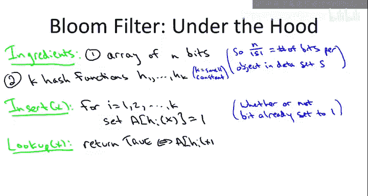

# 算法启蒙（第2册）：图算法和数据结构｜Part 2 Graph Algorithms and Data Structures：P27：布隆过滤器基础

在本节课中，我们将要学习一种名为**布隆过滤器**的数据结构。这是一种由Burton Bloom在1970年提出的、比普通哈希表更节省空间的数据结构。它的代价是，在进行查找操作时，存在一个非零的**误报概率**。尽管如此，它在许多实际应用中仍然非常有用。


## 概述：布隆过滤器是什么？🤔

布隆过滤器是哈希表的一种变体。它支持快速的插入和查找操作，但其核心优势在于**极高的空间效率**。与需要存储键值对或对象指针的哈希表不同，布隆过滤器仅用于记录一个元素是否存在于集合中。这种设计带来了空间上的巨大节省，但也引入了**允许误报**（即可能错误地认为一个未插入的元素存在）的特性。

## 操作与性能：API与权衡⚖️

上一节我们介绍了布隆过滤器的基本概念，本节中我们来看看它具体支持哪些操作，以及其性能特点。

布隆过滤器主要支持两种操作：
*   **插入**：将一个元素添加到过滤器中。
*   **查找**：查询一个元素是否“可能”存在于过滤器中。

其性能特点是**插入和查找都非常快**，时间复杂度通常为O(k)，其中k是一个小常数（哈希函数的数量）。

你可能会问，既然哈希表也能实现快速的插入和查找，为什么还需要布隆过滤器？关键在于两者的权衡：

**优点：**
*   **极高的空间效率**：布隆过滤器每个元素占用的空间远小于哈希表，甚至可以比元素本身占用的空间还小。

**缺点：**
1.  **仅存储成员信息**：它不存储元素对象本身或指向它们的指针，只记录“见过”或“没见过”的状态。这类似于**哈希集合**。
2.  **不支持删除**：在基础的布隆过滤器实现中，很难安全地删除一个元素（类似于开放寻址法哈希表）。虽然有支持删除的变体，但更复杂。
3.  **存在误报**：这是布隆过滤器独有的缺点。它**不会有漏报**（即已插入的元素一定被认为存在），但**会有误报**（即未插入的元素可能被误认为存在）。

因此，选择使用布隆过滤器还是哈希表，取决于具体应用场景。如果空间极其宝贵，且可以容忍小概率的误报，那么布隆过滤器是理想选择。如果必须保证100%的准确性，则应使用哈希表。

## 应用场景：布隆过滤器用在哪里？💡

了解了布隆过滤器的特性后，我们来看看它在哪些实际场景中能发挥作用。以下是几个典型的应用示例：

*   **拼写检查器**：早期（约40年前）的一个应用。将所有字典单词插入布隆过滤器。检查文档时，对每个单词进行查找。若过滤器返回“存在”，则视为拼写正确；否则视为错误。虽然有小概率误报（将错词判为对），但在当时空间紧张的情况下是很好的权衡。
*   **禁用密码列表**：将过于简单或常见的密码插入布隆过滤器。当用户设置新密码时，进行查找。若过滤器返回“存在”，则拒绝该密码，要求用户重设。在此场景中，极低的误报率（如0.1%）是可以接受的，因为这仅意味着极少数用户的强密码被错误拒绝，需要再输一次。
*   **网络路由器**：这是当今布隆过滤器的“杀手级应用”。路由器需要处理海量数据包，对空间和速度要求极高。布隆过滤器可用于：
    *   跟踪被阻止的IP地址。
    *   记录缓存内容，避免不必要的查找。
    *   维护统计数据以检测拒绝服务攻击等。

## 实现原理：窥探内部机制🔧

前面我们讨论了布隆过滤器的用途，现在让我们深入其内部，看看它是如何实现的。其核心思想简单而巧妙。

布隆过滤器主要由两部分组成：
1.  **一个比特数组**：一个长度为`m`的数组，其中每个位置只存储一个**比特**（0或1），而不是一个桶或一个对象。空间效率以**每个对象占用的比特数** `m/n` 来衡量，其中`n`是插入元素的数量。我们可以将其调整到很小的值，例如**8比特/对象**。这意味着，即使要存储一个32位的IP地址，我们也只用了8位来“记住”它，空间效率极高。
2.  **多个哈希函数**：我们使用`k`个独立的、均匀分布的哈希函数（`k`是一个小常数，如3、4、5）。在实践中，有时使用两个哈希函数并通过线性组合生成`k`个哈希值就足够了。

以下是核心操作的伪代码：

**插入操作：**
当一个新对象`x`需要插入时，我们计算`k`个哈希值，并将数组中对应位置的比特位**设置为1**（无论它们之前是0还是1）。
```python
def insert(x):
    for i in range(k):
        index = hash_i(x) % m
        bit_array[index] = 1
```

**查找操作：**
当查找一个对象`x`时，我们计算`k`个哈希值，并**检查**数组中所有对应位置的比特位**是否都为1**。如果全是1，则返回“可能存在”；如果任何一个为0，则返回“肯定不存在”。
```python
def lookup(x):
    for i in range(k):
        index = hash_i(x) % m
        if bit_array[index] == 0:
            return False # 肯定不存在
    return True # 可能存在（但有误报概率）
```

## 为何没有漏报，却有误报？🎯

从上面优雅的代码中，我们可以快速理解其错误特性：



*   **没有漏报**：一旦一个元素被插入，其对应的`k`个比特位就被设置为1。由于比特位只会从0变成1，而不会从1变回0（在基础实现中），所以后续查找该元素时，一定会发现所有比特位都是1。因此，**已插入的元素永远不会被误判为不存在**。
*   **存在误报**：考虑一个从未插入的对象`y`。可能由于其他不同对象的插入，凑巧把`y`对应的`k`个比特位都设置成了1。当查找`y`时，过滤器会发现所有位都是1，从而错误地认为`y`存在。这就是**误报**。

因此，布隆过滤器用极小的空间开销和允许小概率误报的代价，换取了极高的空间效率。一个关键问题是：**我们能否在保持极低空间开销的同时，也将误报概率控制得非常低？** 这需要通过数学分析来回答，也是评估布隆过滤器是否实用的关键。

## 总结📚

本节课中我们一起学习了布隆过滤器。我们了解到它是一种**空间效率极高**的 probabilistic data structure（概率数据结构），支持快速插入和查找。其核心原理是使用一个**比特数组**和**多个哈希函数**来记录集合的成员信息。

布隆过滤器**不会产生漏报**，但**会产生误报**。这使得它特别适用于那些**空间成本是关键约束**，且**可以容忍偶尔误报**的应用场景，例如早期的拼写检查、现代网络路由器中的高速数据过滤、以及禁用密码列表等。

你需要记住，布隆过滤器是你编程工具箱中一个用于**空间优化**的特殊工具，在需要以极小内存快速判断“是否存在”且能接受微小错误率的场合，它会非常有用。