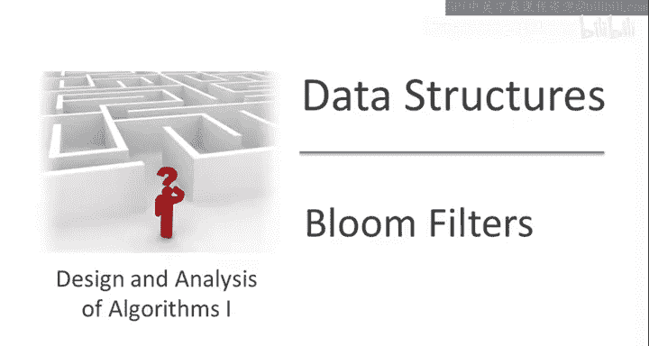
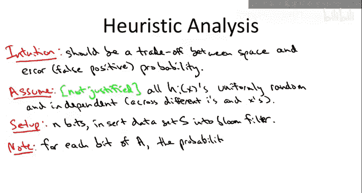
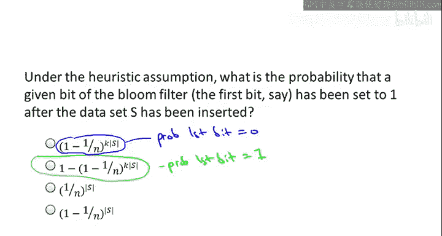
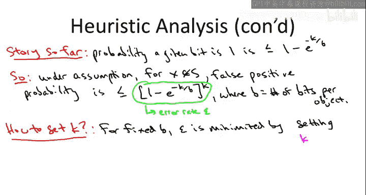

# 算法启蒙（第2册）：图算法和数据结构｜Part 2 Graph Algorithms and Data Structures：P28：布隆过滤器启发式分析

在本节课中，我们将要学习布隆过滤器的启发式分析。我们将通过一个简化的数学模型，来精确理解布隆过滤器在空间使用和错误率之间的权衡关系。通过分析，我们将找到设置参数（如哈希函数数量）的最优方法，并最终评估布隆过滤器在实际应用中的实用性。

## 分析目标与假设

上一节我们介绍了布隆过滤器的基本工作原理，本节中我们来看看如何对其性能进行量化分析。我们直观上知道，布隆过滤器需要在两种资源之间进行权衡：一种是空间消耗（使用的比特数），另一种是正确性（错误率）。我们希望理解，随着我们使用更多空间，错误率如何下降；反之，随着我们压缩表格、更多地复用比特，错误率如何上升。

为了使数学分析易于处理，我们将做出一个启发式假设。这个假设虽然在实际使用的哈希函数中并不严格成立，但它能帮助我们推导出布隆过滤器的性能保证。在实际实现中，你应该验证你的实现是否达到了理想分析所预测的性能水平。

以下是我们的核心假设：
*   我们假设所有的哈希行为都是完全随机的。
*   对于每个哈希函数 `H` 和每个可能的对象 `x`，哈希函数为该对象给出的数组位置（槽位）首先是均匀随机的。
*   并且，该输出独立于所有其他哈希函数在所有其他对象上的所有输出。

## 比特位被设置为1的概率

在分析错误率之前，我们先计算一个中间量：在将数据集 `S` 插入布隆过滤器后，数组中某个特定比特位被设置为1的概率。由于对称性，我们可以关注任意一个比特位，比如第一个比特位。

设总比特数为 `n`，哈希函数数量为 `k`，插入的对象数量为 `|S|`。一个比特位要始终保持为0，必须“躲过”所有插入操作中所有哈希函数产生的“飞镖”（即哈希命中）。每次哈希命中该比特位的概率是 `1/n`，未命中的概率是 `1 - 1/n`。

以下是计算过程：
1.  一个对象插入时，会进行 `k` 次哈希，相当于投掷 `k` 次飞镖。
2.  总共有 `|S|` 个对象被插入，因此总共投掷的飞镖数为 `k * |S|`。
3.  该比特位躲过所有飞镖的概率是 `(1 - 1/n)^(k * |S|)`。
4.  因此，该比特位最终被设置为1的概率 `p` 为：
    **p = 1 - (1 - 1/n)^(k * |S|)**

为了简化这个表达式，我们引入一个近似公式：对于任意实数 `x`，有 `(1 + x) ≤ e^x`。令 `x = -1/n`，我们可以得到：
**p ≤ 1 - e^(- (k * |S|) / n)**

我们进一步引入符号 `b` 来表示每个对象平均使用的比特数，即 **b = n / |S|**。那么上述不等式可以重写为：
**p ≤ 1 - e^(-k / b)**

这个表达式已经初步揭示了权衡关系：当每个对象分配的空间 `b` 增大时，指数项趋近于0，`p` 趋近于0，即数组中1的密度变小，这应该会降低错误率。

## 错误率（假阳性概率）分析

上一节我们计算了单个比特位为1的概率，本节中我们来看看如何计算我们真正关心的量——错误率。对于一个从未被插入布隆过滤器的对象 `x`，要发生一次假阳性（错误地认为它在集合中），必须满足一个条件：`x` 的所有 `k` 个哈希位都已经被设置为1。

由于我们假设哈希函数是独立的，每个比特位为1的概率（近似）为 `p`。因此，所有 `k` 个比特位都为1的概率，即假阳性概率 `ε`，约为 `p` 的 `k` 次方：
**ε ≈ (1 - e^(-k / b))^k**

这个公式就是我们寻求的量化权衡曲线。它明确显示了错误率 `ε` 如何随着每个对象使用的比特数 `b` 的增加而指数级下降。

## 参数优化与实用性评估

现在我们有了权衡公式，可以回答一个关键问题：如何设置哈希函数的数量 `k`？我们的目标是在固定的空间预算 `b` 下，最小化错误率 `ε`。

以下是优化步骤：
1.  对于固定的 `b`，将 `ε` 视为 `k` 的函数。
2.  通过微积分求导（此处作为练习），可以找到使 `ε` 最小的最优 `k` 值。
3.  最优解近似为：**k ≈ ln(2) * b**，其中 `ln(2) ≈ 0.693`。

将最优的 `k` 值代回错误率公式，我们可以得到在最优配置下，空间与错误率的关系：
**ε ≈ (1/2)^(ln(2) * b) ≈ (0.6185)^b**

或者，我们也可以将所需的比特数 `b` 表示为目标错误率 `ε` 的函数：
**b ≈ 1.44 * log₂(1/ε)**

这个关系非常有力：错误率随 `b` 指数下降。这意味着，只需将每个对象分配的比特数翻倍，就能将错误率平方，从而使其急剧减小。

那么，布隆过滤器实用吗？答案是肯定的。让我们看一个例子：
*   如果设置 `b = 8`（即每个对象仅用8比特，1字节），根据公式，最优 `k` 约为5或6，此时的错误率 `ε` 大约为 **2%**。这对于许多应用（如缓存旁路检查、拼写检查器）来说已经足够好。
*   如果将 `b` 增加到16（2字节），错误率会骤降到约 **0.02%**（五千分之一），而空间开销依然极小。

## 总结

本节课中我们一起学习了布隆过滤器的启发式分析。我们通过“完全随机哈希”的假设，推导出了空间使用率（`b`，每个对象的比特数）与假阳性错误率（`ε`）之间的精确权衡公式：**ε ≈ (1 - e^(-k / b))^k**。通过优化哈希函数数量 `k`（约为 `0.693 * b`），我们得到了最优性能，其错误率随空间增加呈指数下降：**ε ≈ (0.6185)^b**。

分析表明，布隆过滤器是一个非常实用的数据结构。即使为每个对象分配极少的空间（如8-16比特，远小于存储对象本身），也能在实现快速插入和查找的同时，将错误率控制在一个可接受的低水平（如1%-0.02%）。这使得它在需要极高效空间利用的众多场景中成为获胜方案。在实际应用中，应使用良好的哈希函数并在真实数据上测试，以确保达到接近理论分析的性能。