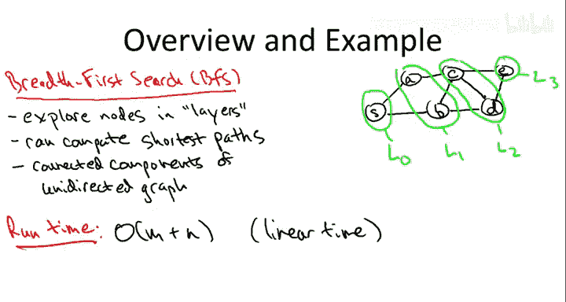
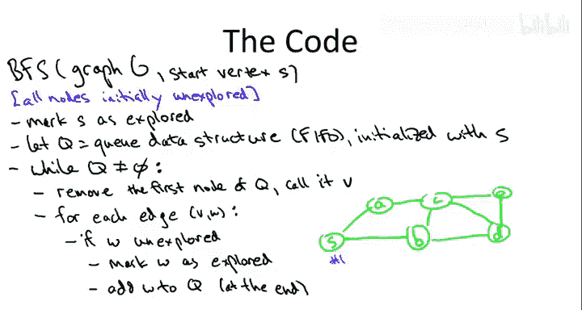

# 图算法和数据结构：04-10：广度优先搜索基础

在本节课中，我们将深入学习图的第一种具体搜索策略——广度优先搜索，并探讨其应用。

## 概述

广度优先搜索是一种系统性地探索图节点的方法，它从给定的起点开始，按“层”向外探索。本节将介绍其核心思想、实现细节以及线性时间复杂度的保证。

## 广度优先搜索的直观理解与应用

上一节我们介绍了图搜索的通用策略，本节中我们来看看广度优先搜索的具体做法。其计划是从给定的起点开始，按层系统地探索图的节点。

让我们思考以下示例图，其中 S 是广度优先搜索的起点。

起点 S 将构成第 0 层，我们称之为 L0。
然后，S 的邻居节点将成为第一层，即我们在探索 S 之后紧接着探索的顶点，这些是 L1。
第二层将是 L1 中顶点的邻居顶点，但这些顶点本身不在 L1 或 L0 中。因此，C 和 D 将成为第二层。
例如，S 本身是第 1 层中这些节点的邻居，但我们已经在前一层中计算过它，因此不将 S 计入 L2。
最后，L2 的邻居中尚未被归入任何层的是 E，因此那将是第 3 层。再次注意，C 和 D 是彼此的邻居，但它们已被归入第二层，因此它们属于第二层而非第三层。

这就是广度优先搜索的高层概览。我们将在下一张幻灯片中讨论如何精确实现它。

以下是你可以用广度优先搜索完成的一些事情，我们将在本视频中探讨：

*   **计算最短路径**：最短路径距离恰好对应于这些层。例如，如果你将 S 视为电影图中的凯文·贝肯节点，那么乔恩·哈姆将在从凯文·贝肯开始的广度优先搜索的第二层中出现。
*   **计算无向图的连通分量**：我们将在线性时间内计算图的各个部分。

在整个关于图基本操作的视频序列中，我们的目标都是达到线性时间这一“圣杯”。请记住，在图中有两个不同的规模参数：边的数量 M 和节点的数量 N。在这些视频中，我不假设 M 和 N 之间存在任何特定关系，任何一个都可能更大。因此，线性时间将意味着 O(M + N)。

## 线性时间实现

现在，让我们讨论如何在线性时间内实际实现广度优先搜索。

伪代码如下。输入是一个图 G。我将以无向图为例进行解释，但整个过程对于有向图的工作方式完全相同。显然，在无向图中，你可以沿任意方向遍历边；而在有向图中，你必须小心地只沿弧的预期方向（从尾部到头部，即向前）遍历。

正如我们在讨论图搜索通用策略时提到的，我们不想重复探索任何节点，那肯定是低效的。因此，我们将为每个节点保留一个布尔值，标记我们是否已经探索过它。默认情况下，我们假设节点是未探索的，只有当我们明确标记它们时，它们才被视为已探索。

我们将用起始顶点 S 初始化搜索：将 S 标记为已探索，然后将其放入我之前称为“已征服区域”的队列中。为了达到线性时间，我们需要以一种略微非朴素但相当直接的方式来管理这些节点，即通过一个队列。队列是一种先进先出的数据结构。

回想一下，在图搜索的通用系统方法中，技巧是在某个 while 循环的每次迭代中，向已征服区域添加一个新顶点，识别一个现在将被探索的未探索节点。

这个 while 循环将转化为我们检查队列是否非空的过程。我们假设队列数据结构支持在常数时间内进行该查询，这很容易实现。如果队列不为空，我们从中移除一个节点。因为它是队列，所以从队首移除节点可以在常数时间内完成。我们称从队列中取出的节点为 V。

现在，我们将查看它的邻居节点（即与其共享边的顶点），并检查它们中是否有尚未被探索的。如果 W 是我们以前没见过的节点（即未探索），这意味着它在未征服区域中，这很好，我们有了一个新的目标。我们可以将 W 标记为已探索，将其放入我们的队列中，这样我们就推进了边界，并且比之前多了一个已探索的节点。

同样，根据构造，队列支持在队尾进行常数时间的添加操作，因此我们将 W 放在那里。

让我们看看这段代码在我们上一张幻灯片看到的同一个图中是如何执行的。我将按照节点被探索的顺序为它们编号。

显然，第一个被探索的节点是 S，队列从这里开始。

现在，当我们执行代码时会发生什么？在 while 循环的第一次迭代中，我们问队列是否为空。不，它不为空，因为 S 在里面。因此，我们移除队列中的节点（在这种情况下是唯一的节点 S），然后迭代遍历与 S 相连的边。这里有两个：S 和 A 之间的边，以及 S 和 B 之间的边。算法没有告诉我们应该先看哪条边，实际上这无关紧要，任何一种都是广度优先搜索的有效执行。但为了具体起见，我们假设在两条可能的边中，我们先看边 (S, A)。

然后我们问：A 已经被探索过了吗？没有，这是我们第一次见到它。所以我们说，太好了，这是新的探索目标。我们可以将 A 添加到队列的末尾，并将 A 标记为已探索。因此，A 将成为第二个被标记的顶点。

在标记 A 为已探索并将其添加到队列后，我们回到 for 循环。现在我们继续处理 S 的第二条边，即 S 和 B 之间的边。我们问：B 已经被探索过了吗？这是我们第一次见到它。所以现在我们对 B 做同样的事情：将 B 标记为已探索，并将其添加到队列的末尾。此时，队列中首先是 A 的记录（因为它是我们在取出 S 后第一个放入的），然后 B 跟在 A 后面。

此时队列看起来是这样的。现在我们回到 while 循环，我们问队列是否为空？当然不是，它实际上有两个元素。现在我们从队列中移除第一个节点，在这种情况下是节点 A（它是在节点 B 之前放入的）。现在，我们查看所有与 A 相连的边。A 有两条相连的边：一条与 S 共享，另一条与 C 共享。

如果我们看 A 和 S 之间的边，那么在 if 语句中我们会问：S 已经被探索过了吗？是的，它已经被探索过了，那是我们开始的地方，所以没有理由对 S 做任何事情，它已经被移出队列了。因此，在 A 的这个 for 循环中，有两次迭代：一次涉及与 S 的边，我们完全忽略它；另一次是 A 与 C 共享的边，而 C 我们还没见过。所以在 for 循环的那部分，我们说，啊哈，C 是个新东西，新节点！我们可以将其标记为已探索并放入队列。这将是我们的第四个节点。

现在队列如何变化？我们移除了 A，所以现在 B 在队首，我们在队尾添加了 C。现在同样的事情发生：我们回到 while 循环，队列不为空，我们取出第一个顶点（这次是 B）。B 有三条相连的边：一条与 S 相连（无关紧要，我们已经见过 S）；一条与 C 相连（也无关紧要，因为我们已经见过 C，虽然我们刚刚才见到它，但我们已经见过了）；但 B 和 D 之间的边是新的。这意味着我们可以将节点 D 标记为已探索并添加到队列中。因此，D 将是我们看到的第五个节点。

现在队列中有元素 C，后面跟着 D。我们回到 while 循环，从队列中取出 C。它现在有四条边：与 A 的边无关紧要（我们已经见过 A）；与 B 的边无关紧要（我们已经见过 B）；与 D 的边无关紧要（我们已经见过 D）；但我们还没见过 E。所以当我们在 for 循环中处理 C 和 E 之间的边时，我们说，啊哈，E 是新的。因此，E 将成为第六个也是最后一个被标记为已探索的顶点，它将被添加到队列的末尾。

然后，在 while 循环的最后两次迭代中，D 将被移除，我们将遍历它的三条边，这些边都不相关，因为我们已经见过其他三个端点。然后我们回到 while 循环，移除 E。E 的边也不相关，因为我们已经见过其他端点。现在我们再次回到 while 循环，队列为空，我们停止。这就是广度优先搜索。

为了理解这如何模拟我们之前讨论的“层”的概念，请注意节点是根据它们所在的层进行编号的：S 是第 0 层。然后，由 S 导致被添加到队列的两个节点 A 和 B，编号为 2 和 3。第二层的边恰好是我们在处理第一层节点（即 A 和 B）时被添加到队列的节点，也就是 C 和 D。第三层中唯一的节点 E，是在我们处理第二层顶点 C 和 D 时被添加到队列的。

因此，通过使用先进先出的数据结构——队列，我们最终确实按照我们之前讨论的层来处理节点。

## 算法正确性与时间复杂度

广度优先搜索是一种很好的图探索方式，因为它满足我们在上一个视频中划定的两个高层目标：首先，它能找到所有可找到的节点，且仅找到这些节点；其次，它没有冗余，不会重复探索任何节点，这是其线性时间实现的关键。

更正式地说：

**声明一**：在算法结束时，我们探索过的顶点恰好是那些存在从 S 到该顶点的路径的顶点。这个声明无论你在无向图还是有向图中运行 BFS 都同样有效。当然，在无向图中，我们指的是从 S 到 V 的无向路径；而在有向图中，我们指的是从 S 到 V 的有向路径（即路径中的每条弧都沿正向遍历）。

为什么这是真的？这基本上对于任何特定形式的图搜索策略（广度优先搜索是其中之一）都成立，我们已经更普遍地证明了这一点。如果你很难将广度优先搜索解释为我们通用搜索算法的一个特例，你也可以直接参考我们为通用搜索算法所做的证明，并将其复制到广度优先搜索中。因此，很明显，如果你实际找到了某个节点（即它被标记为已探索），那只是因为你找到了一系列引导你到达那里的边。反之，要证明任何存在从 S 到 V 路径的节点都会被找到，可以通过反证法进行：查看 BFS 成功探索的从 S 到 V 路径的部分，然后问为什么它没有再多走一步？在到达 V 之前，它永远不会终止。你也可以直接复制我们在上一个视频中为通用搜索策略所做的相同证明。总之，广度优先搜索能找到所有你想找到的节点，它只遍历路径，所以你不会找到任何没有路径可达的节点，但它也绝不会错过任何有路径可达的节点。

**声明二**：运行时间正是我们想要的。我将以一种对后续讨论连通分量有用的形式来陈述它。

主 while 循环的运行时间（忽略任何预处理或初始化）与 N_s 和 M_s 成正比，其中 N_s 是从 S 可达的节点数，M_s 是从 S 可达的边数。

这个声明的原因，通过检查代码就变得很清楚。

让我们回到代码，统计完成的所有工作。我将忽略初始化，只关注主 while 循环。

我们可以总结在 while 循环中完成的总工作如下：首先考虑顶点。在这次搜索中，我们只处理从 S 可找到的顶点，即 N_s 个。对于给定的节点，我们将其插入队列并从中删除，因此我们处理任何一个节点的次数不会超过一次。所以，对于我们看到的每个顶点，都有常数时间的开销。这就是与 N_s 成正比的部分。

对于一条边，我们可能会看它两次。对于边 (v, w)，我们可能在第一次查看顶点 v 时考虑它，也可能在查看顶点 w 时再次考虑它。每次我们查看一条边，都做常数工作。这意味着我们将对每条边做常数工作。我们最多查看每个顶点一次，最多查看从 S 可找到的每条边两次。当我们查看某个东西时，我们做常数时间的工作。因此，总运行时间将与从 S 可找到的顶点数加上从 S 可找到的边数成正比。

这真的很棒。我们有一个线性时间实现的、非常优秀的图搜索策略。而且，我们只需要非常基本的数据结构（一个队列）就能让它以较小的常数快速运行。

## 总结

本节课中，我们一起学习了广度优先搜索的基础知识。我们了解了其按层探索的直观思想，详细分析了使用队列实现的线性时间算法，并确认了其正确性（能找到所有可达节点）和高效性（O(N_s + M_s) 时间复杂度）。这为后续利用 BFS 解决最短路径、连通分量等问题奠定了坚实的基础。