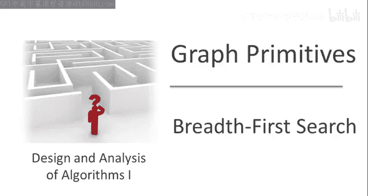
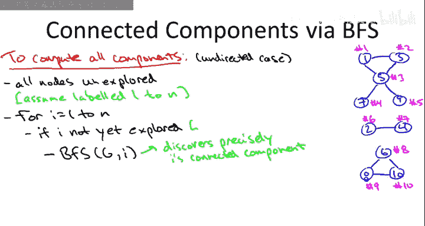

# 图算法和数据结构：06：BFS与无向图连通性



在本节课中，我们将学习如何使用广度优先搜索算法来计算无向图的连通分量。连通分量是图论中的一个核心概念，它帮助我们理解图的整体结构，判断网络是否完整，甚至用于数据聚类分析。

## 连通分量的定义

上一节我们介绍了广度优先搜索的基本原理，本节中我们来看看如何用它来解决一个具体问题：识别无向图中的连通分量。

首先，我们需要明确什么是连通分量。直观上，一个无向图的连通分量是图中一个“最大”的区域，在这个区域内，任意两个顶点之间都存在一条路径。为了更精确地定义，我们引入一个等价关系。


设图G的顶点集为V。我们定义顶点U和V之间存在关系（记作U ~ V），当且仅当在G中存在一条从U到V的路径。这个关系满足以下三个性质，因此是一个等价关系：
*   **自反性**：对于任意顶点V，存在一条从V到V的路径（例如空路径）。公式表示为：`∀v ∈ V, v ~ v`。
*   **对称性**：如果存在从U到V的路径，由于图是无向的，那么也存在从V到U的路径。公式表示为：`u ~ v ⇒ v ~ u`。
*   **传递性**：如果存在从U到V的路径和从V到W的路径，那么通过连接这两条路径，可以得到从U到W的路径。公式表示为：`(u ~ v ∧ v ~ w) ⇒ u ~ w`。

这个等价关系将顶点集V划分成若干个互不相交的**等价类**。每个等价类就是图的一个连通分量，即一个“最大的”相互连通的顶点集合。

## 连通分量的应用

理解连通分量有什么用呢？以下是几个常见的应用场景：

以下是连通分量的一些实际应用：
*   **网络诊断**：互联网服务提供商需要确保其网络中的任何两个节点都能相互通信。这等价于检查代表该网络的图是否是一个连通图（即只有一个连通分量）。
*   **社交网络分析**：例如，在电影演员合作网络中，你可以查询是否每个演员都能通过合作链连接到凯文·贝肯。这本质上是一个连通性问题。
*   **数据可视化**：当需要可视化一个大型网络时，首先识别出不同的连通分量，然后分别展示每个分量，可以使图表更清晰易懂。
*   **数据聚类**：给定一组对象（如文档、图片、基因组）及其两两之间的相似度评分，可以构建一个图：节点代表对象，如果两个对象的相似度超过某个阈值（即非常相似），则在它们之间添加一条边。这个图的连通分量自然就形成了相似对象的聚类。这是一种快速、线性的聚类启发式方法。

## 使用BFS计算连通分量

现在，让我们探讨如何使用广度优先搜索作为核心子程序，高效地找出无向图的所有连通分量。算法的核心思想是：系统地遍历每个顶点，如果遇到一个尚未被探索的顶点，就从它开始进行一次BFS，这次BFS所探索到的所有顶点就构成了一个连通分量。

以下是计算无向图所有连通分量的算法伪代码：

```python
# 假设图G有n个顶点，编号为1到n
将所有顶点标记为“未探索”
for i = 1 to n:
    if 顶点 i 是“未探索”的:
        # 从顶点i开始进行一次BFS
        BFS(G, i)
        # 此次BFS访问到的所有顶点构成一个连通分量
```

让我们通过一个例子来理解算法是如何工作的。考虑一个包含10个顶点、具有三个连通分量的图。

算法执行步骤如下：
1.  外层循环从 `i=1` 开始。顶点1未被探索，因此从顶点1启动BFS。
2.  这次BFS会探索顶点1所在的整个连通分量（例如，可能包含顶点1, 3, 5, 7, 9）。探索完成后，将这些顶点标记为“已探索”。
3.  外层循环继续，`i=2`。顶点2未被探索（因为它不在第一个分量中），因此从顶点2启动BFS。
4.  这次BFS探索第二个连通分量（例如，顶点2和4），并标记它们为“已探索”。
5.  当 `i=3, 4, 5` 时，我们发现这些顶点已被探索过，因此跳过，不执行BFS。
6.  当 `i=6` 时，顶点6未被探索，启动BFS探索第三个连通分量（例如，顶点6, 8, 10）。
7.  循环继续直到 `i=10`，所有顶点都已被处理。

这个算法有两个关键点：
*   **正确性**：BFS从某个顶点出发，能且仅能访问到该顶点所在连通分量中的所有顶点。外层循环确保每个顶点都会被检查到。因此，算法不会遗漏任何顶点或连通分量。
*   **避免重复工作**：一旦一个顶点在某个BFS中被标记为“已探索”，后续循环就不会再以它为起点进行BFS。这确保了每个顶点只被处理一次。

## 算法时间复杂度分析

这个算法的时间复杂度是线性的，即 **O(n + m)**，其中n是顶点数，m是边数。原因如下：



以下是算法各部分的耗时分析：
*   **初始化**：将所有n个顶点标记为“未探索”需要O(n)时间。
*   **外层循环**：循环本身执行n次，每次检查顶点状态为常数时间，共O(n)。
*   **BFS调用**：每个顶点只会作为起点被BFS探索一次（当它是其所在分量中第一个被外层循环遇到的顶点时），或者在BFS过程中作为邻居被访问一次。在每个BFS内部，我们对每个顶点和每条边都只做常数量的工作。
*   **边处理**：图中的每条边，只会在其所属连通分量的那次BFS中被访问至多两次（从两个端点各一次）。因此，所有BFS中对边的总处理时间是O(m)。

将以上所有部分相加，总时间复杂度为O(n + m)。

## 总结

本节课中我们一起学习了无向图连通分量的概念及其计算方法。我们首先给出了连通分量基于等价关系的精确定义，然后列举了它在网络诊断、数据聚类等多个领域的应用。核心内容是，通过结合一个外层循环和广度优先搜索子程序，我们可以在 **O(n + m)** 的线性时间内找出图的所有连通分量。算法高效的关键在于利用BFS系统性地探索每个连通区域，并通过“已探索”标记避免重复计算。这种以BFS为基础模块解决更复杂图论问题（如连通性）的思路，在图算法设计中非常典型。