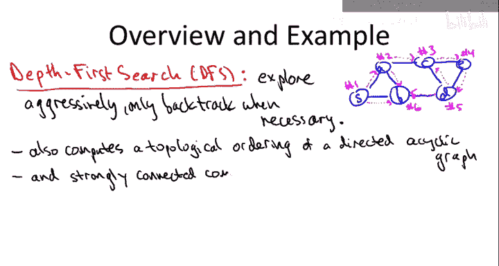
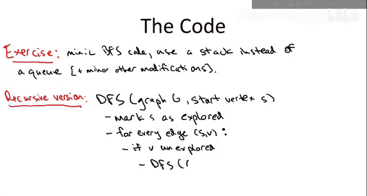
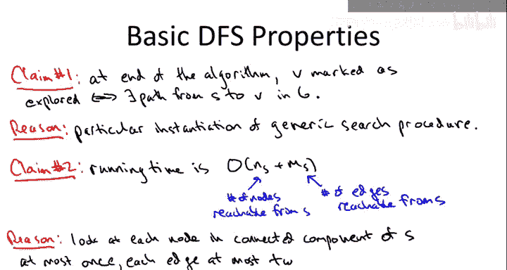

# 图算法与数据结构：第2章：深度优先搜索基础 🧭


在本节课中，我们将要学习图搜索的第二种核心策略——深度优先搜索。我们将从它与广度优先搜索的对比开始，通过一个具体例子来理解其工作原理，最后介绍其代码实现。

## 深度优先搜索策略概述

上一节我们介绍了广度优先搜索，它是一种谨慎、逐层探索的策略。本节中我们来看看它的“表亲”——深度优先搜索。如果说广度优先搜索是“谨慎的探索者”，那么深度优先搜索就是“激进的探险家”。它的核心计划是**尽可能深入地探索**，只有在必要时才进行回溯。这种策略类似于我们在迷宫中探索时，倾向于沿着一条路走到头，直到碰壁再返回。

## 深度优先搜索运行示例

为了清晰地说明深度优先搜索的工作方式，我们使用与讲解广度优先搜索时相同的图作为示例。假设我们从节点 **S** 开始进行深度优先搜索。

以下是搜索过程的具体步骤：

1.  从起点 **S** 开始探索。
2.  **S** 有两个邻居：**A** 和 **B**。深度优先搜索在此处是未确定的，我们可以选择任意一个。假设我们选择先探索 **A**。
3.  现在，与广度优先搜索不同，我们不会去探索 **S** 的另一个邻居 **B**。深度优先搜索的规则是：**必须接着探索当前节点（A）的某个直接邻居**。
4.  假设我们选择从 **A** 继续深入，探索其邻居 **C**。
5.  从 **C** 出发，我们继续深入探索其邻居 **E**。
6.  从 **E** 出发，其唯一的未访问邻居是 **D**，因此我们探索 **D**。
7.  现在，从 **D** 出发，有两条边：通往 **B** 和通往 **C**。假设我们选择通往 **C**。
8.  此时，我们到达了已访问过的节点 **C**。按照规则，我们需要从 **C** 回溯到 **D**。
9.  回溯到 **D** 后，我们发现还有另一条边（通往 **B**）未探索。于是我们沿着这条边探索 **B**。
10. 从 **B** 出发，尝试探索其邻居 **S** 和 **A**，但发现它们都已被访问过。因此，我们从 **B** 回溯到 **D**。
11. 从 **D** 回溯到 **E**，再从 **E** 回溯到 **C**，接着回溯到 **A**。
12. 在 **A**，我们检查最后一条边（通往 **B**），发现 **B** 已访问，于是回溯到 **S**。
13. 在 **S**，检查最后一条边（通往 **B**），发现 **B** 已访问。至此，所有边均被探索一次，搜索结束。

通过这个例子，我们可以看到深度优先搜索的核心模式：**沿着一条路径不断深入，直到无法继续（遇到已访问节点或没有邻居），然后回溯到上一个分岔点，尝试另一条路径。**

## 深度优先搜索的应用价值

你可能会问，既然已经有了强大（线性时间、能计算最短路径和连通分量）的广度优先搜索，为什么还需要深度优先搜索？

深度优先搜索拥有自己独特的、令人印象深刻的应用领域，这些应用是广度优先搜索难以替代的。我们将重点介绍它在**有向图**中的应用：
*   **一个简单应用**（本视频讨论）：计算**有向无环图**的拓扑排序。
*   **一个复杂应用**（后续视频专门讨论）：计算有向图的**强连通分量**。

深度优先搜索的运行时间与广度优先搜索一样，都是我们所能期望的最佳情况——**线性时间**。在图的连通性应用中，线性时间通常表示为 **O(m + n)**，其中 `m` 是边数，`n` 是顶点数。这个复杂度考虑到了边数可能远少于顶点数的情况。

## 深度优先搜索的代码实现

现在，让我们来看看深度优先搜索的实际代码。实现方式有多种。

一种方法是基于广度优先搜索的代码进行微调，主要区别在于将**队列**（先进先出）替换为**栈**（后进先出）。栈支持在常数时间内从前端进行插入（`push`）和删除（`pop`）操作。

为了展示多样性和优雅性，我们将介绍一种**递归版本**的实现。深度优先搜索非常自然地可以表述为一个递归算法。

深度优先搜索的输入是一个图 `G`（可以是无向图或有向图）。对于有向图，只需确保沿着邻接表中边的正确方向进行探索即可。



与广度优先搜索类似，我们需要为每个顶点维护一个布尔值，记录其是否已被访问过。

以下是递归实现的核心思路：

```python
def DFS(graph, vertex, visited):
    """
    从给定顶点开始进行深度优先搜索。
    :param graph: 图的数据结构（如邻接表）
    :param vertex: 当前访问的顶点
    :param visited: 记录顶点访问状态的列表/字典
    """
    # 标记当前顶点为已访问
    visited[vertex] = True
    print(f"访问顶点: {vertex}")  # 或者执行其他操作

    # 递归地探索所有未访问的邻居
    for neighbor in graph[vertex]:
        if not visited[neighbor]:
            DFS(graph, neighbor, visited)
```

## 深度优先搜索的基本性质与保证

深度优先搜索的基本保证与广度优先搜索完全相同：
1.  **完备性**：它能找到所有可达的顶点。
2.  **效率**：它在**线性时间 O(m + n)** 内完成。

原因在于，深度优先搜索同样是我们本系列视频开始时介绍的“通用图搜索过程”的一个特例。它只是定义了在“已探索区域”和“未探索区域”之间的边界上，如何选择下一条探索的边——它总是**偏向于选择最近才发现的已探索节点的邻居**。

运行时间与所探索的连通分量大小成正比，因为：
*   每个节点最多被访问一次（由布尔标记保证）。
*   每条边最多被查看两次（从它的两个端点各一次）。

## 深度优先搜索的特定应用：拓扑排序



由于深度优先搜索和广度优先搜索在上述基本性质上完全一致，因此在无向图中计算连通分量时，两者可以互换使用，都能在线性时间内完成任务。

所以，我们更关注深度优先搜索独有的应用。其中一个关键应用就是为**有向无环图**寻找一个**拓扑排序**。

**拓扑排序**是指将DAG的所有顶点排成一个线性序列，使得对于图中的每一条有向边 `(u, v)`，顶点 `u` 在序列中都出现在顶点 `v` 之前。这在实际中常用于表示任务间的依赖关系（例如课程先修关系、编译顺序）。

深度优先搜索通过其“完成时间”的概念，可以非常高效地生成一个逆拓扑序，稍作处理即可得到拓扑排序。这将是我们在后续内容中深入探讨的主题。

---



**本节课中我们一起学习了**深度优先搜索的基础知识。我们了解了它作为一种“激进”的图搜索策略，其核心是尽可能深入地探索，并在必要时回溯。我们通过一个详细的例子追踪了其执行过程，并介绍了其递归实现的代码框架。最后，我们明确了DFS与BFS同样具有线性时间复杂度和搜索完备性，并引出了其独特的应用场景——例如寻找有向无环图的拓扑排序，这为后续的学习奠定了基础。