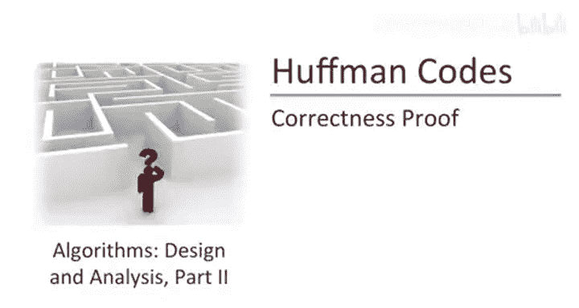
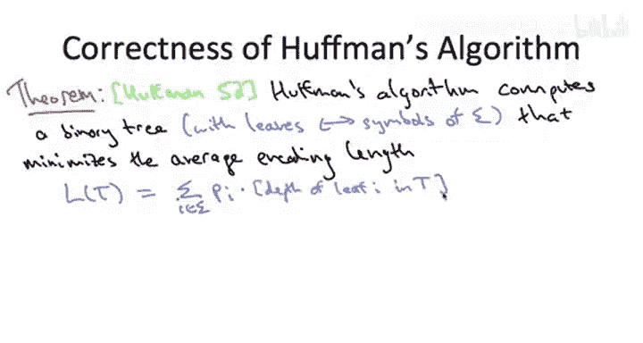
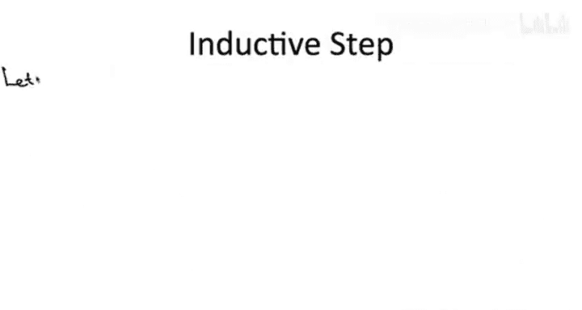
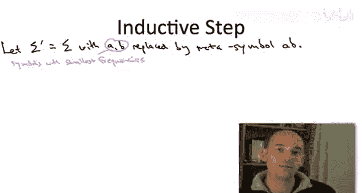
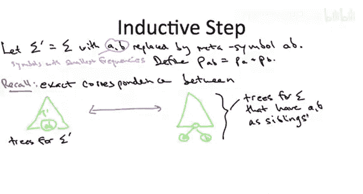

# 算法启蒙（第3册）：贪心算法和动态规划｜P11：11-HUFFMAN CODES_ 正确性证明 1



在本节课中，我们将学习如何证明霍夫曼算法的正确性。这意味着我们将证明，这个贪心算法总是能计算出平均编码长度最小的前缀自由二进制码。

## 概述



我们将证明霍夫曼算法总能产生最优的前缀自由二进制码。证明的核心思想是使用数学归纳法，并结合交换论证来证明算法的每一步贪心选择都是合理的。

首先，让我们回顾一下平均编码长度的表达式，这在证明中会频繁用到。

## 平均编码长度表达式

平均编码长度可以用树 `T` 来表示。我们对字母表 `Σ` 中的所有符号 `i` 进行求和，每个项根据输入中给定的频率 `p_i` 进行加权。一个符号 `i` 的编码长度，恰好等于树 `T` 中对应叶节点的深度 `depth_T(i)`。

因此，平均编码长度 `L(T)` 的公式为：
```
L(T) = Σ_{i ∈ Σ} p_i * depth_T(i)
```

## 证明方法

霍夫曼算法的证明过程很巧妙，它让我们有机会重温证明各种贪心算法正确性的高级主题。

我们将对字母表 `Σ` 的大小 `n` 进行归纳证明。这与我们在第一部分证明迪杰斯特拉算法正确性时有些相似，通过归纳法，我们假设算法在前几步是正确的，然后证明当前步骤也正确。在归纳步骤中，我们将使用交换论证来证明，任何最优解都可以在不使其变差的情况下，调整成与我们的解相似的形式。这就是我们论证每一次合并都是合理且正确的方法。

更精确地说，我们将对字母表的大小 `n` 进行归纳。为了使问题非平凡，我们假设字母表大小至少为2。

## 基础情况

与任何归纳证明一样，我们从基础情况开始，然后进行归纳步骤，在归纳步骤中我们可以假设归纳假设成立。



基础情况是当我们只有一个包含两个字母的字母表时。回顾霍夫曼算法，你会看到它在基础情况下做了显而易见的事情：它输出一棵树，其中一个符号用比特 `0` 编码，另一个符号用比特 `1` 编码。这是你能做到的最好情况，因为每个符号至少需要一个比特来编码，而这棵树恰好为每个符号使用了一个比特。因此，霍夫曼算法在这个平凡的特殊情况下是最优的。

## 归纳步骤



对于归纳步骤，我们关注字母表大小至少为3的任意问题实例。

当然，在进行归纳证明时，你真正拥有的优势是归纳假设。我们假设要证明的断言（在本例中是霍夫曼算法的正确性）对所有更小的 `n` 值都成立。也就是说，如果我们在任何更小的输入上调用算法（正如这个递归算法所做的那样），我们可以假设算法会返回该更小子问题的正确解。

为了理解我们如何从归纳假设（即假设我们在所有更小的输入上都是正确的）过渡到归纳步骤（即断言我们在当前输入上也是正确的），我们需要更仔细地观察原始输入（及其字母表 `Σ`）与更小的子问题（及其字母表 `Σ'`，其中两个字母被融合为一个）之间的关系。我们通过递归调用，假设能正确解决这个更小的子问题。



## 符号与对应关系

回顾霍夫曼算法伪代码中的符号表示。

算法所做的就是取出频率最小的两个符号，我们称它们为 `A` 和 `B`，然后用一个单一的符号 `AB`（一个代表 `A` 或 `B` 存在的元符号）替换这两个符号。在之前的测验中，我们讨论过如何合理地定义这个新元符号 `AB` 的频率，即 `A` 和 `B` 的频率之和。

在上一个视频中，当我们为自底向上连续合并的贪心算法建立直觉时，我们注意到，当你合并两个符号 `A` 和 `B` 时，你实际上是在承诺最终输出的树中，符号 `A` 和 `B` 作为兄弟节点出现，即它们拥有完全相同的父节点。

因此，在以下两种树之间存在一一对应关系：一种是叶子节点标记为 `Σ'` 中符号的树（即没有标记为 `A` 或 `B` 的叶子，而是有一个标记为 `AB` 的叶子）；另一种是原始字母表 `Σ` 的树，其中符号 `A` 和 `B` 恰好是兄弟节点。

给定一棵如左图所示的树（即给定一棵树 `T'`，其叶子根据 `Σ'` 标记），你可以（事实上这正是霍夫曼算法所做的）拆分带有元符号 `AB` 的叶子，创建一个内部节点，并赋予它两个带有标签 `A` 和 `B` 的叶子。这样就产生了如右图形式的树。

反之，给定一棵如右图形式的树（即其叶子根据 `Σ` 标记，并且恰好 `A` 和 `B` 作为该树的叶子出现），你可以通过将 `A` 和 `B` 收缩在一起，将它们吸收到它们的父节点中，并将父节点标记为 `AB`，从而生成一棵 `Σ'` 的树。因此，你可以在这两种类型的树之间来回转换：一种是 `Σ'` 的任意树，另一种是 `Σ` 的特定类型的树（即 `A` 和 `B` 恰好是兄弟节点的树）。

`Σ` 中 `A` 和 `B` 是兄弟节点的这组树非常重要，我们给它一个专门的符号表示。让我用 `X_{AB}` 表示那些叶子根据 `Σ` 标记，并且恰好 `A` 和 `B` 作为兄弟节点出现的树。这将是 `Σ` 的一些树，但不是全部，只是那些 `A` 和 `B` 是兄弟节点的树。

## 目标函数值的对应关系

这种更小子问题的解与原始问题特定形式的解之间的对应关系，有一个重要的性质：它保留了目标函数值，即保留了平均编码长度。这并不完全准确，但足够接近我们的目的。它在一个固定常数范围内保留了平均编码长度。让我通过计算来演示这一点。

考虑任意一对匹配的树 `T'` 和 `T`。所谓匹配，我指的是 `T'` 是任何叶子根据 `Σ'` 标记的树，而 `T` 是你以通常方式拆分带有元标签 `AB` 的叶子后得到的树：你用一个内部节点和带有标签 `A` 和 `B` 的子节点替换它。这将是相应的树 `T`。取任意这样一对匹配的树，让我们看看它们的平均编码长度之间的差异。

记住，一棵树的平均编码长度只是对相关字母表中的符号求和。我们这里的情况是，`Σ` 和 `Σ'` 几乎完全相同，唯一的区别是 `Σ'` 有元符号 `AB`，而 `Σ` 有单独的符号 `A` 和 `B`。此外，两棵树 `T` 和 `T'` 也几乎完全相同，唯一的区别是 `T'` 有一个带有元标签 `AB` 的叶子，而 `T` 在下一层有两个对应的节点，标签分别为 `A` 和 `B`。

因此，当我们取这两个和的差值时，除了树 `T` 贡献的两个项（一个用于标签为 `A` 的叶子，一个用于标签为 `B` 的叶子）和树 `T'` 贡献的一个带负号的项（对应于标签为 `AB` 的叶子）之外，其他所有项都抵消了。所以，尘埃落定后，我们剩下的是：

树 `T` 中叶子 `A` 的项：`p_A * depth_T(A)`
树 `T` 中叶子 `B` 的类似项：`p_B * depth_T(B)`
以及带负号的项：`p_{AB} * depth_{T'}(AB)`

但我们肯定还没有完成简化。我们看到的这些频率之间以及这些深度之间存在着密切的关系。

让我们从频率开始。我们如何定义元符号 `AB` 的频率？回想一下我们的测验，将其定义为 `A` 和 `B` 的频率之和是合理的。

关于深度呢？你知道，符号 `AB` 在树 `T'` 中处于某个深度，假设是深度 `d`。记住，`T` 是通过简单地拆分叶子 `AB` 并赋予它两个带有符号 `A` 和 `B` 的子节点而从 `T'` 获得的。因此，如果元符号 `AB` 在 `T'` 中的深度是 `d`，那么叶子 `A` 和 `B` 在 `T` 中的深度将是 `d+1`。所以深度就是之前在树 `T'` 中的深度加一。

这些关系将导致第二波的抵消。为了更清楚，让我们称 `AB` 在 `T'` 中的深度为 `d`。所以 `A` 和 `B` 在树 `T` 中的深度都是 `d+1`。

因此，第一项变为 `p_A * (d+1)`。
第二项变为 `p_B * (d+1)`。
第三项变为 `(p_A + p_B) * d`。
当尘埃再次落定时，我们剩下一个常数 `p_A + p_B`，即两个频率之和。

我希望你真正理解的一点是，这两个平均编码长度之间的差值只是一个常数。它不依赖于我们开始时选择哪棵树。如果我们选择一棵完全平衡的树并计算这个差值，我们得到某个常数（例如 `p_A + p_B`）。如果我们选择一些完全不同的、非常不平衡的树对来计算这个差值，我们仍然得到完全相同的常数 `p_A + p_B`。

这兑现了我之前给你的承诺：我们不仅在叶子标记为 `Σ'` 的树与特定类型的、叶子根据 `Σ` 标记的树（即 `A` 和 `B` 是兄弟节点的树）之间存在这种自然的对应关系，而且这种对应关系保留了平均编码长度（准确地说，是在一个通用常数范围内保留了它）。这对我们的目的来说已经足够了，我们马上就会看到。

## 总结

本节课中，我们一起学习了霍夫曼算法正确性证明的第一部分。我们定义了平均编码长度的表达式，并介绍了使用归纳法和交换论证的证明框架。我们建立了原始问题与递归子问题之间解的对应关系，并证明了这种对应关系在常数范围内保持了目标函数值。这为下一部分完成归纳证明奠定了坚实的基础。