# 算法启蒙（第3册）：贪心算法和动态规划｜Part 3 Greedy算法和动态规划：14：Prim最小生成树算法

在本节课中，我们将要学习第一个最小生成树算法——Prim算法。我们将通过一个具体例子来理解其工作原理，然后详细阐述其通用伪代码，并讨论其正确性证明的思路。

## 算法工作原理示例

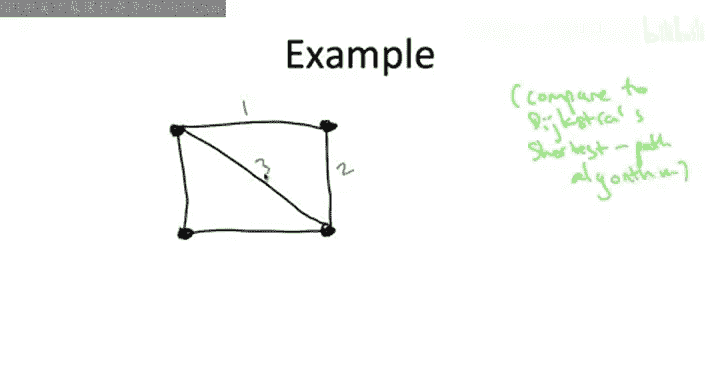

上一节我们介绍了最小生成树问题的定义，本节中我们来看看Prim算法是如何工作的。在展示伪代码之前，我们先通过一个例子来演示。这个例子使用了一个包含四个顶点和五条边的图。

在演示过程中，你会发现它与Dijkstra最短路径算法有明显的相似之处。

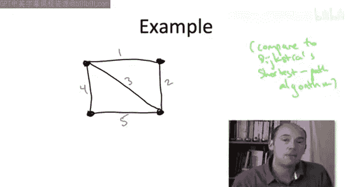

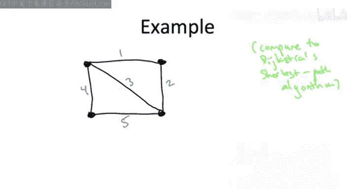

算法的计划是每次添加一条边来“生长”一棵树。这个过程就像霉菌生长一样，从一个“种子”顶点开始，然后在算法的每次迭代中“吸收”一个新的顶点。这与Dijkstra算法相似。在Dijkstra算法中，我们从哪个顶点开始生长是明确的，因为我们有一个给定的源顶点。但在最小生成树问题中，我们没有源顶点。不过，我们可以任意选择一个顶点作为起点，选择哪个顶点并不影响最终结果。

计划是在每次迭代中，我们添加一条边，并“跨越”一个与当前已跨越顶点相邻的新顶点。作为一个贪心算法，Prim算法将简单地选择那条允许它跨越一个新顶点的、成本最低的边。

在算法开始时，我们实际上还没有跨越任何顶点。我们把自己看作是正在从右上角的顶点开始生长。那么，我们可以通过哪些边来跨越一个相邻的顶点呢？有两条边。上面有一条成本为1的边，如果包含它，我们将能跨越左上角的顶点。或者右边有一条成本为2的边，如果包含它，我们将能跨越右下角的顶点。我们将执行贪心策略，选择成本更低的边，即成本为1的边。

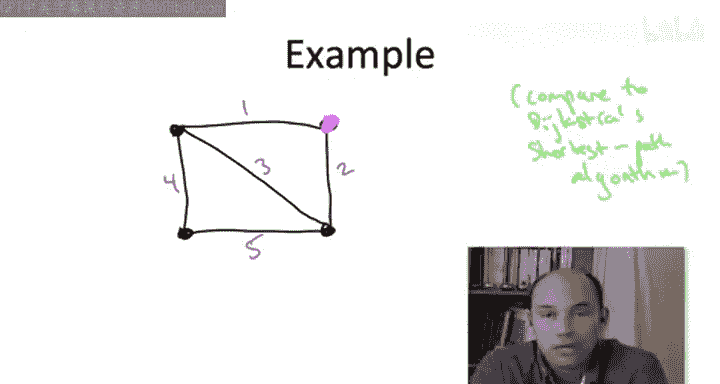

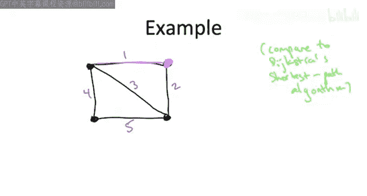

到目前为止，我们的树所跨越的顶点是顶部的两个顶点。

在下一个迭代中，我们希望再添加一条边来跨越一个新的顶点。现在，我们看到从当前已跨越的区域“伸出来”三条边，它们都能让我们跨越一个新的顶点。这些边的成本分别是2、3和4。选择成本为2或3的边将允许我们跨越右下角的顶点。选择成本为4的边将允许我们跨越左下角的顶点。我们将执行贪心策略。在这三条候选边中，我们选择最便宜的一条，即成本为2的边。

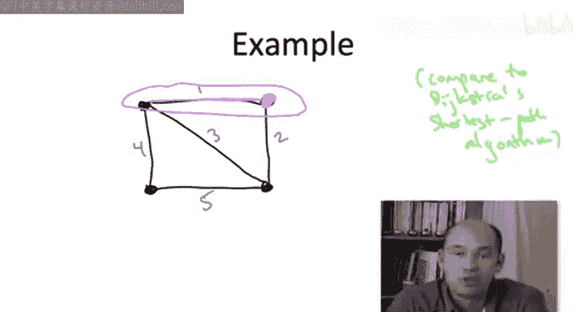

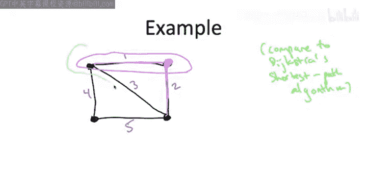

现在，我们生长的“霉菌”覆盖了除左下角顶点之外的所有顶点。

在最后的迭代中，我们希望再包含一条边，以便跨越最后一个剩余的顶点，即左下角的顶点。注意，这里有一条我们从未添加的成本为3的边，但它已经被我们生长的树所包含了。我们将忽略它，因为添加这条成本为3的边不会让我们跨越更多顶点。实际上，它会创建一个我们不需要的环。所以，我们将考虑那两条能让我们跨越额外顶点的边：成本为4的边和成本为5的边。我们将执行贪心策略，选择成本为4的边。

当我们拥有了成本为1、2和4的边后，我们就得到了一棵生成树。图中没有环，并且沿着粉色边，任意两个顶点之间都存在路径，总成本为7。你可能还记得上一节的内容，这确实是这个图的最小成本生成树。

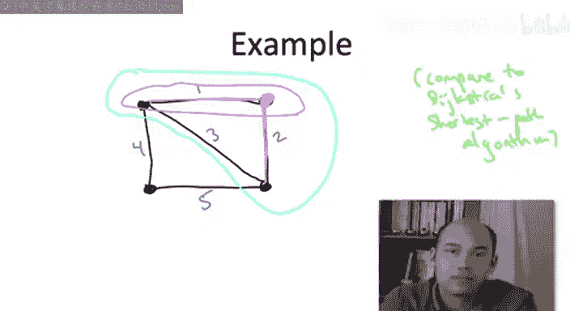
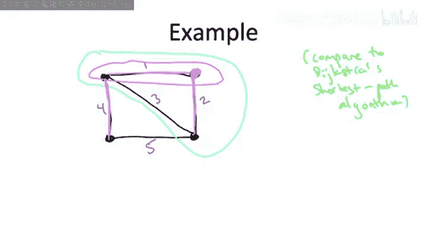

当然，这个在只有四个顶点和五条边的简单例子中正确运行的简单过程，本身并不能说明什么。你不应该立即得出结论，认为这在一般情况下是一个好算法，尽管事实确实如此。接下来，让我们正式地定义这个通用算法。

## 通用伪代码

对于一个通用图，从一个起点开始像霉菌一样生长，每次迭代跨越一个新顶点，并始终以贪心方式推进，直到完成，这具体意味着什么？让我们在下一页详细说明伪代码。

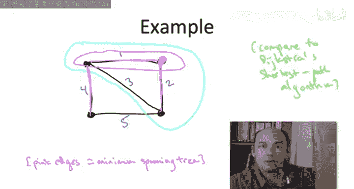

以下是Prim最小生成树算法的伪代码。我们从两行初始化开始。

我们将维护一个顶点集合 `X`。这代表我们目前已经跨越的顶点。同样，我们需要一个“种子”顶点来启动这个过程。选择哪个顶点并不重要，无论从哪里开始，最终都会得到相同的树。我们任意选择一个顶点，称之为 `s`，作为生长的起点。

我们维护的另一个东西当然是树 `T`，它初始为空。我们将在每次迭代中向其中添加一条边。

我们将在整个算法中保持一个不变式：当前存在于集合 `T` 中的边，跨越了当前存在于集合 `X` 中的顶点。

然后是我们的主 `while` 循环，这是算法的核心部分，它与Dijkstra算法中的循环非常相似。即，每次迭代负责选择一条穿过当前“前沿”的边，推进以包含一个新顶点，并且它同样是贪心的。选择标准将与Dijkstra算法不同，事实上更简单：我们不再看路径长度，而是直接看哪条允许我们跨越新顶点的边成本最低。

只要还有我们尚未跨越的顶点，循环就会继续。

我们所做的是，搜索那些允许我们跨越一个新顶点的边。哪些边符合条件呢？我们希望边的一个端点在集合 `X` 内（即我们的树已经跨越的顶点），另一个端点不在 `X` 内（即尚未被跨越）。如果有一条边以这种方式穿过“前沿”，一端在 `X` 内，一端在 `X` 外，这就是我们在一次迭代中将已跨越顶点数增加一的方式。

如果边 `e` 是所有这样穿过前沿的边中成本最低的一条（一端在 `X` 内，一端在 `X` 外），那么这就是我们将在本次迭代中添加到当前树 `T` 中的边。那个不在 `X` 中的端点，就是我们在本次迭代中要添加到 `X` 里的顶点。

再次强调，每次迭代的语义是：我们试图以尽可能低的成本增加被跨越的顶点数量。正是在这个意义上，Prim算法是一种贪心算法。

和通常的贪心算法一样，这看起来足够自然，但完全不清楚它是否正确，即它是否总是能计算出一棵最小生成树。事实上，仔细想想，甚至不能明显看出它一定能计算出一棵生成树（无论是否最小）。但它是正确的，让我们在下一页精确地阐述这个声明。

## 正确性声明与证明计划

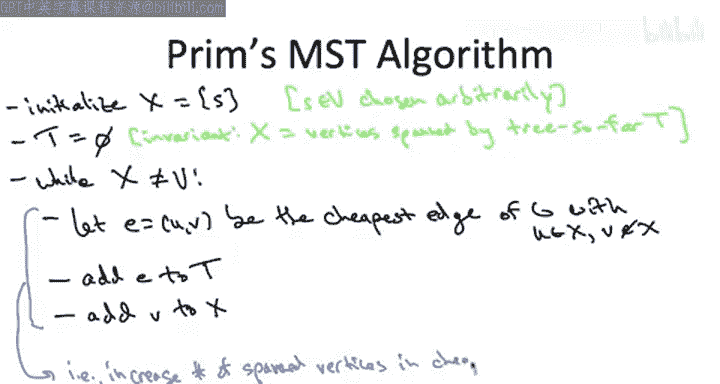

关键主张是：Prim算法是正确的。给定任何连通的输入图，它保证能输出一棵具有最小可能成本的生成树。

在我们深入任何细节之前，让我先通过说明证明计划来结束本节视频。我们将分两部分来证明这个定理。

首先，我们将确定算法确实输出了一棵生成树（可能不是最小的，但即使是这一点也并非显而易见）。然后，我们再论证输出的生成树实际上是最小成本的。

证明的两个部分都很有趣。对于第一部分（论证算法输出了一棵生成树），我们将回顾一些关于图、割以及图中生成树的预备知识。

对于第二部分（论证最优性），我们将依赖于生成树（特别是最小生成树）的一个非常简洁的性质，称为“割性质”。

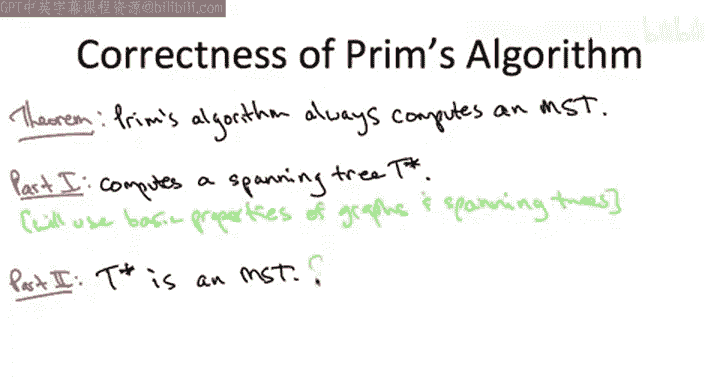

我很高兴地告诉大家，我们在这里两部分所做的工作将在以后产生进一步的成果。在证明另一个MST算法——Kruskal算法的正确性时，我们将重用这些要素。

对于那些更愿意讨论运行时间而不是正确性的人，请不要担心，你们的时间会到来的。在我们完成这个正确性证明之后，我将讨论如何快速实现Prim算法，特别是使用堆数据结构，我们将把运行时间降低到接近线性的 `O(m log n)` 界限。

本节课中我们一起学习了Prim最小生成树算法的工作原理、通用伪代码以及其正确性证明的基本思路。我们通过一个例子直观理解了算法如何以贪心方式逐步构建生成树，并概述了证明其总能找到最小生成树的两个关键步骤。