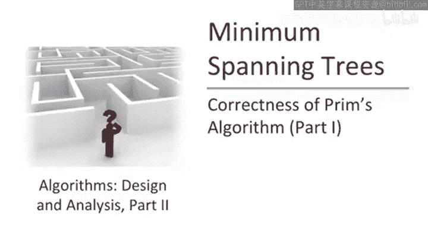
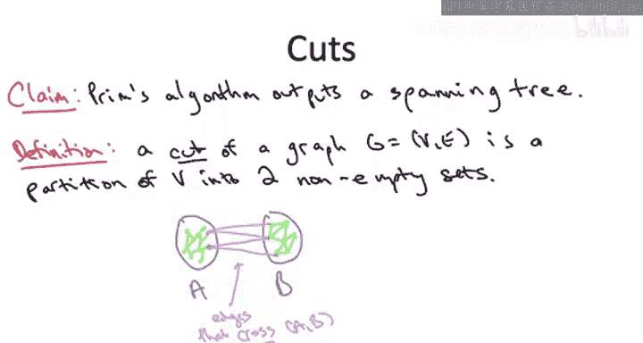
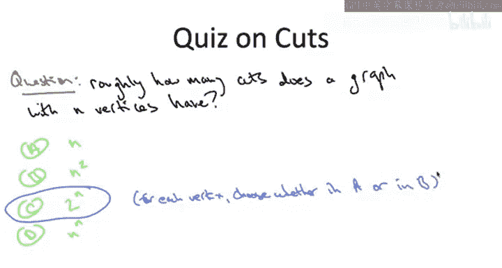
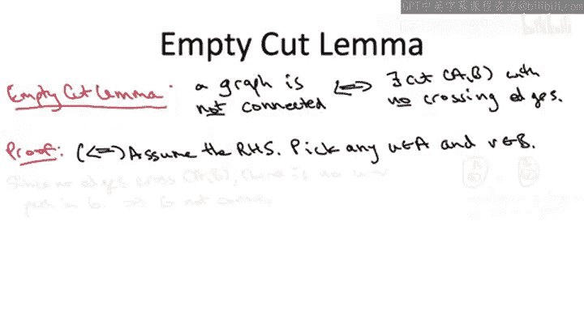
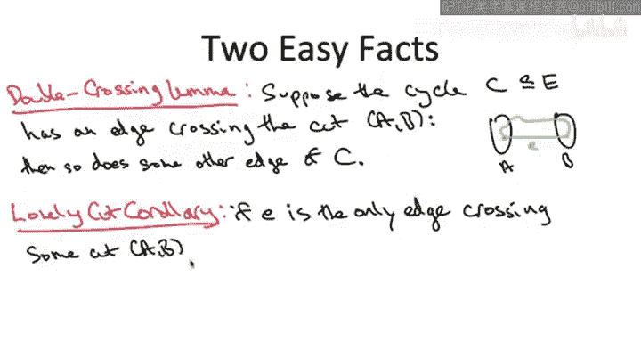
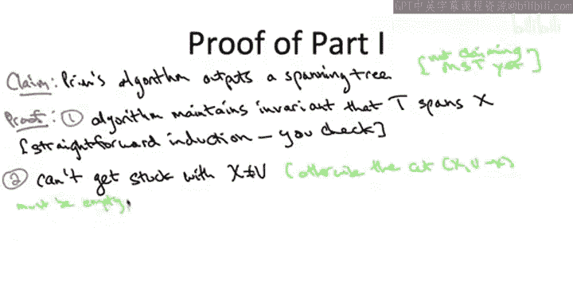

# 算法启蒙（第3册）：贪心算法和动态规划｜P17：-17-_ 正确性证明 1

在本节中，我们将开始讨论为什么Prim算法是正确的，即为什么它总能对每个连通图输出该图的最小生成树。本节我们将设定一个更适中的目标：仅证明Prim算法输出的是一个生成树，暂时不讨论其最优性。即使只是证明这一点也并非易事，并且通过这个过程，我们将有机会深入了解图的一些基本性质，特别是图的割。

## 概述：图割的概念

本课程第一部分的毕业生当然已经熟悉图割的概念。我们曾通过Karger的随机算法详细研究过如何计算图的最小割。这里的割概念是相同的。让我们回顾一下以唤醒记忆。

一个图的割，简单来说，就是将其顶点集划分为两个非空子集。形象地说，我们设想图G的一些顶点在一个子集A中，其余顶点在另一个子集B中。

那么边是如何分布的呢？一条边的两个端点有三种情况：
*   两个端点都在集合A中，即A内部的边。
*   两个端点都在集合B中。
*   我们最感兴趣的是第三种情况：边的两个端点恰好一个在A中，一个在B中。我们说这样的边**横跨**割(A, B)。

割的定义看似简单，但割，特别是它们与边的关系，可能非常有趣且有用。如图所示，对于一个给定的割，可能有多条边横跨它。同样，对于图的一条边，通常会有多个割被这条边横跨。

为了更好地理解这一点，让我们回顾一个关于图中割的简单性质。

## 图中有多少个割？

具体来说，对于一个有n个顶点的图，大约有多少个割？大约是n，n²，2ⁿ，还是nⁿ？这四个答案都不完全精确，但其中有一个比其他三个更接近精确表达式。

正确答案是第三个：**2ⁿ**。一个n个顶点的图本质上拥有2ⁿ个割。所以割的数量是指数级的，非常多。

为什么是这样？实际上，你可以想象为每个顶点做一个二元决策：它要么进入A，要么进入B。n个二元决策导致2ⁿ种不同的结果。为什么说这“稍微”不正确？因为严格来说，一个割要求两个集合都非空，A和B都不能为空。这排除了两种可能性（所有顶点都在A或都在B）。因此，严格来说，图的不同割的数量是 **2ⁿ - 2**。

接下来，我们将陈述并证明关于图中割的三个简单事实。一旦有了这三个事实，我们就能证明本节开头的论断，即Prim算法总是输出一个生成树。

## 三个关键引理

### 1. 空割引理

空割引理旨在为我们提供一种新的方式来描述图何时是连通的。具体来说，我将用它来描述图何时是**不连通**的。

论断是：一个图是不连通的，**当且仅当**我们能找到该图的一个割，且没有边横跨这个割。

回忆一下我们如何定义图是连通的：这意味着对于图中的任意两个顶点，我们都能在图中找到一条从一个顶点到另一个顶点的路径。因此，我们说“不连通”（即存在一对顶点之间没有路径）等价于“存在一个没有横跨边的割”。

让我们快速证明一下。作为一个“当且仅当”陈述，证明需要分两部分进行。

**第一部分（从右向左推）**：假设存在一个割(A, B)，且没有G的边横跨这个割。目标是找出一对顶点，它们之间没有路径，从而证明图不连通。找出这样一对顶点很容易：只需从割的两边各取一个顶点，记为u（在A中）和v（在B中）。为什么在G中从u到v没有路径？因为从u到v的任何路径都必须横跨割(A, B)，但没有可用的边来横跨这个割，因此这条路径不可能存在。

**第二部分（从左向右推）**：假设图不连通，则必然存在一对顶点u和v，它们之间没有路径。我们现在需要展示某个割(A, B)，使得图G没有边横跨它。技巧在于定义集合A为在G中从u可达的所有顶点。另一种理解是，A就是我们在课程第一部分讨论过的u所在的连通分量。然后，我们将所有不在A中的顶点放入集合B。根据定义，u在A中，而根据假设v从u不可达，所以v在B中。因此，两个集合都非空，这确实构成了图G的一个合法割。剩下的就是注意到没有边横跨这个割。为什么？如果存在一条边横跨割(A, B)，一端在A，一端在B，那么根据定义，存在从u到A中所有其他顶点的路径。如果有一条边从A伸出，那将给我们一条通往B中某个顶点的路径。但B中的顶点根据定义是从A不可达的，这就产生了矛盾。因此，没有边横跨这个割，该割是“空”的。

空割引理的关键点在于：它为我们提供了一种新的方式来讨论图是否连通。图是**不连通**的当且仅当存在空割；图是**连通**的当且仅当没有空割。

### 2. 双横跨引理

本质上，双横跨引理说的是：如果一个图中的环横跨一个割，那么它必须横跨该割两次。它不能只横跨一次。

具体来说，考虑图的一个割(A, B)。假设有一条边e，其端点分别在A和B中。进一步假设这条边e属于某个环C。观察图片你会发现，这个引理的论断是显而易见的：因为环必须绕回自身，如果它有一条边连接割的两侧，就必须有一条路径连接这两个端点回到彼此，而这条路径必须再次横跨割(A, B)。

实际上，双横跨引理是一个更强论断的特殊情况，这个更强论断同样容易理解：对于图的任何割和任何环（环起点和终点相同），它必须横跨这个割**偶数次**。它可能横跨0次，但不会只横跨1次。它可能横跨2次、4次（如果来回穿梭）、6次等等。但如果它横跨的次数严格大于0，则至少必须横跨2次。这就是双横跨引理的要点。

### 3. 孤独割推论

孤独割推论是双横跨引理的一个简单推论。让我说明这个推论的意义：在这些生成树算法中，为了确保输出一个生成树，我们必须特别确保不创建任何环。这个推论就是一个论证我们不会创建环的工具。

我们如何确保一条边不会创建环呢？这里有一个方法：假设存在一个割(A, B)，使得边e是唯一横跨这个割的边。也就是说，e在这个割上是“孤独”的。那么，根据双横跨引理，这条边不可能在任何环中。如果它在某个环中并且横跨了一个割，那个环就必须再次横跨该割，那么边e就不会是孤独的，它会有同伴。因此，如果你在一个割上是孤独的，就意味着你不可能在环中。

## 证明Prim算法输出生成树

现在，我们已经准备好了所有工具，可以证明Prim算法正确性的第一部分了：即论证Prim算法在给定连通图时，总能输出一个生成树（暂时不讨论最优性，这将在下一节讨论）。

我们将分三步进行论证。第一步，你可能需要回顾一下Prim算法的伪代码以记起相关符号。

**第一步：验证算法语义**  
算法在其运行过程中维护两个集合：一个是集合X（意图是已覆盖的顶点），另一个是边集T（已选择的边）。意图是当前的边集T总是覆盖当前的顶点集X。第一步就是验证这确实是事实。这里不进行形式化证明，因为这通常被认为是显而易见的。如果你想要严谨的证明，可以自行补充细节，这是一个直接的归纳法，没有复杂的意外。

**第二步：证明算法输出覆盖所有顶点**  
我们试图论证算法的输出是一个生成树。让我们回顾一下这意味着什么。需要检查两个属性：首先，不能有任何环；其次，它必须覆盖所有顶点，即必须存在一条仅使用树边T的路径连接任意两个顶点。让我们按相反顺序证明这两点。

第二步将论证算法输出的东西确实覆盖了所有顶点。根据证明的第一部分，我们只需要证明算法终止时，X等于V（所有顶点）。那么我们就知道T覆盖了V中的所有顶点。这怎么会不发生呢？回顾伪代码，查看主while循环。每个while循环迭代，我们都向X添加一个新顶点。可能出什么问题？唯一可能出错的是，在我们覆盖所有顶点之前的某个迭代中，当我们扫描围绕X的边界时，找不到边。这是我们未能在给定迭代中增加X中顶点的唯一方式。但这意味着什么？如果在某个迭代中，我们找不到一个端点在X内、另一个端点在V-X中的边，那么我们就展示了一个空割：割(X, V-X)将没有横跨边。现在我们可以使用空割引理，该引理说如果存在空割，则图是不连通的。但根据假设，我们处理的是连通的输入图，所以这不可能发生。因此，算法永远不会卡住，我们总是能因为原图是连通的而将X增加一个顶点。这意味着算法终止时，T覆盖了所有顶点。

**第三步：证明算法从不创建环**  
我们需要论证Prim算法在其选择的边集T中从不创建任何环。我们将依次讨论Prim算法添加的每条边，并论证每当添加一条新边时，这条边不可能在集合T中创建任何环。

为了理解原因，让我们在某个给定迭代时对算法进行快照。此时有一个当前的边集T和一个顶点集X（T中的边覆盖了X）。V-X是尚未被T覆盖的顶点。当然，我们可以将(X, V-X)视为图的一个割。在此时刻，T中的所有边都属于一种类型：它们的两个端点都在X内部。根据构造，它们都没有任何端点在V-X中。因此，到目前为止选择的边都没有横跨割(X, V-X)。

那么，在这个迭代中将要添加什么类型的边呢？Prim算法只搜索那些一个端点在X内、一个端点在X外的边，即只搜索横跨割(X, V-X)的边。因此，在这个迭代中添加的边将成为这个割的“开拓者”：目前还没有边横跨这个割，但在这个迭代中添加的边将肯定横跨这个割。

所以，在边e被添加到树T的那一刻，它将是横跨割(X, V-X)的**唯一**成员。根据孤独割推论，作为T中横跨这个割的唯一成员，它不可能参与任何环。记住，如果它参与了T中的某个环，那个环就必须在其他地方再次横跨这个割，但并没有其他边横跨这个割。e是唯一的一条。这就是为什么当我们添加一条新边时，它不可能创建任何环：它是横跨这个特定割的唯一成员。

## 总结

在本节中，我们一起学习了图割的基本概念及其三个关键性质：空割引理、双横跨引理和孤独割推论。利用这些工具，我们成功地证明了Prim算法的一个重要性质：对于任何连通输入图，Prim算法总能输出一个生成树。我们证明了算法输出的边集能覆盖所有顶点（利用空割引理和图的连通性），并且不包含任何环（利用孤独割推论和算法每次迭代选择的边都是特定割上的唯一横跨边这一事实）。这为下一节证明该生成树是最小生成树奠定了基础。