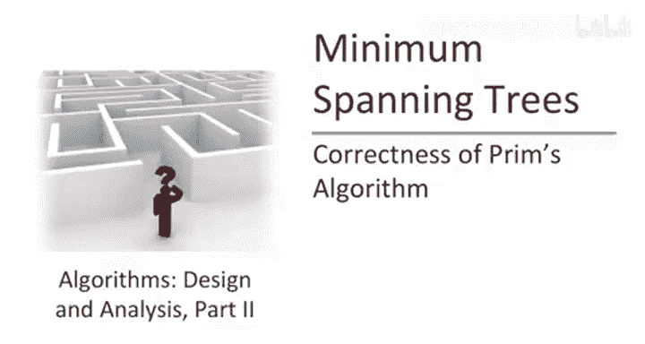
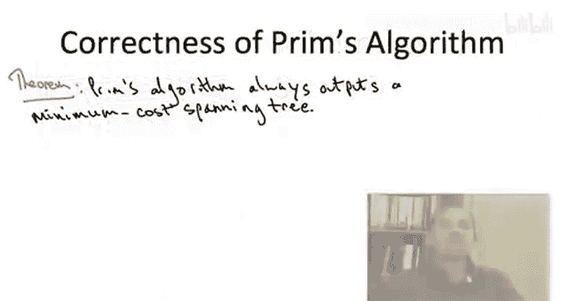
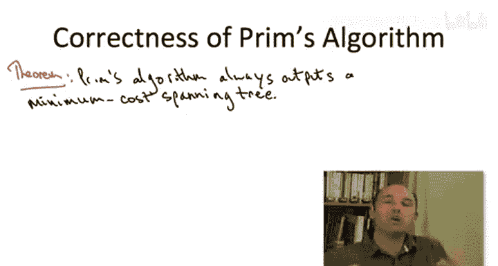
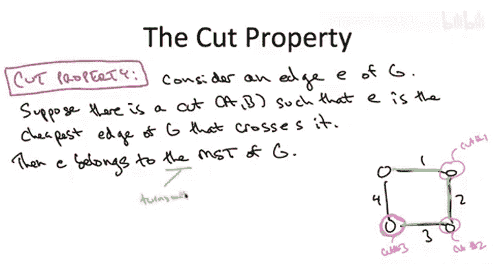
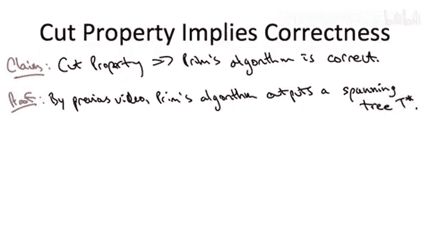
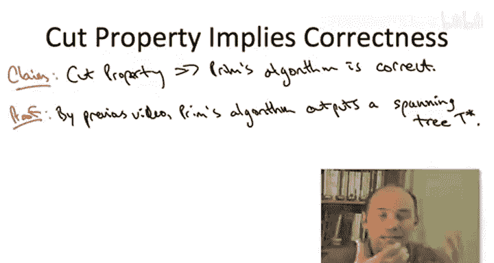

# 算法启蒙（第3册）：贪心算法和动态规划｜P18：-18-_ 正确性证明 2

在本节课中，我们将学习如何证明普里姆算法的正确性。我们将借助一个称为“割性质”的关键定理，来论证普里姆算法输出的生成树确实是成本最小的生成树。

---

我们已经通过热身证明了普里姆算法至少会输出一个生成树。现在，让我们继续前进，实际证明它输出的是一个最小成本生成树。

为了证明这个定理，我们必须直面设计贪心算法时总会遇到的核心困境。在贪心算法中，你做出的是不可撤销的决定。例如在普里姆算法中，我们将一条边加入树中，之后不会再重新考虑它。你如何能确定自己没有犯错？如何保证当前看似短视的决定实际上是一个好决定，不会在未来带来麻烦？

对于最小生成树问题，存在一个优美的条件，它能告诉你何时可以保证将一条边加入生成树而不会后悔。这个条件保证了某条边必须属于最小生成树。它被称为“割性质”，这是我们下一张幻灯片要讨论的主题。

---

### **割性质**

这是一个非常重要的性质。它陈述了什么？

考虑图中的一条边 `e`，我们想知道将它加入当前树中是否安全。以下是保证你不会后悔将此边加入树中的充分条件。这个条件是用“割”来表述的。

假设你能找到一个割 `(A, B)`，满足以下性质：在图 `G` 中所有恰好横跨这个割的边里，边 `e` 是横跨此割的最便宜的边。也就是说，不仅我们的边 `e` 要横跨割 `(A, B)`，它还必须是横跨此割的所有边中最便宜的那条。

如果满足这个条件，那么我们肯定希望将边 `e` 包含在我们的解中。事实上，边 `e` 必须是图 `G` 的**任何**最小生成树的成员。

在本视频中，我们将假设割性质成立。这绝非显而易见，它确实需要一个证明。我将在另一个单独的视频中给出证明，它基于一个巧妙的交换论证，有点技巧性。在本视频中，我们假设它为真，并想看看它能为我们带来什么。

我将很快向你们展示，割性质实际上蕴含了普里姆算法的正确性。但为了先感受一下它，让我们在一个更简单的图中看看它。

让我们看一个四元环，4个节点，4条边，边成本分别为1、2、3和4。

让我们看几个割。

首先，看一个割，其中割的一侧是右上角的顶点，另一侧是其他三个顶点。这个割有两条边横跨：成本为1的边和成本为2的边。成本为1的边是横跨此割的最便宜的边，因此根据割性质，成本为1的边必须在最小生成树中。

我们看了一个割，应用割性质，它告诉了我们一条必须放入最小生成树的边。这很酷。

让我们看另一个割。考虑一个割，其中一侧只有右下角的顶点，另一侧是其他三个顶点。这个割有两条边横跨：成本为2和成本为3的边。成本为2的边是横跨此割的最便宜的边，因此根据割性质，它必须在最小生成树中。很好，我们知道成本为2的边必须在里面。

现在，让我指出一件有趣的事情：成本为2的边并不是在它横跨的每一个割中都是最便宜的。还记得当我们看第一个割时，成本为2的边实际上是横跨那个割的最贵的边。但我们找到了另一个割，使得它是该割中最便宜的，这就足以用割性质来证明它了。换句话说，对于割性质而言，重要的是你只需要为一条边找到一个割，使得它在该割中最便宜，就足以得出结论：它必须在最小生成树中。

类似地，我们可以看第三个割，只包含左下角顶点和其他三个顶点。情况相同：有两条边横跨此割，成本为3和成本为4。成本为3的边是横跨此割的最便宜的边，所以我们知道它必须在最小生成树中。同样，当我们看第二个割时，它没有告诉我们成本为3的边是否在最小生成树中，但看第三个割时，就足以得出结论：成本为3的边必须在最小生成树中。

这样，我们就可以使用割性质来构建整个最小生成树。

另一方面，你无法使用割性质来证明成本为4的边应该被包含。对于任何你选择的、成本为4的边横跨的割，总会有其他更便宜的边也横跨它。因此，你永远无法用割性质来证明包含成本为4的边是合理的——你最好不能证明，因为4确实不在最小生成树中。

一个快速的旁注：有些人可能想知道我在割性质的结论中写了什么。我说了“G的最小生成树”，这似乎表明最小生成树是唯一的。这值得快速说明一下。首先，如果边成本不唯一，存在并列情况，那么你当然可以有多个不同的最小生成树，这时割性质的陈述需要稍作修改。但在本课程中，我们假设边成本互不相同，所以这不是问题。事实上，下一张幻灯片的结果将表明，在边成本互不相同的情况下，最小生成树是唯一的。这并不明显，但我们很快会证明它。

---

### **应用割性质证明普里姆算法**

好的，为了完成这个视频，我想做的是：假设割性质为真，然后由此论证普里姆算法是正确的，总是输出一个最小生成树。割性质的证明非平凡，值得拥有自己的视频，你可以单独观看。

给定我们已经开发的工具，这个论证实际上会相当简短。

让我们假设割性质是一个真实的陈述，并从前一个视频的结论开始构建。前一个视频论证了普里姆算法输出一个生成树（没有论证它是最小的，但论证了它是一个生成树，它覆盖所有顶点且没有环）。让我们称算法结束时普里姆算法的输出为 `T*`。

现在，凝视割性质，再凝视普里姆算法的伪代码。普里姆算法的每次迭代中发生了什么？我们有一个集合 `X`，那是我们目前已经覆盖的部分。其余部分是 `V - X`。所以 `(X, V - X)` 构成了一个割。普里姆算法下一步选择包含什么？它暴力搜索横跨这个割的所有边，并添加其中最便宜的一条。这正好落在割性质的适用范围内。

割性质说的是什么？它说横跨割的最便宜的边必须在最小生成树中。它们完美地结合在一起。普里姆算法在每次迭代中明确地选择了一条满足割性质假设的边，因此该边必须在最小生成树中。

记住，割性质的结论是：如此被证明合理的边必须属于最小生成树。因此，如果 `T*` 中的每一条边都能由割性质证明是合理的，那么 `T*` 中的每一条边都在最小生成树中，所以 `T*` 是最小生成树的一个子集。

但是，`T*` 本身，正如我们已经论证的，已经是一个生成树。如果你向 `T*` 添加更多的边，它将不再是一个生成树，因为你会产生环。如果一个图是连通的，每对顶点之间都有路径，此时添加一条新边，你就会闭合一条路径，得到一个环。所以 `T*` 已经是一个生成树，你不可能有比它更大的东西同时还是一个生成树。

因此，`T*` 必须就是那个最小成本生成树，不可能再有其他东西。

由于这个原因，`T*` 实际上必须是图的最小成本生成树。由于输入图是任意的（仅假设是连通的），在假设割性质成立的前提下，这就完成了对普里姆最小生成树算法正确性的证明。

---

### **总结**

本节课中，我们一起学习了证明普里姆算法正确性的核心思路。我们首先引入了关键的“割性质”定理，该定理指出：对于图中的任意一个割，横跨该割的最便宜的边一定属于图的最小生成树。接着，我们观察到普里姆算法在每一步迭代中，正是从当前已访问顶点集合 `X` 和未访问顶点集合 `V-X` 构成的割中，选择最便宜的横跨边加入树中。因此，算法加入的每一条边都满足割性质的条件，从而都必须属于最小生成树。最终，由于算法输出的 `T*` 本身已经是一个生成树，并且它完全由这些必须属于最小生成树的边构成，所以 `T*` 就是唯一的最小生成树。这便完成了证明。