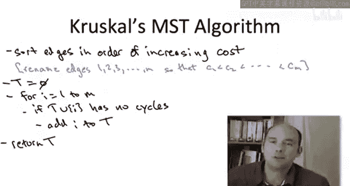
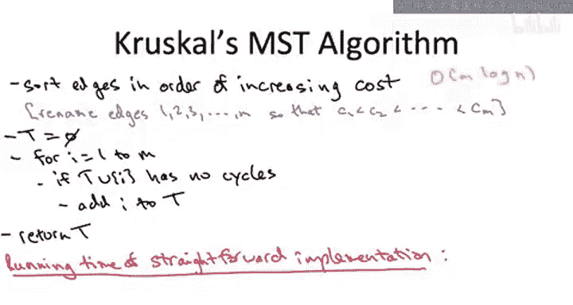
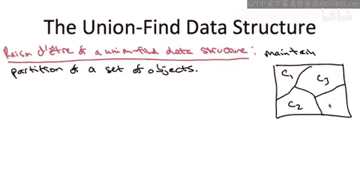
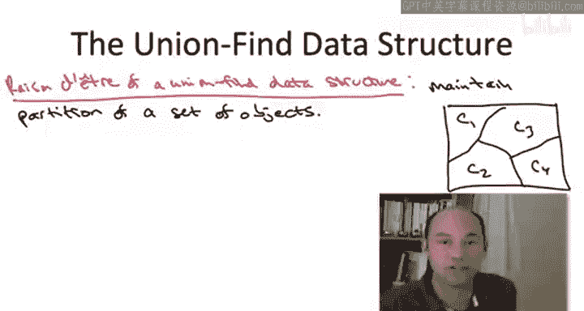
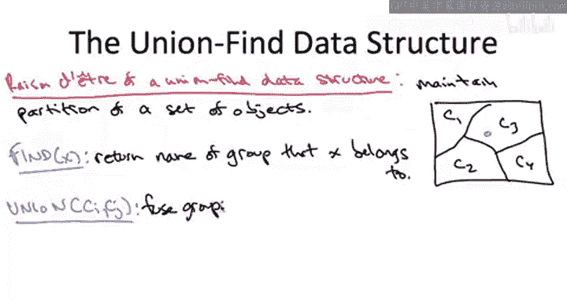

# 算法启蒙（第3册）：贪心算法和动态规划｜P20：-20-_ 通过并查集实现克鲁斯卡尔算法

在本节课中，我们将要学习如何高效地实现克鲁斯卡尔算法。我们已经理解了该算法的正确性，现在将注意力转向实现细节。我们将从一个简单但时间复杂度较高的实现开始，然后介绍一种名为“并查集”的数据结构，它能将算法的运行时间显著提升至接近线性。

## 算法回顾与简单实现

上一节我们介绍了克鲁斯卡尔算法的正确性，本节中我们来看看它的实现。首先，让我们简要回顾一下该算法的优雅伪代码。

克鲁斯卡尔算法是一种贪心算法，它按成本从低到高的顺序考虑所有边。算法从一个排序预处理步骤开始，为方便起见，我们将边重命名，使得 `e1` 是最便宜的边，`em` 是最昂贵的边。接着是一个简单的线性扫描循环，只要可能，我们就将边加入集合 `T`（最终将构成生成树）。排除一条边的唯一原因是它会与已选边构成环。只要不构成环，我们就乐观地将其加入。正如我们所见，这是一个总能输出最小成本生成树的正确算法。

如果直接实现上述伪代码，运行时间是多少呢？让我们按步骤分析。

1.  **排序边**：这需要 `O(m log n)` 时间。这里 `m` 表示边数，`n` 表示顶点数。注意，由于图中边数 `m` 最多为 `O(n²)`，因此 `log m` 和 `log n` 在大O表示法中可以互换使用。
2.  **主循环**：共有 `m` 次迭代。每次迭代需要检查将当前边加入已选边集 `T` 是否会构成环。

检查环的关键在于：判断新边端点 `u` 和 `v` 在当前的边集 `T` 中是否已经存在路径。如果存在路径，加入此边将构成环；如果不存在，则不会。我们可以使用图搜索算法（如广度优先搜索或深度优先搜索）来检查 `u` 和 `v` 在 `T` 中的连通性。由于 `T` 中最多有 `n-1` 条边，因此每次搜索的时间复杂度为 `O(n)`。

综上所述，总运行时间为排序步骤的 `O(m log n)` 加上主循环的 `O(m * n)`。后者占主导地位，因此总体运行时间为 **`O(m * n)`**。

这个运行时间与普里姆算法的简单实现相同。虽然这是一个多项式时间，比检查所有指数级数量的生成树要好得多，但我们希望做得更好，实现接近线性的运行时间。

## 引入并查集进行优化

我们希望能加速循环检查。并查集数据结构将允许我们以近乎常数的时间完成环检查。如果每次迭代只需常数时间，那么主循环的总时间将降至 `O(m)`，排序步骤将成为瓶颈，整体运行时间将降至 **`O(m log n)`**。

现在，让我简要介绍一下这个神奇的数据结构，以及它如何与克鲁斯卡尔算法关联。我们将在下一个视频中深入其细节。

并查集数据结构的核心思想是维护一组对象的划分（即分区）。它将对象集合划分为若干个互不相交的子集（或称“组”），这些子集的并集是整个集合。

这个数据结构主要支持两种操作：

*   **查找**：给定一个对象，返回该对象所属组的名称。
*   **合并**：给定两个组的名称，将这两个组合并为一个新组。

那么，为什么这个数据结构对加速克鲁斯卡尔算法有用呢？让我们看看其中的联系。

在克鲁斯卡尔算法中，我们可以这样理解其过程：算法开始时，边集 `T` 为空，每个顶点自成一个独立的连通分量。每次算法添加一条新边到 `T`，实际上是将两个当前的连通分量融合为一个。

因此，在实现中：
*   **对象**：并查集中的对象对应于图的顶点。
*   **组**：并查集中的组对应于当前已选边集 `T` 所定义的连通分量。

每次克鲁斯卡尔算法添加一条新边时，我们就需要调用一次**合并**操作，将这条边两个端点所在的连通分量（即组）融合在一起。而检查一条边是否会构成环，就等价于检查它的两个端点是否已经属于同一个组（即同一个连通分量），这可以通过**查找**操作快速完成。

通过使用并查集，我们可以将每次迭代中耗时的图搜索替换为高效的查找操作，从而大幅提升算法效率。

## 总结

本节课中我们一起学习了克鲁斯卡尔算法的实现策略。我们首先分析了一个简单直接的实现，其运行时间为 `O(m * n)`。然后，我们引入了并查集数据结构，它通过高效地维护顶点连通分量的信息，允许我们以近乎常数的时间完成环检查，从而将算法的整体运行时间优化至 `O(m log n)`。在接下来的课程中，我们将深入探讨并查集的具体实现细节。